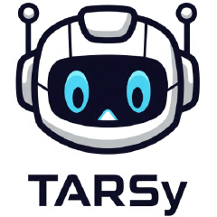
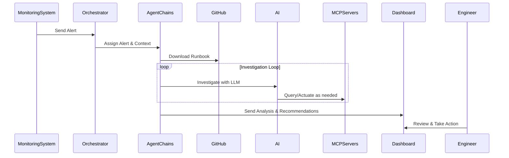

[](https://github.com/codeready-toolchain/tarsy-bot/actions)
[](https://codecov.io/gh/codeready-toolchain/tarsy-bot)

<div align="center">
  
</div>

**TARSy** is an intelligent Site Reliability Engineering system that automatically processes alerts through sequential agent chains, retrieves runbooks, and uses MCP (Model Context Protocol) servers to gather system information for comprehensive multi-stage incident analysis.

Inspired by the spirit of sci-fi AI, TARSy is your reliable companion for SRE operations. 🚀

## Documentation

- **[README.md](README.md)**: This file - project overview and quick start
- **[docs/architecture-overview.md](docs/architecture-overview.md)**: High-level architecture concepts and design principles
- **[docs/functional-areas-design.md](docs/functional-areas-design.md)**: Functional areas design and architecture documentation

## Prerequisites

### For Development Mode
- **Python 3.13+** - Core backend runtime
- **Node.js 18+** - Frontend development and build tools  
- **npm** - Node.js package manager (comes with Node.js)
- **uv** - Modern Python package and project manager
  - Install: `pip install uv`
  - Alternative: `curl -LsSf https://astral.sh/uv/install.sh | sh`

### For Container Deployment (Additional)
- **Podman** (or Docker) - Container runtime
- **podman-compose** - Multi-container application management
  - Install: `pip install podman-compose`

> **Quick Check**: Run `make check-prereqs` to verify all prerequisites are installed.

## Quick Start

### Development Mode (Direct Backend)

```bash
# 1. Initial setup (one-time only)
make setup

# 2. Configure API keys (REQUIRED)
# Edit backend/.env and set your API keys:
# - GOOGLE_API_KEY (get from https://aistudio.google.com/app/apikey)
# - GITHUB_TOKEN (get from https://github.com/settings/tokens)

# 3. Ensure Kubernetes/OpenShift access (REQUIRED)
# See [K8s Access Requirements](#k8s-access-reqs) section below for details

# 4. Start all services  
make dev
```

**Services will be available at:**
- 🖥️ **TARSy Dashboard**: http://localhost:5173
  - Manual Alert Submission: http://localhost:5173/submit-alert
- 🔧 **Backend API**: http://localhost:8000 (docs at /docs)

**Stop all services:** `make stop`

### Container Deployment (Production-like)

For production-like testing with containerized services, authentication, and database:

```bash
# 1. Initial setup (one-time only)
make setup

# 2. Configure API keys and OAuth (REQUIRED)
# Edit backend/.env and set your API keys + OAuth configuration
# - See [OAuth2-proxy setup docs](docs/oauth2-proxy-setup.md) for GitHub OAuth setup
# - Configure LLM providers in backend/.env (GOOGLE_API_KEY, etc.)

# 3. Deploy complete containerized stack
make containers-deploy        # Preserves database data (recommended)
# OR for fresh start:
make containers-deploy-fresh  # Clean rebuild including database
```

**Services will be available at:**
- 🖥️ **TARSy Dashboard**: http://localhost:8080 (with OAuth authentication)
- 🔧 **Backend API**: http://localhost:8080/api (protected by OAuth2-proxy)
- 🗄️ **PostgreSQL Database**: localhost:5432 (admin access)

**Container Management:**
- **Update apps (preserve database):** `make containers-deploy`
- **Fresh deployment:** `make containers-deploy-fresh` 
- **Stop containers:** `make containers-stop`
- **View logs:** `make containers-logs` 
- **Check status:** `make containers-status`
- **Clean up:** `make containers-clean` (removes all containers and data)

## Key Features

- **🛠️ Configuration-Based Agents**: Deploy new agents and chain definitions via YAML configuration without code changes
- **🔧 Flexible Alert Processing**: Accept arbitrary JSON payloads from any monitoring system  
- **🧠 Chain-Based Agent Architecture**: Specialized agents with domain-specific tools and AI reasoning working in coordinated stages
- **📊 Comprehensive Audit Trail**: Complete visibility into chain processing workflows with stage-level timeline reconstruction
- **🖥️ SRE Dashboard**: Real-time monitoring and historical analysis with interactive chain timeline visualization
- **🔒 Data Masking**: Automatic protection of sensitive data in logs and responses

## Architecture

Tarsy uses an AI-powered chain-based architecture where alerts flow through sequential stages of specialized agents that build upon each other's work using domain-specific tools to provide comprehensive expert recommendations to engineers.

> **📖 For high-level architecture concepts**: See [Architecture Overview](docs/architecture-overview.md)

## How It Works

1. **Alert arrives** from monitoring systems with flexible JSON payload
2. **Orchestrator selects** appropriate agent chain based on alert type  
3. **Runbook downloaded** automatically from GitHub for chain guidance
4. **Sequential stages execute** where each agent builds upon previous stage data using AI to select and execute domain-specific tools
5. **Comprehensive multi-stage analysis** provided to engineers with actionable recommendations
6. **Full audit trail** captured with stage-level detail for monitoring and continuous improvement



## Usage

### Development Mode
1. **Start All Services**: Run `make dev` to start backend and dashboard
2. **Submit an Alert**: Use Manual Alert Submission at http://localhost:5173/submit-alert for testing TARSy
3. **Monitor via Dashboard**: Watch real-time progress updates and historical analysis at http://localhost:5173
4. **View Results**: See detailed processing timelines and comprehensive LLM analysis
5. **Stop Services**: Run `make stop` when finished

### Container Deployment Mode
1. **Deploy Stack**: Run `make containers-deploy` (preserves database) or `make containers-deploy-fresh` (clean start)
2. **Login**: Navigate to http://localhost:8080 and authenticate via GitHub OAuth
3. **Submit Alert**: Use the dashboard at http://localhost:8080/submit-alert (OAuth protected)
4. **Monitor Processing**: Watch real-time progress with full audit trail
5. **Stop Containers**: Run `make containers-stop` when finished

> **Tip**: Use `make status` or `make containers-status` to check which services are running.

## Container Architecture

The containerized deployment provides a production-like environment with:

- **🔐 OAuth2 Authentication**: GitHub OAuth integration via oauth2-proxy
- **🔄 Reverse Proxy**: Nginx handles all traffic routing and CORS  
- **🗄️ PostgreSQL Database**: Persistent storage for processing history
- **📦 Production Builds**: Optimized frontend and backend containers
- **🔒 Security**: All API endpoints protected behind authentication

**Architecture Overview:**
```
Browser → Nginx (8080) → OAuth2-Proxy → Backend (FastAPI)
                      ↘ Dashboard (Static Files)
```

**📖 For OAuth2-proxy setup instructions**: See [docs/oauth2-proxy-setup.md](docs/oauth2-proxy-setup.md)

## Supported Alert Types

The system now supports flexible alert types from any monitoring source:

### Current Agent Types
- **Kubernetes Agent**: Processes alerts from Kubernetes clusters (namespaces, pods, services, etc.)

### Flexible Alert Support  
- **Any Monitoring System**: Accepts arbitrary JSON payloads from Prometheus, AWS CloudWatch, ArgoCD, Datadog, etc.
- **Agent-Agnostic Processing**: New alert types can be added by creating specialized agents and updating agent registry
- **LLM-Driven Analysis**: Agents intelligently interpret any alert data structure without code changes to core system

The LLM-driven approach with flexible data structures means diverse alert types can be handled from any monitoring source, as long as:
- A runbook exists for the alert type
- An appropriate specialized agent is available or can be created
- The MCP servers have relevant tools for the monitoring domain

<a id="k8s-access-reqs"></a>
## Kubernetes/OpenShift Access Requirements

TARSy requires read-only access to a Kubernetes or OpenShift cluster to analyze and troubleshoot Kubernetes infrastructure issues. The system uses the [**kubernetes-mcp-server**](https://github.com/containers/kubernetes-mcp-server), which connects to your cluster via kubeconfig.

### 🔗 How TARSy Accesses Your Cluster

TARSy **does not use `oc` or `kubectl` commands directly**. Instead, it:

1. **Uses [Kubernetes MCP Server](https://github.com/containers/kubernetes-mcp-server)**: Runs `kubernetes-mcp-server@latest` via npm
2. **Reads kubeconfig**: Authenticates using your existing kubeconfig file
3. **Read-Only Operations**: Configured with `--read-only --disable-destructive` flags
4. **No Modifications**: Cannot create, update, or delete cluster resources

### ⚙️ Setup Instructions

#### Option 1: Use Existing Session (Recommended)
If you're already logged into your OpenShift/Kubernetes cluster:

```bash
# Verify your current access
oc whoami
oc cluster-info

# TARSy will automatically use your current kubeconfig
# Default location: ~/.kube/config or $KUBECONFIG
```

#### Option 2: Custom Kubeconfig
To use a specific kubeconfig file:

```bash
# Set in backend/.env
KUBECONFIG=/path/to/your/kubeconfig

# Or set environment variable
export KUBECONFIG=/path/to/your/kubeconfig
```

### 🔧 Troubleshooting Cluster Access

**Common Issues:**

```bash
# Check kubeconfig validity
oc cluster-info

# Verify TARSy can access cluster
# Check backend logs for kubernetes-mcp-server errors
tail -f backend/logs/tarsy.log | grep kubernetes

# Test kubernetes-mcp-server independently
npx -y kubernetes-mcp-server@latest --kubeconfig ~/.kube/config --help
```

**Permission Errors:**
- Ensure your user/service account has at least `view` cluster role
- Verify kubeconfig points to correct cluster
- Check network connectivity to cluster API server

## API Endpoints

### Core API
- `GET /` - Health check endpoint
- `GET /health` - Comprehensive health check with service status
- `POST /api/v1/alerts` - Submit a new alert for processing
- `GET /api/v1/alert-types` - Get supported alert types
- `GET /api/v1/session-id/{alert_id}` - Get session ID for alert tracking
- `GET /processing-status/{alert_id}` - Get processing status
- `WebSocket /ws/{alert_id}` - Real-time progress updates

### History API
- `GET /api/v1/history/sessions` - List alert processing sessions with filtering and pagination
- `GET /api/v1/history/sessions/{session_id}` - Get detailed session with chronological timeline
- `GET /api/v1/history/health` - History service health check and database status

## Development

### Adding New Components

- **Alert Types**: Define any alert type in `config/agents.yaml` - no hardcoding required, just create corresponding runbooks
- **MCP Servers**: Update `mcp_servers` configuration in `settings.py` or define in `config/agents.yaml`
- **Agents**: Create traditional hardcoded agent classes extending BaseAgent, or define configuration-based agents in `config/agents.yaml`
- **LLM Providers**: Built-in providers work out-of-the-box (OpenAI, Google, xAI, Anthropic). Add custom providers via `config/llm_providers.yaml` for proxy configurations or model overrides

> **📖 For detailed extensibility examples**: See [Extensibility section](docs/architecture-overview.md#extensibility) in the Architecture Overview

### Running Tests

```bash
# Run back-end and front-end (dashboard) tests
make test
```

The test suite includes comprehensive end-to-end integration tests covering the complete alert processing pipeline, agent specialization, error handling, and performance scenarios with full mocking of external services.
