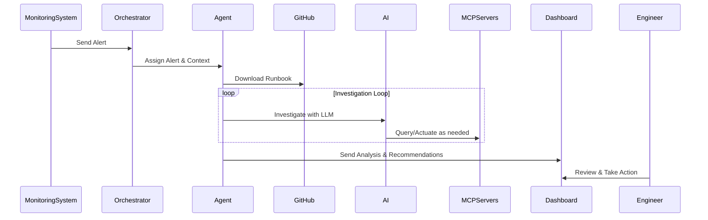

# TARSy-bot 🤖

[](https://github.com/codeready-toolchain/tarsy-bot/actions)
[](https://codecov.io/gh/codeready-toolchain/tarsy-bot)

An intelligent Site Reliability Engineering agent that automatically processes alerts, retrieves runbooks, and uses MCP (Model Context Protocol) servers to gather system information for comprehensive incident analysis.

Inspired by the spirit of sci-fi AI, TARSy is your reliable SRE operations companion for SRE operations. 🚀

## Documentation

- **[README.md](README.md)**: This file - project overview and quick start
- **[docs/architecture-overview.md](docs/architecture-overview.md)**: High-level architecture concepts and design principles
- **[docs/requirements.md](docs/requirements.md)**: Application requirements and specifications  
- **[docs/design.md](docs/design.md)**: Detailed system design and architecture documentation

## Prerequisites

Before running TARSy, ensure you have the following tools installed:

- **Python 3.11+** - Core backend runtime
- **Node.js 18+** - Frontend development and build tools  
- **npm** - Node.js package manager (comes with Node.js)
- **uv** - Modern Python package and project manager
  - Install: `pip install uv`
  - Alternative: `curl -LsSf https://astral.sh/uv/install.sh | sh`

> **Quick Check**: Run `make check-prereqs` to verify all prerequisites are installed.

## Quick Start

```bash
# 1. Initial setup (one-time only)
make setup

# 2. Configure API keys (REQUIRED)
# Edit backend/.env and set your API keys:
# - GEMINI_API_KEY (get from https://aistudio.google.com/app/apikey)
# - GITHUB_TOKEN (get from https://github.com/settings/tokens)

# 3. Ensure Kubernetes/OpenShift access (REQUIRED)
# See [K8s Access Requirements](#k8s-access-reqs) section below for details

# 4. Start all services  
make dev
```

**Services will be available at:**
- 🖥️ **TARSy Dashboard**: http://localhost:5173 (operational monitoring)
- 🛠️ **Alert Dev UI**: http://localhost:3001 (alert testing)  
- 🔧 **Backend API**: http://localhost:8000 (docs at /docs)

**Stop all services:** `make stop`

## Key Features

- **🛠️ Configuration-Based Agents**: Deploy new agents via YAML configuration without code changes
- **🔧 Flexible Alert Processing**: Accept arbitrary JSON payloads from any monitoring system  
- **🧠 Multi-Layer Agent Architecture**: Specialized agents with domain-specific tools and AI reasoning
- **📊 Comprehensive Audit Trail**: Complete visibility into alert processing workflows with timeline reconstruction
- **🖥️ SRE Dashboard**: Real-time monitoring and historical analysis with interactive timeline visualization
- **🔒 Data Masking**: Automatic protection of sensitive data in logs and responses

## Architecture

Tarsy uses an AI-powered multi-layer architecture where specialized agents analyze alerts using domain-specific tools and provide expert recommendations to engineers.

> **📖 For high-level architecture concepts**: See [Architecture Overview](docs/architecture-overview.md)

## How It Works

1. **Alert arrives** from monitoring systems with flexible JSON payload
2. **Orchestrator selects** appropriate specialized agent based on alert type  
3. **Runbook downloaded** automatically from GitHub for agent guidance
4. **Agent investigates** using AI to select and execute domain-specific tools
5. **Complete analysis** provided to engineers with actionable recommendations
6. **Full audit trail** captured for monitoring and continuous improvement



## Usage

1. **Start All Services**: Run `make dev` to start backend, dashboard, and alert UI
2. **Submit an Alert**: Use the alert dev UI at http://localhost:3001 to simulate an alert
3. **Monitor via Dashboard**: Watch real-time progress updates and historical analysis at http://localhost:5173
4. **View Results**: See detailed processing timelines and comprehensive LLM analysis
5. **Stop Services**: Run `make stop` when finished

> **Tip**: Use `make urls` to see all available service endpoints and `make status` to check which services are running.

## Supported Alert Types

The system now supports flexible alert types from any monitoring source:

### Current Agent Types
- **Kubernetes Agent**: Processes alerts from Kubernetes clusters (namespaces, pods, services, etc.)

### Flexible Alert Support  
- **Any Monitoring System**: Accepts arbitrary JSON payloads from Prometheus, AWS CloudWatch, ArgoCD, Datadog, etc.
- **Agent-Agnostic Processing**: New alert types can be added by creating specialized agents and updating agent registry
- **LLM-Driven Analysis**: Agents intelligently interpret any alert data structure without code changes to core system

The LLM-driven approach with flexible data structures means diverse alert types can be handled from any monitoring source, as long as:
- A runbook exists for the alert type
- An appropriate specialized agent is available or can be created
- The MCP servers have relevant tools for the monitoring domain

<a id="k8s-access-reqs"></a>
## Kubernetes/OpenShift Access Requirements

TARSy requires read-only access to a Kubernetes or OpenShift cluster to analyze and troubleshoot Kubernetes infrastructure issues. The system uses the [**kubernetes-mcp-server**](https://github.com/containers/kubernetes-mcp-server), which connects to your cluster via kubeconfig.

### 🔗 How TARSy Accesses Your Cluster

TARSy **does not use `oc` or `kubectl` commands directly**. Instead, it:

1. **Uses [Kubernetes MCP Server](https://github.com/containers/kubernetes-mcp-server)**: Runs `kubernetes-mcp-server@latest` via npm
2. **Reads kubeconfig**: Authenticates using your existing kubeconfig file
3. **Read-Only Operations**: Configured with `--read-only --disable-destructive` flags
4. **No Modifications**: Cannot create, update, or delete cluster resources

### ⚙️ Setup Instructions

#### Option 1: Use Existing Session (Recommended)
If you're already logged into your OpenShift/Kubernetes cluster:

```bash
# Verify your current access
oc whoami
oc cluster-info

# TARSy-bot will automatically use your current kubeconfig
# Default location: ~/.kube/config or $KUBECONFIG
```

#### Option 2: Custom Kubeconfig
To use a specific kubeconfig file:

```bash
# Set in backend/.env
KUBECONFIG=/path/to/your/kubeconfig

# Or set environment variable
export KUBECONFIG=/path/to/your/kubeconfig
```

### 🔧 Troubleshooting Cluster Access

**Common Issues:**

```bash
# Check kubeconfig validity
oc cluster-info

# Verify TARSy can access cluster
# Check backend logs for kubernetes-mcp-server errors
tail -f backend/logs/tarsy.log | grep kubernetes

# Test kubernetes-mcp-server independently
npx -y kubernetes-mcp-server@latest --kubeconfig ~/.kube/config --help
```

**Permission Errors:**
- Ensure your user/service account has at least `view` cluster role
- Verify kubeconfig points to correct cluster
- Check network connectivity to cluster API server

## API Endpoints

### Core API
- `GET /` - Health check endpoint
- `GET /health` - Comprehensive health check with service status
- `POST /alerts` - Submit a new alert for processing
- `GET /alert-types` - Get supported alert types
- `GET /processing-status/{alert_id}` - Get processing status
- `WebSocket /ws/{alert_id}` - Real-time progress updates

### History API (EP-0003)
- `GET /api/v1/history/sessions` - List alert processing sessions with filtering and pagination
- `GET /api/v1/history/sessions/{session_id}` - Get detailed session with chronological timeline
- `GET /api/v1/history/health` - History service health check and database status

## Development

### Adding New Components

- **Alert Types**: Define any alert type in `config/agents.yaml` - no hardcoding required, just create corresponding runbooks
- **MCP Servers**: Update `mcp_servers` configuration in `settings.py` or define in `config/agents.yaml`
- **Agents**: Create traditional hardcoded agent classes extending BaseAgent, or define configuration-based agents in `config/agents.yaml`
- **LLM Providers**: Add new providers by extending the LLM client configuration

> **📖 For detailed extensibility examples**: See [Extensibility section](docs/architecture-overview.md#extensibility) in the Architecture Overview

### Running Tests

```bash
# Run back-end and front-end (dashboard) tests
make test
```

The test suite includes comprehensive end-to-end integration tests covering the complete alert processing pipeline, agent specialization, error handling, and performance scenarios with full mocking of external services.
