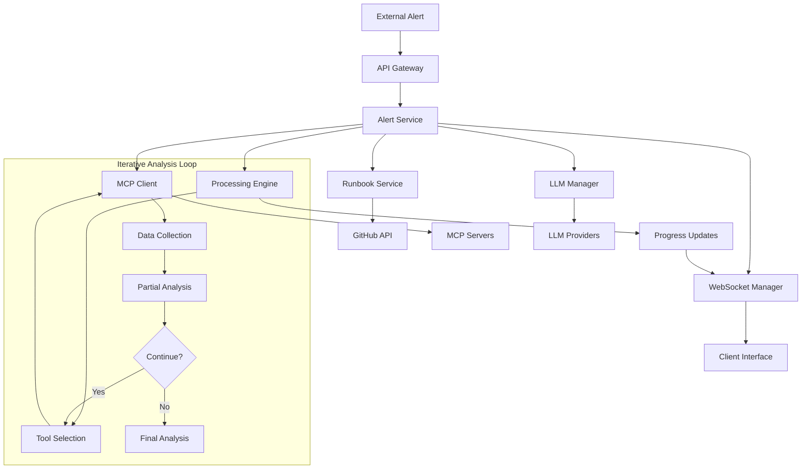
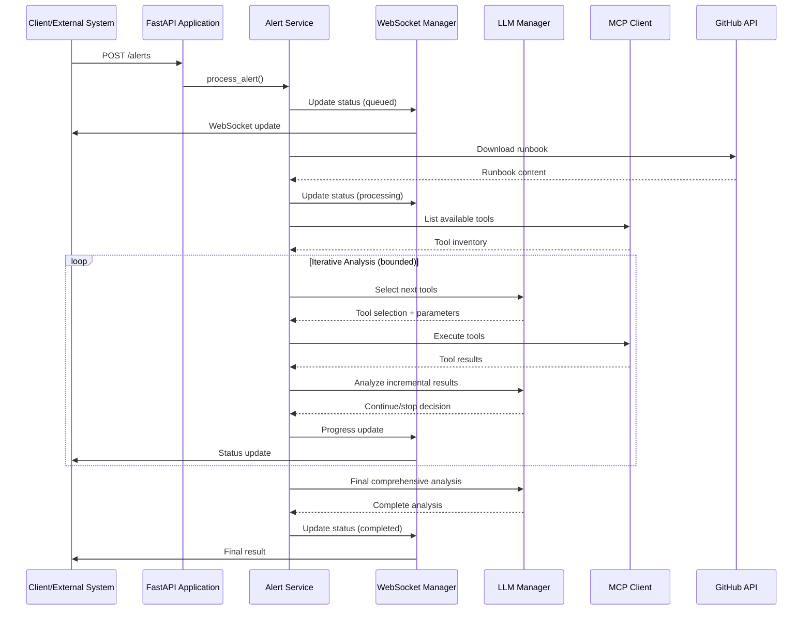

# SRE AI Agent - Technical Design Document

## Table of Contents
1. [System Overview](#system-overview)
2. [Architecture Design](#architecture-design)
3. [Backend Components](#backend-components)
4. [Data Flow Architecture](#data-flow-architecture)
5. [Integration Patterns](#integration-patterns)
6. [Frontend Development Interface](#frontend-development-interface)
7. [Security Architecture](#security-architecture)
8. [Performance Considerations](#performance-considerations)
9. [Error Handling and Resilience](#error-handling-and-resilience)
10. [Deployment Architecture](#deployment-architecture)
11. [Extension Points](#extension-points)

---

## System Overview

The SRE AI Agent is a **distributed, event-driven system** designed to automate incident response through intelligent alert processing. The system implements an **iterative, multi-step analysis architecture** where Large Language Models (LLMs) dynamically select and orchestrate Model Context Protocol (MCP) servers to gather system data and perform comprehensive incident analysis.

### Core Design Principles

1. **Iterative Intelligence**: Multi-step LLM-driven analysis that mimics human troubleshooting methodology
2. **Dynamic Tool Selection**: LLMs intelligently choose appropriate MCP tools based on context
3. **Extensible Architecture**: Plugin-based design for easy integration of new LLM providers and MCP servers
4. **Real-time Communication**: WebSocket-based progress updates and status tracking
5. **Resilient Design**: Graceful degradation and comprehensive error handling

### Technology Stack

**Backend:**
- **Framework**: FastAPI (Python 3.11+) with asyncio for asynchronous processing
- **LLM Integration**: LangChain framework supporting multiple providers (OpenAI, Google Gemini, xAI Grok)
- **MCP Integration**: Official MCP SDK with stdio transport
- **Communication**: WebSocket for real-time updates, REST API for external integration
- **Configuration**: Environment-based configuration with validation
- **Logging**: Structured logging with separate channels for different components

**Frontend (Development/Testing Only):**
- **Framework**: React with TypeScript
- **UI Library**: Material-UI (MUI) for modern, responsive interface
- **Communication**: Axios for HTTP requests, native WebSocket for real-time updates

---

## Architecture Design

### High-Level Architecture

```
┌─────────────────────────────────────────────────────────────────────────────────────┐
│                                   SRE AI Agent                                      │
│                                                                                     │
│  ┌─────────────────────────────────────────────────────────────────────────────┐    │
│  │                              Frontend Layer                                 │    │
│  │                        (Development/Testing Only)                           │    │
│  │  ┌─────────────────┐    ┌─────────────────┐    ┌─────────────────┐          │    │
│  │  │   Alert Form    │    │ Processing      │    │ Result Display  │          │    │
│  │  │   Component     │    │ Status          │    │ Component       │          │    │
│  │  └─────────────────┘    └─────────────────┘    └─────────────────┘          │    │
│  └─────────────────────────────────────────────────────────────────────────────┘    │
│                                      │                                              │
│                                   HTTP/WebSocket                                    │
│                                      │                                              │
│  ┌─────────────────────────────────────────────────────────────────────────────┐    │
│  │                              Backend Layer                                  │    │
│  │                                                                             │    │
│  │  ┌─────────────────┐    ┌─────────────────┐    ┌─────────────────┐          │    │
│  │  │   FastAPI       │    │   WebSocket     │    │   Background    │          │    │
│  │  │   Application   │    │   Manager       │    │   Task Queue    │          │    │
│  │  └─────────────────┘    └─────────────────┘    └─────────────────┘          │    │
│  │                                                                             │    │
│  │  ┌─────────────────┐    ┌─────────────────┐    ┌─────────────────┐          │    │
│  │  │   Alert         │    │   LLM           │    │   MCP Client    │          │    │
│  │  │   Service       │    │   Manager       │    │   Manager       │          │    │
│  │  └─────────────────┘    └─────────────────┘    └─────────────────┘          │    │
│  │                                                                             │    │
│  │  ┌─────────────────┐    ┌─────────────────┐    ┌─────────────────┐          │    │
│  │  │   Runbook       │    │   Prompt        │    │   Logger        │          │    │
│  │  │   Service       │    │   Builder       │    │   System        │          │    │
│  │  └─────────────────┘    └─────────────────┘    └─────────────────┘          │    │
│  └─────────────────────────────────────────────────────────────────────────────┘    │
│                                                                                     │
│  ┌─────────────────────────────────────────────────────────────────────────────┐    │
│  │                            Integration Layer                                │    │
│  │                                                                             │    │
│  │  ┌─────────────────┐    ┌─────────────────┐    ┌─────────────────┐          │    │
│  │  │   LLM           │    │   MCP Server    │    │   GitHub        │          │    │
│  │  │   Providers     │    │   Ecosystem     │    │   Integration   │          │    │
│  │  │                 │    │                 │    │                 │          │    │
│  │  │ • OpenAI        │    │ • Kubernetes    │    │ • Runbook       │          │    │
│  │  │ • Google Gemini │    │ • Database      │    │   Download      │          │    │
│  │  │ • xAI Grok      │    │ • Monitoring    │    │ • Authentication│          │    │
│  │  └─────────────────┘    └─────────────────┘    └─────────────────┘          │    │
│  └─────────────────────────────────────────────────────────────────────────────┘    │
└─────────────────────────────────────────────────────────────────────────────────────┘
```

### Component Interaction Diagram



---

## Backend Components

### 1. API Gateway Layer

The main application layer will provide the HTTP API and WebSocket endpoints:

```
Core API Endpoints:
POST /alerts              # Submit alert for processing
GET /processing-status/{id}  # Check processing status
GET /alert-types          # Get supported alert types
GET /health               # Health check
WebSocket /ws/{id}        # Real-time progress updates
```

**Core Features:**
- **Asynchronous Processing**: Background task management for alert processing
- **CORS Support**: Configurable cross-origin resource sharing
- **Lifecycle Management**: Startup/shutdown hooks for service initialization
- **State Management**: Processing status tracking and persistence
- **Real-time Communication**: WebSocket-based progress broadcasting

### 2. Alert Service

The core orchestration service that implements the iterative processing engine:

```
Interface Pattern:
class AlertService:
    def __init__(self, dependencies: ServiceDependencies)
    async def process_alert(self, alert: Alert, callback: ProgressCallback) -> AnalysisResult
    async def get_processing_status(self, alert_id: str) -> ProcessingStatus
```

**Core Responsibilities:**
- **Workflow Orchestration**: Manage the complete alert processing pipeline
- **Iterative Processing**: Implement the multi-step LLM→MCP analysis loop
- **Progress Tracking**: Real-time status updates via callback mechanism
- **Error Handling**: Comprehensive error management and recovery
- **Safety Mechanisms**: Prevent infinite loops and resource exhaustion

**Processing Algorithm:**
1. **Initialization**: Validate dependencies and prepare resources
2. **Context Gathering**: Collect runbook and available tools
3. **Iterative Analysis Loop** (bounded iterations):
   - **Tool Selection**: LLM determines required tools and parameters
   - **Data Collection**: Execute selected tools in parallel where possible
   - **Incremental Analysis**: LLM processes collected data
   - **Continuation Decision**: LLM determines if more data is needed
4. **Final Analysis**: Comprehensive analysis with all collected information
5. **Result Formatting**: Structure output for consumption

### 3. LLM Manager

Unified LLM client implementation using LangChain framework:

```
Interface Pattern:
class LLMManager:
    def __init__(self, configuration: LLMConfig)
    def get_client(self, provider: str) -> LLMClient
    async def analyze_with_context(self, prompt: str, context: Dict) -> AnalysisResult
```

**Core Features:**
- **Provider Abstraction**: Unified interface for multiple LLM providers
- **Availability Checking**: Runtime validation of provider accessibility
- **Configuration Management**: Environment-based credential and model management
- **Failover Support**: Automatic fallback to alternative providers
- **Comprehensive Logging**: Detailed communication logs for debugging

**Core Operations:**
- `select_initial_tools()`: First iteration tool selection
- `select_next_tools()`: Subsequent iteration tool selection and continuation logic
- `analyze_incremental()`: Process partial results during iterations
- `synthesize_final()`: Comprehensive analysis of all collected data

### 4. MCP Client Manager

Official MCP SDK-based client for server integration:

```
Interface Pattern:
class MCPClientManager:
    def __init__(self, server_configurations: Dict[str, ServerConfig])
    async def initialize_connections(self)
    async def execute_tool(self, server: str, tool: str, params: Dict) -> ToolResult
    async def list_available_tools(self) -> Dict[str, List[ToolSchema]]
```

**Core Features:**
- **Connection Management**: Persistent connections with automatic reconnection
- **Tool Discovery**: Dynamic tool inventory and schema validation
- **Parallel Execution**: Concurrent tool execution where possible
- **Error Handling**: Graceful degradation on individual server failures
- **Resource Management**: Connection pooling and cleanup

**Server Configuration Pattern:**
```
server_configuration = {
    "server_name": {
        "type": "server_type",
        "enabled": boolean,
        "connection_params": {...},
        "environment": {...}
    }
}
```

### 5. Runbook Service (`app/services/runbook_service.py`)

External repository integration for runbook management:

```
Interface Pattern:
class RunbookService:
    def __init__(self, repository_config: RepositoryConfig)
    async def fetch_runbook(self, url: str) -> RunbookContent
    async def validate_runbook(self, content: str) -> ValidationResult
```

**Core Features:**
- **GitHub API Integration**: Authenticated access to public/private repositories
- **URL Transformation**: Automatic conversion to raw content URLs
- **Authentication**: GitHub token-based authentication
- **Error Handling**: Comprehensive error management for network issues

### 6. WebSocket Manager (`app/services/websocket_manager.py`)

Real-time communication management:

```
Interface Pattern:
class WebSocketManager:
    def __init__(self)
    async def register_client(self, alert_id: str, connection: WebSocket)
    async def broadcast_update(self, alert_id: str, status: ProcessingStatus)
    async def cleanup_connections(self, alert_id: str)
```

**Core Features:**
- **Connection Management**: Per-alert connection tracking and cleanup
- **Message Broadcasting**: Efficient multi-client update distribution
- **Error Handling**: Automatic cleanup of broken connections
- **Serialization**: Consistent message format and encoding

### 7. Configuration System (`app/config/settings.py`)

Environment-based configuration management:

```
Configuration Categories:
- Server Settings: Host, port, CORS policies
- LLM Providers: API keys, models, provider-specific settings
- MCP Servers: Connection parameters, enabled services
- Processing Limits: Safety thresholds and resource controls
- External Services: Repository access, authentication
```

**Core Features:**
- **Environment Variables**: Secure configuration via environment
- **Validation**: Runtime validation of configuration completeness
- **Hot Reload**: Configuration updates without restart where possible
- **Secrets Management**: Secure handling of API keys and tokens

---

## Data Flow Architecture

### 1. Alert Processing Pipeline



### 2. Data Structure Patterns

**Alert Data Model:**
```
Alert Entity:
- alert_type: string              # Alert type
- severity: enum                  # warning, critical, info
- environment: string             # Environment identifier
- cluster: str                    # Kubernetes cluster URL
- namespace: str                  # Kubernetes namespace
- pod: str                        # Specific pod (optional)
- message: string                 # Alert description
- runbook_reference: string       # GitHub runbook URL
- timestamp: datetime             # Alert occurrence time

```

**Processing Status Model:**
```
ProcessingStatus Entity:
- alert_id: string
- status: enum                    # queued, processing, completed, error
- progress: integer               # 0-100 percentage
- current_step: string            # Human-readable step description
- result: optional<string>        # Final analysis result
- error: optional<string>         # Error message if failed
- timestamp: datetime
- iterations: array<IterationRecord>
```

**Iteration History Pattern:**
```
IterationRecord:
- iteration_number: integer
- reasoning: string               # LLM reasoning for decisions
- tools_selected: array<ToolCall>
- data_collected: object          # Structured tool results
- partial_analysis: string        # Incremental analysis
- continuation_decision: boolean
- timestamp: datetime
```

---

## Integration Patterns

### 1. LLM Provider Integration

**Provider Abstraction Pattern:**
```
LLM Provider Interface:
- initialize(credentials, model_config)
- analyze_with_context(prompt, context_data)
- select_tools(available_tools, current_context)
- synthesize_results(collected_data, runbook_content)
- validate_availability()
```

**Provider Selection Strategy:**
- Configurable default provider with fallback chain
- Runtime availability checking before selection
- Provider-specific error handling and retry logic
- Consistent interface across all providers

### 2. MCP Server Integration

**Server Management Pattern:**
```
MCP Server Interface:
- initialize_connection(server_config)
- discover_tools() -> tool_schema_list
- execute_tool(tool_name, parameters) -> tool_result
- validate_connection() -> connection_status
- cleanup_resources()
```

**Connection Management:**
- Persistent connection pooling with health checks
- Automatic reconnection on failure
- Graceful degradation when servers are unavailable
- Request/response logging for debugging

### 3. GitHub Integration

**Repository Access Pattern:**
```python
headers = {
    "Accept": "application/vnd.github.v3.raw",
    "Authorization": f"token {github_token}",
    "User-Agent": "SRE-AI-Agent/1.0"
}

raw_url = f"https://raw.githubusercontent.com/{user}/{repo}/{branch}/{file_path}"
response = await client.get(raw_url, headers=headers)
```

---

## Frontend Development Interface

The frontend is a **React-based development and testing interface** designed for system validation and demonstration purposes only. It is not intended for production use.

### Architecture Overview

```
Frontend/
├── src/
│   ├── components/
│   │   ├── AlertForm.tsx       # Alert submission form
│   │   ├── ProcessingStatus.tsx # Real-time progress display
│   │   └── ResultDisplay.tsx    # Analysis results presentation
│   ├── services/
│   │   ├── api.ts              # HTTP API client
│   │   └── websocket.ts        # WebSocket client
│   ├── types/
│   │   └── index.ts            # TypeScript type definitions
│   └── App.tsx                 # Main application component
```

### Key Features

1. **Alert Submission Form**: Pre-filled form with validation for testing alert scenarios
2. **Real-time Progress Tracking**: WebSocket-based progress updates with visual indicators
3. **Result Display**: Markdown rendering of analysis results with syntax highlighting
4. **Error Handling**: User-friendly error messages and connection status indicators
5. **Responsive Design**: Material-UI components for modern, responsive interface

### Production Integration

For production deployment, the frontend is replaced by:
- **REST API Integration**: External monitoring systems (e.g., AlertManager) submit alerts via HTTP API
- **Webhook Notifications**: Status updates delivered to external incident management systems
- **API-based Status Queries**: External systems can query processing status programmatically

---

## Security Architecture

### 1. Authentication and Authorization

**API Key Management:**
```python
# Environment-based configuration
GEMINI_API_KEY=your_gemini_key
OPENAI_API_KEY=your_openai_key
GITHUB_TOKEN=your_github_token
```

**Security Features:**
- No API keys exposed in logs or error messages
- Secure credential storage via environment variables
- Token-based GitHub authentication
- Runtime validation of API key availability

### 2. Input Validation and Sanitization

**Validation Strategy:**
```
Input Validation Layers:
- Schema validation at API boundaries
- Content sanitization for external inputs
- Parameter validation for tool calls
- Output sanitization for responses
```

**Security Measures:**
- Strict input validation using schema validation
- Prevention of injection attacks
- Content Security Policy implementation
- CORS configuration for API access control

### 3. Error Handling Security

**Information Disclosure Prevention:**
- Sanitized error messages in API responses
- Detailed error logging without credential exposure
- Graceful degradation on security failures

---

## Performance Considerations

### 1. Asynchronous Architecture

**Concurrency Pattern:**
```
Async Processing Design:
- Non-blocking I/O operations throughout
- Concurrent processing of multiple alerts
- Parallel tool execution where possible
- Efficient resource utilization
```

**Performance Benefits:**
- Scalable WebSocket connections
- Efficient resource utilization
- Concurrent alert processing
- Optimized I/O operations

### 2. Resource Management

**Resource Control Mechanisms:**
```
Safety Thresholds:
- Maximum iteration limits
- Tool call limits per alert
- Data collection thresholds
- Connection timeout configurations
```

**Resource Controls:**
- Maximum iteration limits prevent infinite loops
- Tool call limits prevent resource exhaustion
- Data collection thresholds optimize processing time
- Connection pooling for MCP servers

### 3. Caching and Optimization

**Performance Optimization Strategy:**
- In-memory processing status management
- Persistent connection reuse
- Efficient data structures
- Optimized communication protocols

---

## Error Handling and Resilience

### 1. Multi-Layer Error Handling

**Error Handling Strategy:**
```
Error Handling Layers:
- Service-level error handling with fallbacks
- Network-level retry mechanisms
- Resource-level graceful degradation
- User-facing error communication
```

**Error Categories:**
- **LLM Provider Failures**: Fallback to alternative providers or basic analysis
- **MCP Server Failures**: Graceful degradation with available tools
- **Network Failures**: Retry mechanisms with exponential backoff
- **Configuration Errors**: Validation and helpful error messages

### 2. Graceful Degradation

**Fallback Strategies:**
- **No LLM Available**: Return error (LLM is critical for core functionality)
- **Partial MCP Failures**: Continue with available tools
- **Runbook Download Failures**: Proceed with basic analysis
- **WebSocket Failures**: Fall back to HTTP polling

### 3. Monitoring and Observability

**Logging Architecture:**
```
Logging Categories:
- Application Events: General system events
- Communication Logs: External service interactions
- Security Events: Authentication and authorization
- Performance Metrics: System performance data
```

**Log Categories:**
- **Application Logs**: General application events and errors
- **LLM Communications**: Detailed LLM request/response logging
- **MCP Communications**: MCP tool call logging
- **Error Logs**: Dedicated error tracking and analysis

---

## Deployment Architecture

### 1. Containerization Strategy

**Container Architecture:**
```
Container Design:
- Backend: Containerized FastAPI application
- Frontend: Containerized React application (dev only)
- Dependencies: External service containers
- Orchestration: Docker Compose for development
```

### 2. Environment Configuration

**Production Environment:**
```bash
# Required environment variables
GEMINI_API_KEY=your_key
OPENAI_API_KEY=your_key
GITHUB_TOKEN=your_token
DEFAULT_LLM_PROVIDER=gemini
LOG_LEVEL=INFO
```

### 3. Scaling Considerations

**Horizontal Scaling:**
- Stateless service design for horizontal scaling
- Load balancing across multiple instances
- Shared state management for multi-instance deployments
- Database integration for persistent storage

---

## Extension Points

### 1. LLM Provider Extensions

**Provider Integration Pattern:**
```
New Provider Integration:
1. Implement LLMProvider interface
2. Add provider configuration schema
3. Update provider factory registration
4. Add provider-specific error handling
5. Update documentation and examples
```

### 2. MCP Server Extensions

**Server Integration Pattern:**
```
New Server Integration:
1. Define server configuration schema
2. Add server initialization logic
3. Update tool discovery mechanisms
4. Add server-specific error handling
5. Update server registry
```

### 3. Alert Type Extensions

**Dynamic Alert Processing:**
- System supports any alert type with appropriate runbook
- No hardcoded alert processing logic
- LLM intelligence adapts to new alert types automatically
- Runbook-driven processing workflow
