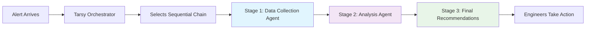
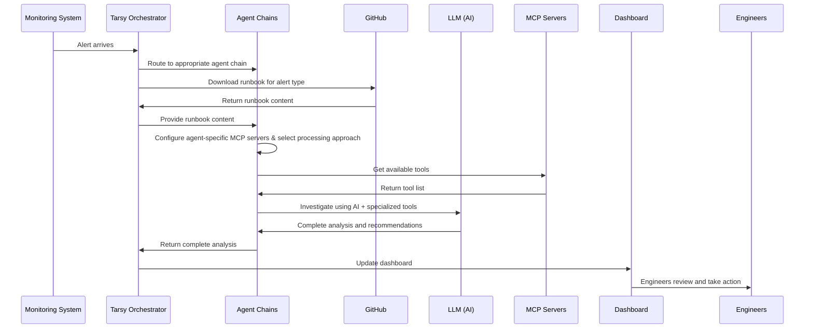
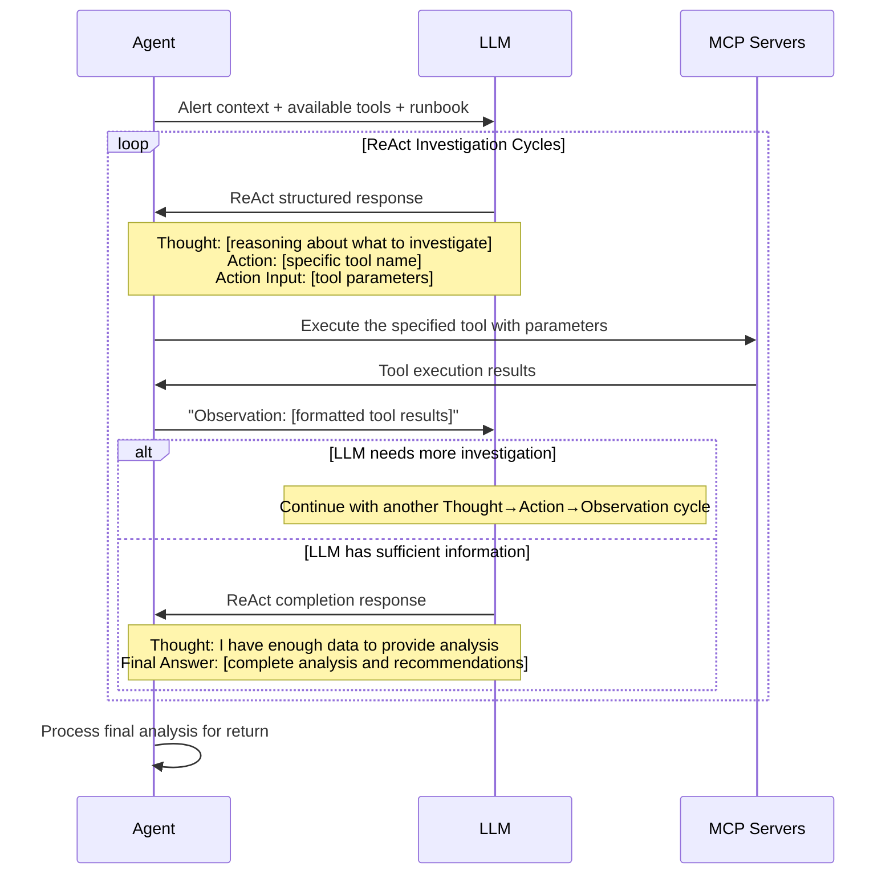
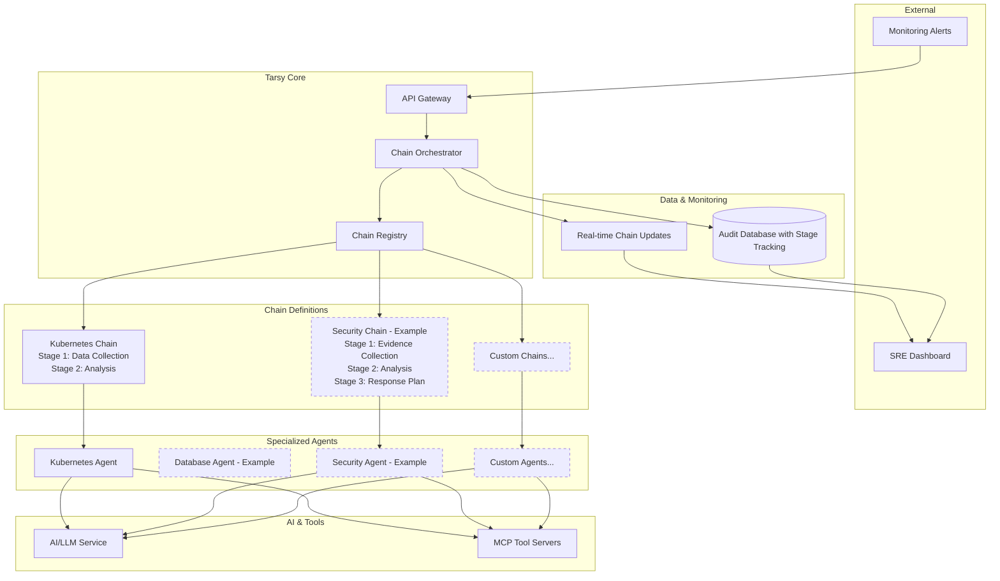

# Tarsy - High-Level Architecture Overview

> **📖 For detailed technical implementation**: See [Technical Design Document](design.md)

## What is Tarsy?

Tarsy is an **AI-powered incident analysis system** that processes alerts through sequential chains of specialized agents. When an alert comes in, Tarsy automatically selects the appropriate chain, executes multiple stages where agents build upon each other's work, and provides comprehensive analysis and recommendations for engineers to act upon. This chain-based approach enables complex multi-stage workflows for thorough incident investigation and analysis.

## Core Concept



## Key Components

### 1. The Orchestrator
- Receives alerts from monitoring systems
- Determines which sequential chain should handle each alert type
- Manages the overall chain execution workflow with stage-by-stage processing

### 2. Sequential Agent Chains
- **Multi-stage workflows** where specialized agents build upon each other's work
- Each chain consists of **sequential stages** executed by domain expert agents
- **Progressive data enrichment** as data flows from stage to stage
- **Flexible chain definitions** supporting both single-stage (traditional) and multi-stage processing

### 3. Specialized Agents (Enhanced for Chains)
- **Domain experts** for different infrastructure areas (Kubernetes, databases, networks, etc.)
- Each agent comes with its own **dedicated MCP servers/tools** (kubectl, database clients, network diagnostics, etc.)
- **Advanced processing approaches**: ReAct (systematic reasoning), Regular (fast iteration), ReAct Tools (data collection only), ReAct Tools Partial (data collection and partial analysis), ReAct Final Analysis (comprehensive analysis of data collected by previous stages, no tool calling)
- **Stage-aware processing**: Agents can access data from all previous stages in the chain
- Uses AI to intelligently select and use the right tools based on stage requirements and accumulated data

### 4. AI + Tools Integration
- **LLM (Large Language Model)**: Provides the "thinking" - analyzes situations and decides what to investigate
- **Agent-specific MCP Tools**: The "hands" - allows inspection of systems, diagnostic commands, log analysis
- **Chain context awareness**: Agents access accumulated data from previous stages for comprehensive analysis

### 5. Real-time Monitoring (Enhanced)
- Dashboard shows live chain processing status with stage-by-stage progress
- Complete audit trail of what each stage and agent did and why
- Stage execution tracking with detailed performance metrics
- SREs can observe and learn from multi-stage decision processes

## How It Works

### Alert Processing Flow



### ReAct Processing Detail (Within Chain Stages)

For agents using ReAct strategy within any chain stage, the investigation follows this detailed pattern:



## System Architecture



## Agent Intelligence Model

Each agent operates with four types of knowledge:

1. **General Instructions**: Universal best practices for incident response
2. **Domain-Specific Instructions**: Expert knowledge for their specialty area  
3. **Tool-Specific Instructions**: How to effectively use their available tools
4. **Runbook Knowledge**: Alert-specific investigation procedures and context from downloaded runbooks

The AI combines all four to make intelligent decisions about investigation approaches and generate expert recommendations. Agents can use either systematic ReAct reasoning (Think→Action→Observation cycles) or fast Regular iteration based on the complexity of the situation.

## Extensibility

- **New Agent Types**: Add expertise for new infrastructure domains
  - *Examples: ArgoCD agents, AWS agents, database agents, network agents*
- **New MCP Servers**: Integrate additional diagnostic tools for deeper analysis capabilities
  - *Examples: Prometheus metrics server, Grafana dashboards server, cloud provider APIs, log aggregation tools*
- **Configurable Chain Definitions**: Deploy new multi-stage workflows via YAML configuration without code changes
  - *Example config/agents.yaml:*
  ```yaml
  mcp_servers:
    prometheus-server:
      server_id: "prometheus-server"
      enabled: true
      connection_params:
        command: "npx"
        args: ["-y", "prometheus-mcp-server@latest", "--url", "${PROMETHEUS_URL}"]
      instructions: |
        For Prometheus metrics analysis:
        - Query time-series data to identify performance trends
        - Focus on resource utilization and application metrics
        - Correlate metrics with alert timeframes

  agents:
    performance-k8s-data-collector:
      mcp_servers:
        - "kubernetes-server"
      iteration_strategy: "react-tools"  # Optional default strategy: Data collection only
      custom_instructions: |             # Optional
        Collect comprehensive performance metrics for k8s cluster for analysis stage.
    performance-prometheus-data-collector:
      mcp_servers:
        - "prometheus-server"
        - "kubernetes-server"
      iteration_strategy: "react-tools"  # Optional default strategy: Data collection only
    performance-analyzer:
      iteration_strategy: "react-final-analysis"  # Optional default strategy: Analysis without tools
      custom_instructions: |
        Analyze performance data and provide optimization recommendations.

  agent_chains:
    performance-investigation-chain:
      alert_types:
        - "HighCPUUsage"
        - "MemoryPressure" 
        - "DiskSpaceWarning"
      stages:
        - name: "k8s-data-collection"
          agent: "performance-k8s-data-collector"         # Only k8s MCP Server available for this agent
          iteration_strategy: "react-tools"               # Override default if needed
        - name: "prometheus-metrics-collection"
          agent: "performance-prometheus-data-collector"  # Only prometheus MCP Server available for this agent
          iteration_strategy: "react-tools"
        - name: "trend-analysis"
          agent: "performance-analyzer"
          iteration_strategy: "react-final-analysis"
      description: "Multi-stage performance investigation workflow"
      # Key architectural benefit: Each stage can have specialized MCP servers
      # - Stage 1: Only kubernetes-server (lightweight data collection)  
      # - Stage 2: prometheus-server + kubernetes-server (metrics correlation)
      # - Stage 3: No MCP servers needed (pure analysis of collected data)
      # This avoids packing all MCP servers into a single agent, enabling focused expertise per stage
  ```
- **Integration Points**: Connect with existing monitoring and ticketing systems
  - *Examples: AlertManager, PagerDuty, Jira, ServiceNow integrations*

## Next Steps

For detailed technical implementation, API specifications, data models, and deployment information, see the comprehensive [Technical Design Document](design.md).

