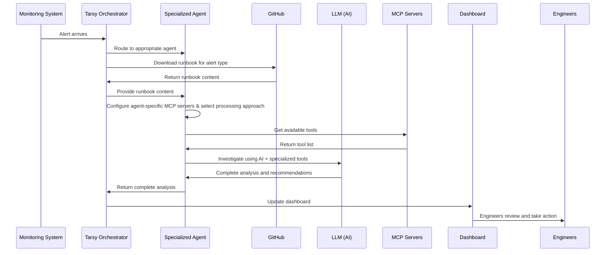

# Tarsy - High-Level Architecture Overview

> **📖 For detailed technical implementation**: See [Technical Design Document](design.md)

## What is Tarsy?

Tarsy is an **AI-powered incident analysis system** that processes alerts using specialized agents. When an alert comes in, Tarsy automatically selects the right expert agent, gives it the appropriate tools, and lets it investigate and analyze issues just like a human SRE would, then provides detailed recommendations for engineers to act upon.

## Core Concept


## Key Components

### 1. The Orchestrator
- Receives alerts from monitoring systems
- Determines which specialized agent should handle each alert type
- Manages the overall processing workflow

### 2. Specialized Agents
- **Domain experts** for different infrastructure areas (Kubernetes, databases, networks, etc.)
- Each agent comes with its own **dedicated MCP servers/tools** (kubectl, database clients, network diagnostics, etc.)
- **Configurable processing approaches**: ReAct (systematic reasoning) for complex analysis or Regular (fast iteration) for quick responses
- Uses AI to intelligently select and use the right tools for investigation and analysis

### 3. AI + Tools Integration
- **LLM (Large Language Model)**: Provides the "thinking" - analyzes situations and decides what to investigate
- **Agent-specific MCP Tools**: The "hands" - allows inspection of systems, diagnostic commands, log analysis
- Agents combine AI reasoning with their specialized toolset to provide thorough analysis

### 4. Real-time Monitoring
- Dashboard shows live processing status
- Complete audit trail of what each agent did and why
- SREs can observe and learn from agent decisions

## How It Works

### Alert Processing Flow



### ReAct Processing Detail

For agents using ReAct strategy, the investigation follows this detailed pattern:

```mermaid
sequenceDiagram
    participant A as Agent
    participant L as LLM
    participant MCP as MCP Servers

    A->>L: Alert context + available tools + runbook
    
    loop ReAct Investigation Cycles
        L->>A: ReAct structured response
        Note over L,A: Thought: [reasoning about what to investigate]<br/>Action: [specific tool name]<br/>Action Input: [tool parameters]
        A->>MCP: Execute the specified tool with parameters
        MCP->>A: Tool execution results
        A->>L: "Observation: [formatted tool results]"
        
        alt LLM needs more investigation
            Note over L: Continue with another Thought→Action→Observation cycle
        else LLM has sufficient information
            L->>A: ReAct completion response
            Note over L,A: Thought: I have enough data to provide analysis<br/>Final Answer: [complete analysis and recommendations]
        end
    end
    
    A->>A: Process final analysis for return
```



## System Architecture


## Agent Intelligence Model

Each agent operates with four types of knowledge:

1. **General Instructions**: Universal best practices for incident response
2. **Domain-Specific Instructions**: Expert knowledge for their specialty area  
3. **Tool-Specific Instructions**: How to effectively use their available tools
4. **Runbook Knowledge**: Alert-specific investigation procedures and context from downloaded runbooks

The AI combines all four to make intelligent decisions about investigation approaches and generate expert recommendations. Agents can use either systematic ReAct reasoning (Think→Action→Observation cycles) or fast Regular iteration based on the complexity of the situation.

## Extensibility

- **New Agent Types**: Add expertise for new infrastructure domains
  - *Examples: ArgoCD agents, AWS agents, database agents, network agents*
- **New MCP Servers**: Integrate additional diagnostic tools for deeper analysis capabilities
  - *Examples: Prometheus metrics server, Grafana dashboards server, cloud provider APIs, log aggregation tools*
- **Configurable Agents**: Deploy new agents via YAML configuration without code changes
  - *Example config/agents.yaml:*
  ```yaml
  mcp_servers:
    prometheus-server:
      server_id: "prometheus-server"
      enabled: true
      connection_params:
        command: "npx"
        args: ["-y", "prometheus-mcp-server@latest", "--url", "${PROMETHEUS_URL}"]
      instructions: |
        For Prometheus metrics analysis:
        - Query time-series data to identify performance trends
        - Focus on resource utilization and application metrics
        - Correlate metrics with alert timeframes

  agents:
    performance-agent:
      alert_types:
        - "HighCPUUsage"
        - "MemoryPressure" 
        - "DiskSpaceWarning"
      mcp_servers:
        - "prometheus-server"
        - "kubernetes-server"
      iteration_strategy: "regular"  # Fast iteration for performance issues
      custom_instructions: |
        You are a performance-focused SRE agent.
        Prioritize system stability and resource optimization.
  ```
- **Integration Points**: Connect with existing monitoring and ticketing systems
  - *Examples: AlertManager, PagerDuty, Jira, ServiceNow integrations*

## Next Steps

For detailed technical implementation, API specifications, data models, and deployment information, see the comprehensive [Technical Design Document](design.md).

