# Tarsy - High-Level Architecture Overview

> **📖 For detailed technical implementation**: See [Functional Areas Design Document](functional-areas-design.md)

## What is Tarsy?

Tarsy is an **AI-powered incident analysis system** that processes alerts through sequential chains of specialized agents. When an alert comes in, Tarsy automatically selects the appropriate chain, executes multiple stages where agents build upon each other's work, and provides comprehensive analysis and recommendations for engineers to act upon. This chain-based approach enables complex multi-stage workflows for thorough incident investigation and analysis.

**Pause & Resume**: Long-running investigations that reach iteration limits automatically pause, preserving full conversation state and allowing engineers to resume with one click. The system continues exactly where it left off, maintaining complete context from the paused stage.

After an investigation completes, engineers can continue the conversation through **follow-up chat** - asking clarifying questions, requesting deeper analysis, or exploring different aspects of the incident. The chat agent maintains full access to the investigation context and tools, enabling continued exploration without restarting the analysis pipeline.

## Core Concept


## Key Components

### 1. The Orchestrator
- Receives alerts from monitoring systems
- Determines which sequential chain should handle each alert type
- Manages the overall chain execution workflow with stage-by-stage processing
- Handles automatic pause when iteration limits are reached during stage execution
- Supports resume operations to continue paused investigations from their exact state

### 2. Sequential Agent Chains
- **Multi-stage workflows** where specialized agents build upon each other's work
- Each chain consists of **sequential stages** executed by domain expert agents
- **Progressive data enrichment** as data flows from stage to stage
- **Flexible chain definitions** supporting both single-stage (traditional) and multi-stage processing

### 3. Specialized Agents (Enhanced for Chains)
- **Domain experts** for different infrastructure areas (Kubernetes, databases, networks, etc.)
- Each agent comes with its own **dedicated MCP servers/tools** (kubectl, database clients, network diagnostics, etc.)
- **Advanced processing approaches**: ReAct (systematic reasoning), ReAct Stage (stage-specific analysis within chains), ReAct Final Analysis (comprehensive analysis of data collected by previous stages, no tool calling)
- **Stage-aware processing**: Agents can access data from all previous stages in the chain
- Uses AI to intelligently select and use the right tools based on stage requirements and accumulated data

### 4. AI + Tools Integration
- **LLM (Large Language Model)**: Provides the "thinking" - analyzes situations and decides what to investigate
- **Agent-specific MCP Tools**: The "hands" - allows inspection of systems, diagnostic commands, log analysis
- **Custom MCP Configuration**: Optionally override default agent MCP server assignments per alert request, enabling fine-grained control over which tools are available during processing
- **Chain context awareness**: Agents access accumulated data from previous stages for comprehensive analysis
- **Intelligent Content Management**: Dual-layer content truncation system with provider-aware limits prevents context overflow while preserving critical investigation details. Large MCP tool results are automatically summarized using context-aware AI, and hook processing includes content size optimization for database and dashboard performance

### 5. Real-time Monitoring (Enhanced)
- Dashboard shows live chain processing status with stage-by-stage progress
- **Real-time LLM streaming** - see agent thinking process as it happens (Thought and Final Answer sections)
- Complete audit trail of what each stage and agent did and why
- Stage execution tracking with detailed performance metrics
- **Pause/Resume UI** - prominent visual indicators for paused sessions with one-click resume functionality
- **MCP Health Monitoring** - background service monitors MCP server health, automatically attempts recovery, and displays warnings for unavailable servers
- SREs can observe and learn from multi-stage decision processes

### 6. Follow-up Chat Capability
- **Interactive Investigation**: Continue exploring after sessions complete (or fail/are cancelled)
- **Context Preservation**: Chat agent maintains full investigation context and tool access
- **Multi-user Collaboration**: Multiple engineers can participate in the same conversation
- **Unified Timeline**: Chat messages appear inline with investigation stages in the reasoning view
- **Real-time Streaming**: Follow-up questions trigger the same ReAct reasoning visible during initial investigation
- **Per-chain Configuration**: Chat capability can be enabled/disabled per agent chain

## How It Works

### Alert Processing Flow


### ReAct Processing Detail (Within Chain Stages)

For agents using the ReAct strategy within any chain stage, the investigation follows this detailed pattern with structured conversation handling:

```mermaid
sequenceDiagram
    participant A as Agent
    participant L as LLM
    participant MCP as MCP Servers

    A->>L: Alert context + available tools + runbook
    
    loop ReAct Investigation Cycles
        L->>A: ReAct structured response
        Note over L,A: Thought: [reasoning about what to investigate]<br/>Action: [specific tool name]<br/>Action Input: [tool parameters]
        A->>MCP: Execute the specified tool with parameters
        MCP->>A: Tool execution results (auto-summarized if large)
        A->>L: "Observation: [formatted tool results]"
        
        alt LLM needs more investigation
            Note over L: Continue with another Thought→Action→Observation cycle
        else LLM has sufficient information
            L->>A: ReAct completion response
            Note over L,A: Thought: I have enough data to provide analysis<br/>Final Answer: [complete analysis and recommendations]
        end
    end
    
    A->>A: Process final analysis for return
```



### Pause & Resume Flow

When a stage reaches its maximum iteration limit, the system automatically pauses if the last LLM interaction was successful. The complete conversation state and context are preserved in the database. Engineers can resume processing with one click via `POST /api/v1/history/sessions/{session_id}/resume`, continuing from exactly where it paused. Sessions with failed last interactions are marked as failed, not paused.

**Pause Metadata Fields:** When a session pauses, the following metadata is available in the UI and API responses:
- `reason`: Why the session paused (currently `"max_iterations_reached"`)
- `current_iteration`: The iteration count when paused (optional, included for iteration-based pauses)
- `message`: User-friendly explanation of the pause (e.g., "Paused after 15 iterations - resume to continue")
- `paused_at_us`: Timestamp when session paused (microseconds since epoch)

### Follow-up Chat

After a session completes (or fails/is cancelled), engineers can start a chat conversation to ask follow-up questions. The chat agent uses the same ReAct processing shown above, with full investigation context and access to the same MCP tools used during the original session. Responses stream in real-time and appear inline in the conversation timeline.

## Authentication & Access Control

Tarsy supports **optional OAuth2-based authentication** for enhanced security in development and production environments using [OAuth2-Proxy](https://github.com/oauth2-proxy/oauth2-proxy):

### Development Modes
- **Direct Mode (Default)**: Dashboard connects directly to Tarsy API (`localhost:8000`)
- **Authenticated Mode**: Dashboard connects through OAuth2-proxy (`localhost:4180`) for real authentication testing

**📖 For complete authentication setup**: See [OAuth2-Proxy Setup Guide](oauth2-proxy-setup.md)

## Agent Intelligence Model

Each agent operates with four types of knowledge:

1. **General Instructions**: Universal best practices for incident response
2. **Domain-Specific Instructions**: Expert knowledge for their specialty area  
3. **Tool-Specific Instructions**: How to effectively use their available tools
4. **Runbook Knowledge**: Alert-specific investigation procedures and context from downloaded runbooks

The AI combines all four to make intelligent decisions about investigation approaches and generate expert recommendations. Agents can use either systematic ReAct reasoning (Think→Action→Observation cycles) or fast Regular iteration based on the complexity of the situation.

## Extensibility

- **New Agent Types**: Add expertise for new infrastructure domains
  - *Examples: ArgoCD agents, AWS agents, database agents, network agents*
  - *Note: Can override built-in agents via `config/agents.yaml` to customize behavior*
- **New MCP Servers**: Integrate additional diagnostic tools for deeper analysis capabilities
  - *Examples: Prometheus metrics server, Grafana dashboards server, cloud provider APIs, log aggregation tools*
  - *Note: Can override built-in MCP servers via `config/agents.yaml` (e.g., customize kubernetes-server with specific kubeconfig)*
- **Runtime MCP Configuration**: Override default agent MCP server assignments per alert request
  - *Capability: Specify which MCP servers and tools to use via the `mcp` field in alert payloads*
  - *Validation: Server and tool selections are validated at runtime to ensure security and prevent unauthorized access*
- **LLM Provider Configuration**: Built-in support for multiple AI providers with optional custom configurations
  - *Built-in providers: OpenAI, Google Gemini, xAI Grok, Anthropic Claude, Google Vertex AI*
  - *Custom providers: Proxy configurations, model overrides, content truncation controls via `config/llm_providers.yaml`*
  - *Google Search Grounding: Optional native search capability for Gemini models via `enable_native_search` flag - allows LLMs to ground responses with real-time web information*
- **Configurable Chain Definitions**: Deploy new multi-stage workflows via YAML configuration without code changes
  - *Note: Can override built-in chains via `config/agents.yaml` to customize investigation workflows*
  - *Example config/agents.yaml:*
  ```yaml
  mcp_servers:
    prometheus-server:
      server_id: "prometheus-server"
      enabled: true
      transport:
        type: "stdio"
        command: "npx"
        args: ["-y", "prometheus-mcp-server@latest", "--url", "${PROMETHEUS_URL}"]
      instructions: |
        For Prometheus metrics analysis:
        - Query time-series data to identify performance trends
        - Focus on resource utilization and application metrics
        - Correlate metrics with alert timeframes
      summarization:
        enabled: true
        size_threshold_tokens: 3000      # Database output can be large
        summary_max_token_limit: 800

  agents:
    performance-k8s-data-collector:
      mcp_servers:
        - "kubernetes-server"
      iteration_strategy: "react-stage"  # Optional default strategy: Stage-specific analysis
      custom_instructions: |             # Optional
        Collect comprehensive performance metrics for k8s cluster for analysis stage.
    performance-prometheus-data-collector:
      mcp_servers:
        - "prometheus-server"
        - "kubernetes-server"
      iteration_strategy: "react-stage"  # Optional default strategy: Stage-specific analysis
    performance-analyzer:
      iteration_strategy: "react-final-analysis"  # Optional default strategy: Analysis without tools
      custom_instructions: |
        Analyze performance data and provide optimization recommendations.

  agent_chains:
    performance-investigation-chain:
      alert_types:
        - "HighCPUUsage"
        - "MemoryPressure" 
        - "DiskSpaceWarning"
      stages:
        - name: "k8s-data-collection"
          agent: "performance-k8s-data-collector"         # Only k8s MCP Server available for this agent
          iteration_strategy: "react-stage"               # Override default if needed
        - name: "prometheus-metrics-collection"
          agent: "performance-prometheus-data-collector"  # Only prometheus MCP Server available for this agent
          iteration_strategy: "react-stage"
        - name: "trend-analysis"
          agent: "performance-analyzer"
          iteration_strategy: "react-final-analysis"
      description: "Multi-stage performance investigation workflow"
      # Key architectural benefit: Each stage can have specialized MCP servers
      # - Stage 1: Only kubernetes-server (lightweight data collection)  
      # - Stage 2: prometheus-server + kubernetes-server (metrics correlation)
      # - Stage 3: No MCP servers needed (pure analysis of collected data)
      # This avoids packing all MCP servers into a single agent, enabling focused expertise per stage
  ```
- **Integration Points**: Connect with existing monitoring and ticketing systems
  - *Examples: AlertManager, PagerDuty, Jira, ServiceNow integrations*

## Next Steps

For detailed technical implementation, API specifications, data models, and deployment information, see the comprehensive [Functional Areas Design Document](functional-areas-design.md).

