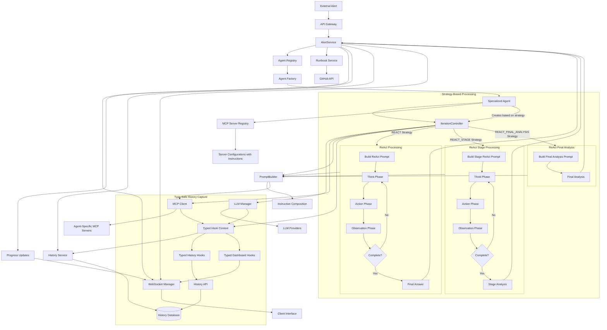
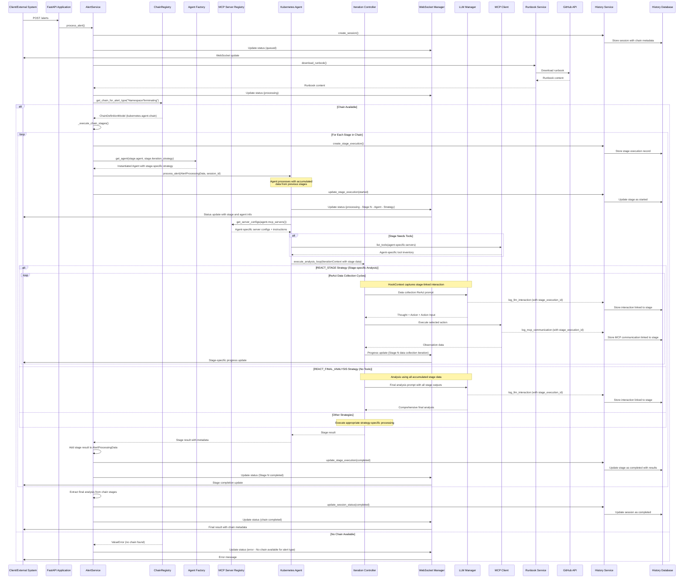

# Tarsy-bot - Technical Design Document 🛠️

> **🎯 For high-level concept overview**: See [Architecture Overview](architecture-overview.md)

## Table of Contents
1. [System Overview](#system-overview)
2. [Architecture Design](#architecture-design)
3. [Backend Components](#backend-components)
4. [Data Flow Architecture](#data-flow-architecture)
5. [Integration Patterns](#integration-patterns)
6. [Alert Dev UI Development Interface](#alert-dev-ui-development-interface)
7. [Security Architecture](#security-architecture)
8. [Performance Considerations](#performance-considerations)
9. [Error Handling and Resilience](#error-handling-and-resilience)
10. [Deployment Architecture](#deployment-architecture)
11. [Extension Points](#extension-points)

---

## Document Evolution

This design document is a living document that evolves through [Enhancement Proposals (EPs)](enhancements/README.md). All significant architectural changes are documented through the EP process, ensuring traceable evolution and AI-friendly implementation.

### Recent Changes
- **EP-0008-1 (IMPLEMENTED)**: Sequential Agent Chains - Added multi-stage alert processing workflows where alerts can flow through multiple specialized agents that build upon each other's work. Key features include unified AlertProcessingData model throughout the pipeline, ChainRegistry for managing chain definitions, new iteration strategies (REACT_STAGE, REACT_FINAL_ANALYSIS) for different chain stage purposes, enhanced database schema with StageExecution tracking, and chain execution logic integrated into AlertService
- **TYPED HOOK SYSTEM (IMPLEMENTED)**: Type-Safe Interaction Capture - Complete refactoring to typed hook system with unified LLMInteraction and MCPInteraction models, eliminating data contamination and providing clean type-safe interaction capture. Comprehensive test coverage restoration with 49 new tests for hook system, LLM client, and MCP client functionality
- **INTERACTION MODEL UNIFICATION (IMPLEMENTED)**: Unified Interaction Models - Consolidated interaction data structures into type-safe LLMInteraction and MCPInteraction models with consistent fields, JSON serialization, and proper database persistence. Dashboard integration updated for LLM interaction preview with smart text parsing
- **ITERATION STRATEGIES (IMPLEMENTED)**: Agent Iteration Flow Strategies - Added ReAct vs Regular iteration strategy support allowing agents to use either the standard ReAct pattern (Think→Action→Observation cycles) for systematic analysis or regular iteration pattern for faster processing without reasoning overhead
- **EP-0007 (IMPLEMENTED)**: Data Masking Service for Sensitive MCP Server Data - Added comprehensive pattern-based masking service for secrets and credentials from MCP server responses, with built-in patterns for common secrets (kubernetes_data_section, api_key, password, certificate, token) and configurable per-server masking rules with pattern groups
- **EP-0006 (IMPLEMENTED)**: Configuration-Based Agents - Added YAML-based agent configuration system allowing deployment of new agents without code changes, supporting both traditional hardcoded agents and configuration-driven agents simultaneously via ConfigurableAgent class
- **EP-0005 (IMPLEMENTED)**: Flexible Alert Data Structure Support - Transformed rigid Kubernetes-specific alert model into flexible, agent-agnostic system supporting arbitrary JSON payloads with minimal validation, enhanced database with JSON indexing for efficient querying, and updated UI for dynamic alert data rendering
- **EP-0004 (IMPLEMENTED)**: Dashboard UI for Alert History - Added comprehensive standalone React 19.1.0 dashboard for SRE operational monitoring with real-time WebSocket integration, historical analysis, multiplexed WebSocket architecture with subscription management, and session-specific timeline visualization
- **EP-0003 (IMPLEMENTED)**: Alert Processing History Service - Added comprehensive audit trail capture and database persistence with REST API endpoints for historical data access, including microsecond-precision timeline reconstruction and advanced filtering capabilities  
- **EP-0002 (IMPLEMENTED)**: Multi-Layer Agent Architecture - Transformed monolithic alert processing into orchestrator + specialized agents architecture with BaseAgent abstract class, KubernetesAgent implementation, and integrated PromptBuilder system
- This document was established as the baseline technical design
- Future changes will be tracked through Enhancement Proposals in `docs/enhancements/`

### Pending Enhancements
- **EP-0008-2 (PENDING)**: Parallel Agent Execution - Parallel execution within chain stages for increased processing throughput
- **EP-0008-3 (PENDING)**: Conditional Chain Routing - Branching logic and conditional workflows between chain stages

For proposed architectural changes or new design patterns, see the [Enhancement Proposals directory](enhancements/README.md).

---

## System Overview

Tarsy is a **distributed, event-driven system** designed to automate incident response through intelligent alert processing using a **chain-based multi-layer agent architecture**. The system implements **sequential agent chains** where alerts flow through multiple specialized agents that build upon each other's work, using Large Language Models (LLMs) to dynamically select and orchestrate Model Context Protocol (MCP) servers for comprehensive incident analysis. The system includes comprehensive audit trail capture with stage-level tracking, real-time dashboard monitoring, and supports both hardcoded and configuration-driven agents with flexible chain definitions.

> **💡 For conceptual understanding**: See [Architecture Overview](architecture-overview.md) for a high-level introduction to Tarsy's concepts and benefits.

### Core Design Principles

1. **Chain-Based Processing**: Sequential agent chains enable multi-stage workflows where agents build upon each other's work for comprehensive analysis
2. **Unified Data Model**: Enhanced AlertProcessingData serves as the single data model throughout the entire processing pipeline, accumulating stage outputs
3. **Agent Specialization**: Domain-specific agents with focused MCP server subsets, specialized instructions, and configurable iteration strategies per stage
4. **Configuration-Driven Extensibility**: Support for both hardcoded agents and YAML-configured agents with chain definitions without code changes
5. **Flexible Alert Data Structure**: Agent-agnostic system supporting arbitrary JSON payloads from diverse monitoring sources
6. **LLM-First Processing**: Agents receive complete JSON payloads for intelligent interpretation without rigid field extraction
7. **Multiple Iteration Strategies**: Configurable strategies including ReAct (systematic reasoning), REACT_STAGE (stage-specific analysis), and REACT_FINAL_ANALYSIS (comprehensive analysis)
8. **Progressive Data Enrichment**: Stage outputs accumulate throughout the chain, allowing later stages to access all previous stage data
9. **Dynamic Tool Selection**: Agents intelligently choose appropriate MCP tools from their assigned server subsets based on stage requirements
10. **Extensible Chain Architecture**: Inheritance-based agent design with composition-based iteration strategies and flexible chain definitions
11. **Real-time Communication**: Dashboard-based WebSocket updates with multiplexed subscription management and stage-level progress tracking
12. **Resilient Design**: Graceful degradation with stage-level error handling and comprehensive error handling across chain layers
13. **Comprehensive Audit Trail**: Persistent history capture of all chain processing workflows with stage-level detail and chronological timeline reconstruction

### Technology Stack

**Backend:**
- **Framework**: FastAPI (>=0.104.0, Python 3.11+) with asyncio for asynchronous processing
- **Agent Architecture**: Abstract BaseAgent class with inheritance-based specialization and ConfigurableAgent for YAML-driven agents
- **LLM Integration**: LangChain framework (>=0.3.0) supporting multiple providers (OpenAI >=0.2.0, Google Gemini >=2.0.0, xAI Grok >=0.2.0)
- **MCP Integration**: Official MCP SDK (>=1.0.0) with stdio transport, agent-specific server subsets, and integrated data masking
- **Hook System**: Type-safe interaction capture with unified LLMInteraction and MCPInteraction models, eliminating data contamination
- **Communication**: WebSocket (>=12.0) for real-time updates with agent context, REST API for external integration
- **Configuration**: Environment-based configuration with centralized builtin_config.py, agent registry and MCP server registry
- **Database**: SQLModel (>=0.0.14) with SQLAlchemy (>=2.0.41) for audit trail persistence, SQLite with PostgreSQL migration support
- **HTTP Client**: HTTPX (>=0.25.0) for external API integrations
- **Additional**: Pydantic (>=2.5.0) for data validation, python-multipart for file uploads, markdown for documentation rendering

**Dashboard UI (SRE Operational Monitoring):**
- **Framework**: React 19.1.0 with TypeScript for standalone SRE dashboard
- **UI Library**: Material-UI v7.2.0 with comprehensive Material Design components, MUI X Date Pickers v8.9.0
- **Communication**: Axios 1.11.0 for HTTP requests, native WebSocket with multiplexed subscription management
- **Features**: Active/historical alert monitoring, session-specific timeline visualization, real-time filtering, advanced search
- **Additional**: React Router DOM 7.7.1 for navigation, React Markdown 10.1.0 for content rendering, date-fns 4.1.0 for date handling

**Alert Dev UI (Development/Testing Only):**
- **Framework**: React with TypeScript
- **UI Library**: Material-UI (MUI) for modern, responsive interface
- **Communication**: Axios for HTTP requests, native WebSocket for real-time updates including agent status

---

## Architecture Design

### High-Level Architecture

```
┌─────────────────────────────────────────────────────────────────────────────────────┐
│                              Tarsy - Multi-Layer Architecture                       │
│                                                                                     │
│              ┌────────────────────┐            ┌────────────────────────┐           │
│              │ Alert Dev UI Layer │            │       Dashboard UI     |           |
│              │                    │            │                        |           |
│              │                    │            │                        │           │
│              └────────────────────┘            └────────────────────────┘           |
│                        └────────────────────────────────────┘                       │
│                                      │                                              │
│                                   HTTP/WebSocket                                    │
│                                      │                                              │
│  ┌─────────────────────────────────────────────────────────────────────────────┐    │
│  │                        API Gateway & Orchestrator Layer                     │    │
│  │                                                                             │    │
│  │  ┌─────────────────┐    ┌─────────────────┐    ┌─────────────────┐          │    │
│  │  │   FastAPI       │    │   Alert         │    │   WebSocket     │          │    │
│  │  │   Application   │    │   Orchestrator  │    │   Manager       │          │    │
│  │  └─────────────────┘    └─────────────────┘    └─────────────────┘          │    │
│  │                                                                             │    │
│  │  ┌─────────────────┐    ┌─────────────────┐    ┌─────────────────┐          │    │
│  │  │   Agent         │    │   Agent         │    │   MCP Server    │          │    │
│  │  │   Registry      │    │   Factory       │    │   Registry      │          │    │
│  │  └─────────────────┘    └─────────────────┘    └─────────────────┘          │    │
│  │                                                                             │    │
│  │  ┌─────────────────┐    ┌─────────────────┐    ┌─────────────────┐          │    │
│  │  │   History       │    │   History       │    │   Database      │          │    │
│  │  │   Service       │    │   API           │    │   Manager       │          │    │
│  │  └─────────────────┘    └─────────────────┘    └─────────────────┘          │    │
│  └─────────────────────────────────────────────────────────────────────────────┘    │
│                                                                                     │
│  ┌─────────────────────────────────────────────────────────────────────────────┐    │
│  │                        Specialized Agent Layer                              │    │
│  │                                                                             │    │
│  │  ┌─────────────────────────────────────────────────────────────────────┐    │    │
│  │  │                         BaseAgent                                   │    │    │
│  │  │              (Common Processing Logic)                              │    │    │
│  │  └─────────────────────────────────────────────────────────────────────┘    │    │
│  │                                  │                                          │    │
│  │          ┌──────────────────────────────────────────────────┐               │    │
│  │          │                      │                           │               │    │
│  │  ┌─────────────────┐    ┌─────────────────┐    ┌─────────────────┐          │    │
│  │  │   Kubernetes    │    │   ArgoCD        │    │   AWS           │          │    │
│  │  │   Agent         │    │   Agent         │    │   Agent         │          │    │
│  │  │   (IMPLEMENTED) │    │   (Future)      │    │   (Future)      │          │    │
│  │  └─────────────────┘    └─────────────────┘    └─────────────────┘          │    │
│  │                                                                             │    │
│  │  ┌─────────────────┐    ┌─────────────────┐    ┌─────────────────┐          │    │
│  │  │   LLM           │    │   MCP Client    │    │   Runbook       │          │    │
│  │  │   Manager       │    │   Manager       │    │   Service       │          │    │
│  │  └─────────────────┘    └─────────────────┘    └─────────────────┘          │    │
│  │                                                                             │    │
│  │  ┌─────────────────┐    ┌─────────────────┐    ┌─────────────────┐          │    │
│  │  │   History       │    │   Hook Context  │    │   History       │          │    │
│  │  │   Repository    │    │   System        │    │   Models        │          │    │
│  │  └─────────────────┘    └─────────────────┘    └─────────────────┘          │    │
│  └─────────────────────────────────────────────────────────────────────────────┘    │
│                                                                                     │
│  ┌─────────────────────────────────────────────────────────────────────────────┐    │
│  │                            Integration Layer                                │    │
│  │                                                                             │    │
│  │  ┌─────────────────┐    ┌─────────────────┐    ┌─────────────────┐          │    │
│  │  │   LLM           │    │   MCP Server    │    │   GitHub        │          │    │
│  │  │   Providers     │    │   Ecosystem     │    │   Integration   │          │    │
│  │  │                 │    │   (Agent-       │    │                 │          │    │
│  │  │ • OpenAI        │    │    Specific)    │    │ • Runbook       │          │    │
│  │  │ • Google Gemini │    │ • Kubernetes    │    │   Download      │          │    │
│  │  │ • xAI Grok      │    │ • ArgoCD        │    │ • Authentication│          │    │
│  │  │                 │    │ • Database      │    │                 │          │    │
│  │  │                 │    │ • Monitoring    │    │                 │          │    │
│  │  └─────────────────┘    └─────────────────┘    └─────────────────┘          │    │
│  └─────────────────────────────────────────────────────────────────────────────┘    │
└─────────────────────────────────────────────────────────────────────────────────────┘
```

### Component Interaction Diagram

The following diagram shows the current implementation of component interactions in the Tarsy system:



---

## Backend Components

### 1. API Gateway Layer

The main application layer provides HTTP API and WebSocket endpoints with agent-aware responses:

```
Core API Endpoints:
GET /                              # Root health check endpoint
GET /health                        # Comprehensive health check with service status
POST /alerts                       # Submit alert for processing (with comprehensive validation)
GET /session-id/{alert_id}         # Get session ID for an alert (needed for dashboard WebSocket subscription)
GET /alert-types                   # Get supported alert types (from agent registry)

History API Endpoints:
GET /api/v1/history/sessions              # List alert processing sessions with advanced filtering and pagination
GET /api/v1/history/sessions/{session_id}    # Get detailed session information with chronological timeline
GET /api/v1/history/health                # History service health check
GET /api/v1/history/metrics               # Dashboard metrics overview
GET /api/v1/history/active-sessions       # Get currently active/processing sessions
GET /api/v1/history/filter-options        # Get available filter options for dashboard
GET /api/v1/history/sessions/{session_id}/export  # Export session data in JSON or CSV format
GET /api/v1/history/search                # Search sessions by content, error messages, or metadata

Dashboard WebSocket:
WebSocket /ws/dashboard/{user_id}     # Multiplexed WebSocket with subscription management for real-time updates

Note: The /processing-status/{alert_id} endpoint was removed. Alert processing status 
is now tracked through the history service and dashboard WebSocket subscriptions.
```

**Core Features:**
- **Agent-Aware Processing**: Background task management with agent delegation
- **CORS Support**: Configurable cross-origin resource sharing
- **Lifecycle Management**: Startup/shutdown hooks for service and agent initialization
- **State Management**: Processing status tracking with agent identification
- **Real-time Communication**: Dashboard-based WebSocket updates with agent-aware status broadcasting
- **Dashboard WebSocket**: Multiplexed WebSocket endpoint (`/ws/dashboard/{user_id}`) with subscription management

### 2. AlertService

The core service that implements chain orchestration and manages the overall processing pipeline:

```
Interface Pattern:
class AlertService:
    def __init__(self, settings: Settings)
    async def initialize(self)
    async def process_alert(self, alert_data: Dict[str, Any]) -> Dict[str, Any]
    async def _execute_chain_stages(self, chain_definition, alert_processing_data: AlertProcessingData, session_id: str) -> Dict[str, Any]
```

**Core Responsibilities:**
- **Service Initialization**: Initialize all required services (MCP client, LLM manager, agent factory, chain registry)
- **Chain Selection**: Use ChainRegistry to determine appropriate chain for alert type
- **Runbook Management**: Download runbooks using RunbookService and distribute to chain stages
- **Chain Orchestration**: Execute sequential stages with data accumulation between stages
- **Stage Management**: Create and track stage executions with detailed audit trails
- **Status Updates**: Coordinate WebSocket-based status updates and dashboard broadcasting with stage-level progress
- **Error Handling**: Handle stage-level errors and provide chain execution recovery
- **Result Aggregation**: Aggregate and format results from all chain stages

**Chain Processing Algorithm:**
1. **Prerequisites Validation**: Validate LLM availability and chain registry initialization
2. **Chain Selection**: Use ChainRegistry to determine appropriate chain definition for alert type
3. **Chain Session Creation**: Create history session with chain metadata and stage tracking
4. **Runbook Download**: Retrieve runbook content from GitHub using RunbookService
5. **Stage Execution Loop**: Execute each stage sequentially:
   - Create stage execution record with database tracking
   - Instantiate agent with stage-specific iteration strategy
   - Execute stage with accumulated data from previous stages
   - Store stage results in unified AlertProcessingData model
   - Update stage execution status and duration
6. **Chain Completion**: Extract final analysis from last successful analysis stage
7. **Result Processing**: Format and return chain execution results with stage metadata
8. **Error Handling**: Handle stage-level and chain-level errors with recovery options

### 3. ChainRegistry

Registry for chain definitions with built-in and YAML chain support, replacing the previous AgentRegistry:

```
Interface Pattern:
class ChainRegistry:
    def __init__(self, config_loader: Optional[ConfigurationLoader] = None)
    def get_chain_for_alert_type(self, alert_type: str) -> ChainDefinitionModel
    def list_available_alert_types(self) -> List[str]
    def list_available_chains(self) -> List[str]
    def get_chain_by_id(self, chain_id: str) -> Optional[ChainDefinitionModel]
```

**Core Features:**
- **Chain-Based Architecture**: Maps alert types to chain definitions instead of individual agents
- **Centralized Configuration**: Imports built-in chain definitions from `builtin_config.py` single source of truth
- **Configuration Extension**: Supports both built-in and YAML-configured chain definitions simultaneously
- **Fast Lookup**: O(1) dictionary-based chain resolution with comprehensive validation
- **Conflict Detection**: Validates that chain IDs are unique and alert types map to only one chain
- **Error Handling**: Clear messages when no chain is available for alert type

**Current Built-in Chains (from builtin_config.py):**
```
Chain Definitions:
"kubernetes-agent-chain":
  alert_types: ["kubernetes", "NamespaceTerminating"]
  stages: [{"name": "analysis", "agent": "KubernetesAgent"}]
  description: "Single-stage Kubernetes analysis"

# Configuration-based chains create definitions like:
# "security-incident-chain":
#   alert_types: ["SecurityBreach"]
#   stages: [
#     {"name": "data-collection", "agent": "ConfigurableAgent:security-collector"},
#     {"name": "analysis", "agent": "ConfigurableAgent:security-analyzer"}
#   ]
```

### 3a. Centralized Built-in Configuration (EP-0006)

Central configuration management for all built-in system components:

```
Location: backend/tarsy/config/builtin_config.py
```

**Core Features:**
- **Single Source of Truth**: Centralized definitions for all built-in agents and MCP servers
- **Import Path Management**: Maps agent class names to their full import paths for dynamic loading
- **Alert Type Mappings**: Defines which built-in agents handle which alert types
- **MCP Server Definitions**: Complete built-in MCP server configurations with connection parameters
- **Conflict Prevention**: Provides authoritative lists for configuration validation

**Built-in Component Definitions:**
```python
# Agent class imports for dynamic loading
BUILTIN_AGENTS = {
    "KubernetesAgent": {
        "import": "tarsy.agents.kubernetes_agent.KubernetesAgent",
        "iteration_strategy": "react",
        "description": "Kubernetes-specialized agent using ReAct pattern"
    }
}

# Built-in chain definitions (replaces BUILTIN_AGENT_MAPPINGS)
BUILTIN_CHAIN_DEFINITIONS = {
    "kubernetes-agent-chain": {
        "alert_types": ["kubernetes", "NamespaceTerminating"],
        "stages": [
            {"name": "analysis", "agent": "KubernetesAgent"}
        ],
        "description": "Single-stage Kubernetes analysis"
    }
}

# Complete MCP server configurations
BUILTIN_MCP_SERVERS = {
    "kubernetes-server": {
        "server_id": "kubernetes-server",
        "server_type": "kubernetes", 
        "enabled": True,
        "connection_params": {...},
        "instructions": "Kubernetes-specific LLM guidance...",
        "data_masking": {
            "enabled": True,
            "pattern_groups": ["kubernetes"]
        }
    }
}
```

**Module Integration:**
- **ChainRegistry**: Imports `BUILTIN_CHAIN_DEFINITIONS` for alert type to chain mapping
- **AgentFactory**: Imports `BUILTIN_AGENTS` for dynamic class loading and agent metadata
- **MCPServerRegistry**: Imports `BUILTIN_MCP_SERVERS` for server initialization
- **ConfigurationLoader**: Imports all definitions for conflict detection with configured components

**Adding New Built-in Components:**
1. Edit only `builtin_config.py` - no changes needed elsewhere
2. Add agent class definition to `BUILTIN_AGENTS` with import path and metadata
3. Add chain definition to `BUILTIN_CHAIN_DEFINITIONS` with alert types and stages
4. Add MCP server configuration to `BUILTIN_MCP_SERVERS`
5. All registries automatically inherit the new definitions

### 4. Agent Factory

Factory service for instantiating specialized agent classes with dependency injection:

```
Interface Pattern:
class AgentFactory:
    def __init__(self,
                 llm_client: LLMClient,
                 mcp_client: MCPClient,
                 mcp_registry: MCPServerRegistry)
    def create_agent(self, agent_class_name: str) -> BaseAgent
    def _register_available_agents(self) -> None
```

**Core Features:**
- **Dependency Injection**: Automatic injection of required services into agents
- **Static Class Registry**: Internal registry of available agent classes loaded at initialization
- **Error Handling**: Clear messages for unknown or failed agent instantiation (raises ValueError)
- **Resource Management**: Efficient reuse of shared resources (LLM clients, MCP connections)

### 5. BaseAgent (Abstract Base Class)

Abstract base class providing common processing logic and interface for all specialized agents with configurable iteration strategies:

```
Interface Pattern:
class BaseAgent(ABC):
    def __init__(self, llm_client: LLMClient, mcp_client: MCPClient, 
                 mcp_registry: MCPServerRegistry, 
                 iteration_strategy: IterationStrategy = IterationStrategy.REACT)
    
    # Abstract methods that must be implemented by specialized agents
    @abstractmethod
    def mcp_servers(self) -> List[str]
    @abstractmethod  
    def custom_instructions(self) -> str
    
    # Iteration strategy management
    @property
    def iteration_strategy(self) -> IterationStrategy
    def _create_iteration_controller(self, strategy: IterationStrategy) -> IterationController
    
    # Main processing method with unified alert processing model
    async def process_alert(self, alert_data: AlertProcessingData, session_id: str) -> Dict[str, Any]
    
    # Chain processing support methods
    def set_current_stage_execution_id(self, stage_execution_id: str)
    def get_current_stage_execution_id(self) -> Optional[str]
    
    # Legacy methods for backward compatibility (used by Regular strategy)
    async def analyze_alert(self, alert_data: Dict, runbook_content: str, mcp_data: Dict, session_id: str) -> str
    async def determine_mcp_tools(self, alert_data: Dict, runbook_content: str, available_tools: Dict, session_id: str) -> List[Dict]
    async def determine_next_mcp_tools(self, alert_data: Dict, runbook_content: str, available_tools: Dict, 
                                       iteration_history: List[Dict], current_iteration: int, session_id: str) -> Dict
```

**Core Features:**
- **Inheritance + Composition Design**: Common logic shared across all specialized agents with pluggable iteration strategies
- **Configurable Iteration Strategies**: Agents can use ReAct, REACT_STAGE, or REACT_FINAL_ANALYSIS processing patterns
- **Chain Processing Support**: Processes unified AlertProcessingData with access to previous stage outputs and data accumulation
- **Stage Execution Tracking**: Links interactions to specific chain stage executions for detailed audit trails
- **Strategy-Based Processing**: Delegates alert processing to appropriate IterationController based on stage-specific configuration
- **Three-Tier Instruction Composition**: General + MCP server + agent-specific instructions
- **Agent-Specific MCP Access**: Each agent only accesses its assigned MCP server subset
- **Status Updates**: Standardized WebSocket-based status broadcasting integration with stage-level progress
- **Error Handling**: Consistent error handling patterns across all agents, strategies, and chain stages

**Iteration Strategy Support:**
- **IterationStrategy.REACT**: Uses SimpleReActController for structured Think→Action→Observation cycles
- **IterationStrategy.REACT_STAGE**: Uses ReactStageController for stage-specific analysis within multi-stage chains
- **IterationStrategy.REACT_FINAL_ANALYSIS**: Uses ReactFinalAnalysisController for comprehensive analysis without tool access
- **Default Strategy**: REACT for systematic analysis (configurable per agent and stage)

**Instruction Composition Pattern:**
```
Final Instructions = General Instructions + MCP Server Instructions + Custom Instructions

Where:
- General Instructions: Universal SRE guidance (from PromptBuilder)
- MCP Server Instructions: Server-specific guidance (from MCP Server Registry)
- Custom Instructions: Agent-specific guidance (from specialized agent)
```

**PromptBuilder Integration:**
BaseAgent uses a centralized PromptBuilder for consistent prompt construction across all agents. The PromptBuilder handles:
- Template standardization for all prompt types
- Context formatting and data presentation
- Iteration history formatting
- System message construction

### 5a. IterationController (Strategy Pattern)

Strategy pattern implementation for different agent processing approaches with clean separation between ReAct and Regular iteration flows:

```
Interface Pattern:
abstract class IterationController:
    @abstractmethod
    async def execute_analysis_loop(self, context: IterationContext) -> str

class SimpleReActController(IterationController):
    def __init__(self, llm_client: LLMClient, prompt_builder: PromptBuilder)
    async def execute_analysis_loop(self, context: IterationContext) -> str
        # ReAct Think→Action→Observation cycles with structured reasoning

class ReactStageController(IterationController):
    def __init__(self, llm_client: LLMClient, prompt_builder: PromptBuilder)
    async def execute_analysis_loop(self, context: IterationContext) -> str
        # ReAct pattern for stage-specific analysis within multi-stage chains

class ReactFinalAnalysisController(IterationController):
    def __init__(self, llm_client: LLMClient, prompt_builder: PromptBuilder)
    async def execute_analysis_loop(self, context: IterationContext) -> str
        # Comprehensive analysis using all accumulated data, no tool calls

@dataclass
class IterationContext:
    alert_data: Dict[str, Any]
    runbook_content: str
    available_tools: Dict[str, Any]
    session_id: str
    agent: Optional['BaseAgent'] = None
```

**Core Features:**
- **Clean Strategy Separation**: No conditional logic in BaseAgent - pure composition pattern
- **ReAct Pattern Implementation**: True ReAct format with Think→Action→Observation cycles that LLMs are trained on
- **Regular Pattern Implementation**: Direct tool iteration without reasoning overhead for fast response
- **Structured Parsing**: ReAct controller includes specialized LLM response parsing and validation
- **Error Handling**: Each controller handles strategy-specific errors and edge cases
- **Context Isolation**: IterationContext provides clean data passing without coupling

**ReAct Strategy Features:**
- Standard ReAct prompting format with mandatory formatting rules
- Structured response parsing for Thought, Action, Action Input, and Final Answer
- Action-to-tool-call conversion for MCP execution
- Observation formatting for structured feedback
- Complete/incomplete detection for proper loop termination


### 6. PromptBuilder

Centralized prompt construction service used by all agents for consistent LLM interactions with support for multiple iteration strategies:

```
Interface Pattern:
class PromptBuilder:
    # ReAct iteration strategy methods
    def build_standard_react_prompt(self, context: PromptContext, react_history: List[str] = None) -> str
    def build_stage_analysis_react_prompt(self, context: PromptContext, react_history: List[str] = None) -> str
    def build_final_analysis_prompt(self, context: PromptContext) -> str
    def parse_react_response(self, response: str) -> Dict[str, Any]
    def convert_action_to_tool_call(self, action: str, action_input: str) -> Dict[str, Any]
    def format_observation(self, mcp_data: Dict[str, Any]) -> str
    
    # System message methods
    def get_general_instructions(self) -> str
    def get_enhanced_react_system_message(self, task_focus: str = "investigation and providing recommendations") -> str
```

**Core Features:**
- **Multi-Strategy Support**: Supports REACT, REACT_STAGE, and REACT_FINAL_ANALYSIS iteration patterns with strategy-specific prompts
- **Template Standardization**: Consistent prompt formats across all agents and strategies
- **ReAct Pattern Implementation**: Full ReAct prompt building with Think→Action→Observation format
- **ReAct Response Parsing**: Structured parsing of ReAct responses with thought, action, and completion detection
- **Context Management**: Structured context data handling via PromptContext dataclass
- **Iteration History Formatting**: Comprehensive formatting for ReAct conversation history across all strategies
- **System Message Generation**: Specialized system messages for different LLM interaction types and strategies
- **Data Formatting**: Intelligent formatting of MCP data and alert information for ReAct patterns
- **Shared Instance**: Stateless design with global shared instance for efficiency

**PromptContext Data Structure:**
```
@dataclass
class PromptContext:
    agent_name: str
    alert_data: Dict[str, Any]
    runbook_content: str
    mcp_data: Dict[str, Any]
    mcp_servers: List[str]
    server_guidance: str = ""
    agent_specific_guidance: str = ""
    available_tools: Optional[Dict] = None
    iteration_history: Optional[List[Dict]] = None
    current_iteration: Optional[int] = None
    max_iterations: Optional[int] = None
```

### 7. KubernetesAgent (Specialized Agent)

First implemented specialized agent for Kubernetes-related alerts with ReAct iteration strategy:

```
Interface Pattern:
class KubernetesAgent(BaseAgent):
    def mcp_servers(self) -> List[str]:
        return ["kubernetes-server"]
    
    def custom_instructions(self) -> str:
        return ""  # No additional instructions for initial implementation
```

**Core Features:**
- **Domain Specialization**: Focused on Kubernetes namespace and pod issues with ReAct reasoning pattern
- **ReAct Processing**: Uses ReAct iteration strategy by default for systematic Kubernetes troubleshooting
- **Focused Tool Access**: Only accesses kubernetes-server MCP tools
- **Kubernetes Expertise**: Inherits all common processing logic from BaseAgent with ReAct-specific systematic analysis
- **Configurable Strategy**: Can be configured to use Regular iteration for faster processing if needed
- **Future Extensibility**: Can be extended with custom Kubernetes-specific instructions

**Built-in Configuration:**
```python
BUILTIN_AGENTS = {
    "KubernetesAgent": {
        "import": "tarsy.agents.kubernetes_agent.KubernetesAgent",
        "iteration_strategy": "react",  # ReAct for systematic k8s troubleshooting
        "description": "Kubernetes-specialized agent using ReAct pattern for systematic analysis"
    }
}
```

### 8. MCP Server Registry

Global registry of all available MCP server configurations with embedded instructions:

```
Interface Pattern:
class MCPServerRegistry:
    def __init__(self, config: Optional[Dict[str, Dict]] = None)
    def get_server_configs(self, server_ids: List[str]) -> List[MCPServerConfig]
    def get_server_config(self, server_id: str) -> Optional[MCPServerConfig]
    def get_all_server_ids(self) -> List[str]
```

**Core Features:**
- **Centralized Configuration**: Imports built-in server definitions from `builtin_config.py`
- **Configuration Extension**: Merges built-in servers with YAML-configured servers seamlessly
- **Default Configurations**: Built-in default server configurations with override capability
- **Embedded Instructions**: Server-specific LLM instructions stored with configurations
- **Agent Assignment**: Agents request specific server subsets from unified registry
- **Conflict Detection**: Validates that configured servers don't conflict with built-in server IDs

**Server Configuration Pattern:**
```
MCPServerConfig:
- server_id: str (e.g., "kubernetes-server")
- server_type: str (e.g., "kubernetes")
- enabled: bool
- connection_params: Dict[str, Any]
- instructions: str (embedded LLM instructions)
```

### 9. LLM Manager

Unified LLM client implementation shared across all specialized agents:

```
Interface Pattern:
class LLMManager:
    def __init__(self, settings: Settings)
    def get_client(self, provider: str = None) -> Optional[LLMClient]
    async def generate_response(self, messages: List[LLMMessage], provider: str = None, **kwargs) -> str
    def list_available_providers(self) -> List[str]
    def is_available(self) -> bool
    def get_availability_status(self) -> Dict

class LLMClient:
    def __init__(self, provider_name: str, config: Dict)
    async def generate_response(self, messages: List[LLMMessage], **kwargs) -> str
```

**Core Features:**
- **Multi-Provider Support**: LangChain-based unified interface for OpenAI, Gemini, and xAI Grok
- **Agent Integration**: Consistent LLM access for all specialized agents
- **Availability Checking**: Runtime validation of provider accessibility and API key availability
- **Configuration Management**: Environment-based credential and model management
- **Comprehensive Logging**: Detailed communication logs with request/response tracking
- **Error Handling**: Consistent error handling and reporting across all providers

### 10. MCP Client

MCP client implementation using the official MCP SDK with agent-specific server management and integrated data masking:

```
Interface Pattern:
class MCPClient:
    def __init__(self, settings: Settings, mcp_registry: Optional[MCPServerRegistry] = None)
    async def initialize(self)
    async def list_tools(self, server_name: Optional[str] = None) -> Dict[str, List[Dict[str, Any]]]
    async def call_tool(self, server_name: str, tool_name: str, parameters: Dict[str, Any]) -> Dict[str, Any]
```

**Core Features:**
- **Official MCP SDK Integration**: Uses the official MCP SDK with stdio transport for server connections
- **Registry-Driven Initialization**: Automatically initializes all servers defined in MCP Server Registry
- **Integrated Data Masking**: Automatically applies server-specific masking to all tool responses using DataMaskingService
- **Connection Management**: Maintains persistent sessions using AsyncExitStack for proper cleanup
- **Tool Discovery**: Dynamic tool inventory from connected MCP servers with detailed schema information
- **Comprehensive Logging**: Detailed request/response logging for debugging and monitoring
- **Error Handling**: Robust error handling with graceful degradation when servers are unavailable

### 10a. Data Masking Service

Pattern-based masking service for securing sensitive data in MCP server responses:

```
Interface Pattern:
class DataMaskingService:
    def __init__(self, mcp_registry: MCPServerRegistry)
    def mask_response(self, server_name: str, response: Dict[str, Any]) -> Dict[str, Any]
    def compile_patterns(self, config: MaskingConfig) -> Dict[str, str]
```

**Core Features:**
- **Universal MCP Response Masking**: Automatically masks sensitive data before LLM processing, logging, or storage
- **Built-in Pattern Library**: Pre-configured patterns for kubernetes_secret, api_key, password, certificate, token
- **Pattern Groups**: Built-in groups (basic, secrets, security, kubernetes, all) for common use cases
- **Server-Specific Configuration**: Per-MCP server masking rules through YAML and built-in configurations
- **Custom Regex Patterns**: Support for user-defined regex patterns with validation
- **Fail-Safe Behavior**: Over-masking approach with comprehensive error handling to prevent data leaks
- **Performance Optimized**: Compiled regex patterns with minimal processing overhead

### 11. Runbook Service

External repository integration for runbook management:

```
Interface Pattern:
class RunbookService:
    def __init__(self, settings: Settings)
    async def download_runbook(self, url: str) -> str
    async def close(self)
```

**Core Features:**
- **GitHub Integration**: Downloads runbook content from GitHub repositories
- **URL Conversion**: Automatically converts GitHub URLs to raw content URLs
- **Authentication Support**: Optional GitHub token support for private repositories
- **HTTP Client Management**: Async HTTP client with proper cleanup

### 12. WebSocket Manager

Real-time communication management for progress updates and dashboard integration:

```
Interface Pattern:
class WebSocketManager:
    def __init__(self)
    async def connect(self, websocket: WebSocket, alert_id: str)
    def disconnect(self, websocket: WebSocket, alert_id: str)
    async def send_status_update(self, alert_id: str, status: ProcessingStatus)
    async def send_message(self, alert_id: str, message: dict)
    async def connect_dashboard(self, websocket: WebSocket, user_id: str)
    def disconnect_dashboard(self, user_id: str)
    async def handle_dashboard_message(self, user_id: str, message: dict)
    async def initialize_dashboard_broadcaster(self)
    async def shutdown_dashboard_broadcaster(self)
    
class DashboardConnectionManager:
    def __init__(self)
    async def connect_user(self, websocket: WebSocket, user_id: str)
    async def disconnect_user(self, user_id: str)
    async def send_to_user(self, user_id: str, data: dict)
    async def broadcast_to_all(self, data: dict)
    
class SubscriptionManager:
    def __init__(self)
    def validate_channel(self, channel: str) -> tuple[bool, Optional[str]]
    def subscribe_user(self, user_id: str, channel: str, filters: dict = None) -> bool
    def unsubscribe_user(self, user_id: str, channel: str) -> bool
    def get_user_subscriptions(self, user_id: str) -> set[str]
    def get_channel_subscribers(self, channel: str) -> set[str]
```

**Core Features:**
- **Connection Management**: Per-alert WebSocket connection tracking and cleanup
- **Dashboard Integration**: Multiplexed WebSocket endpoint (`/ws/dashboard/{user_id}`) with subscription management
- **Status Broadcasting**: Send ProcessingStatus updates to all connected clients for an alert
- **Subscription Management**: Channel-based message routing for dashboard updates with validation and filtering
- **Session-Specific Channels**: Dynamic session channels for real-time timeline updates
- **Custom Messaging**: Support for custom message types beyond status updates including subscription responses
- **Error Handling**: Automatic cleanup of broken connections with graceful degradation
- **Dashboard Broadcasting**: Integrated with DashboardBroadcaster for system-wide real-time updates
- **Multi-User Support**: Support for multiple dashboard users with individual subscription management

### 13. History Service

Comprehensive audit trail capture and management for alert processing workflows:

```
Interface Pattern:
class HistoryService:
    def __init__(self)
    def initialize(self) -> bool
    def create_session(self, alert_id: str, alert_data: Dict, agent_type: str, alert_type: Optional[str] = None) -> Optional[str]
    def update_session_status(self, session_id: str, status: str, error_message: Optional[str] = None, final_analysis: Optional[str] = None) -> bool
    def log_llm_interaction(self, session_id: str, prompt_text: str, response_text: str, model_used: str, step_description: str, **kwargs) -> bool
    def log_mcp_communication(self, session_id: str, server_name: str, communication_type: str, step_description: str, success: bool, **kwargs) -> bool
    def get_sessions_list(self, filters: Dict = None, page: int = 1, page_size: int = 20) -> Tuple[List, int]
    def get_session_timeline(self, session_id: str) -> Dict
```

**Core Features:**
- **Session Lifecycle Management**: Complete tracking from alert initiation to completion
- **Automatic Interaction Capture**: Transparent integration with LLM and MCP clients via HookContext
- **Microsecond Precision Timing**: Exact chronological ordering of all interactions
- **Database Abstraction**: SQLModel-based persistence with SQLite and PostgreSQL support
- **Graceful Degradation**: Continues operation when database is unavailable
- **Retry Logic**: Exponential backoff for transient database failures
- **Configuration Management**: Environment-based settings for database URL, retention, and enablement

### 14. History Models

SQLModel-based database models for comprehensive audit trail persistence:

```
Data Models:
AlertSession:
- session_id: str (primary key)
- alert_id: str
- alert_data: dict (JSON)
- agent_type: str
- alert_type: Optional[str]
- status: str (pending, in_progress, completed, failed)
- started_at: datetime
- completed_at: Optional[datetime]
- error_message: Optional[str]
- session_metadata: Optional[dict] (JSON)

LLMInteraction:
- interaction_id: str (primary key)
- session_id: str (foreign key)
- timestamp: datetime (microsecond precision)
- prompt_text: str
- response_text: str
- tool_calls: Optional[dict] (JSON)
- tool_results: Optional[dict] (JSON)
- model_used: str
- token_usage: Optional[dict] (JSON)
- duration_ms: int
- step_description: str

MCPCommunication:
- communication_id: str (primary key)
- session_id: str (foreign key)
- timestamp: datetime (microsecond precision)
- server_name: str
- communication_type: str
- tool_name: Optional[str]
- tool_arguments: Optional[dict] (JSON)
- tool_result: Optional[dict] (JSON)
- available_tools: Optional[dict] (JSON)
- duration_ms: int
- success: boolean                # Success/failure status
- error_message: Optional[string] # Error message if failed
- step_description: string        # Human-readable step description
```

### 15. History Repository

Database access layer for alert processing history with advanced querying capabilities:

```
Interface Pattern:
class HistoryRepository:
    def __init__(self, session: Session)
    def create_alert_session(self, alert_session: AlertSession) -> Optional[AlertSession]
    def get_alert_session(self, session_id: str) -> Optional[AlertSession]
    def update_alert_session(self, alert_session: AlertSession) -> bool
    def get_alert_sessions(self, status: str = None, agent_type: str = None, alert_type: str = None, 
                          start_date: datetime = None, end_date: datetime = None, page: int = 1, page_size: int = 20) -> Dict
    def create_llm_interaction(self, llm_interaction: LLMInteraction) -> Optional[LLMInteraction]
    def create_mcp_communication(self, mcp_communication: MCPCommunication) -> Optional[MCPCommunication]
    def get_session_timeline(self, session_id: str) -> Dict
```

**Core Features:**
- **Complex Filtering**: Support for multiple simultaneous filters using AND logic
- **Pagination Support**: Efficient handling of large datasets
- **Chronological Timeline Reconstruction**: Merged LLM and MCP interactions ordered by timestamp
- **SQLModel Integration**: Type-safe database operations with modern Python typing
- **Relationship Management**: Automatic foreign key handling and cascade operations

### 16. History API Controller

REST API endpoints for accessing alert processing history:

```
Interface Pattern:
@router.get("/api/v1/history/sessions")
async def list_sessions(status: List[str] = None, agent_type: str = None, alert_type: str = None,
                       start_date: datetime = None, end_date: datetime = None,
                       search: str = None, page: int = 1, page_size: int = 20) -> SessionsListResponse

@router.get("/api/v1/history/sessions/{session_id}")
async def get_session_detail(session_id: str) -> SessionDetailResponse

@router.get("/api/v1/history/health")
async def health_check() -> HealthCheckResponse
```

**Core Features:**
- **Advanced Filtering**: Multiple filter combinations with AND logic for precise queries
  - **Multiple Status Support**: `status` parameter accepts multiple values (e.g., `status=completed&status=failed` for historical alerts)
  - **Text Search**: `search` parameter for full-text search across alert messages, errors, analysis, and JSON fields (minimum 3 characters)
  - **Common Use Cases**: Historical alerts (`completed,failed`), Active alerts (`pending,in_progress`)
- **Pagination**: Efficient handling of large result sets with metadata
- **Chronological Timeline**: Complete session details with merged interaction timeline
- **Health Monitoring**: Database connectivity and service status checking
- **Type Safety**: Pydantic response models for consistent API contracts

**Multiple Status Filtering Examples:**
```bash
# Historical alerts (completed and failed sessions)
GET /api/v1/history/sessions?status=completed&status=failed

# Active alerts (pending and in_progress sessions)
GET /api/v1/history/sessions?status=pending&status=in_progress

# Single status (backward compatible)
GET /api/v1/history/sessions?status=completed

# Combined with other filters
GET /api/v1/history/sessions?status=completed&status=failed&agent_type=kubernetes&start_date=2024-12-18T00:00:00Z

# Text search (searches across error messages, analysis, and alert data)
GET /api/v1/history/sessions?search=kubernetes

# Search combined with filters
GET /api/v1/history/sessions?search=namespace&status=completed&agent_type=KubernetesAgent
```

### 17. Typed Hook System

Type-safe interaction capture system providing clean separation between interaction data and hook execution:

```
Interface Pattern:
class BaseTypedHook[T]:
    def __init__(self, name: str)
    async def execute(self, interaction: T) -> None

class TypedLLMHistoryHook(BaseTypedHook[LLMInteraction]):
    def __init__(self, history_service: HistoryService)
    async def execute(self, interaction: LLMInteraction) -> None

class TypedMCPHistoryHook(BaseTypedHook[MCPInteraction]):
    def __init__(self, history_service: HistoryService)
    async def execute(self, interaction: MCPInteraction) -> None

class TypedLLMDashboardHook(BaseTypedHook[LLMInteraction]):
    def __init__(self, dashboard_broadcaster: DashboardBroadcaster)
    async def execute(self, interaction: LLMInteraction) -> None

class TypedMCPDashboardHook(BaseTypedHook[MCPInteraction]):
    def __init__(self, dashboard_broadcaster: DashboardBroadcaster)
    async def execute(self, interaction: MCPInteraction) -> None
```

**Core Features:**
- **Type Safety**: Generic base class ensures compile-time type checking for interactions
- **Clean Separation**: Clear distinction between interaction data models and hook execution logic
- **Elimination of Data Contamination**: No cross-contamination between LLM and MCP interaction data
- **Specialized Hook Types**: Dedicated hooks for history logging and dashboard broadcasting
- **Error Isolation**: Hook failures don't affect other hooks or the main processing pipeline
- **Comprehensive Coverage**: Complete interaction capture for both LLM and MCP communications

**Unified Interaction Models:**
```python
@dataclass
class LLMInteraction:
    session_id: str
    model_name: str
    provider: Optional[str] = None
    request_json: Dict[str, Any] = field(default_factory=dict)
    response_json: Dict[str, Any] = field(default_factory=dict)
    duration_ms: Optional[int] = None
    token_usage: Optional[Dict[str, Any]] = None
    error_message: Optional[str] = None
    success: bool = True
    timestamp_us: int = field(default_factory=now_us)
    request_id: str = field(default_factory=generate_request_id)
    step_description: str = ""

@dataclass  
class MCPInteraction:
    session_id: str
    server_name: str
    communication_type: str
    tool_name: Optional[str] = None
    tool_arguments: Optional[Dict[str, Any]] = None
    tool_result: Optional[Dict[str, Any]] = None
    available_tools: Optional[Dict[str, Any]] = None
    duration_ms: Optional[int] = None
    error_message: Optional[str] = None
    success: bool = True
    timestamp_us: int = field(default_factory=now_us)
    request_id: str = field(default_factory=generate_request_id)
    step_description: str = ""
```

### 18. Typed Hook Context System

Context managers providing automatic interaction lifecycle management with typed hook integration:

```
Interface Pattern:
@asynccontextmanager
async def llm_interaction_context(session_id: str, request_data: Dict[str, Any]) -> AsyncContextManager[TypedHookContext[LLMInteraction]]

@asynccontextmanager  
async def mcp_interaction_context(session_id: str, server_name: str, tool_name: str, tool_arguments: Dict[str, Any]) -> AsyncContextManager[TypedHookContext[MCPInteraction]]

@asynccontextmanager
async def mcp_list_context(session_id: str, server_name: Optional[str] = None) -> AsyncContextManager[TypedHookContext[MCPInteraction]]

Usage Pattern:
async with llm_interaction_context(session_id, request_data) as ctx:
    response = await llm_client.generate_response(messages)
    ctx.set_response_data(response_data)
    ctx.set_duration(duration_ms)
    await ctx.complete_success({})
```

**Core Features:**
- **Automatic Lifecycle Management**: Context managers handle interaction timing, creation, and hook execution
- **Transparent Integration**: Works seamlessly with existing LLM and MCP client code
- **Type-Safe Interactions**: Creates properly typed interaction objects for hook system
- **Error Handling**: Graceful degradation when hook services are unavailable
- **Request Tracking**: Unique request IDs for correlation and debugging
- **Microsecond Timing**: Precise timing information for performance analysis
- **Clean Data Flow**: Eliminates manual interaction object creation and management

---

## Data Flow Architecture

### 1. Multi-Layer Chain Processing Pipeline



### 2. Data Structure Patterns

**Alert Data Model:**
```
Alert Entity:
- alert_type: string              # Alert type for chain selection (required)
- runbook: string                 # GitHub runbook URL (required)
- data: object                    # Arbitrary JSON payload for monitoring data (default: {})
- severity: Optional[string]      # Alert severity (defaults to "warning" if not provided)
- timestamp: Optional[int]        # Alert timestamp in unix microseconds (defaults to current time)

AlertProcessingData Entity (Enhanced for Chain Processing):
- alert_type: string              # Alert type for chain selection
- alert_data: dict                # Complete normalized alert data including defaults and metadata
- runbook_url: Optional[string]   # URL to runbook for this alert
- runbook_content: Optional[string] # Downloaded runbook content
- stage_outputs: Dict[str, Dict[str, Any]] # Results from completed chain stages
- chain_id: Optional[string]      # ID of chain processing this alert
- current_stage_name: Optional[string] # Currently executing stage

Chain Data Models:
ChainStageModel:
- name: string                    # Human-readable stage name
- agent: string                   # Agent identifier (class name or "ConfigurableAgent:agent-name")

ChainDefinitionModel:
- chain_id: string                # Unique chain identifier
- alert_types: List[string]       # Alert types this chain handles
- stages: List[ChainStageModel]   # Sequential stages (1+ stages)
- description: Optional[string]   # Chain description
```

**Processing Status Model:**
```
ProcessingStatus Entity:
- alert_id: string
- status: string                  # queued, processing, completed, error
- progress: integer               # 0-100 percentage (validated 0-100)
- current_step: string            # Human-readable step description
- current_agent: Optional[string] # Name of the agent currently processing
- assigned_mcp_servers: Optional[List[string]] # MCP servers assigned to agent
- result: Optional[string]        # Final analysis result
- error: Optional[string]         # Error message if failed
- timestamp: datetime             # Auto-generated timestamp (with JSON encoder)
- session_id: Optional[string]    # NOTE: Not currently in implementation, tracked in history separately
```

**Unified Interaction Models (Type-Safe):**
```
AlertSession Entity (Enhanced for Chain Processing):
- session_id: string (primary key, UUID)      # Unique identifier for alert processing session
- alert_id: string (unique, indexed)          # External alert identifier from alert system
- alert_data: dict (JSON column)              # Original alert payload and context data
- agent_type: string                          # Type of processing agent (e.g., 'kubernetes', 'base', 'chain:chain-id')
- alert_type: Optional[string]                # Alert type for filtering (e.g., 'NamespaceTerminating')
- status: string                              # Current status (pending, in_progress, completed, failed)
- started_at_us: int (indexed)                # Session start timestamp (microseconds since epoch UTC)
- completed_at_us: Optional[int]              # Session completion timestamp (microseconds since epoch UTC)
- error_message: Optional[string]             # Error message if processing failed
- final_analysis: Optional[string]            # Final formatted analysis result if completed successfully
- session_metadata: Optional[dict] (JSON)    # Additional context and metadata
- chain_id: Optional[string]                  # Chain identifier for this execution
- chain_definition: Optional[dict] (JSON)     # Complete chain definition snapshot
- current_stage_index: Optional[int]          # Current stage position (0-based)
- current_stage_id: Optional[string]          # Current stage identifier
- llm_interactions: list[LLMInteraction]      # Related LLM interactions (cascade delete)
- mcp_interactions: list[MCPInteraction]      # Related MCP interactions (cascade delete)

StageExecution Entity (New for Chain Processing):
- execution_id: string (primary key, UUID)   # Unique identifier for stage execution
- session_id: string (foreign key)           # Reference to parent alert session
- stage_id: string                           # Stage identifier (e.g., 'initial-analysis')
- stage_index: int                           # Stage position in chain (0-based)
- agent: string                              # Agent used for this stage
- status: string                             # pending|active|completed|failed
- started_at_us: Optional[int]               # Stage start timestamp
- completed_at_us: Optional[int]             # Stage completion timestamp
- duration_ms: Optional[int]                 # Stage execution duration
- stage_output: Optional[dict] (JSON)        # Data produced by stage (only for successful completion)
- error_message: Optional[string]            # Error message if stage failed

JSON Indexes (for efficient querying):
- ix_alert_data_gin: GIN index on alert_data (PostgreSQL)
- ix_alert_data_severity: Index on alert_data->>'severity'
- ix_alert_data_environment: Index on alert_data->>'environment'  
- ix_alert_data_cluster: Index on alert_data->>'cluster'

LLMInteraction Entity (Unified Model):
- interaction_id: string (primary key, UUID)  # Unique identifier for LLM interaction
- session_id: string (foreign key)            # Reference to parent alert session
- timestamp_us: int (indexed)                 # Interaction timestamp (microseconds since epoch UTC)
- model_name: string                          # LLM model identifier (unified field)
- provider: Optional[string]                  # LLM provider name (OpenAI, Gemini, etc.)
- request_json: dict (JSON)                   # Complete request data structure (unified field)
- response_json: dict (JSON)                  # Complete response data structure (unified field)
- duration_ms: Optional[int]                  # Interaction duration in milliseconds
- token_usage: Optional[dict] (JSON)          # Token usage statistics (input/output counts)
- error_message: Optional[string]             # Error message if interaction failed
- success: boolean                            # Whether interaction was successful
- request_id: string                          # Unique request identifier for correlation
- step_description: string                    # Human-readable step description
- session: AlertSession                       # Relationship back to session

MCPInteraction Entity (Unified Model):
- interaction_id: string (primary key, UUID)  # Unique identifier for MCP interaction
- session_id: string (foreign key)            # Reference to parent alert session
- timestamp_us: int (indexed)                 # Interaction timestamp (microseconds since epoch UTC)
- server_name: string                         # MCP server identifier (e.g., 'kubernetes-server')
- communication_type: string                  # Type of communication (tool_list, tool_call)
- tool_name: Optional[string]                 # Name of tool being called (for tool_call type)
- tool_arguments: Optional[dict] (JSON)       # Arguments passed to tool call
- tool_result: Optional[dict] (JSON)          # Result returned from tool call
- available_tools: Optional[dict] (JSON)      # List of available tools (for tool_list type)
- duration_ms: Optional[int]                  # Interaction duration in milliseconds
- error_message: Optional[string]             # Error message if interaction failed
- success: boolean                            # Whether interaction was successful
- request_id: string                          # Unique request identifier for correlation
- step_description: string                    # Human-readable step description
- session: AlertSession                       # Relationship back to session

Type Safety Benefits:
- Unified field names across LLM and MCP interactions prevent confusion
- Consistent JSON serialization through dataclass implementations
- Proper database persistence with SQLModel integration
- Clean separation between interaction data and hook execution logic
- Elimination of data contamination between different interaction types
```

**Agent Processing Context:**
```
AgentProcessingContext:
- alert_data: Dict[str, Any]       # Flexible alert data structure
- runbook_content: string
- agent_class_name: string
- agent_instance: BaseAgent
- iteration_strategy: IterationStrategy
- selected_mcp_servers: array<MCPServerConfig>
- composed_instructions: string   # General + MCP + Custom instructions
- session_id: string              # For history tracking and WebSocket updates
```

**Iteration History Pattern (Enhanced):**
```
IterationRecord:
- iteration_number: integer
- agent_name: string              # Agent that performed iteration (NEW)
- reasoning: string               # LLM reasoning for decisions  
- available_tools: array<string>  # Tools available from agent's MCP servers (NEW)
- tools_selected: array<ToolCall>
- data_collected: object          # Structured tool results
- partial_analysis: string        # Incremental analysis
- continuation_decision: boolean
- timestamp: datetime
```

---

## Integration Patterns

### 1. Agent-Based LLM Provider Integration

**Provider Abstraction Pattern:**
```
LLM Provider Interface (Enhanced):
- initialize(credentials, model_config)
- analyze_with_context(prompt_with_agent_instructions, context_data)
- select_tools_from_agent_subset(available_agent_tools, current_context)
- synthesize_results(collected_data, runbook_content, agent_context)
- validate_availability()
```

**Agent Integration Features:**
- Agents compose specialized instructions for LLM providers
- Provider selection consistent across all agents
- Agent-specific context passed to providers
- Unified error handling across agent layer

### 2. Agent-Specific MCP Server Integration

**Agent-Server Assignment Pattern:**
```
Agent MCP Server Management:
- Each agent declares required MCP servers via mcp_servers() method
- MCP Server Registry provides server configurations and instructions
- Agents only access their assigned server subset
- Tool discovery limited to agent's authorized servers
```

**Server Configuration Pattern:**
```
MCPServerConfig:
- server_id: "kubernetes-server"
- server_type: "kubernetes"  
- enabled: true
- connection_params: {command: "npx", args: ["-y", "kubernetes-mcp-server@latest"]}
- instructions: "For Kubernetes operations: be careful with cluster-scoped listings..."
```

**Agent Server Assignment:**
- **KubernetesAgent**: Uses ["kubernetes-server"]
- **Future ArgoCDAgent**: Would use ["argocd-server"]  
- **Future HybridAgent**: Could use ["kubernetes-server", "aws-server"]

### 3. GitHub Integration (Enhanced)

**Agent-Aware Repository Access Pattern:**
```python
# Runbook distribution to agents
runbook_content = await runbook_service.fetch_runbook(alert.runbook_reference)
agent_result = await selected_agent.process_alert(alert, runbook_content)
```

The GitHub integration remains the same but now serves runbook content to specialized agents rather than a monolithic service.

---

## Dashboard UI - SRE Operational Monitoring

The Dashboard UI is a comprehensive **standalone React 19.1.0 application** designed for SRE operational monitoring with real-time capabilities.

### Architecture Overview

```
dashboard/ (Current Implementation)
├── src/
│   ├── components/
│   │   ├── DashboardView.tsx          # Main dashboard with active/historical panels
│   │   ├── ActiveAlertsPanel.tsx      # Real-time active alerts monitoring
│   │   ├── HistoricalAlertsList.tsx   # Historical alerts with advanced filtering
│   │   ├── SessionDetailPage.tsx      # Detailed session timeline visualization
│   │   ├── TimelineVisualization.tsx  # Interactive chronological timeline
│   │   ├── FilterPanel.tsx            # Advanced filtering interface
│   │   ├── PaginationControls.tsx     # Efficient pagination for large datasets
│   │   └── StatusBadge.tsx            # Session status indicators
│   ├── services/
│   │   ├── api.ts                     # HTTP API client with filtering support
│   │   └── websocket.ts               # Multiplexed WebSocket with subscription management
│   ├── types/
│   │   └── index.ts                   # TypeScript definitions for dashboard data
│   └── utils/
│       ├── search.ts                  # Multi-field search functionality
│       ├── filterPersistence.ts       # Filter state persistence
│       └── timestamp.ts               # Timestamp formatting utilities
```

### Core Features

1. **Real-time Monitoring**: Live view of active alert processing with progress indicators and agent information
2. **Historical Analysis**: Comprehensive filtering of completed/failed sessions with advanced search
3. **Timeline Visualization**: Interactive chronological view of complete processing workflows
4. **Multiplexed WebSocket**: Efficient real-time updates with subscription-based architecture
5. **Performance Optimized**: Advanced pagination and virtual scrolling for large datasets
6. **Session Detail Views**: Complete audit trail with chronological interaction timeline
7. **Advanced Filtering**: Multi-field filtering with persistent state management
8. **Responsive Design**: Material-UI v7.2.0 components with modern design system

### WebSocket Integration

- **Connection Management**: Automatic reconnection with exponential backoff
- **Subscription Channels**: `dashboard_updates`, `system_health`, and session-specific channels
- **Message Routing**: Intelligent message routing based on session context
- **Error Handling**: Graceful degradation with user feedback

## Alert Dev UI - Development Interface

The alert dev UI maintains its role as a **React-based development and testing interface** for system validation and demonstration.

### Architecture Overview

```
alert-dev-ui/ 
├── src/
│   ├── components/
│   │   ├── AlertForm.tsx       # Alert submission form with agent-type selection
│   │   ├── ProcessingStatus.tsx # Real-time progress with agent info
│   │   └── ResultDisplay.tsx    # Analysis results with agent details
│   ├── services/
│   │   ├── api.ts              # HTTP API client
│   │   └── websocket.ts        # WebSocket client for real-time updates
│   ├── types/
│   │   └── index.ts            # TypeScript type definitions
│   └── App.tsx                 # Main application component
```

### Enhanced Features

1. **Alert Submission Form**: Pre-filled form with validation and agent-type dropdown
2. **Agent-Aware Progress Tracking**: WebSocket updates include current processing agent and MCP servers
3. **Enhanced Result Display**: Shows which agent processed the alert and agent-specific details
4. **Agent Error Handling**: User-friendly error messages for agent selection failures
5. **Responsive Design**: Material-UI components with modern interface

### Agent-Specific UI Elements

- **Processing Status**: "Processing with KubernetesAgent - Iteration 3/10"
- **Result Headers**: "Analysis completed by KubernetesAgent"
- **Error Messages**: "No specialized agent available for alert type 'Unknown Alert'"
- **Tool Information**: Shows which MCP servers were used by the agent

---

## Security Architecture

### 1. Authentication and Authorization (Enhanced)

**API Key Management:**
```python
# Environment-based configuration (unchanged)
GEMINI_API_KEY=your_gemini_key
OPENAI_API_KEY=your_openai_key  
GITHUB_TOKEN=your_github_token

# New agent registry configuration
AGENT_REGISTRY_CONFIG={"NamespaceTerminating": "KubernetesAgent"}
MCP_SERVER_REGISTRY_CONFIG={...}
```

**Enhanced Security Features:**
- Agent registry configuration protected through environment variables
- MCP server assignments secured at agent instantiation
- **Data Masking Security**: Automatic masking of sensitive data (secrets, API keys, passwords) from MCP server responses
- No additional authentication required for agent delegation
- Same security boundaries maintained across agent layers

### 1a. Data Masking Security Layer

**Sensitive Data Protection:**
```
Data Masking Security Measures:
- Universal masking applied to all MCP server responses before LLM processing, logging, or storage
- Pattern-based detection for kubernetes_secret, api_key, password, certificate, token
- Server-specific masking configurations through YAML and built-in rules
- Fail-safe behavior: better to over-mask than under-mask sensitive data
- Custom regex patterns with validation for domain-specific secrets
```

**Security Benefits:**
- Prevents sensitive credentials from reaching LLM providers
- Protects secrets in system logs and persistent storage
- Configurable masking per MCP server type
- Comprehensive pattern library for common credential formats

### 2. Agent Security Isolation

**Agent Access Control:**
```
Agent Security Measures:
- Agents can only access their assigned MCP server subset
- Agent registry prevents unauthorized agent instantiation  
- Server configurations validated before agent assignment
- Agent processing isolated from other agent types
```

**Security Boundaries:**
- Each agent operates within its defined MCP server scope
- Cross-agent resource access prevented at the factory level
- Agent failures isolated and don't affect other agents
- Consistent error handling prevents information leakage

### 3. Input Validation and Sanitization (Enhanced)

**Multi-Layer Validation Strategy:**
```
Validation Layers:
- API boundary validation (unchanged)
- Agent selection validation (NEW)
- Agent-specific input validation (inherited from BaseAgent)
- MCP server authorization validation (NEW)
```

---

## Performance Considerations

### 1. Asynchronous Architecture (Enhanced)

**Agent-Aware Concurrency Pattern:**
```
Multi-Agent Processing Design:
- Concurrent processing of different alert types using different agents
- Agent-specific resource pools and connections
- Isolated agent processing prevents resource contention
- Efficient agent instantiation and dependency injection
```

**Performance Benefits:**
- Multiple agents can process alerts simultaneously
- Agent specialization improves processing efficiency
- Focused tool sets reduce LLM decision complexity
- Resource isolation prevents agent interference

### 2. Agent-Specific Resource Management

**Resource Control Mechanisms:**
```
Agent Resource Controls:
- Per-agent iteration limits and safety mechanisms
- Agent-specific MCP server connection pools
- Shared LLM client resources across agents
- Isolated agent processing contexts
```

**Resource Optimization:**
- Agent factory reuses common dependencies
- MCP connections shared within agent types
- Specialized agents use focused tool subsets
- Efficient memory management through inheritance

### 3. Performance Monitoring (Enhanced)

**Agent Performance Tracking:**
- Processing time by agent type
- Agent-specific error rates and patterns
- MCP server performance by agent assignment
- Resource utilization across agent instances

---

## Error Handling and Resilience

### 1. Multi-Layer Error Handling (Enhanced)

**Agent-Aware Error Handling Strategy:**
```
Error Handling Layers:
- Orchestrator-level error handling (agent selection, delegation)
- Agent-level error handling (processing failures, MCP issues)
- Service-level error handling (LLM, MCP server connectivity)
- Network-level retry mechanisms (unchanged)
```

**Enhanced Error Categories:**
- **Agent Selection Failures**: No agent available for alert type
- **Agent Instantiation Failures**: Agent class not found or initialization failed
- **Agent Processing Failures**: Specialized agent processing errors
- **MCP Server Subset Failures**: Agent's assigned servers unavailable
- **LLM Provider Failures**: Consistent across all agents

### 2. Agent-Specific Graceful Degradation

**Agent Failure Isolation:**
- **Single Agent Failure**: Other agents continue processing different alert types
- **Agent MCP Server Failure**: Only affects agents using those specific servers
- **Agent Registry Failure**: Clear error messages about agent unavailability
- **Agent Factory Failure**: Specific agent type unavailable, others continue working

**Fallback Strategies:**
- **No Specialized Agent**: Return clear error message (no fallback to generic processing)
- **Agent MCP Server Subset Failure**: Agent continues with available servers
- **Agent Processing Failure**: Return agent-specific error information
- **Multiple Alert Types**: Other agents continue processing their assigned types

### 3. Enhanced Monitoring and Observability

**Agent-Aware Logging Architecture:**
```
Enhanced Logging Categories:
- Orchestrator Events: Agent selection, delegation, coordination
- Agent Events: Processing steps, iteration progress, results
- Agent Registry Events: Lookup operations, configuration changes
- MCP Server Assignment Events: Agent server assignments and failures
- Agent Error Events: Specialized error tracking by agent type
```

**Agent-Specific Observability:**
- Agent performance metrics and processing times
- Agent-specific error rates and patterns
- MCP server usage by agent type
- Agent load distribution and capacity planning

---

## Deployment Architecture

### 1. Containerization Strategy (Enhanced)

**Multi-Layer Container Architecture:**
```
Container Design:
- Backend: Containerized FastAPI application with multi-layer agent architecture
- Agent Dependencies: Specialized agent classes included in main application container
- External Services: MCP servers, LLM providers (unchanged)
- Configuration: Agent registry and MCP server registry via environment variables
```

### 2. Environment Configuration (Enhanced)

**Production Environment:**
```bash
# Existing configuration (unchanged)
GEMINI_API_KEY=your_key
OPENAI_API_KEY=your_key
GITHUB_TOKEN=your_token
DEFAULT_LLM_PROVIDER=gemini
LOG_LEVEL=INFO

# Agent architecture configuration
AGENT_REGISTRY='{"NamespaceTerminating": "KubernetesAgent"}'
MCP_SERVER_REGISTRY='{"kubernetes-server": {...}}'

# History service configuration
HISTORY_ENABLED=true
HISTORY_DATABASE_URL=sqlite:///history.db
HISTORY_RETENTION_DAYS=90
```

### 3. Scaling Considerations (Enhanced)

**Multi-Agent Horizontal Scaling:**
- Agent-specific scaling based on alert type distribution
- Independent agent performance optimization
- Specialized agent resource requirements
- Agent load balancing and distribution strategies

---

## Extension Points

### 1. Agent Architecture Extensions

**New Agent Integration Pattern:**
```
Traditional Hardcoded Agent:
1. Create agent class inheriting from BaseAgent
2. Implement mcp_servers() method defining required server subset
3. Implement custom_instructions() method for agent-specific guidance
4. Add agent class to AgentFactory static registry
5. Update agent registry configuration with alert type mapping
6. Add required MCP servers to MCP Server Registry

Configuration-Based Agent (EP-0006):
1. Create YAML configuration entry in ./config/agents.yaml
2. Define alert_types, mcp_servers, and custom_instructions in configuration
3. System automatically creates ConfigurableAgent instances
4. No code changes required - purely configuration-driven
```

**Example: Traditional ArgoCD Agent**
```python
class ArgoCDAgent(BaseAgent):
    def mcp_servers(self) -> List[str]:
        return ["argocd-server"]
    
    def custom_instructions(self) -> str:
        return """
        For ArgoCD sync issues:
        - Check application health status first
        - Analyze sync operation logs for specific errors
        - Consider GitOps workflow and repository state
        - Look for resource hooks and sync wave dependencies
        """
```

**Example: Configuration-Based Security Agent**
```yaml
# config/agents.yaml
agents:
  security-agent:
    alert_types: ["SecurityBreach", "UnauthorizedAccess"]
    mcp_servers: ["security-server", "audit-server"]
    custom_instructions: |
      For security incidents:
      - Prioritize containment over investigation
      - Check access logs and authentication patterns
      - Identify affected systems and data exposure
      - Follow incident response procedures
```

### 2. MCP Server Extensions (Enhanced)

**Agent-Aware Server Integration Pattern:**
```
New MCP Server Integration:
Built-in MCP Server:
1. Add server configuration to BUILTIN_MCP_SERVERS in builtin_config.py
2. Include server-specific LLM instructions in configuration
3. Update agent mcp_servers() methods to reference the new server
4. All registries automatically inherit the new server definition

Configuration-Based MCP Server:
1. Add server configuration to config/agents.yaml
2. Include server-specific LLM instructions in YAML configuration  
3. Assign server to appropriate agent types in the same file
4. System automatically merges with built-in servers
```

### 3. Alert Type Extensions (Simplified)

**Configuration-Based Alert Processing:**
```
Adding New Alert Types:
Built-in Agent Alert Types:
1. Add alert type mapping to BUILTIN_AGENT_MAPPINGS in builtin_config.py
2. Ensure corresponding agent class exists in BUILTIN_AGENT_CLASS_IMPORTS
3. All registries automatically inherit the new mapping

Configuration-Based Agent Alert Types:
1. Add alert type to agent's alert_types field in config/agents.yaml
2. System automatically creates alert type mappings to ConfigurableAgent
3. No code changes required - purely configuration-driven
```

**Dynamic Alert Processing Benefits:**
- Centralized built-in definitions in single source of truth file
- Specialized agents adapt to new alert types automatically
- Agent-specific tool subsets optimize LLM decision making
- Domain expertise through agent specialization
- Configuration-driven extensibility for both built-in and custom components

## Backend Project Structure

The backend follows a modular architecture with clear separation of concerns:

```
backend/tarsy/
├── agents/                 # Agent implementation layer
│   ├── base_agent.py      # Abstract base class with common processing logic
│   ├── kubernetes_agent.py# Kubernetes-specialized agent implementation
│   ├── configurable_agent.py # YAML configuration-driven agent
│   ├── prompt_builder.py  # LLM prompt composition system with ReAct support
│   └── iteration_controllers/
│       ├── __init__.py                        # Controller pattern exports
│       ├── base_iteration_controller.py       # Abstract controller and context
│       ├── react_iteration_controller.py     # ReAct reasoning strategy
│       ├── react_stage_controller.py         # ReAct stage-specific analysis strategy
│       └── react_final_analysis_controller.py # ReAct final analysis strategy
├── controllers/            # API layer
│   └── history_controller.py # REST endpoints for historical data
├── database/              # Data persistence layer
│   └── init_db.py         # Database initialization and schema management
├── hooks/                 # Type-safe event system
│   ├── typed_context.py   # Typed hook context managers and base classes
│   ├── typed_history_hooks.py # Type-safe audit trail capture hooks
│   └── typed_dashboard_hooks.py # Type-safe real-time dashboard update hooks
├── models/                # Data models and schemas
│   ├── alert.py           # Alert data structures
│   ├── constants.py       # Iteration strategy enums and constants
│   ├── history.py         # Audit trail data models (SQLModel)
│   ├── unified_interactions.py # Type-safe LLM and MCP interaction models
│   ├── api_models.py      # REST API request/response models
│   ├── agent_config.py    # Agent configuration models
│   ├── mcp_config.py      # MCP server configuration models
│   └── websocket_models.py# WebSocket communication models
├── repositories/          # Data access layer
│   ├── base_repository.py # Repository pattern foundation
│   └── history_repository.py # Database operations for audit trail
├── services/              # Business logic layer
│   ├── alert_service.py   # Main orchestration service
│   ├── agent_factory.py   # Agent instantiation with dependency injection
│   ├── agent_registry.py  # Agent type mapping and discovery
│   ├── history_service.py # Audit trail management
│   ├── mcp_server_registry.py # MCP server configuration management
│   ├── data_masking_service.py # Sensitive data protection
│   ├── websocket_manager.py # Real-time communication
│   └── dashboard_*        # Dashboard-specific services
├── integrations/          # External service integrations
│   ├── llm/client.py      # Multi-provider LLM client
│   └── mcp/client.py      # MCP server communication
├── config/                # Configuration management
│   ├── settings.py        # Application settings with environment variables
│   ├── agent_config.py    # Agent configuration loading and validation
│   └── builtin_config.py  # Centralized built-in agent and server definitions
└── utils/                 # Utility functions
    ├── logger.py          # Structured logging system
    ├── template_resolver.py # Environment variable template substitution
    └── timestamp.py       # Unix timestamp utilities
```

---

This completes the updated design document reflecting the implemented EP-0002 multi-layer agent architecture. The system now supports specialized agents with focused MCP server subsets, inheritance-based extensibility, and clear separation of concerns between orchestration and domain-specific processing.
