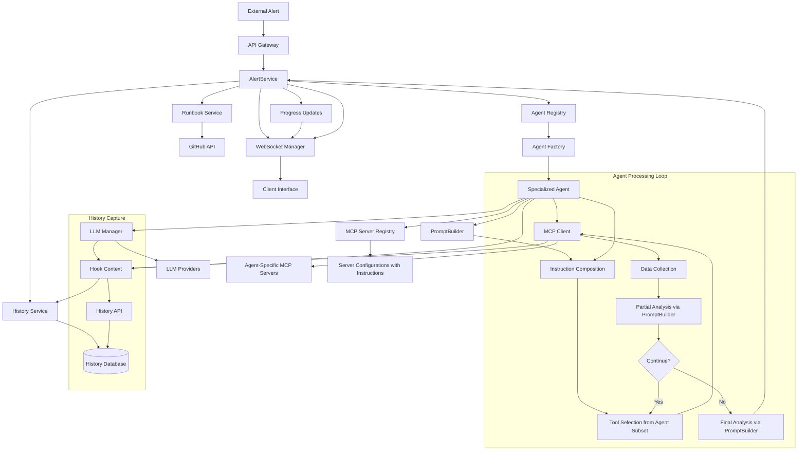
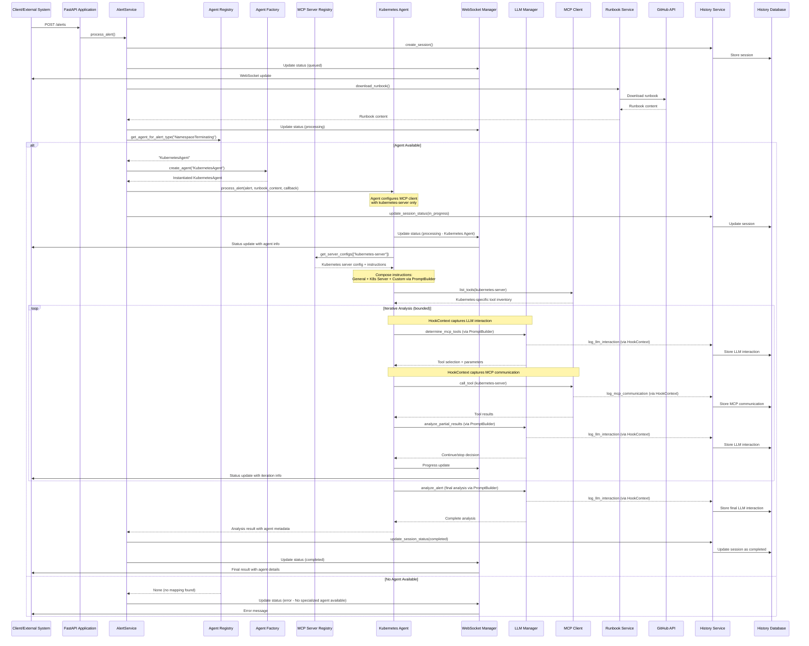

# Tarsy-bot - Technical Design Document 🛠️

## Table of Contents
1. [System Overview](#system-overview)
2. [Architecture Design](#architecture-design)
3. [Backend Components](#backend-components)
4. [Data Flow Architecture](#data-flow-architecture)
5. [Integration Patterns](#integration-patterns)
6. [Alert Dev UI Development Interface](#alert-dev-ui-development-interface)
7. [Security Architecture](#security-architecture)
8. [Performance Considerations](#performance-considerations)
9. [Error Handling and Resilience](#error-handling-and-resilience)
10. [Deployment Architecture](#deployment-architecture)
11. [Extension Points](#extension-points)

---

## Document Evolution

This design document is a living document that evolves through [Enhancement Proposals (EPs)](enhancements/README.md). All significant architectural changes are documented through the EP process, ensuring traceable evolution and AI-friendly implementation.

### Recent Changes
- **EP-0007 (IMPLEMENTED)**: Data Masking Service for Sensitive MCP Server Data - Added pattern-based masking service for secrets and credentials from MCP server responses, with built-in patterns for common secrets and configurable per-server masking rules
- **EP-0006 (IMPLEMENTED)**: Configuration-Based Agents - Added YAML-based agent configuration system allowing deployment of new agents without code changes, supporting both traditional hardcoded agents and configuration-driven agents simultaneously
- **EP-0005 (IMPLEMENTED)**: Flexible Alert Data Structure Support - Transformed rigid Kubernetes-specific alert model into flexible, agent-agnostic system supporting arbitrary JSON payloads with minimal validation, enhanced database with JSON indexing, and updated UI for dynamic alert data rendering
- **EP-0004 (IMPLEMENTED)**: Dashboard UI for Alert History - Added standalone React dashboard for SRE operational monitoring with real-time WebSocket integration, historical analysis, and multiplexed WebSocket architecture
- **EP-0003 (IMPLEMENTED)**: Alert Processing History Service - Added comprehensive audit trail capture and database persistence with REST API endpoints for historical data access
- **EP-0002 (IMPLEMENTED)**: Multi-Layer Agent Architecture - Transformed monolithic alert processing into orchestrator + specialized agents architecture
- This document was established as the baseline technical design
- Future changes will be tracked through Enhancement Proposals in `docs/enhancements/`

For proposed architectural changes or new design patterns, see the [Enhancement Proposals directory](enhancements/README.md).

---

## System Overview

Tarsy is a **distributed, event-driven system** designed to automate incident response through intelligent alert processing using a **multi-layer agent architecture**. The system implements an **iterative, multi-step analysis architecture** where an orchestrator layer delegates alerts to specialized agents that use Large Language Models (LLMs) to dynamically select and orchestrate Model Context Protocol (MCP) servers for comprehensive incident analysis.

### Core Design Principles

1. **Multi-Layer Agent Architecture**: Orchestrator layer delegates processing to specialized agents based on alert type mappings
2. **Agent Specialization**: Domain-specific agents with focused MCP server subsets and specialized instructions
3. **Configuration-Driven Extensibility**: Support for both hardcoded agents and YAML-configured agents without code changes
4. **Flexible Alert Data Structure**: Agent-agnostic system supporting arbitrary JSON payloads from diverse monitoring sources
5. **LLM-First Processing**: Agents receive complete JSON payloads for intelligent interpretation without rigid field extraction
6. **Iterative Intelligence**: Multi-step LLM-driven analysis that mimics human troubleshooting methodology
7. **Dynamic Tool Selection**: Agents intelligently choose appropriate MCP tools from their assigned server subsets
8. **Extensible Architecture**: Inheritance-based agent design for easy addition of new specialized agents
9. **Real-time Communication**: WebSocket-based progress updates and status tracking with agent identification
10. **Resilient Design**: Graceful degradation and comprehensive error handling across agent layers
11. **Comprehensive Audit Trail**: Persistent history capture of all alert processing workflows with chronological timeline reconstruction

### Technology Stack

**Backend:**
- **Framework**: FastAPI (Python 3.11+) with asyncio for asynchronous processing
- **Agent Architecture**: Abstract base class with inheritance-based specialization
- **LLM Integration**: LangChain framework supporting multiple providers (OpenAI, Google Gemini, xAI Grok)
- **MCP Integration**: Official MCP SDK with stdio transport, agent-specific server subsets
- **Communication**: WebSocket for real-time updates with agent context, REST API for external integration
- **Configuration**: Environment-based configuration with agent registry and MCP server registry
- **Logging**: Structured logging with separate channels for orchestrator and agent components
- **History Service**: SQLModel-based database persistence with comprehensive audit trail capture
- **Database**: SQLite with PostgreSQL migration support, automatic schema creation and management

**Dashboard UI (SRE Operational Monitoring):**
- **Framework**: React 18.2.0 with TypeScript for standalone SRE dashboard
- **UI Library**: Material-UI v5.15.0 with comprehensive Material Design components
- **Communication**: Axios for HTTP requests, multiplexed WebSocket for real-time updates
- **Features**: Active/historical alert monitoring, timeline visualization, filtering, virtual scrolling

**Alert Dev UI (Development/Testing Only):**
- **Framework**: React with TypeScript
- **UI Library**: Material-UI (MUI) for modern, responsive interface
- **Communication**: Axios for HTTP requests, native WebSocket for real-time updates including agent status

---

## Architecture Design

### High-Level Architecture

```
┌─────────────────────────────────────────────────────────────────────────────────────┐
│                              Tarsy - Multi-Layer Architecture                       │
│                                                                                     │
│              ┌────────────────────┐            ┌────────────────────────┐           │
│              │ Alert Dev UI Layer │            │       Dashboard UI     |           |
│              │                    │            │                        |           |
│              │                    │            │                        │           │
│              └────────────────────┘            └────────────────────────┘           |
│                        └────────────────────────────────────┘                       │
│                                      │                                              │
│                                   HTTP/WebSocket                                    │
│                                      │                                              │
│  ┌─────────────────────────────────────────────────────────────────────────────┐    │
│  │                        API Gateway & Orchestrator Layer                     │    │
│  │                                                                             │    │
│  │  ┌─────────────────┐    ┌─────────────────┐    ┌─────────────────┐          │    │
│  │  │   FastAPI       │    │   Alert         │    │   WebSocket     │          │    │
│  │  │   Application   │    │   Orchestrator  │    │   Manager       │          │    │
│  │  └─────────────────┘    └─────────────────┘    └─────────────────┘          │    │
│  │                                                                             │    │
│  │  ┌─────────────────┐    ┌─────────────────┐    ┌─────────────────┐          │    │
│  │  │   Agent         │    │   Agent         │    │   MCP Server    │          │    │
│  │  │   Registry      │    │   Factory       │    │   Registry      │          │    │
│  │  └─────────────────┘    └─────────────────┘    └─────────────────┘          │    │
│  │                                                                             │    │
│  │  ┌─────────────────┐    ┌─────────────────┐    ┌─────────────────┐          │    │
│  │  │   History       │    │   History       │    │   Database      │          │    │
│  │  │   Service       │    │   API           │    │   Manager       │          │    │
│  │  └─────────────────┘    └─────────────────┘    └─────────────────┘          │    │
│  └─────────────────────────────────────────────────────────────────────────────┘    │
│                                                                                     │
│  ┌─────────────────────────────────────────────────────────────────────────────┐    │
│  │                        Specialized Agent Layer                              │    │
│  │                                                                             │    │
│  │  ┌─────────────────────────────────────────────────────────────────────┐    │    │
│  │  │                         BaseAgent                                   │    │    │
│  │  │              (Common Processing Logic)                              │    │    │
│  │  └─────────────────────────────────────────────────────────────────────┘    │    │
│  │                                  │                                          │    │
│  │          ┌──────────────────────────────────────────────────┐               │    │
│  │          │                      │                           │               │    │
│  │  ┌─────────────────┐    ┌─────────────────┐    ┌─────────────────┐          │    │
│  │  │   Kubernetes    │    │   ArgoCD        │    │   AWS           │          │    │
│  │  │   Agent         │    │   Agent         │    │   Agent         │          │    │
│  │  │   (IMPLEMENTED) │    │   (Future)      │    │   (Future)      │          │    │
│  │  └─────────────────┘    └─────────────────┘    └─────────────────┘          │    │
│  │                                                                             │    │
│  │  ┌─────────────────┐    ┌─────────────────┐    ┌─────────────────┐          │    │
│  │  │   LLM           │    │   MCP Client    │    │   Runbook       │          │    │
│  │  │   Manager       │    │   Manager       │    │   Service       │          │    │
│  │  └─────────────────┘    └─────────────────┘    └─────────────────┘          │    │
│  │                                                                             │    │
│  │  ┌─────────────────┐    ┌─────────────────┐    ┌─────────────────┐          │    │
│  │  │   History       │    │   Hook Context  │    │   History       │          │    │
│  │  │   Repository    │    │   System        │    │   Models        │          │    │
│  │  └─────────────────┘    └─────────────────┘    └─────────────────┘          │    │
│  └─────────────────────────────────────────────────────────────────────────────┘    │
│                                                                                     │
│  ┌─────────────────────────────────────────────────────────────────────────────┐    │
│  │                            Integration Layer                                │    │
│  │                                                                             │    │
│  │  ┌─────────────────┐    ┌─────────────────┐    ┌─────────────────┐          │    │
│  │  │   LLM           │    │   MCP Server    │    │   GitHub        │          │    │
│  │  │   Providers     │    │   Ecosystem     │    │   Integration   │          │    │
│  │  │                 │    │   (Agent-       │    │                 │          │    │
│  │  │ • OpenAI        │    │    Specific)    │    │ • Runbook       │          │    │
│  │  │ • Google Gemini │    │ • Kubernetes    │    │   Download      │          │    │
│  │  │ • xAI Grok      │    │ • ArgoCD        │    │ • Authentication│          │    │
│  │  │                 │    │ • Database      │    │                 │          │    │
│  │  │                 │    │ • Monitoring    │    │                 │          │    │
│  │  └─────────────────┘    └─────────────────┘    └─────────────────┘          │    │
│  └─────────────────────────────────────────────────────────────────────────────┘    │
└─────────────────────────────────────────────────────────────────────────────────────┘
```

### Component Interaction Diagram



---

## Backend Components

### 1. API Gateway Layer

The main application layer provides HTTP API and WebSocket endpoints with agent-aware responses:

```
Core API Endpoints:
POST /alerts              # Submit alert for processing (delegates to agents)
GET /processing-status/{id}  # Check processing status (includes agent info)
GET /alert-types          # Get supported alert types (from agent registry)
GET /health               # Health check
WebSocket /ws/{id}        # Real-time progress updates (agent-aware)

History API Endpoints:
GET /api/v1/history/sessions          # List alert processing sessions with filtering and pagination
GET /api/v1/history/sessions/{id}     # Get detailed session information with chronological timeline
GET /api/v1/history/health           # History service health check

Dashboard API Endpoints (EP-0004):
GET /api/v1/history/metrics          # Dashboard overview metrics and statistics
GET /api/v1/history/active-sessions  # Currently processing sessions with real-time status
GET /api/v1/history/filter-options   # Dynamic filter options based on actual data
GET /api/v1/history/sessions/{id}/export  # Export session data in JSON/CSV format
GET /api/v1/history/search           # Multi-field session search functionality
WebSocket /ws/dashboard/{user_id}    # Multiplexed WebSocket with subscription management
```

**Core Features:**
- **Agent-Aware Processing**: Background task management with agent delegation
- **CORS Support**: Configurable cross-origin resource sharing
- **Lifecycle Management**: Startup/shutdown hooks for service and agent initialization
- **State Management**: Processing status tracking with agent identification
- **Real-time Communication**: WebSocket-based progress broadcasting with agent context
- **Dashboard WebSocket**: Multiplexed WebSocket endpoint (`/ws/dashboard/{user_id}`) with subscription management

### 2. AlertService

The core service that implements agent delegation and manages the overall processing pipeline:

```
Interface Pattern:
class AlertService:
    def __init__(self, settings: Settings)
    async def initialize(self)
    async def process_alert(self, alert: Alert, progress_callback: Optional[Callable] = None) -> str
```

**Core Responsibilities:**
- **Service Initialization**: Initialize all required services (MCP client, LLM manager, agent factory, registries)
- **Agent Selection**: Use agent registry to determine appropriate specialized agent for alert type
- **Runbook Management**: Download runbooks using RunbookService
- **Agent Delegation**: Use agent factory to instantiate and delegate processing to specialized agents
- **Progress Coordination**: Coordinate progress callbacks and status updates
- **Error Handling**: Handle agent-level errors and provide formatted error responses
- **Result Formatting**: Format and return agent analysis results with context

**Processing Algorithm:**
1. **Prerequisites Validation**: Validate LLM availability and agent factory initialization
2. **Agent Selection**: Use agent registry to determine appropriate specialized agent class
3. **Runbook Download**: Retrieve runbook content from GitHub using RunbookService
4. **Agent Instantiation**: Use agent factory to create specialized agent instance with dependencies
5. **Agent Delegation**: Delegate processing to specialized agent with runbook content and progress callbacks
6. **Result Processing**: Format and return agent analysis results with context and metadata
7. **Error Handling**: Handle and format any errors that occur during processing

### 3. Agent Registry

Static registry that maintains mappings between alert types and specialized agent class names:

```
Interface Pattern:
class AgentRegistry:
    def __init__(self, config: Optional[Dict[str, str]] = None)
    def get_agent_for_alert_type(self, alert_type: str) -> Optional[str]
    def get_supported_alert_types(self) -> List[str]
```

**Core Features:**
- **Centralized Configuration**: Imports built-in mappings from `builtin_config.py` single source of truth
- **Configuration Extension**: Supports both built-in and YAML-configured agent mappings simultaneously
- **Fast Lookup**: O(1) dictionary-based agent resolution
- **Conflict Detection**: Validates that alert types are handled by only one agent
- **Error Handling**: Clear messages when no agent is available for alert type

**Current Mappings (from builtin_config.py):**
```
Alert Type Mappings:
"kubernetes" -> "KubernetesAgent"
"NamespaceTerminating" -> "KubernetesAgent"
# Configuration-based agents create mappings like:
# "SecurityBreach" -> "ConfigurableAgent:security-agent"
```

### 3a. Centralized Built-in Configuration (EP-0006)

Central configuration management for all built-in system components:

```
Location: backend/tarsy/config/builtin_config.py
```

**Core Features:**
- **Single Source of Truth**: Centralized definitions for all built-in agents and MCP servers
- **Import Path Management**: Maps agent class names to their full import paths for dynamic loading
- **Alert Type Mappings**: Defines which built-in agents handle which alert types
- **MCP Server Definitions**: Complete built-in MCP server configurations with connection parameters
- **Conflict Prevention**: Provides authoritative lists for configuration validation

**Built-in Component Definitions:**
```python
# Agent class imports for dynamic loading
BUILTIN_AGENT_CLASS_IMPORTS = {
    "KubernetesAgent": "tarsy.agents.kubernetes_agent.KubernetesAgent"
}

# Alert type to agent mappings  
BUILTIN_AGENT_MAPPINGS = {
    "kubernetes": "KubernetesAgent",
    "NamespaceTerminating": "KubernetesAgent"
}

# Complete MCP server configurations
BUILTIN_MCP_SERVERS = {
    "kubernetes-server": {
        "server_id": "kubernetes-server",
        "server_type": "kubernetes", 
        "enabled": True,
        "connection_params": {...},
        "instructions": "Kubernetes-specific LLM guidance..."
    }
}
```

**Module Integration:**
- **AgentRegistry**: Imports `BUILTIN_AGENT_MAPPINGS` for alert type routing
- **AgentFactory**: Imports `BUILTIN_AGENT_CLASS_IMPORTS` for dynamic class loading
- **MCPServerRegistry**: Imports `BUILTIN_MCP_SERVERS` for server initialization
- **ConfigurationLoader**: Imports all definitions for conflict detection with configured components

**Adding New Built-in Components:**
1. Edit only `builtin_config.py` - no changes needed elsewhere
2. Add agent class import path to `BUILTIN_AGENT_CLASS_IMPORTS`
3. Add alert type mapping to `BUILTIN_AGENT_MAPPINGS`
4. Add MCP server configuration to `BUILTIN_MCP_SERVERS`
5. All registries automatically inherit the new definitions

### 4. Agent Factory

Factory service for instantiating specialized agent classes with dependency injection:

```
Interface Pattern:
class AgentFactory:
    def __init__(self,
                 llm_client: LLMClient,
                 mcp_client: MCPClient,
                 mcp_registry: MCPServerRegistry,
                 progress_callback: Optional[Any] = None)
    def create_agent(self, agent_class_name: str) -> BaseAgent
    def _register_available_agents(self) -> None
```

**Core Features:**
- **Dependency Injection**: Automatic injection of required services into agents
- **Static Class Registry**: Internal registry of available agent classes loaded at initialization
- **Error Handling**: Clear messages for unknown or failed agent instantiation (raises ValueError)
- **Resource Management**: Efficient reuse of shared resources (LLM clients, MCP connections)

### 5. BaseAgent (Abstract Base Class)

Abstract base class providing common processing logic and interface for all specialized agents:

```
Interface Pattern:
class BaseAgent(ABC):
    def __init__(self, llm_client: LLMClient, mcp_client: MCPClient, 
                 mcp_registry: MCPServerRegistry, progress_callback: Optional[Callable] = None)
    
    # Abstract methods that must be implemented by specialized agents
    @abstractmethod
    def mcp_servers(self) -> List[str]
    @abstractmethod  
    def custom_instructions(self) -> str
    
    # Prompt building methods (can be overridden by specialized agents)
    def build_analysis_prompt(self, alert_data: Dict, runbook_content: str, mcp_data: Dict) -> str
    def build_mcp_tool_selection_prompt(self, alert_data: Dict, runbook_content: str, available_tools: Dict) -> str
    def build_partial_analysis_prompt(self, alert_data: Dict, runbook_content: str, 
                                     iteration_history: List[Dict], current_iteration: int) -> str
    
    # Common processing methods
    async def process_alert(self, alert: Alert, runbook_content: str, callback: Optional[Callable] = None) -> Dict[str, Any]
    async def analyze_alert(self, alert_data: Dict, runbook_content: str, mcp_data: Dict, **kwargs) -> str
    async def determine_mcp_tools(self, alert_data: Dict, runbook_content: str, available_tools: Dict, **kwargs) -> List[Dict]
    async def analyze_partial_results(self, alert_data: Dict, runbook_content: str, 
                                     iteration_history: List[Dict], current_iteration: int, **kwargs) -> str
```

**Core Features:**
- **Inheritance-Based Design**: Common logic shared across all specialized agents
- **Three-Tier Instruction Composition**: General + MCP server + agent-specific instructions
- **Agent-Specific MCP Access**: Each agent only accesses its assigned MCP server subset
- **Iterative Processing**: Bounded multi-step LLM analysis with safety mechanisms
- **Progress Reporting**: Standardized progress callback integration
- **Error Handling**: Consistent error handling patterns across all agents

**Instruction Composition Pattern:**
```
Final Instructions = General Instructions + MCP Server Instructions + Custom Instructions

Where:
- General Instructions: Universal SRE guidance (from PromptBuilder)
- MCP Server Instructions: Server-specific guidance (from MCP Server Registry)
- Custom Instructions: Agent-specific guidance (from specialized agent)
```

**PromptBuilder Integration:**
BaseAgent uses a centralized PromptBuilder for consistent prompt construction across all agents. The PromptBuilder handles:
- Template standardization for all prompt types
- Context formatting and data presentation
- Iteration history formatting
- System message construction

### 6. PromptBuilder

Centralized prompt construction service used by all agents for consistent LLM interactions:

```
Interface Pattern:
class PromptBuilder:
    def build_analysis_prompt(self, context: PromptContext) -> str
    def build_mcp_tool_selection_prompt(self, context: PromptContext) -> str
    def build_iterative_mcp_tool_selection_prompt(self, context: PromptContext) -> str
    def build_partial_analysis_prompt(self, context: PromptContext) -> str
    def get_general_instructions(self) -> str
    def get_mcp_tool_selection_system_message(self) -> str
    def get_partial_analysis_system_message(self) -> str
```

**Core Features:**
- **Template Standardization**: Consistent prompt formats across all agents
- **Context Management**: Structured context data handling via PromptContext dataclass
- **Iteration History Formatting**: Comprehensive formatting of multi-step analysis history
- **System Message Generation**: Specialized system messages for different LLM interaction types
- **Data Formatting**: Intelligent formatting of MCP data and alert information
- **Shared Instance**: Stateless design with global shared instance for efficiency

**PromptContext Data Structure:**
```
@dataclass
class PromptContext:
    agent_name: str
    alert_data: Dict[str, Any]
    runbook_content: str
    mcp_data: Dict[str, Any]
    mcp_servers: List[str]
    server_guidance: str = ""
    agent_specific_guidance: str = ""
    available_tools: Optional[Dict] = None
    iteration_history: Optional[List[Dict]] = None
    current_iteration: Optional[int] = None
    max_iterations: Optional[int] = None
```

### 7. KubernetesAgent (Specialized Agent)

First implemented specialized agent for Kubernetes-related alerts:

```
Interface Pattern:
class KubernetesAgent(BaseAgent):
    def mcp_servers(self) -> List[str]:
        return ["kubernetes-server"]
    
    def custom_instructions(self) -> str:
        return ""  # No additional instructions for initial implementation
```

**Core Features:**
- **Domain Specialization**: Focused on Kubernetes namespace and pod issues
- **Focused Tool Access**: Only accesses kubernetes-server MCP tools
- **Kubernetes Expertise**: Inherits all common processing logic from BaseAgent
- **Future Extensibility**: Can be extended with custom Kubernetes-specific instructions

### 8. MCP Server Registry

Global registry of all available MCP server configurations with embedded instructions:

```
Interface Pattern:
class MCPServerRegistry:
    def __init__(self, config: Optional[Dict[str, Dict]] = None)
    def get_server_configs(self, server_ids: List[str]) -> List[MCPServerConfig]
    def get_server_config(self, server_id: str) -> Optional[MCPServerConfig]
    def get_all_server_ids(self) -> List[str]
```

**Core Features:**
- **Centralized Configuration**: Imports built-in server definitions from `builtin_config.py`
- **Configuration Extension**: Merges built-in servers with YAML-configured servers seamlessly
- **Default Configurations**: Built-in default server configurations with override capability
- **Embedded Instructions**: Server-specific LLM instructions stored with configurations
- **Agent Assignment**: Agents request specific server subsets from unified registry
- **Conflict Detection**: Validates that configured servers don't conflict with built-in server IDs

**Server Configuration Pattern:**
```
MCPServerConfig:
- server_id: str (e.g., "kubernetes-server")
- server_type: str (e.g., "kubernetes")
- enabled: bool
- connection_params: Dict[str, Any]
- instructions: str (embedded LLM instructions)
```

### 9. LLM Manager

Unified LLM client implementation shared across all specialized agents:

```
Interface Pattern:
class LLMManager:
    def __init__(self, settings: Settings)
    def get_client(self, provider: str = None) -> Optional[LLMClient]
    async def generate_response(self, messages: List[LLMMessage], provider: str = None, **kwargs) -> str
    def list_available_providers(self) -> List[str]
    def is_available(self) -> bool
    def get_availability_status(self) -> Dict

class LLMClient:
    def __init__(self, provider_name: str, config: Dict)
    async def generate_response(self, messages: List[LLMMessage], **kwargs) -> str
```

**Core Features:**
- **Multi-Provider Support**: LangChain-based unified interface for OpenAI, Gemini, and xAI Grok
- **Agent Integration**: Consistent LLM access for all specialized agents
- **Availability Checking**: Runtime validation of provider accessibility and API key availability
- **Configuration Management**: Environment-based credential and model management
- **Comprehensive Logging**: Detailed communication logs with request/response tracking
- **Error Handling**: Consistent error handling and reporting across all providers

### 10. MCP Client

MCP client implementation using the official MCP SDK with agent-specific server management and integrated data masking:

```
Interface Pattern:
class MCPClient:
    def __init__(self, settings: Settings, mcp_registry: Optional[MCPServerRegistry] = None)
    async def initialize(self)
    async def list_tools(self, server_name: Optional[str] = None) -> Dict[str, List[Dict[str, Any]]]
    async def call_tool(self, server_name: str, tool_name: str, parameters: Dict[str, Any]) -> Dict[str, Any]
```

**Core Features:**
- **Official MCP SDK Integration**: Uses the official MCP SDK with stdio transport for server connections
- **Registry-Driven Initialization**: Automatically initializes all servers defined in MCP Server Registry
- **Integrated Data Masking**: Automatically applies server-specific masking to all tool responses using DataMaskingService
- **Connection Management**: Maintains persistent sessions using AsyncExitStack for proper cleanup
- **Tool Discovery**: Dynamic tool inventory from connected MCP servers with detailed schema information
- **Comprehensive Logging**: Detailed request/response logging for debugging and monitoring
- **Error Handling**: Robust error handling with graceful degradation when servers are unavailable

### 10a. Data Masking Service

Pattern-based masking service for securing sensitive data in MCP server responses:

```
Interface Pattern:
class DataMaskingService:
    def __init__(self, mcp_registry: MCPServerRegistry)
    def mask_response(self, server_name: str, response: Dict[str, Any]) -> Dict[str, Any]
    def compile_patterns(self, config: MaskingConfig) -> Dict[str, str]
```

**Core Features:**
- **Universal MCP Response Masking**: Automatically masks sensitive data before LLM processing, logging, or storage
- **Built-in Pattern Library**: Pre-configured patterns for kubernetes_secret, api_key, password, certificate, token
- **Pattern Groups**: Built-in groups (basic, secrets, security, kubernetes, all) for common use cases
- **Server-Specific Configuration**: Per-MCP server masking rules through YAML and built-in configurations
- **Custom Regex Patterns**: Support for user-defined regex patterns with validation
- **Fail-Safe Behavior**: Over-masking approach with comprehensive error handling to prevent data leaks
- **Performance Optimized**: Compiled regex patterns with minimal processing overhead

### 11. Runbook Service

External repository integration for runbook management:

```
Interface Pattern:
class RunbookService:
    def __init__(self, settings: Settings)
    async def download_runbook(self, url: str) -> str
    async def close(self)
```

**Core Features:**
- **GitHub Integration**: Downloads runbook content from GitHub repositories
- **URL Conversion**: Automatically converts GitHub URLs to raw content URLs
- **Authentication Support**: Optional GitHub token support for private repositories
- **HTTP Client Management**: Async HTTP client with proper cleanup

### 12. WebSocket Manager

Real-time communication management for progress updates and dashboard integration:

```
Interface Pattern:
class WebSocketManager:
    def __init__(self)
    async def connect(self, websocket: WebSocket, alert_id: str)
    def disconnect(self, websocket: WebSocket, alert_id: str)
    async def send_status_update(self, alert_id: str, status: ProcessingStatus)
    async def send_message(self, alert_id: str, message: dict)
    
class DashboardWebSocketManager:
    def __init__(self)
    async def connect(self, websocket: WebSocket, user_id: str)
    async def subscribe(self, user_id: str, channel: str, filters: dict = None)
    async def broadcast_dashboard_update(self, channel: str, data: dict)
```

**Core Features:**
- **Connection Management**: Per-alert WebSocket connection tracking and cleanup
- **Dashboard Integration**: Multiplexed WebSocket endpoint with subscription management
- **Status Broadcasting**: Send ProcessingStatus updates to all connected clients for an alert
- **Subscription Management**: Channel-based message routing for dashboard updates
- **Custom Messaging**: Support for custom message types beyond status updates
- **Error Handling**: Automatic cleanup of broken connections
- **DateTime Serialization**: Built-in support for datetime object serialization in JSON messages

### 13. History Service

Comprehensive audit trail capture and management for alert processing workflows:

```
Interface Pattern:
class HistoryService:
    def __init__(self)
    def initialize(self) -> bool
    def create_session(self, alert_id: str, alert_data: Dict, agent_type: str, alert_type: Optional[str] = None) -> Optional[str]
    def update_session_status(self, session_id: str, status: str, error_message: Optional[str] = None, final_analysis: Optional[str] = None) -> bool
    def log_llm_interaction(self, session_id: str, prompt_text: str, response_text: str, model_used: str, step_description: str, **kwargs) -> bool
    def log_mcp_communication(self, session_id: str, server_name: str, communication_type: str, step_description: str, success: bool, **kwargs) -> bool
    def get_sessions_list(self, filters: Dict = None, page: int = 1, page_size: int = 20) -> Tuple[List, int]
    def get_session_timeline(self, session_id: str) -> Dict
```

**Core Features:**
- **Session Lifecycle Management**: Complete tracking from alert initiation to completion
- **Automatic Interaction Capture**: Transparent integration with LLM and MCP clients via HookContext
- **Microsecond Precision Timing**: Exact chronological ordering of all interactions
- **Database Abstraction**: SQLModel-based persistence with SQLite and PostgreSQL support
- **Graceful Degradation**: Continues operation when database is unavailable
- **Retry Logic**: Exponential backoff for transient database failures
- **Configuration Management**: Environment-based settings for database URL, retention, and enablement

### 14. History Models

SQLModel-based database models for comprehensive audit trail persistence:

```
Data Models:
AlertSession:
- session_id: str (primary key)
- alert_id: str
- alert_data: dict (JSON)
- agent_type: str
- alert_type: Optional[str]
- status: str (pending, in_progress, completed, failed)
- started_at: datetime
- completed_at: Optional[datetime]
- error_message: Optional[str]
- session_metadata: Optional[dict] (JSON)

LLMInteraction:
- interaction_id: str (primary key)
- session_id: str (foreign key)
- timestamp: datetime (microsecond precision)
- prompt_text: str
- response_text: str
- tool_calls: Optional[dict] (JSON)
- tool_results: Optional[dict] (JSON)
- model_used: str
- token_usage: Optional[dict] (JSON)
- duration_ms: int
- step_description: str

MCPCommunication:
- communication_id: str (primary key)
- session_id: str (foreign key)
- timestamp: datetime (microsecond precision)
- server_name: str
- communication_type: str
- tool_name: Optional[str]
- tool_arguments: Optional[dict] (JSON)
- tool_result: Optional[dict] (JSON)
- available_tools: Optional[dict] (JSON)
- duration_ms: int
- success: boolean                # Success/failure status
- error_message: Optional[string] # Error message if failed
- step_description: string        # Human-readable step description
```

### 15. History Repository

Database access layer for alert processing history with advanced querying capabilities:

```
Interface Pattern:
class HistoryRepository:
    def __init__(self, session: Session)
    def create_alert_session(self, alert_session: AlertSession) -> Optional[AlertSession]
    def get_alert_session(self, session_id: str) -> Optional[AlertSession]
    def update_alert_session(self, alert_session: AlertSession) -> bool
    def get_alert_sessions(self, status: str = None, agent_type: str = None, alert_type: str = None, 
                          start_date: datetime = None, end_date: datetime = None, page: int = 1, page_size: int = 20) -> Dict
    def create_llm_interaction(self, llm_interaction: LLMInteraction) -> Optional[LLMInteraction]
    def create_mcp_communication(self, mcp_communication: MCPCommunication) -> Optional[MCPCommunication]
    def get_session_timeline(self, session_id: str) -> Dict
```

**Core Features:**
- **Complex Filtering**: Support for multiple simultaneous filters using AND logic
- **Pagination Support**: Efficient handling of large datasets
- **Chronological Timeline Reconstruction**: Merged LLM and MCP interactions ordered by timestamp
- **SQLModel Integration**: Type-safe database operations with modern Python typing
- **Relationship Management**: Automatic foreign key handling and cascade operations

### 16. History API Controller

REST API endpoints for accessing alert processing history:

```
Interface Pattern:
@router.get("/api/v1/history/sessions")
async def list_sessions(status: List[str] = None, agent_type: str = None, alert_type: str = None,
                       start_date: datetime = None, end_date: datetime = None,
                       search: str = None, page: int = 1, page_size: int = 20) -> SessionsListResponse

@router.get("/api/v1/history/sessions/{session_id}")
async def get_session_detail(session_id: str) -> SessionDetailResponse

@router.get("/api/v1/history/health")
async def health_check() -> HealthCheckResponse
```

**Core Features:**
- **Advanced Filtering**: Multiple filter combinations with AND logic for precise queries
  - **Multiple Status Support**: `status` parameter accepts multiple values (e.g., `status=completed&status=failed` for historical alerts)
  - **Text Search**: `search` parameter for full-text search across alert messages, errors, analysis, and JSON fields (minimum 3 characters)
  - **Common Use Cases**: Historical alerts (`completed,failed`), Active alerts (`pending,in_progress`)
- **Pagination**: Efficient handling of large result sets with metadata
- **Chronological Timeline**: Complete session details with merged interaction timeline
- **Health Monitoring**: Database connectivity and service status checking
- **Type Safety**: Pydantic response models for consistent API contracts

**Multiple Status Filtering Examples:**
```bash
# Historical alerts (completed and failed sessions)
GET /api/v1/history/sessions?status=completed&status=failed

# Active alerts (pending and in_progress sessions)
GET /api/v1/history/sessions?status=pending&status=in_progress

# Single status (backward compatible)
GET /api/v1/history/sessions?status=completed

# Combined with other filters
GET /api/v1/history/sessions?status=completed&status=failed&agent_type=kubernetes&start_date=2024-12-18T00:00:00Z

# Text search (searches across error messages, analysis, and alert data)
GET /api/v1/history/sessions?search=kubernetes

# Search combined with filters
GET /api/v1/history/sessions?search=namespace&status=completed&agent_type=KubernetesAgent
```

### 17. Hook Context System

Automatic interaction capture system for transparent history logging:

```
Interface Pattern:
class HookContext:
    def __init__(self, service_type: str, method_name: str, session_id: str = None, **kwargs)
    async def __aenter__(self)
    async def __aexit__(self, exc_type, exc_val, exc_tb)
    async def complete_success(self, result: Any)
    def get_request_id(self) -> str

Usage Pattern:
async with HookContext(service_type="llm", method_name="generate_response", 
                      session_id=session_id, **context) as hook_ctx:
    result = await llm_operation()
    await hook_ctx.complete_success(result)
```

**Core Features:**
- **Automatic Lifecycle Management**: Context manager handles interaction timing and logging
- **Transparent Integration**: Works with existing LLM and MCP client code
- **Error Handling**: Graceful degradation when history service is unavailable
- **Request Tracking**: Unique request IDs for correlation and debugging
- **Microsecond Timing**: Precise timing information for performance analysis

---

## Data Flow Architecture

### 1. Multi-Layer Alert Processing Pipeline with History Capture



### 2. Data Structure Patterns

**Alert Data Model:**
```
FlexibleAlert Entity:
- alert_type: string              # Alert type for agent selection (required)
- runbook: string                 # GitHub runbook URL (required)
- data: object                    # Arbitrary JSON payload for monitoring data
  - severity: Optional[string]    # Defaults to "warning" if not provided
  - timestamp: Optional[number]   # Unix microseconds, auto-generated if not provided
  - environment: Optional[string] # Defaults to "production" if not provided
  - [any_field]: any              # Support for arbitrary monitoring system data
                                  # Examples: cluster, namespace, pod, service_name,
                                  # aws_region, argocd_app, prometheus_labels, etc.
```

**Processing Status Model:**
```
ProcessingStatus Entity:
- alert_id: string
- status: string                  # queued, processing, completed, error
- progress: integer               # 0-100 percentage (validated 0-100)
- current_step: string            # Human-readable step description
- current_agent: Optional[string] # Currently processing agent
- assigned_mcp_servers: Optional[List[string]] # MCP servers assigned to agent
- result: Optional[string]        # Final analysis result
- error: Optional[string]         # Error message if failed
- timestamp: datetime             # Auto-generated timestamp
- session_id: Optional[string]    # History session ID for audit trail access
```

**History Data Models:**
```
AlertSession Entity:
- session_id: string (primary key)
- alert_id: string
- alert_data: object              # Complete alert information
- agent_type: string              # Processing agent type
- alert_type: Optional[string]    # Alert type for filtering
- status: string                  # pending, in_progress, completed, failed
- started_at: datetime            # Session start timestamp
- completed_at: Optional[datetime] # Session completion timestamp
- error_message: Optional[string] # Error message if failed
- final_analysis: Optional[string] # Final formatted analysis result if completed successfully
- session_metadata: Optional[object] # Additional context

LLMInteraction Entity:
- interaction_id: string (primary key)
- session_id: string (foreign key)
- timestamp: datetime             # Microsecond precision for chronological ordering
- prompt_text: string             # Complete prompt sent to LLM
- response_text: string           # Complete response from LLM
- tool_calls: Optional[object]    # Tool calls made during interaction
- tool_results: Optional[object]  # Results from tool calls
- model_used: string              # LLM model identifier
- token_usage: Optional[object]   # Token usage statistics
- duration_ms: integer            # Interaction duration
- step_description: string        # Human-readable step description

MCPCommunication Entity:
- communication_id: string (primary key)
- session_id: string (foreign key)
- timestamp: datetime             # Microsecond precision for chronological ordering
- server_name: string             # MCP server identifier
- communication_type: string      # tool_list, tool_call, result
- tool_name: Optional[string]     # Tool name for tool calls
- tool_arguments: Optional[object] # Tool call arguments
- tool_result: Optional[object]   # Tool call result
- available_tools: Optional[object] # Available tools for tool_list
- duration_ms: integer            # Communication duration
- success: boolean                # Success/failure status
- error_message: Optional[string] # Error message if failed
- step_description: string        # Human-readable step description
```

**Agent Processing Context:**
```
AgentProcessingContext:
- alert: Alert
- runbook_content: string
- agent_class_name: string
- agent_instance: BaseAgent
- selected_mcp_servers: array<MCPServerConfig>
- composed_instructions: string   # General + MCP + Custom instructions
- progress_callback: Callable
```

**Iteration History Pattern (Enhanced):**
```
IterationRecord:
- iteration_number: integer
- agent_name: string              # Agent that performed iteration (NEW)
- reasoning: string               # LLM reasoning for decisions  
- available_tools: array<string>  # Tools available from agent's MCP servers (NEW)
- tools_selected: array<ToolCall>
- data_collected: object          # Structured tool results
- partial_analysis: string        # Incremental analysis
- continuation_decision: boolean
- timestamp: datetime
```

---

## Integration Patterns

### 1. Agent-Based LLM Provider Integration

**Provider Abstraction Pattern:**
```
LLM Provider Interface (Enhanced):
- initialize(credentials, model_config)
- analyze_with_context(prompt_with_agent_instructions, context_data)
- select_tools_from_agent_subset(available_agent_tools, current_context)
- synthesize_results(collected_data, runbook_content, agent_context)
- validate_availability()
```

**Agent Integration Features:**
- Agents compose specialized instructions for LLM providers
- Provider selection consistent across all agents
- Agent-specific context passed to providers
- Unified error handling across agent layer

### 2. Agent-Specific MCP Server Integration

**Agent-Server Assignment Pattern:**
```
Agent MCP Server Management:
- Each agent declares required MCP servers via mcp_servers() method
- MCP Server Registry provides server configurations and instructions
- Agents only access their assigned server subset
- Tool discovery limited to agent's authorized servers
```

**Server Configuration Pattern:**
```
MCPServerConfig:
- server_id: "kubernetes-server"
- server_type: "kubernetes"  
- enabled: true
- connection_params: {command: "npx", args: ["-y", "kubernetes-mcp-server@latest"]}
- instructions: "For Kubernetes operations: be careful with cluster-scoped listings..."
```

**Agent Server Assignment:**
- **KubernetesAgent**: Uses ["kubernetes-server"]
- **Future ArgoCDAgent**: Would use ["argocd-server"]  
- **Future HybridAgent**: Could use ["kubernetes-server", "aws-server"]

### 3. GitHub Integration (Enhanced)

**Agent-Aware Repository Access Pattern:**
```python
# Runbook distribution to agents
runbook_content = await runbook_service.fetch_runbook(alert.runbook_reference)
agent_result = await selected_agent.process_alert(alert, runbook_content)
```

The GitHub integration remains the same but now serves runbook content to specialized agents rather than a monolithic service.

---

## Alert Dev UI Development Interface

The alert dev UI is enhanced to display agent-specific information while maintaining its role as a **React-based development and testing interface** for system validation and demonstration.

### Architecture Overview

```
alert-dev-ui/ (Enhanced)
├── src/
│   ├── components/
│   │   ├── AlertForm.tsx       # Alert submission form (unchanged)
│   │   ├── ProcessingStatus.tsx # Real-time progress with agent info (ENHANCED)
│   │   └── ResultDisplay.tsx    # Analysis results with agent details (ENHANCED)
│   ├── services/
│   │   ├── api.ts              # HTTP API client (unchanged)
│   │   └── websocket.ts        # WebSocket client (unchanged)
│   ├── types/
│   │   └── index.ts            # TypeScript type definitions (ENHANCED)
│   └── App.tsx                 # Main application component (unchanged)
```

### Enhanced Features

1. **Alert Submission Form**: Pre-filled form with validation (no changes required)
2. **Agent-Aware Progress Tracking**: WebSocket updates now include current processing agent
3. **Enhanced Result Display**: Shows which agent processed the alert and agent-specific details
4. **Agent Error Handling**: User-friendly error messages for agent selection failures
5. **Responsive Design**: Material-UI components (unchanged)

### Agent-Specific UI Elements

- **Processing Status**: "Processing with Kubernetes Agent - Iteration 3/10"
- **Result Headers**: "Analysis completed by KubernetesAgent"
- **Error Messages**: "No specialized agent available for alert type 'Unknown Alert'"
- **Tool Information**: Shows which MCP servers were used by the agent

---

## Security Architecture

### 1. Authentication and Authorization (Enhanced)

**API Key Management:**
```python
# Environment-based configuration (unchanged)
GEMINI_API_KEY=your_gemini_key
OPENAI_API_KEY=your_openai_key  
GITHUB_TOKEN=your_github_token

# New agent registry configuration
AGENT_REGISTRY_CONFIG={"NamespaceTerminating": "KubernetesAgent"}
MCP_SERVER_REGISTRY_CONFIG={...}
```

**Enhanced Security Features:**
- Agent registry configuration protected through environment variables
- MCP server assignments secured at agent instantiation
- **Data Masking Security**: Automatic masking of sensitive data (secrets, API keys, passwords) from MCP server responses
- No additional authentication required for agent delegation
- Same security boundaries maintained across agent layers

### 1a. Data Masking Security Layer

**Sensitive Data Protection:**
```
Data Masking Security Measures:
- Universal masking applied to all MCP server responses before LLM processing, logging, or storage
- Pattern-based detection for kubernetes_secret, api_key, password, certificate, token
- Server-specific masking configurations through YAML and built-in rules
- Fail-safe behavior: better to over-mask than under-mask sensitive data
- Custom regex patterns with validation for domain-specific secrets
```

**Security Benefits:**
- Prevents sensitive credentials from reaching LLM providers
- Protects secrets in system logs and persistent storage
- Configurable masking per MCP server type
- Comprehensive pattern library for common credential formats

### 2. Agent Security Isolation

**Agent Access Control:**
```
Agent Security Measures:
- Agents can only access their assigned MCP server subset
- Agent registry prevents unauthorized agent instantiation  
- Server configurations validated before agent assignment
- Agent processing isolated from other agent types
```

**Security Boundaries:**
- Each agent operates within its defined MCP server scope
- Cross-agent resource access prevented at the factory level
- Agent failures isolated and don't affect other agents
- Consistent error handling prevents information leakage

### 3. Input Validation and Sanitization (Enhanced)

**Multi-Layer Validation Strategy:**
```
Validation Layers:
- API boundary validation (unchanged)
- Agent selection validation (NEW)
- Agent-specific input validation (inherited from BaseAgent)
- MCP server authorization validation (NEW)
```

---

## Performance Considerations

### 1. Asynchronous Architecture (Enhanced)

**Agent-Aware Concurrency Pattern:**
```
Multi-Agent Processing Design:
- Concurrent processing of different alert types using different agents
- Agent-specific resource pools and connections
- Isolated agent processing prevents resource contention
- Efficient agent instantiation and dependency injection
```

**Performance Benefits:**
- Multiple agents can process alerts simultaneously
- Agent specialization improves processing efficiency
- Focused tool sets reduce LLM decision complexity
- Resource isolation prevents agent interference

### 2. Agent-Specific Resource Management

**Resource Control Mechanisms:**
```
Agent Resource Controls:
- Per-agent iteration limits and safety mechanisms
- Agent-specific MCP server connection pools
- Shared LLM client resources across agents
- Isolated agent processing contexts
```

**Resource Optimization:**
- Agent factory reuses common dependencies
- MCP connections shared within agent types
- Specialized agents use focused tool subsets
- Efficient memory management through inheritance

### 3. Performance Monitoring (Enhanced)

**Agent Performance Tracking:**
- Processing time by agent type
- Agent-specific error rates and patterns
- MCP server performance by agent assignment
- Resource utilization across agent instances

---

## Error Handling and Resilience

### 1. Multi-Layer Error Handling (Enhanced)

**Agent-Aware Error Handling Strategy:**
```
Error Handling Layers:
- Orchestrator-level error handling (agent selection, delegation)
- Agent-level error handling (processing failures, MCP issues)
- Service-level error handling (LLM, MCP server connectivity)
- Network-level retry mechanisms (unchanged)
```

**Enhanced Error Categories:**
- **Agent Selection Failures**: No agent available for alert type
- **Agent Instantiation Failures**: Agent class not found or initialization failed
- **Agent Processing Failures**: Specialized agent processing errors
- **MCP Server Subset Failures**: Agent's assigned servers unavailable
- **LLM Provider Failures**: Consistent across all agents

### 2. Agent-Specific Graceful Degradation

**Agent Failure Isolation:**
- **Single Agent Failure**: Other agents continue processing different alert types
- **Agent MCP Server Failure**: Only affects agents using those specific servers
- **Agent Registry Failure**: Clear error messages about agent unavailability
- **Agent Factory Failure**: Specific agent type unavailable, others continue working

**Fallback Strategies:**
- **No Specialized Agent**: Return clear error message (no fallback to generic processing)
- **Agent MCP Server Subset Failure**: Agent continues with available servers
- **Agent Processing Failure**: Return agent-specific error information
- **Multiple Alert Types**: Other agents continue processing their assigned types

### 3. Enhanced Monitoring and Observability

**Agent-Aware Logging Architecture:**
```
Enhanced Logging Categories:
- Orchestrator Events: Agent selection, delegation, coordination
- Agent Events: Processing steps, iteration progress, results
- Agent Registry Events: Lookup operations, configuration changes
- MCP Server Assignment Events: Agent server assignments and failures
- Agent Error Events: Specialized error tracking by agent type
```

**Agent-Specific Observability:**
- Agent performance metrics and processing times
- Agent-specific error rates and patterns
- MCP server usage by agent type
- Agent load distribution and capacity planning

---

## Deployment Architecture

### 1. Containerization Strategy (Enhanced)

**Multi-Layer Container Architecture:**
```
Container Design:
- Backend: Containerized FastAPI application with multi-layer agent architecture
- Agent Dependencies: Specialized agent classes included in main application container
- External Services: MCP servers, LLM providers (unchanged)
- Configuration: Agent registry and MCP server registry via environment variables
```

### 2. Environment Configuration (Enhanced)

**Production Environment:**
```bash
# Existing configuration (unchanged)
GEMINI_API_KEY=your_key
OPENAI_API_KEY=your_key
GITHUB_TOKEN=your_token
DEFAULT_LLM_PROVIDER=gemini
LOG_LEVEL=INFO

# Agent architecture configuration
AGENT_REGISTRY='{"NamespaceTerminating": "KubernetesAgent"}'
MCP_SERVER_REGISTRY='{"kubernetes-server": {...}}'

# History service configuration
HISTORY_ENABLED=true
HISTORY_DATABASE_URL=sqlite:///history.db
HISTORY_RETENTION_DAYS=90
```

### 3. Scaling Considerations (Enhanced)

**Multi-Agent Horizontal Scaling:**
- Agent-specific scaling based on alert type distribution
- Independent agent performance optimization
- Specialized agent resource requirements
- Agent load balancing and distribution strategies

---

## Extension Points

### 1. Agent Architecture Extensions

**New Agent Integration Pattern:**
```
Traditional Hardcoded Agent:
1. Create agent class inheriting from BaseAgent
2. Implement mcp_servers() method defining required server subset
3. Implement custom_instructions() method for agent-specific guidance
4. Add agent class to AgentFactory static registry
5. Update agent registry configuration with alert type mapping
6. Add required MCP servers to MCP Server Registry

Configuration-Based Agent (EP-0006):
1. Create YAML configuration entry in ./config/agents.yaml
2. Define alert_types, mcp_servers, and custom_instructions in configuration
3. System automatically creates ConfigurableAgent instances
4. No code changes required - purely configuration-driven
```

**Example: Traditional ArgoCD Agent**
```python
class ArgoCDAgent(BaseAgent):
    def mcp_servers(self) -> List[str]:
        return ["argocd-server"]
    
    def custom_instructions(self) -> str:
        return """
        For ArgoCD sync issues:
        - Check application health status first
        - Analyze sync operation logs for specific errors
        - Consider GitOps workflow and repository state
        - Look for resource hooks and sync wave dependencies
        """
```

**Example: Configuration-Based Security Agent**
```yaml
# config/agents.yaml
agents:
  security-agent:
    alert_types: ["SecurityBreach", "UnauthorizedAccess"]
    mcp_servers: ["security-server", "audit-server"]
    custom_instructions: |
      For security incidents:
      - Prioritize containment over investigation
      - Check access logs and authentication patterns
      - Identify affected systems and data exposure
      - Follow incident response procedures
```

### 2. MCP Server Extensions (Enhanced)

**Agent-Aware Server Integration Pattern:**
```
New MCP Server Integration:
Built-in MCP Server:
1. Add server configuration to BUILTIN_MCP_SERVERS in builtin_config.py
2. Include server-specific LLM instructions in configuration
3. Update agent mcp_servers() methods to reference the new server
4. All registries automatically inherit the new server definition

Configuration-Based MCP Server:
1. Add server configuration to config/agents.yaml
2. Include server-specific LLM instructions in YAML configuration  
3. Assign server to appropriate agent types in the same file
4. System automatically merges with built-in servers
```

### 3. Alert Type Extensions (Simplified)

**Configuration-Based Alert Processing:**
```
Adding New Alert Types:
Built-in Agent Alert Types:
1. Add alert type mapping to BUILTIN_AGENT_MAPPINGS in builtin_config.py
2. Ensure corresponding agent class exists in BUILTIN_AGENT_CLASS_IMPORTS
3. All registries automatically inherit the new mapping

Configuration-Based Agent Alert Types:
1. Add alert type to agent's alert_types field in config/agents.yaml
2. System automatically creates alert type mappings to ConfigurableAgent
3. No code changes required - purely configuration-driven
```

**Dynamic Alert Processing Benefits:**
- Centralized built-in definitions in single source of truth file
- Specialized agents adapt to new alert types automatically
- Agent-specific tool subsets optimize LLM decision making
- Domain expertise through agent specialization
- Configuration-driven extensibility for both built-in and custom components

---

This completes the updated design document reflecting the implemented EP-0002 multi-layer agent architecture. The system now supports specialized agents with focused MCP server subsets, inheritance-based extensibility, and clear separation of concerns between orchestration and domain-specific processing.
