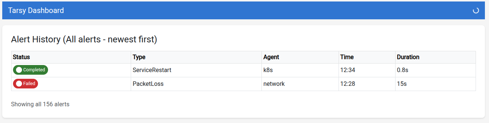
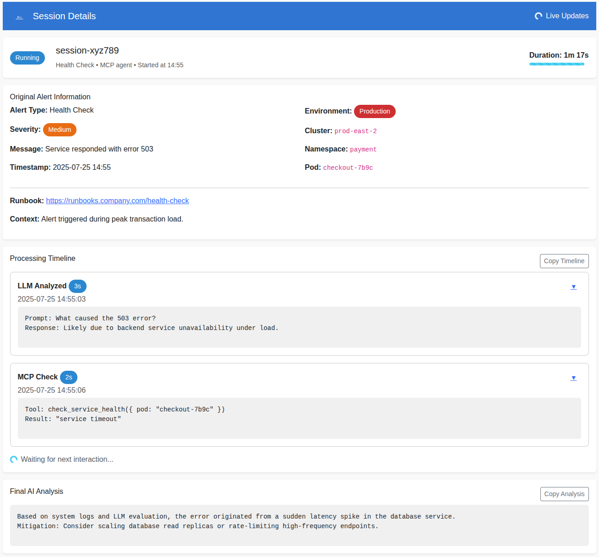
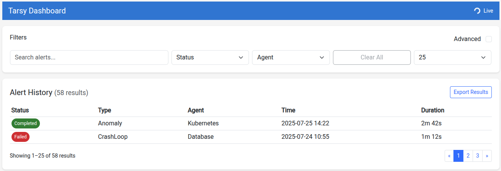

# EP-0004: Dashboard UI/UX Phased Implementation Plan

**Status:** In Progress  
**Created:** 2025-01-25  
**Parent Enhancement:** EP-0004 Dashboard UI Design  
**Purpose:** Break down frontend implementation into small, manageable phases

---

## Overview

This document outlines a phased approach for implementing the EP-0004 Dashboard UI, allowing for iterative development and early value delivery. Each phase builds upon the previous one, adding functionality incrementally while maintaining a working dashboard at each step.

**Backend Status:** ✅ Completed - WebSocket infrastructure and integrated hook system are implemented and ready.

### Backend Integration Notes for AI
- **Base API URL**: `http://localhost:8000` (development) or configured via `REACT_APP_API_BASE_URL`
- **CORS**: Backend already configured to accept frontend requests
- **Available Endpoints**: All EP-0003 history service endpoints are functional
- **Authentication**: Currently no authentication required (may be added in future phases)
- **Data Format**: Backend returns consistent JSON responses with `data` wrapper objects

---

## Phase 1: Basic Alert List
**Goal:** Create a minimal working dashboard with a single list of all alerts

### Scope
- Single unified list showing both active and completed alerts
- Basic alert information only: type, status, timestamp, duration
- No filtering, no search, no detail views
- Static refresh (no real-time updates yet)
- Basic Material-UI styling

### Implementation Notes for AI
- **Priority**: This is the foundation - must work before any other phases
- **Data Source**: Use existing `GET /api/v1/history/sessions` endpoint (no filtering parameters)
- **Error Handling**: Always include loading states and graceful error messages
- **Styling**: Follow Material-UI design system consistently
- **Testing**: Each component should render without errors and display mock data correctly

### Components to Build
```
dashboard/
├── src/
│   ├── App.tsx                     # Basic app shell with routing
│   ├── components/
│   │   ├── AlertList.tsx          # Simple table/list of all alerts
│   │   ├── AlertListItem.tsx      # Individual alert row
│   │   └── StatusBadge.tsx        # Status indicator component
│   ├── services/
│   │   └── api.ts                 # Basic API client for history endpoint
│   ├── types/
│   │   └── index.ts               # Basic alert types
│   └── index.tsx                  # App entry point
├── package.json
└── tsconfig.json
```

### API Integration
- `GET /api/v1/history/sessions` - Fetch all sessions (newest first, no pagination initially)
- Real backend API integration from day one
- Basic error handling with try/catch and user-friendly error messages
- Loading states with Material-UI CircularProgress spinner

**API Details for Implementation:**
```typescript
// Expected API response format
interface SessionResponse {
  data: {
    sessions: Array<{
      id: string;
      alert_type: string;
      agent_type: string;
      status: 'completed' | 'failed' | 'in_progress' | 'pending';
      started_at: string; // ISO timestamp
      completed_at: string | null;
      duration_ms: number | null;
      summary: string;
      error_message: string | null;
    }>;
    total_count: number;
  };
}

// Backend URL configuration
const API_BASE_URL = process.env.REACT_APP_API_BASE_URL || 'http://localhost:8000';
```

### UI Layout (Material-UI Components)

<details>
<summary>Click to view Phase 1 UI Layout Code</summary>

```typescript
// Dashboard layout using Material-UI components
<Container maxWidth="lg">
  <AppBar position="static">
    <Toolbar>
      <Typography variant="h6">Tarsy Dashboard</Typography>
      <Box sx={{ ml: 'auto' }}>
        <CircularProgress size={20} /> {/* Loading indicator */}
      </Box>
    </Toolbar>
  </AppBar>
  
  <Paper sx={{ mt: 2, p: 2 }}>
    <Typography variant="h5" gutterBottom>
      Alert History (All alerts - newest first)
    </Typography>
    
    <TableContainer>
      <Table>
        <TableHead>
          <TableRow>
            <TableCell>Status</TableCell>
            <TableCell>Type</TableCell>
            <TableCell>Agent</TableCell>
            <TableCell>Time</TableCell>
            <TableCell>Duration</TableCell>
          </TableRow>
        </TableHead>
        <TableBody>
          <TableRow>
            <TableCell><Chip color="success" icon={<CheckCircle />} label="Completed" size="small" /></TableCell>
            <TableCell>ServiceRestart</TableCell>
            <TableCell>k8s</TableCell>
            <TableCell>12:34</TableCell>
            <TableCell>0.8s</TableCell>
          </TableRow>
          <TableRow>
            <TableCell><Chip color="error" icon={<Error />} label="Failed" size="small" /></TableCell>
            <TableCell>PacketLoss</TableCell>
            <TableCell>network</TableCell>
            <TableCell>12:28</TableCell>
            <TableCell>15s</TableCell>
          </TableRow>
          {/* Additional rows... */}
        </TableBody>
      </Table>
    </TableContainer>
    
    <Typography variant="body2" sx={{ mt: 2 }}>
      Showing all 156 alerts
    </Typography>
  </Paper>
</Container>
```

</details>

<p align="center">
  
</p>


### Success Criteria
- [ ] Dashboard loads and displays list of alerts from real API
- [ ] Alert status uses Material-UI Chip components with appropriate colors (success, error, warning, info)
- [ ] Status indicators include Material Icons (CheckCircle, Error, Schedule, Refresh)
- [ ] Basic responsive design works on desktop using Material-UI Grid system (1200px+ width)
- [ ] Error states show user-friendly messages using Material-UI Alert component
- [ ] Loading states display Material-UI CircularProgress component
- [ ] Layout uses Material-UI Container, Paper, and Typography components
- [ ] Can be built and deployed independently of other apps
- [ ] All TypeScript types are properly defined with Material-UI component props
- [ ] Basic unit tests pass for core components using @testing-library/react

### Implementation Patterns for AI
```typescript
import { Chip, ChipProps } from '@mui/material';
import { CheckCircle, Error, Schedule, Refresh } from '@mui/icons-material';

// Status badge color mapping using Material-UI Chip component
const getStatusChipProps = (status: string): { color: ChipProps['color'], icon: React.ReactNode, label: string } => {
  switch (status) {
    case 'completed': 
      return { color: 'success', icon: <CheckCircle />, label: 'Completed' };
    case 'failed': 
      return { color: 'error', icon: <Error />, label: 'Failed' };
    case 'in_progress':
      return { color: 'info', icon: <Refresh />, label: 'In Progress' };
    case 'pending': 
      return { color: 'warning', icon: <Schedule />, label: 'Pending' };
    default: 
      return { color: 'default', icon: null, label: 'Unknown' };
  }
};

// StatusBadge component using Material-UI Chip
const StatusBadge: React.FC<{ status: string }> = ({ status }) => {
  const { color, icon, label } = getStatusChipProps(status);
  return <Chip size="small" color={color} icon={icon} label={label} />;
};

// Duration formatting helper (unchanged but fits Material-UI Typography)
const formatDuration = (durationMs: number | null): string => {
  if (!durationMs) return '-';
  if (durationMs < 1000) return `${durationMs}ms`;
  if (durationMs < 60000) return `${(durationMs / 1000).toFixed(1)}s`;
  return `${Math.floor(durationMs / 60000)}m ${Math.floor((durationMs % 60000) / 1000)}s`;
};
```

### Common Pitfalls to Avoid
- **Don't** hardcode API URLs - use environment variables
- **Don't** expose raw API errors to users - use Material-UI Alert component for user-friendly messages
- **Don't** forget loading states - use Material-UI CircularProgress or Skeleton components
- **Don't** skip TypeScript types - they prevent runtime errors, especially with Material-UI component props
- **Don't** make API calls in render functions - use useEffect hooks
- **Don't** forget ThemeProvider - wrap your app with Material-UI ThemeProvider
- **Don't** use inline styles - prefer Material-UI's sx prop or styled components
- **Don't** mix UI libraries - stick to Material-UI components consistently
- **Don't** ignore responsive design - use Material-UI Grid and breakpoint system

---

## Phase 2: Active/Historical Split
**Goal:** Separate active alerts from completed ones with distinct sections

### Scope
- Split the single list into two sections: "Active Alerts" and "Alert History"
- Active alerts at the top with real-time status indicators
- Historical alerts below in a separate section
- Still no filtering or detailed views
- Add basic real-time updates for active alerts only

### New Components
```
├── components/
│   ├── ActiveAlertsPanel.tsx      # Top panel for currently processing
│   ├── HistoricalAlertsList.tsx   # Bottom section for completed
│   ├── ActiveAlertCard.tsx        # Expanded active alert display
│   └── DashboardLayout.tsx        # Two-section layout component
├── services/
│   └── websocket.ts               # Basic WebSocket for active updates
```

### API Integration
- `GET /api/v1/history/active-sessions` - Fetch active alerts
- `GET /api/v1/history/sessions?status=completed&status=failed` - Fetch historical alerts (supports multiple status values)
- WebSocket connection for active alert updates
- Basic subscription to `dashboard_updates` channel

### UI Layout (Material-UI Components)

<details>
<summary>Click to view Phase 2 UI Layout Code</summary>

```typescript
// Phase 2 layout with active/historical split
<Container maxWidth="lg">
  <AppBar position="static">
    <Toolbar>
      <Typography variant="h6">Tarsy Dashboard</Typography>
      <Box sx={{ ml: 'auto', display: 'flex', alignItems: 'center', gap: 1 }}>
        <CircularProgress size={16} />
        <Typography variant="body2">Live</Typography>
      </Box>
    </Toolbar>
  </AppBar>

  {/* Active Alerts Section */}
  <Paper sx={{ mt: 2, p: 2 }}>
    <Typography variant="h5" gutterBottom>
      Active Alerts (2)
    </Typography>
    <Stack spacing={2}>
      <Card variant="outlined">
        <CardContent sx={{ display: 'flex', alignItems: 'center', gap: 2 }}>
          <Chip color="error" icon={<Error />} label="Failed" />
          <Typography>k8s-prod</Typography>
          <Typography>PodCrashLoop</Typography>
          <Typography color="text.secondary">00:34</Typography>
        </CardContent>
      </Card>
      <Card variant="outlined">
        <CardContent sx={{ display: 'flex', alignItems: 'center', gap: 2 }}>
          <Chip color="info" icon={<Refresh />} label="In Progress" />
          <Typography>network</Typography>
          <Typography>LatencySpike</Typography>
          <Typography color="text.secondary">02:45</Typography>
          <LinearProgress variant="determinate" value={65} sx={{ ml: 'auto', width: 100 }} />
        </CardContent>
      </Card>
    </Stack>
  </Paper>

  {/* Historical Alerts Section */}
  <Paper sx={{ mt: 2, p: 2 }}>
    <Typography variant="h5" gutterBottom>
      Alert History
    </Typography>
    <TableContainer>
      <Table size="small">
        <TableHead>
          <TableRow>
            <TableCell>Status</TableCell>
            <TableCell>Type</TableCell>
            <TableCell>Agent</TableCell>
            <TableCell>Time</TableCell>
            <TableCell>Duration</TableCell>
          </TableRow>
        </TableHead>
        <TableBody>
          <TableRow>
            <TableCell><Chip color="success" icon={<CheckCircle />} label="Completed" size="small" /></TableCell>
            <TableCell>ServiceRestart</TableCell>
            <TableCell>k8s</TableCell>
            <TableCell>12:34</TableCell>
            <TableCell>0.8s</TableCell>
          </TableRow>
          {/* Additional rows... */}
        </TableBody>
      </Table>
    </TableContainer>
  </Paper>
</Container>
```

</details>

<p align="center">
  
</p>


### Success Criteria
- [ ] Active and historical alerts are clearly separated
- [ ] Active alerts show real-time status updates
- [ ] Active alerts display progress indicators
- [ ] WebSocket connection works reliably
- [ ] Active alert count updates automatically

---

## Phase 3: Basic Navigation & Detail View
**Goal:** Add clickable alerts that navigate to a simple detail page

### Scope
- Make alert items clickable
- Create comprehensive session detail page with original alert data
- Display final AI analysis with proper markdown rendering
- Basic timeline showing LLM/MCP interactions
- Simple back navigation
- No advanced timeline features yet

### New Components
```
├── components/
│   ├── SessionDetailPage.tsx      # Comprehensive detail page
│   ├── SessionHeader.tsx          # Session metadata display
│   ├── OriginalAlertCard.tsx      # Structured original alert data display
│   ├── FinalAnalysisCard.tsx      # Markdown analysis with expand/collapse
│   ├── SimpleTimeline.tsx         # Basic timeline list
│   └── BackButton.tsx             # Navigation component
├── utils/
│   └── markdownRenderer.ts        # Markdown parsing utilities
```

### Features
- Click any alert → navigate to `/sessions/{id}`
- **Original Alert Data**: Structured display of triggering alert information
- **Final AI Analysis**: Markdown-formatted analysis with expand/collapse for long content
- **Processing Timeline**: Basic timeline showing LLM/MCP interactions
- Session metadata (start time, duration, status, etc.)
- Simple back button to return to dashboard

### API Integration
- `GET /api/v1/history/sessions/{session_id}` - Get complete session details including:
  - `alert_data`: Original alert information (severity, environment, cluster, namespace, etc.)
  - `final_analysis`: AI-generated markdown analysis document
  - `chronological_timeline`: LLM/MCP interaction timeline
  - Session metadata and processing status

### Dependencies
- **react-markdown**: For rendering final analysis markdown content
- **@mui/icons-material**: Additional icons for alert severity and environment indicators

### UI Layout (Material-UI Components)

<details>
<summary>Click to view Phase 3 UI Layout Code</summary>

```typescript
// Phase 3: Enhanced Session Detail Page with Original Alert Data & Final Analysis
<Container maxWidth="lg">
  <AppBar position="static">
    <Toolbar>
      <IconButton edge="start" onClick={handleBack}>
        <ArrowBack />
      </IconButton>
      <Typography variant="h6" sx={{ ml: 1 }}>
        Session Details
      </Typography>
    </Toolbar>
  </AppBar>

  {/* Session Header */}
  <Paper sx={{ mt: 2, p: 3 }}>
    <Grid container spacing={2} alignItems="center">
      <Grid item>
        <Chip 
          {...getStatusChipProps(session.status)}
          size="medium" 
        />
      </Grid>
      <Grid item xs>
        <Typography variant="h5">{session.session_id}</Typography>
        <Typography variant="body2" color="text.secondary">
          {session.alert_type} • {session.agent_type} agent • Started at {formatTime(session.started_at)}
        </Typography>
      </Grid>
      <Grid item>
        <Typography variant="h6" color={session.status === 'completed' ? 'success.main' : 'text.primary'}>
          Duration: {formatDuration(session.duration_ms)}
        </Typography>
      </Grid>
    </Grid>
  </Paper>

  {/* Original Alert Data */}
  <Paper sx={{ mt: 2, p: 3 }}>
    <Typography variant="h6" gutterBottom sx={{ display: 'flex', alignItems: 'center', gap: 1 }}>
      <Warning color="warning" />
      Original Alert Information
    </Typography>
    
    <Grid container spacing={3}>
      {/* Primary Alert Info */}
      <Grid item xs={12} md={6}>
        <Card variant="outlined" sx={{ height: '100%' }}>
          <CardContent>
            <Typography variant="subtitle1" gutterBottom sx={{ fontWeight: 600 }}>
              Alert Details
            </Typography>
            <Stack spacing={2}>
              <Box>
                <Typography variant="body2" color="text.secondary">Alert Type</Typography>
                <Typography variant="body1" sx={{ fontWeight: 500 }}>{session.alert_data.alert_type}</Typography>
              </Box>
              <Box>
                <Typography variant="body2" color="text.secondary">Severity</Typography>
                <Chip 
                  label={session.alert_data.severity} 
                  color={getSeverityColor(session.alert_data.severity)}
                  size="small"
                />
              </Box>
              <Box>
                <Typography variant="body2" color="text.secondary">Message</Typography>
                <Typography variant="body1">{session.alert_data.message}</Typography>
              </Box>
              <Box>
                <Typography variant="body2" color="text.secondary">Timestamp</Typography>
                <Typography variant="body1">{formatTime(session.alert_data.timestamp)}</Typography>
              </Box>
            </Stack>
          </CardContent>
        </Card>
      </Grid>

      {/* Environment & Infrastructure */}
      <Grid item xs={12} md={6}>
        <Card variant="outlined" sx={{ height: '100%' }}>
          <CardContent>
            <Typography variant="subtitle1" gutterBottom sx={{ fontWeight: 600 }}>
              Environment & Infrastructure
            </Typography>
            <Stack spacing={2}>
              <Box>
                <Typography variant="body2" color="text.secondary">Environment</Typography>
                <Chip 
                  label={session.alert_data.environment} 
                  color={session.alert_data.environment === 'production' ? 'error' : 'info'}
                  size="small"
                  icon={session.alert_data.environment === 'production' ? <Warning /> : <Info />}
                />
              </Box>
              <Box>
                <Typography variant="body2" color="text.secondary">Cluster</Typography>
                <Typography variant="body1" sx={{ fontFamily: 'monospace', fontSize: '0.875rem' }}>
                  {session.alert_data.cluster}
                </Typography>
              </Box>
              <Box>
                <Typography variant="body2" color="text.secondary">Namespace</Typography>
                <Typography variant="body1" sx={{ fontFamily: 'monospace', fontSize: '0.875rem' }}>
                  {session.alert_data.namespace}
                </Typography>
              </Box>
              {session.alert_data.pod && (
                <Box>
                  <Typography variant="body2" color="text.secondary">Pod</Typography>
                  <Typography variant="body1" sx={{ fontFamily: 'monospace', fontSize: '0.875rem' }}>
                    {session.alert_data.pod}
                  </Typography>
                </Box>
              )}
            </Stack>
          </CardContent>
        </Card>
      </Grid>

      {/* Additional Context & Runbook */}
      {(session.alert_data.context || session.alert_data.runbook) && (
        <Grid item xs={12}>
          <Card variant="outlined">
            <CardContent>
              <Typography variant="subtitle1" gutterBottom sx={{ fontWeight: 600 }}>
                Additional Information
              </Typography>
              <Stack spacing={2}>
                {session.alert_data.runbook && (
                  <Box>
                    <Typography variant="body2" color="text.secondary">Runbook</Typography>
                    <Link 
                      href={session.alert_data.runbook} 
                      target="_blank" 
                      rel="noopener noreferrer"
                      sx={{ display: 'flex', alignItems: 'center', gap: 0.5 }}
                    >
                      <OpenInNew fontSize="small" />
                      {session.alert_data.runbook}
                    </Link>
                  </Box>
                )}
                {session.alert_data.context && (
                  <Box>
                    <Typography variant="body2" color="text.secondary">Context</Typography>
                    <Typography variant="body1">{session.alert_data.context}</Typography>
                  </Box>
                )}
              </Stack>
            </CardContent>
          </Card>
        </Grid>
      )}
    </Grid>
  </Paper>

  {/* Processing Timeline */}
  <Paper sx={{ mt: 2, p: 3 }}>
    <Typography variant="h6" gutterBottom sx={{ display: 'flex', alignItems: 'center', gap: 1 }}>
      <Timeline color="primary" />
      Processing Timeline
    </Typography>
    <List>
      {session.chronological_timeline.map((event, index) => (
        <ListItem key={event.event_id}>
          <ListItemIcon>
            {event.type === 'llm' ? (
              <Psychology sx={{ color: 'primary.main' }} />
            ) : event.type === 'mcp' ? (
              <Build sx={{ color: 'secondary.main' }} />
            ) : (
              <Circle sx={{ color: 'info.main', fontSize: 12 }} />
            )}
          </ListItemIcon>
          <ListItemText
            primary={event.step_description}
            secondary={`${formatTimestamp(event.timestamp)}${event.duration_ms ? ` • Duration: ${formatDuration(event.duration_ms)}` : ''}`}
          />
        </ListItem>
      ))}
    </List>
  </Paper>

  {/* Final AI Analysis */}
  {session.final_analysis && (
    <Paper sx={{ mt: 2, p: 3 }}>
      <Box sx={{ display: 'flex', justifyContent: 'space-between', alignItems: 'center', mb: 2 }}>
        <Typography variant="h6" sx={{ display: 'flex', alignItems: 'center', gap: 1 }}>
          <Psychology color="primary" />
          Final AI Analysis
        </Typography>
        <Button
          startIcon={<ContentCopy />}
          variant="outlined"
          size="small"
          onClick={() => copyToClipboard(session.final_analysis)}
        >
          Copy Analysis
        </Button>
      </Box>

      {/* Analysis Content with Expand/Collapse */}
      <Box sx={{ position: 'relative' }}>
        <Box 
          sx={{ 
            maxHeight: analysisExpanded ? 'none' : '400px',
            overflow: 'hidden',
            transition: 'max-height 0.3s ease-in-out'
          }}
        >
          <Paper 
            variant="outlined" 
            sx={{ 
              p: 3, 
              bgcolor: 'grey.50',
              '& pre': { 
                whiteSpace: 'pre-wrap', 
                fontFamily: 'monospace',
                fontSize: '0.875rem' 
              },
              '& code': {
                backgroundColor: 'rgba(0, 0, 0, 0.08)',
                padding: '2px 4px',
                borderRadius: 1,
                fontFamily: 'monospace',
                fontSize: '0.875rem'
              },
              '& h1, & h2, & h3': {
                color: 'primary.main',
                marginTop: 2,
                marginBottom: 1
              },
              '& ul, & ol': {
                paddingLeft: 3
              }
            }}
          >
            <ReactMarkdown>{session.final_analysis}</ReactMarkdown>
          </Paper>
        </Box>

        {/* Fade overlay and expand button when collapsed */}
        {!analysisExpanded && session.final_analysis.length > 1000 && (
          <>
            <Box
              sx={{
                position: 'absolute',
                bottom: 0,
                left: 0,
                right: 0,
                height: '80px',
                background: 'linear-gradient(transparent, white)',
                pointerEvents: 'none'
              }}
            />
            <Box sx={{ textAlign: 'center', mt: 1 }}>
              <Button
                variant="text"
                startIcon={<ExpandMore />}
                onClick={() => setAnalysisExpanded(true)}
              >
                Show Full Analysis
              </Button>
            </Box>
          </>
        )}

        {/* Collapse button when expanded */}
        {analysisExpanded && (
          <Box sx={{ textAlign: 'center', mt: 1 }}>
            <Button
              variant="text"
              startIcon={<ExpandLess />}
              onClick={() => setAnalysisExpanded(false)}
            >
              Show Less
            </Button>
          </Box>
        )}
      </Box>

      {session.status === 'failed' && session.error_message && (
        <Alert severity="error" sx={{ mt: 2 }}>
          <AlertTitle>Processing Error</AlertTitle>
          {session.error_message}
        </Alert>
      )}
    </Paper>
  )}
</Container>
```

</details>

<p align="center">
  
</p>


### Success Criteria
- [ ] Clicking alerts navigates to detail page using React Router
- [ ] **Original Alert Data** displays in structured Material-UI Cards with proper field organization
- [ ] **Severity and Environment** indicators use appropriate Material-UI Chip colors
- [ ] **Final AI Analysis** renders markdown content using react-markdown with proper styling
- [ ] **Analysis expand/collapse** functionality works with smooth transitions (400px initial height)
- [ ] **Copy Analysis** button successfully copies markdown content to clipboard
- [ ] **Processing Timeline** displays interactions using Material-UI List with appropriate icons
- [ ] Back navigation works correctly with Material-UI IconButton
- [ ] URLs are shareable and properly formatted
- [ ] Session metadata displays in Material-UI Grid layout
- [ ] **Runbook links** open in new tab with proper security attributes
- [ ] **Error states** display for failed sessions with Material-UI Alert components
- [ ] All Material Icons render correctly (Warning, Psychology, Build, Timeline, etc.)

---

## Phase 4: Search & Basic Filtering
**Goal:** Add search capability and simple status filtering

### Scope
- Add search bar for alert content
- Add status filter dropdown (All, Completed, Failed, In Progress, Pending)
- Apply filters to historical alerts list
- Simple search across alert types and error messages

### New Components
```
├── components/
│   ├── SearchBar.tsx              # Debounced search input
│   ├── StatusFilter.tsx           # Status dropdown filter
│   └── FilterBar.tsx              # Container for filters
```

### API Integration
- `GET /api/v1/history/search?q={searchTerm}&limit={limit}` - Full-text search across sessions
- `GET /api/v1/history/filter-options` - Get available filter values (agent types, alert types)
- Enhanced session filtering with multiple parameters
- Debounced search queries to prevent API overload

### Features
- Search box with debounced API calls
- Status filter affecting historical list
- Clear filters functionality
- Search results highlighting

### UI Layout (Material-UI Components)

<details>
<summary>Click to view Phase 4 UI Layout Code</summary>

```typescript
// Phase 4: Dashboard with Search & Filtering
<Container maxWidth="lg">
  <AppBar position="static">
    <Toolbar>
      <Typography variant="h6">Tarsy Dashboard</Typography>
      <Box sx={{ ml: 'auto', display: 'flex', alignItems: 'center', gap: 1 }}>
        <CircularProgress size={16} />
        <Typography variant="body2">Live</Typography>
      </Box>
    </Toolbar>
  </AppBar>

  {/* Search and Filter Bar */}
  <Paper sx={{ mt: 2, p: 2 }}>
    <Grid container spacing={2} alignItems="center">
      <Grid item xs={12} md={6}>
        <TextField
          fullWidth
          placeholder="Search alerts by type, error message..."
          variant="outlined"
          size="small"
          InputProps={{
            startAdornment: (
              <InputAdornment position="start">
                <Search />
              </InputAdornment>
            ),
          }}
          onChange={handleSearchChange}
        />
      </Grid>
      <Grid item xs={12} md={3}>
        <FormControl fullWidth size="small">
          <InputLabel>Status</InputLabel>
          <Select
            value={statusFilter}
            label="Status"
            onChange={handleStatusChange}
          >
            <MenuItem value="all">All</MenuItem>
            <MenuItem value="completed">Completed</MenuItem>
            <MenuItem value="failed">Failed</MenuItem>
            <MenuItem value="in_progress">In Progress</MenuItem>
            <MenuItem value="pending">Pending</MenuItem>
          </Select>
        </FormControl>
      </Grid>
      <Grid item xs={12} md={3}>
        <Button
          variant="outlined"
          startIcon={<Clear />}
          onClick={handleClearFilters}
          fullWidth
        >
          Clear Filters
        </Button>
      </Grid>
    </Grid>

    {/* Active Filter Chips */}
    {(searchTerm || statusFilter !== 'all') && (
      <Box sx={{ mt: 2, display: 'flex', gap: 1, flexWrap: 'wrap' }}>
        {searchTerm && (
          <Chip
            label={`Search: "${searchTerm}"`}
            onDelete={() => setSearchTerm('')}
            deleteIcon={<Clear />}
            variant="outlined"
          />
        )}
        {statusFilter !== 'all' && (
          <Chip
            label={`Status: ${statusFilter}`}
            onDelete={() => setStatusFilter('all')}
            deleteIcon={<Clear />}
            variant="outlined"
          />
        )}
      </Box>
    )}
  </Paper>

  {/* Active Alerts Section (unchanged from Phase 2) */}
  <Paper sx={{ mt: 2, p: 2 }}>
    <Typography variant="h5" gutterBottom>
      Active Alerts (2)
    </Typography>
    {/* Same as Phase 2... */}
  </Paper>

  {/* Historical Alerts Section with Search Results */}
  <Paper sx={{ mt: 2, p: 2 }}>
    <Typography variant="h5" gutterBottom>
      Alert History {filteredCount > 0 && `(${filteredCount} results)`}
    </Typography>
    
    {searchTerm && (
      <Alert severity="info" sx={{ mb: 2 }}>
        Showing results for "{searchTerm}" with status: {statusFilter}
      </Alert>
    )}

    <TableContainer>
      <Table size="small">
        <TableHead>
          <TableRow>
            <TableCell>Status</TableCell>
            <TableCell>Type</TableCell>
            <TableCell>Agent</TableCell>
            <TableCell>Time</TableCell>
            <TableCell>Duration</TableCell>
          </TableRow>
        </TableHead>
        <TableBody>
          {filteredAlerts.map((alert) => (
            <TableRow key={alert.id} hover onClick={() => handleRowClick(alert.id)}>
              <TableCell>
                <Chip 
                  {...getStatusChipProps(alert.status)}
                  size="small" 
                />
              </TableCell>
              <TableCell>
                <Typography
                  dangerouslySetInnerHTML={{
                    __html: highlightSearchTerm(alert.alert_type, searchTerm)
                  }}
                />
              </TableCell>
              <TableCell>{alert.agent_type}</TableCell>
              <TableCell>{formatTime(alert.started_at)}</TableCell>
              <TableCell>{formatDuration(alert.duration_ms)}</TableCell>
            </TableRow>
          ))}
        </TableBody>
      </Table>
    </TableContainer>

    {filteredAlerts.length === 0 && (
      <Box sx={{ textAlign: 'center', py: 4 }}>
        <SearchOff sx={{ fontSize: 48, color: 'text.secondary', mb: 2 }} />
        <Typography variant="h6" color="text.secondary">
          No alerts found
        </Typography>
        <Typography variant="body2" color="text.disabled">
          Try adjusting your search terms or filters
        </Typography>
      </Box>
    )}
  </Paper>
</Container>
```

</details>

<p align="center">
  
</p>


### Success Criteria
- [ ] Search finds relevant alerts quickly using Material-UI TextField with InputAdornment
- [ ] Status filter works correctly using Material-UI Select component
- [ ] Filter combinations work together and display active filter Chips
- [ ] Clear/reset filters functionality works with Material-UI Button
- [ ] Search results are highlighted in table cells
- [ ] Empty state shows Material-UI SearchOff icon and helpful message
- [ ] Filtered count displays in section header
- [ ] Filter state is visually represented with Chip components

---

## Phase 5: Enhanced Timeline & Interaction Details
**Goal:** Improve session detail page with better timeline and expandable interactions

### Scope
- Enhanced timeline visualization
- Interaction details expansion
- Copy/export basic functionality

### New Components
```
├── components/
│   ├── TimelineVisualization.tsx  # Enhanced timeline component
│   ├── InteractionDetails.tsx     # Expandable interaction info
│   ├── ProgressIndicator.tsx      # Real-time progress display
│   └── CopyButton.tsx             # Copy functionality
```

### Features
- Visual timeline with timestamps
- Expandable interaction details
- Copy interaction details to clipboard
- Progress indicators for active processing

### Dependencies
- **@mui/lab**: Required for Timeline, TimelineItem, TimelineDot, TimelineConnector components
- **@mui/icons-material**: Additional icons for Timeline events (Psychology, Build, etc.)

### UI Layout (Material-UI Components)

<details>
<summary>Click to view Phase 5 UI Layout Code</summary>

```typescript
// Phase 5: Enhanced Session Detail with Real-time Updates
<Container maxWidth="lg">
  <AppBar position="static">
    <Toolbar>
      <IconButton edge="start" onClick={handleBack}>
        <ArrowBack />
      </IconButton>
      <Typography variant="h6" sx={{ ml: 1 }}>
        Session Details
      </Typography>
      {isActive && (
        <Box sx={{ ml: 'auto', display: 'flex', alignItems: 'center', gap: 1 }}>
          <Box sx={{ width: 20, height: 20 }}>
            <CircularProgress size={16} />
          </Box>
          <Typography variant="body2" color="info.main">
            Live Updates
          </Typography>
        </Box>
      )}
    </Toolbar>
  </AppBar>

  {/* Enhanced Session Header with Progress */}
  <Paper sx={{ mt: 2, p: 3 }}>
    <Grid container spacing={2} alignItems="center">
      <Grid item>
        <Chip 
          {...getStatusChipProps(session.status)}
          size="medium" 
        />
      </Grid>
      <Grid item xs>
        <Typography variant="h5">{session.session_id}</Typography>
        <Typography variant="body2" color="text.secondary">
          {session.alert_type} • {session.agent_type} agent • Started at {formatTime(session.started_at)}
        </Typography>
      </Grid>
      <Grid item>
        <Box sx={{ textAlign: 'right' }}>
          <Typography variant="h6" color={session.status === 'completed' ? 'success.main' : 'text.primary'}>
            Duration: {formatDuration(session.duration_ms)}
          </Typography>
          {isActive && (
            <LinearProgress 
              variant="indeterminate" 
              sx={{ mt: 1, width: 120 }} 
              color="info"
            />
          )}
        </Box>
      </Grid>
    </Grid>
  </Paper>

  {/* Original Alert Data - Same as Phase 3 */}
  <Paper sx={{ mt: 2, p: 3 }}>
    <Typography variant="h6" gutterBottom sx={{ display: 'flex', alignItems: 'center', gap: 1 }}>
      <Warning color="warning" />
      Original Alert Information
    </Typography>
    
    <Grid container spacing={3}>
      {/* Primary Alert Info */}
      <Grid item xs={12} md={6}>
        <Card variant="outlined" sx={{ height: '100%' }}>
          <CardContent>
            <Typography variant="subtitle1" gutterBottom sx={{ fontWeight: 600 }}>
              Alert Details
            </Typography>
            <Stack spacing={2}>
              <Box>
                <Typography variant="body2" color="text.secondary">Alert Type</Typography>
                <Typography variant="body1" sx={{ fontWeight: 500 }}>{session.alert_data.alert_type}</Typography>
              </Box>
              <Box>
                <Typography variant="body2" color="text.secondary">Severity</Typography>
                <Chip 
                  label={session.alert_data.severity} 
                  color={getSeverityColor(session.alert_data.severity)}
                  size="small"
                />
              </Box>
              <Box>
                <Typography variant="body2" color="text.secondary">Message</Typography>
                <Typography variant="body1">{session.alert_data.message}</Typography>
              </Box>
              <Box>
                <Typography variant="body2" color="text.secondary">Timestamp</Typography>
                <Typography variant="body1">{formatTime(session.alert_data.timestamp)}</Typography>
              </Box>
            </Stack>
          </CardContent>
        </Card>
      </Grid>

      {/* Environment & Infrastructure */}
      <Grid item xs={12} md={6}>
        <Card variant="outlined" sx={{ height: '100%' }}>
          <CardContent>
            <Typography variant="subtitle1" gutterBottom sx={{ fontWeight: 600 }}>
              Environment & Infrastructure
            </Typography>
            <Stack spacing={2}>
              <Box>
                <Typography variant="body2" color="text.secondary">Environment</Typography>
                <Chip 
                  label={session.alert_data.environment} 
                  color={session.alert_data.environment === 'production' ? 'error' : 'info'}
                  size="small"
                  icon={session.alert_data.environment === 'production' ? <Warning /> : <Info />}
                />
              </Box>
              <Box>
                <Typography variant="body2" color="text.secondary">Cluster</Typography>
                <Typography variant="body1" sx={{ fontFamily: 'monospace', fontSize: '0.875rem' }}>
                  {session.alert_data.cluster}
                </Typography>
              </Box>
              <Box>
                <Typography variant="body2" color="text.secondary">Namespace</Typography>
                <Typography variant="body1" sx={{ fontFamily: 'monospace', fontSize: '0.875rem' }}>
                  {session.alert_data.namespace}
                </Typography>
              </Box>
              {session.alert_data.pod && (
                <Box>
                  <Typography variant="body2" color="text.secondary">Pod</Typography>
                  <Typography variant="body1" sx={{ fontFamily: 'monospace', fontSize: '0.875rem' }}>
                    {session.alert_data.pod}
                  </Typography>
                </Box>
              )}
            </Stack>
          </CardContent>
        </Card>
      </Grid>

      {/* Additional Context & Runbook */}
      {(session.alert_data.context || session.alert_data.runbook) && (
        <Grid item xs={12}>
          <Card variant="outlined">
            <CardContent>
              <Typography variant="subtitle1" gutterBottom sx={{ fontWeight: 600 }}>
                Additional Information
              </Typography>
              <Stack spacing={2}>
                {session.alert_data.runbook && (
                  <Box>
                    <Typography variant="body2" color="text.secondary">Runbook</Typography>
                    <Link 
                      href={session.alert_data.runbook} 
                      target="_blank" 
                      rel="noopener noreferrer"
                      sx={{ display: 'flex', alignItems: 'center', gap: 0.5 }}
                    >
                      <OpenInNew fontSize="small" />
                      {session.alert_data.runbook}
                    </Link>
                  </Box>
                )}
                {session.alert_data.context && (
                  <Box>
                    <Typography variant="body2" color="text.secondary">Context</Typography>
                    <Typography variant="body1">{session.alert_data.context}</Typography>
                  </Box>
                )}
              </Stack>
            </CardContent>
          </Card>
        </Grid>
      )}
    </Grid>
  </Paper>

  {/* Enhanced Timeline with Expandable Details */}
  <Paper sx={{ mt: 2, p: 3 }}>
    <Box sx={{ display: 'flex', justifyContent: 'space-between', alignItems: 'center', mb: 2 }}>
      <Typography variant="h6" sx={{ display: 'flex', alignItems: 'center', gap: 1 }}>
        <Timeline color="primary" />
        Processing Timeline
      </Typography>
      <Button
        startIcon={<ContentCopy />}
        variant="outlined"
        size="small"
        onClick={handleCopyTimeline}
      >
        Copy Timeline
      </Button>
    </Box>

    <Timeline position="left">
      {interactions.map((interaction, index) => (
        <TimelineItem key={interaction.id}>
          <TimelineSeparator>
            <TimelineDot 
              color={getInteractionColor(interaction.type)}
              variant={interaction.status === 'completed' ? 'filled' : 'outlined'}
            >
              {getInteractionIcon(interaction.type)}
            </TimelineDot>
            {index < interactions.length - 1 && <TimelineConnector />}
          </TimelineSeparator>
          
          <TimelineContent>
            <Card variant="outlined" sx={{ mb: 1 }}>
              <CardHeader
                avatar={
                  <Avatar sx={{ bgcolor: getInteractionColor(interaction.type) + '.main' }}>
                    {getInteractionIcon(interaction.type)}
                  </Avatar>
                }
                title={
                  <Box sx={{ display: 'flex', alignItems: 'center', gap: 1 }}>
                    <Typography variant="subtitle1">
                      {interaction.title}
                    </Typography>
                    {interaction.duration_ms && (
                      <Chip 
                        label={formatDuration(interaction.duration_ms)} 
                        size="small" 
                        variant="outlined"
                      />
                    )}
                  </Box>
                }
                subheader={formatTimestamp(interaction.timestamp)}
                action={
                  <IconButton onClick={() => toggleExpansion(interaction.id)}>
                    {expanded[interaction.id] ? <ExpandLess /> : <ExpandMore />}
                  </IconButton>
                }
              />
              
              <Collapse in={expanded[interaction.id]}>
                <CardContent sx={{ pt: 0 }}>
                  <Divider sx={{ mb: 2 }} />
                  
                  {interaction.type === 'llm' && (
                    <Box>
                      <Typography variant="subtitle2" gutterBottom>
                        Prompt:
                      </Typography>
                      <Paper variant="outlined" sx={{ p: 2, mb: 2, bgcolor: 'grey.50' }}>
                        <Typography variant="body2" sx={{ fontFamily: 'monospace' }}>
                          {interaction.details.prompt}
                        </Typography>
                      </Paper>
                      
                      <Typography variant="subtitle2" gutterBottom>
                        Response:
                      </Typography>
                      <Paper variant="outlined" sx={{ p: 2, bgcolor: 'grey.50' }}>
                        <Typography variant="body2" sx={{ fontFamily: 'monospace' }}>
                          {interaction.details.response}
                        </Typography>
                      </Paper>
                    </Box>
                  )}

                  {interaction.type === 'mcp' && (
                    <Box>
                      <Typography variant="subtitle2" gutterBottom>
                        Tool Call:
                      </Typography>
                      <Paper variant="outlined" sx={{ p: 2, mb: 2, bgcolor: 'grey.50' }}>
                        <Typography variant="body2" sx={{ fontFamily: 'monospace' }}>
                          {interaction.details.tool_name}({JSON.stringify(interaction.details.parameters)})
                        </Typography>
                      </Paper>
                      
                      <Typography variant="subtitle2" gutterBottom>
                        Result:
                      </Typography>
                      <Paper variant="outlined" sx={{ p: 2, bgcolor: 'grey.50' }}>
                        <Typography variant="body2" sx={{ fontFamily: 'monospace' }}>
                          {JSON.stringify(interaction.details.result, null, 2)}
                        </Typography>
                      </Paper>
                    </Box>
                  )}

                  <Box sx={{ mt: 2, display: 'flex', gap: 1 }}>
                    <Button
                      size="small"
                      startIcon={<ContentCopy />}
                      onClick={() => copyInteraction(interaction)}
                    >
                      Copy Details
                    </Button>
                  </Box>
                </CardContent>
              </Collapse>
            </Card>
          </TimelineContent>
        </TimelineItem>
      ))}
    </Timeline>

    {/* Real-time indicator for active sessions */}
    {isActive && (
      <Box sx={{ mt: 2, display: 'flex', alignItems: 'center', gap: 1 }}>
        <CircularProgress size={16} />
        <Typography variant="body2" color="text.secondary">
          Waiting for next interaction...
        </Typography>
      </Box>
    )}
  </Paper>

  {/* Final AI Analysis - Same as Phase 3 */}
  {session.final_analysis && (
    <Paper sx={{ mt: 2, p: 3 }}>
      <Box sx={{ display: 'flex', justifyContent: 'space-between', alignItems: 'center', mb: 2 }}>
        <Typography variant="h6" sx={{ display: 'flex', alignItems: 'center', gap: 1 }}>
          <Psychology color="primary" />
          Final AI Analysis
        </Typography>
        <Button
          startIcon={<ContentCopy />}
          variant="outlined"
          size="small"
          onClick={() => copyToClipboard(session.final_analysis)}
        >
          Copy Analysis
        </Button>
      </Box>

      {/* Analysis Content with Expand/Collapse */}
      <Box sx={{ position: 'relative' }}>
        <Box 
          sx={{ 
            maxHeight: analysisExpanded ? 'none' : '400px',
            overflow: 'hidden',
            transition: 'max-height 0.3s ease-in-out'
          }}
        >
          <Paper 
            variant="outlined" 
            sx={{ 
              p: 3, 
              bgcolor: 'grey.50',
              '& pre': { 
                whiteSpace: 'pre-wrap', 
                fontFamily: 'monospace',
                fontSize: '0.875rem' 
              },
              '& code': {
                backgroundColor: 'rgba(0, 0, 0, 0.08)',
                padding: '2px 4px',
                borderRadius: 1,
                fontFamily: 'monospace',
                fontSize: '0.875rem'
              },
              '& h1, & h2, & h3': {
                color: 'primary.main',
                marginTop: 2,
                marginBottom: 1
              },
              '& ul, & ol': {
                paddingLeft: 3
              }
            }}
          >
            <ReactMarkdown>{session.final_analysis}</ReactMarkdown>
          </Paper>
        </Box>

        {/* Fade overlay and expand button when collapsed */}
        {!analysisExpanded && session.final_analysis.length > 1000 && (
          <>
            <Box
              sx={{
                position: 'absolute',
                bottom: 0,
                left: 0,
                right: 0,
                height: '80px',
                background: 'linear-gradient(transparent, white)',
                pointerEvents: 'none'
              }}
            />
            <Box sx={{ textAlign: 'center', mt: 1 }}>
              <Button
                variant="text"
                startIcon={<ExpandMore />}
                onClick={() => setAnalysisExpanded(true)}
              >
                Show Full Analysis
              </Button>
            </Box>
          </>
        )}

        {/* Collapse button when expanded */}
        {analysisExpanded && (
          <Box sx={{ textAlign: 'center', mt: 1 }}>
            <Button
              variant="text"
              startIcon={<ExpandLess />}
              onClick={() => setAnalysisExpanded(false)}
            >
              Show Less
            </Button>
          </Box>
        )}
      </Box>

      {session.status === 'failed' && session.error_message && (
        <Alert severity="error" sx={{ mt: 2 }}>
          <AlertTitle>Processing Error</AlertTitle>
          {session.error_message}
        </Alert>
      )}
    </Paper>
  )}

  {/* Error Handling - Built into Final Analysis section above */}
  {session.status === 'failed' && session.error_message && !session.final_analysis && (
    <Paper sx={{ mt: 2, p: 3 }}>
      <Typography variant="h6" gutterBottom>
        Error Details
      </Typography>
      <Alert 
        severity="error" 
        sx={{ mt: 1 }}
        action={
          <Button
            size="small"
            startIcon={<ContentCopy />}
            onClick={() => copyError(session.error_message)}
          >
            Copy Error
          </Button>
        }
      >
        {session.error_message}
      </Alert>
    </Paper>
  )}
</Container>
```

</details>

<p align="center">
  
</p>


### Success Criteria
- [ ] **Original Alert Data** displays in structured Material-UI Cards with proper field organization *(already implemented in phase 3, keep it)*
- [ ] **Severity and Environment** indicators use appropriate Material-UI Chip colors *(already implemented in phase 3, keep it)*
- [ ] **Final AI Analysis** renders markdown content using react-markdown with proper styling *(already implemented in phase 3, keep it)*
- [ ] **Analysis expand/collapse** functionality works with smooth transitions (400px initial height) *(already implemented in phase 3, keep it)*
- [ ] **Copy Analysis** button successfully copies markdown content to clipboard *(already implemented in phase 3, keep it)*
- [ ] **Enhanced Timeline** shows clear progression using Material-UI Timeline components *(new - phase 3 used Material-UI List)*
- [ ] **Expandable Timeline Interactions** provide detailed LLM/MCP information with Material-UI Collapse *(new)*
- [ ] **Copy Timeline** functionality works with Material-UI Button components *(new)*
- [ ] **Copy Individual Timeline Elements** allows copying specific LLM/MCP interactions separately *(new)*
- [ ] Progress indicators are accurate using LinearProgress and CircularProgress *(new)*
- [ ] Timeline uses Material-UI TimelineItem, TimelineDot, and TimelineConnector *(new - phase 3 used Material-UI List)*
- [ ] **Runbook links** open in new tab with proper security attributes *(already implemented in phase 3, keep it)*
- [ ] **Error states** display for failed sessions within Final Analysis section *(already implemented in phase 3, keep it)*
- [ ] All Material Icons render correctly (Warning, Psychology, Build, Timeline, etc.) *(already implemented in phase 3, keep it)*

---

## Phase 6: Advanced Filtering & Pagination
**Goal:** Add comprehensive filtering and handle large datasets

### Scope
- Advanced filter panel with multiple criteria
- Date range filtering
- Agent type filtering
- Pagination for large result sets
- Filter persistence

### New Components
```
├── components/
│   ├── FilterPanel.tsx            # Advanced filter interface
│   ├── DateRangePicker.tsx        # Date filtering
│   ├── Pagination.tsx             # Pagination controls
│   └── FilterChip.tsx             # Active filter indicators
```

### Features
- Multi-criteria filtering
- Date range selection
- Agent type selection
- Paginated results
- Active filter display
- Filter state persistence

### API Integration
- Enhanced filtering with date ranges and multiple criteria
- Pagination support for large datasets
- Filter state persistence in localStorage

### UI Layout (Material-UI Components)

<details>
<summary>Click to view Phase 6 UI Layout Code</summary>

```typescript
// Phase 6: Advanced Filtering & Pagination
<Container maxWidth="lg">
  <AppBar position="static">
    <Toolbar>
      <Typography variant="h6">Tarsy Dashboard</Typography>
      <Box sx={{ ml: 'auto', display: 'flex', alignItems: 'center', gap: 1 }}>
        <CircularProgress size={16} />
        <Typography variant="body2">Live</Typography>
      </Box>
    </Toolbar>
  </AppBar>

  {/* Advanced Filter Panel */}
  <Paper sx={{ mt: 2, p: 2 }}>
    <Box sx={{ display: 'flex', justifyContent: 'space-between', alignItems: 'center', mb: 2 }}>
      <Typography variant="h6">Filters</Typography>
      <FormControlLabel
        control={
          <Switch
            checked={showAdvancedFilters}
            onChange={handleToggleAdvanced}
          />
        }
        label="Advanced"
      />
    </Box>

    <Grid container spacing={2} alignItems="center">
      {/* Search */}
      <Grid item xs={12} md={4}>
        <TextField
          fullWidth
          placeholder="Search alerts..."
          variant="outlined"
          size="small"
          value={filters.search}
          InputProps={{
            startAdornment: (
              <InputAdornment position="start">
                <Search />
              </InputAdornment>
            ),
          }}
          onChange={(e) => setFilters(prev => ({ ...prev, search: e.target.value }))}
        />
      </Grid>

      {/* Status Filter */}
      <Grid item xs={12} md={2}>
        <FormControl fullWidth size="small">
          <InputLabel>Status</InputLabel>
          <Select
            multiple
            value={filters.status}
            label="Status"
            onChange={handleStatusChange}
            renderValue={(selected) => (
              <Box sx={{ display: 'flex', flexWrap: 'wrap', gap: 0.5 }}>
                {selected.map((value) => (
                  <Chip key={value} label={value} size="small" />
                ))}
              </Box>
            )}
          >
            <MenuItem value="completed">Completed</MenuItem>
            <MenuItem value="failed">Failed</MenuItem>
            <MenuItem value="in_progress">In Progress</MenuItem>
            <MenuItem value="pending">Pending</MenuItem>
          </Select>
        </FormControl>
      </Grid>

      {/* Agent Type Filter */}
      <Grid item xs={12} md={2}>
        <FormControl fullWidth size="small">
          <InputLabel>Agent</InputLabel>
          <Select
            multiple
            value={filters.agentType}
            label="Agent"
            onChange={handleAgentChange}
            renderValue={(selected) => (
              <Box sx={{ display: 'flex', flexWrap: 'wrap', gap: 0.5 }}>
                {selected.map((value) => (
                  <Chip key={value} label={value} size="small" />
                ))}
              </Box>
            )}
          >
            <MenuItem value="kubernetes">Kubernetes</MenuItem>
            <MenuItem value="network">Network</MenuItem>
            <MenuItem value="database">Database</MenuItem>
          </Select>
        </FormControl>
      </Grid>

      {/* Clear Filters */}
      <Grid item xs={12} md={2}>
        <Button
          variant="outlined"
          startIcon={<Clear />}
          onClick={handleClearFilters}
          fullWidth
          disabled={isFiltersEmpty}
        >
          Clear All
        </Button>
      </Grid>

      {/* Results Per Page */}
      <Grid item xs={12} md={2}>
        <FormControl fullWidth size="small">
          <InputLabel>Per Page</InputLabel>
          <Select
            value={pagination.pageSize}
            label="Per Page"
            onChange={handlePageSizeChange}
          >
            <MenuItem value={25}>25</MenuItem>
            <MenuItem value={50}>50</MenuItem>
            <MenuItem value={100}>100</MenuItem>
          </Select>
        </FormControl>
      </Grid>
    </Grid>

    {/* Advanced Filters (Collapsible) */}
    <Collapse in={showAdvancedFilters}>
      <Box sx={{ mt: 2, pt: 2, borderTop: 1, borderColor: 'divider' }}>
        <Grid container spacing={2}>
          {/* Date Range */}
          <Grid item xs={12} md={6}>
            <Typography variant="subtitle2" gutterBottom>
              Date Range
            </Typography>
            <Stack direction="row" spacing={1} alignItems="center">
              <DatePicker
                label="From"
                value={filters.dateRange.start}
                onChange={(date) => setFilters(prev => ({
                  ...prev,
                  dateRange: { ...prev.dateRange, start: date }
                }))}
                slotProps={{ textField: { size: 'small' } }}
              />
              <Typography>to</Typography>
              <DatePicker
                label="To"
                value={filters.dateRange.end}
                onChange={(date) => setFilters(prev => ({
                  ...prev,
                  dateRange: { ...prev.dateRange, end: date }
                }))}
                slotProps={{ textField: { size: 'small' } }}
              />
            </Stack>
          </Grid>

          {/* Duration Filter */}
          <Grid item xs={12} md={3}>
            <Typography variant="subtitle2" gutterBottom>
              Duration Range (seconds)
            </Typography>
            <Slider
              value={filters.durationRange}
              onChange={handleDurationChange}
              valueLabelDisplay="auto"
              min={0}
              max={300}
              marks={[
                { value: 0, label: '0s' },
                { value: 60, label: '1m' },
                { value: 300, label: '5m' },
              ]}
            />
          </Grid>

          {/* Alert Type Filter */}
          <Grid item xs={12} md={3}>
            <Typography variant="subtitle2" gutterBottom>
              Alert Type
            </Typography>
            <Autocomplete
              multiple
              options={availableAlertTypes}
              value={filters.alertType}
              onChange={handleAlertTypeChange}
              renderTags={(value, getTagProps) =>
                value.map((option, index) => (
                  <Chip
                    variant="outlined"
                    label={option}
                    {...getTagProps({ index })}
                    size="small"
                  />
                ))
              }
              renderInput={(params) => (
                <TextField
                  {...params}
                  variant="outlined"
                  size="small"
                  placeholder="Select types..."
                />
              )}
            />
          </Grid>
        </Grid>
      </Box>
    </Collapse>

    {/* Active Filter Summary */}
    {activeFiltersCount > 0 && (
      <Box sx={{ mt: 2, display: 'flex', gap: 1, flexWrap: 'wrap', alignItems: 'center' }}>
        <Typography variant="body2" color="text.secondary">
          Active filters ({activeFiltersCount}):
        </Typography>
        {filters.search && (
          <Chip
            label={`Search: "${filters.search}"`}
            onDelete={() => clearFilter('search')}
            size="small"
            variant="outlined"
          />
        )}
        {filters.status.map(status => (
          <Chip
            key={status}
            label={`Status: ${status}`}
            onDelete={() => removeStatusFilter(status)}
            size="small"
            variant="outlined"
          />
        ))}
        {/* Additional filter chips... */}
      </Box>
    )}
  </Paper>

  {/* Active Alerts Section (unchanged) */}
  <Paper sx={{ mt: 2, p: 2 }}>
    {/* Same as previous phases... */}
  </Paper>

  {/* Historical Alerts with Pagination */}
  <Paper sx={{ mt: 2, p: 2 }}>
    <Box sx={{ display: 'flex', justifyContent: 'space-between', alignItems: 'center', mb: 2 }}>
      <Typography variant="h5">
        Alert History
        {filteredCount > 0 && (
          <Typography component="span" variant="body2" color="text.secondary" sx={{ ml: 1 }}>
            ({filteredCount.toLocaleString()} results)
          </Typography>
        )}
      </Typography>
      
    </Box>

    {filteredCount === 0 ? (
      <Box sx={{ textAlign: 'center', py: 8 }}>
        <SearchOff sx={{ fontSize: 64, color: 'text.secondary', mb: 2 }} />
        <Typography variant="h6" color="text.secondary" gutterBottom>
          No alerts found
        </Typography>
        <Typography variant="body2" color="text.disabled">
          Try adjusting your filters or search terms
        </Typography>
      </Box>
    ) : (
      <>
        <TableContainer>
          <Table size="small">
            <TableHead>
              <TableRow>
                <TableCell>
                  <TableSortLabel
                    active={sortBy === 'status'}
                    direction={sortDirection}
                    onClick={() => handleSort('status')}
                  >
                    Status
                  </TableSortLabel>
                </TableCell>
                <TableCell>
                  <TableSortLabel
                    active={sortBy === 'alert_type'}
                    direction={sortDirection}
                    onClick={() => handleSort('alert_type')}
                  >
                    Type
                  </TableSortLabel>
                </TableCell>
                <TableCell>Agent</TableCell>
                <TableCell>
                  <TableSortLabel
                    active={sortBy === 'started_at'}
                    direction={sortDirection}
                    onClick={() => handleSort('started_at')}
                  >
                    Time
                  </TableSortLabel>
                </TableCell>
                <TableCell>
                  <TableSortLabel
                    active={sortBy === 'duration_ms'}
                    direction={sortDirection}
                    onClick={() => handleSort('duration_ms')}
                  >
                    Duration
                  </TableSortLabel>
                </TableCell>
              </TableRow>
            </TableHead>
            <TableBody>
              {paginatedAlerts.map((alert) => (
                <TableRow key={alert.id} hover onClick={() => handleRowClick(alert.id)}>
                  <TableCell>
                    <Chip 
                      {...getStatusChipProps(alert.status)}
                      size="small" 
                    />
                  </TableCell>
                  <TableCell>
                    <Typography
                      dangerouslySetInnerHTML={{
                        __html: highlightSearchTerm(alert.alert_type, filters.search)
                      }}
                    />
                  </TableCell>
                  <TableCell>{alert.agent_type}</TableCell>
                  <TableCell>{formatTime(alert.started_at)}</TableCell>
                  <TableCell>{formatDuration(alert.duration_ms)}</TableCell>
                </TableRow>
              ))}
            </TableBody>
          </Table>
        </TableContainer>

        {/* Pagination */}
        <Box sx={{ display: 'flex', justifyContent: 'space-between', alignItems: 'center', mt: 2 }}>
          <Typography variant="body2" color="text.secondary">
            Showing {((pagination.page - 1) * pagination.pageSize) + 1}-{Math.min(pagination.page * pagination.pageSize, filteredCount)} of {filteredCount.toLocaleString()} results
          </Typography>
          
          <Pagination
            count={Math.ceil(filteredCount / pagination.pageSize)}
            page={pagination.page}
            onChange={handlePageChange}
            color="primary"
            showFirstButton
            showLastButton
          />
        </Box>
      </>
    )}
  </Paper>
</Container>
```

</details>

<p align="center">
  
</p>


### Success Criteria
- [ ] Advanced filters work correctly using Material-UI FormControl and Select components
- [ ] Date range filtering functional using Material-UI DatePicker components
- [ ] Pagination handles large datasets using Material-UI Pagination component
- [ ] Filter state persists across sessions using localStorage
- [ ] Performance remains good with filters using debounced search
- [ ] Multi-select filters display as Material-UI Chips
- [ ] Sort functionality works with Material-UI TableSortLabel
- [ ] Filter summary shows active filters as dismissible Chips
- [ ] Advanced filters collapse/expand using Material-UI Collapse component

---

## Design & Theme Guidelines

### Visual Design System
- **Style**: Clean Minimalist (Light Mode)
- **Design Language**: Material-UI v5 Design System
- **Color Scheme** (Material-UI palette):
  - **Primary**: Material-UI blue palette (`theme.palette.primary`)
  - **Secondary**: Material-UI grey palette (`theme.palette.secondary`) 
  - **Success**: Green (`theme.palette.success`) - for completed alerts
  - **Error**: Red (`theme.palette.error`) - for failed alerts  
  - **Warning**: Orange (`theme.palette.warning`) - for pending alerts
  - **Info**: Light blue (`theme.palette.info`) - for in_progress alerts
  - **Background**: Material-UI paper and background colors
- **Typography**: Material-UI typography system (`theme.typography`)
- **Spacing**: Material-UI 8px spacing system (`theme.spacing()`)
- **Components**: Material-UI v5 components with custom theme overrides only when necessary
- **Icons**: Material Icons (`@mui/icons-material`) exclusively

### Implementation Approach

**Technology Stack (Recommended):**

**Core Framework:**
- **React 18.2.0**: Latest stable version with concurrent features, matches existing project standards
- **TypeScript**: Essential for maintainability and type safety, consistent with backend patterns

**UI & Styling:**
- **Material-UI v5.15.0**: Complete Material Design system with 50+ components (Table, Chip, Card, etc.)
- **Material Icons (@mui/icons-material)**: 2000+ icons including CheckCircle, Error, Schedule, Refresh
- **Emotion (@emotion/react)**: CSS-in-JS solution (bundled with MUI), enables dynamic styling with sx prop
- **Material-UI System**: Built-in responsive breakpoints, spacing, and theme system

**Routing & Data:**
- **React Router v6**: Latest stable routing solution with clean declarative API
- **Axios**: Robust HTTP client with excellent error handling and interceptor support

**Build & Development:**
- **Vite**: Lightning-fast dev server, superior build performance, modern tooling

**Phase 1 Configuration:**
- **Data Display**: Show all available alerts (no pagination limits initially)
- **Sort Order**: Newest first (most recent alerts at top for operational relevance)
- **API Integration**: Real backend API from day one (no mock data phase)
- **Development**: Separate React app in `dashboard/` directory (independent deployment)
- **Build Tool**: Vite for optimal development experience

---

## Project Setup Instructions for AI

### Initial Setup Commands
```bash
# Create dashboard directory in project root (sibling to alert-dev-ui and backend)
cd /path/to/tarsy-bot
npm create vite@latest dashboard -- --template react-ts
cd dashboard

# Install required dependencies
npm install @mui/material @emotion/react @emotion/styled @mui/icons-material
npm install @mui/lab  # REQUIRED for Timeline components in Phases 5-6
npm install axios react-router-dom react-markdown
npm install -D @types/node

# Install development dependencies
npm install -D @testing-library/react @testing-library/jest-dom @testing-library/user-event
npm install -D vitest jsdom
```

### Environment Configuration
```bash
# Create .env file in dashboard/ directory
echo "REACT_APP_API_BASE_URL=http://localhost:8000" > .env
echo "REACT_APP_WS_BASE_URL=ws://localhost:8000" >> .env
```

### Essential File Structure
```
dashboard/
├── src/
│   ├── components/           # All React components
│   ├── services/            # API and external service clients  
│   ├── types/               # TypeScript type definitions
│   ├── hooks/               # Custom React hooks (future phases)
│   ├── utils/               # Helper functions and utilities
│   └── theme/
│       ├── index.ts         # Material-UI theme configuration
│       └── palette.ts       # Custom color palette definitions
├── public/                  # Static assets
├── .env                     # Environment variables
└── package.json            # Dependencies and scripts
```

### Material-UI Theme Setup for AI

<details>
<summary>Click to view Material-UI Theme Configuration</summary>

```typescript
// src/theme/index.ts - Material-UI theme configuration
import { createTheme } from '@mui/material/styles';

// src/App.tsx - Theme provider setup
import { ThemeProvider } from '@mui/material/styles';
import CssBaseline from '@mui/material/CssBaseline';
import { theme } from './theme';

function App() {
  return (
    <ThemeProvider theme={theme}>
      <CssBaseline /> {/* Material-UI CSS reset */}
      {/* Your app components */}
    </ThemeProvider>
  );
}
```

</details>

---

## Phase Implementation Checklist

### Phase 1: Basic Alert List
- [ ] Set up dashboard React app structure with Vite + TypeScript
- [ ] Configure Material-UI theme and basic layout
- [ ] Implement basic API service with proper error handling
- [ ] Create AlertList and AlertListItem components with proper TypeScript interfaces
- [ ] Add status indicators using Material-UI Chip components with Material Icons
- [ ] Test with real backend API and handle loading/error states
- [ ] Add basic responsive design for desktop usage
- [ ] Write unit tests for core components
- [ ] Deploy and validate functionality

### Implementation Order for Phase 1
1. **Project Setup** - Initialize Vite project with dependencies
2. **Type Definitions** - Create TypeScript interfaces for API responses
3. **API Service** - Build axios-based API client with error handling  
4. **Theme Setup** - Configure Material-UI theme with project colors
5. **Core Components** - Build AlertList, AlertListItem, StatusBadge
6. **App Integration** - Wire components together in main App component
7. **Testing** - Add unit tests for components and API service
8. **Polish** - Add loading states, error handling, responsive design

### Testing Patterns for AI Implementation

<details>
<summary>Click to view Testing Patterns Code</summary>

```typescript
import { render, screen, waitFor } from '@testing-library/react';
import { ThemeProvider, createTheme } from '@mui/material/styles';
import AlertList from '../components/AlertList';

// Theme provider wrapper for Material-UI components
const renderWithTheme = (component: React.ReactElement) => {
  const theme = createTheme();
  return render(
    <ThemeProvider theme={theme}>
      {component}
    </ThemeProvider>
  );
};

// Example component test structure
describe('AlertList', () => {
  it('renders Material-UI CircularProgress when loading', () => {
    renderWithTheme(<AlertList loading={true} alerts={[]} />);
    expect(screen.getByRole('progressbar')).toBeInTheDocument();
  });
  
  it('displays alerts in Material-UI Table when data loads', () => {
    const mockAlerts = [{ id: '1', status: 'completed', alert_type: 'test' }];
    renderWithTheme(<AlertList loading={false} alerts={mockAlerts} />);
    expect(screen.getByRole('table')).toBeInTheDocument();
    expect(screen.getByText('test')).toBeInTheDocument();
  });
  
  it('shows Material-UI Alert component when API fails', () => {
    renderWithTheme(<AlertList error="API Error" alerts={[]} />);
    expect(screen.getByRole('alert')).toBeInTheDocument();
    expect(screen.getByText('API Error')).toBeInTheDocument();
  });
  
  it('formats status as Material-UI Chip with correct color', () => {
    const mockAlerts = [{ id: '1', status: 'completed', alert_type: 'test' }];
    renderWithTheme(<AlertList alerts={mockAlerts} />);
    const chip = screen.getByText('Completed');
    expect(chip).toBeInTheDocument();
    // Test chip color class or data-testid
  });
});

// Example API service test (unchanged)
describe('ApiService', () => {
  it('fetches sessions successfully', async () => {
    // Mock successful API response
  });
  
  it('handles network errors gracefully', async () => {
    // Mock network failure
  });
});
```

</details>

### Phase Completion Criteria for AI
**Phase 1 is complete when:**
- All success criteria checkboxes can be marked as ✅
- `npm run build` completes without errors
- `npm run test` passes all unit tests
- Application loads in browser with Material-UI theme applied correctly
- Displays real backend data in Material-UI Table component
- Status indicators use Material-UI Chip components with correct colors
- Loading states show Material-UI CircularProgress component
- Error states display Material-UI Alert component (test by stopping backend)
- All components are wrapped in Material-UI ThemeProvider
- Code follows TypeScript best practices with no `any` types
- All Material-UI component props are properly typed

*Subsequent phases will be detailed as we complete each previous phase.* 