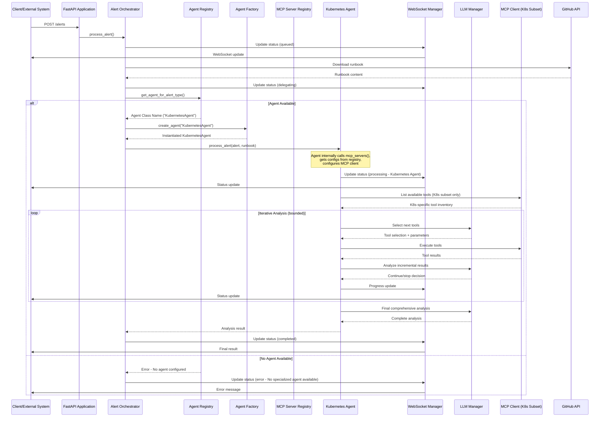

# EP-0002: Multi-Layer Agent Architecture - Design Document

**Status:** Approved  
**Created:** 2025-07-23  
**Phase:** Design Complete
**Requirements Document:** `docs/enhancements/approved/EP-0002-multi-layer-agent-requirements.md`
**Next Phase:** Implementation

---

## Design Overview

The multi-layer agent architecture transforms the current monolithic AlertService into a distributed, extensible system with clear separation of concerns. The design introduces an orchestrator layer that delegates alert processing to specialized agent classes that inherit from a common BaseAgent, with each agent defining its own MCP server requirements and custom instructions.

### Architecture Summary

The new architecture consists of four main layers:
1. **Orchestrator Layer**: Receives alerts, downloads runbooks, and delegates to appropriate agent classes
2. **Agent Registry Layer**: Maintains configurable mappings between alert types and specialized agent classes
3. **Specialized Agent Layer**: Inheritance-based agent classes that extend BaseAgent with specific configurations
4. **MCP Server Registry Layer**: Global registry of MCP servers with embedded instructions, reused across agents

### Key Design Principles

- **Inheritance-Based Design**: Common logic in BaseAgent, specialization through inheritance
- **Configuration Through Code**: Agents define MCP servers and instructions via abstract methods
- **Reusable MCP Registry**: Global MCP server registry with embedded instructions for reuse
- **Extensibility**: Easy addition of new agents through simple class creation
- **Backward Compatibility**: Existing API contracts remain unchanged
- **Performance**: Minimal overhead with focused tool sets for better LLM decision-making

### MCP Registry Role in Instruction Management

**Central Instruction Authority**: The MCPServerRegistry serves as the single source of truth for all MCP server configurations and their associated LLM instructions. This eliminates instruction duplication and ensures consistency across agents.

**Instruction Composition Pattern**: Agents compose their final LLM instructions from three distinct sources in a hierarchical manner:

1. **General Instructions** (BaseAgent level): Universal SRE guidance applicable to all agents
2. **MCP Server Instructions** (Registry level): Server-specific operational guidance stored in the global registry  
3. **Custom Instructions** (Agent level): Optional agent-specific guidance for specialized behavior

**Agent MCP Server Assignment**: Each agent declares its required MCP servers through the abstract `mcp_servers()` method. The agent retrieves the corresponding configurations (including embedded instructions) from the registry and uses only that subset of servers, preventing tool confusion.

**Initial Implementation Example**:
- **KubernetesAgent**: Uses only `["kubernetes-server"]` from the registry
- **Future ArgoCDAgent**: Would use only `["argocd-server"]` from the registry
- **Future Hybrid Agent**: Could use `["kubernetes-server", "aws-server"]` from the registry

This design ensures that each agent receives focused, relevant instructions while maintaining centralized instruction management through the registry.

### Design Goals

- Enable specialized expertise through inheritance-based agent classes
- Prevent LLM tool selection confusion by providing focused, agent-specific tool subsets
- Simplify addition of new agents to simple class creation with method overrides
- Maintain consistent processing patterns through shared BaseAgent implementation
- Provide clear error handling when no specialized agent is available
- Enable flexible agent customization through method overriding capabilities

## System Architecture

### High-Level Architecture

```
┌─────────────────────────────────────────────────────────────┐
│                      Tarsy - Multi-Layer                    │
│                                                             │
│  ┌─────────────────────────────────────────────────────┐    │
│  │                 API Layer                           │    │
│  │  ┌─────────────────┐    ┌─────────────────┐         │    │
│  │  │   FastAPI       │    │   WebSocket     │         │    │
│  │  │   Application   │    │   Manager       │         │    │
│  │  └─────────────────┘    └─────────────────┘         │    │
│  └─────────────────────────────────────────────────────┘    │
│                                                             │
│  ┌─────────────────────────────────────────────────────┐    │
│  │              Orchestrator Layer                     │    │
│  │  ┌─────────────────┐    ┌─────────────────┐         │    │
│  │  │   Alert         │    │   Agent         │         │    │
│  │  │   Orchestrator  │    │   Registry      │         │    │
│  │  └─────────────────┘    └─────────────────┘         │    │
│  └─────────────────────────────────────────────────────┘    │
│                                                             │
│  ┌────────────────────────────────────────────────────────┐ │
│  │              Specialized Agent Layer                   │ │
│  │  ┌─────────────────┐                                   │ │
│  │  │   BaseAgent     │                                   │ │
│  │  │   (Common       │                                   │ │
│  │  │   Logic)        │                                   │ │
│  │  └─────────────────┘                                   │ │
│  │           │                                            │ │
│  │           |──────────────────────────────────┐         │ │
│  │           |                │                 |         | │
│  │┌─────────────────┐ ┌───────────────┐ ┌────────────────┐| │
│  ││   Kubernetes    │ │   ArgoCD      │ │   K8s+AWS      │| │
│  ││ Agent (Phase 1) │ │ Agent (Future)│ │ Agent (Future) || |
│  ││   (Inherits)    │ │  (Inherits)   │ │   (Inherits)   │| │
│  │└─────────────────┘ └───────────────┘ └────────────────┘| │
│  └────────────────────────────────────────────────────────┘ │
│                                                             │
│  ┌─────────────────────────────────────────────────────┐    │
│  │           MCP Server Registry Layer                 │    │
│  │  ┌─────────────────┐    ┌─────────────────┐         │    │
│  │  │   Global MCP    │    │   Server Config │         │    │
│  │  │   Server        │    │   with Embedded │         │    │
│  │  │   Registry      │    │   Instructions  │         │    │
│  │  └─────────────────┘    └─────────────────┘         │    │
│  └─────────────────────────────────────────────────────┘    │
│                                                             │
│  ┌─────────────────────────────────────────────────────┐    │
│  │              Integration Layer                      │    │
│  │  ┌─────────────────┐    ┌─────────────────┐         │    │
│  │  │   LLM           │    │   MCP Server    │         │    │
│  │  │   Providers     │    │   Ecosystem     │         │    │
│  │  └─────────────────┘    └─────────────────┘         │    │
│  └─────────────────────────────────────────────────────┘    │
└─────────────────────────────────────────────────────────────┘
```

### Component Architecture

#### New Components

- **AlertOrchestrator**: Main orchestration service that receives alerts, downloads runbooks, and delegates to appropriate agent classes (REQ-2.1)
- **AgentRegistry**: Simple static map that maintains pre-defined mappings between alert types and specialized agent classes, loaded once at startup (REQ-2.2)
- **BaseAgent**: Abstract base class containing common processing logic for all agents, with abstract methods for customization
- **KubernetesAgent**: Specialized agent class inheriting from BaseAgent for Kubernetes-related alerts (initial implementation) (REQ-2.3)
- **MCPServerRegistry**: Simple static map of all available MCP servers with embedded instructions, loaded once at startup (REQ-2.6)
- **AgentFactory**: Factory for resolving agent class names to instantiated classes with dependency injection

#### Modified Components

- **AlertService**: Refactored to become the AlertOrchestrator, removing direct LLM analysis logic
- **FastAPI Application**: Updated to use the new AlertOrchestrator with agent class instantiation
- **Configuration System**: Extended to support agent registry configuration mapping alert types to agent classes (REQ-2.15)
- **ProcessingStatus**: Enhanced to include current processing agent information (REQ-2.9)
- **MCPClient**: Updated to work with agent-specific MCP server selections provided by agent classes (REQ-2.13)

#### Component Interactions

The new architecture follows a clear delegation pattern with inheritance-based specialization:
1. API Layer receives alerts and delegates to AlertOrchestrator
2. AlertOrchestrator downloads runbooks and consults AgentRegistry
3. AgentRegistry returns first available agent class for the alert type or returns error if none available (REQ-2.24)
4. AgentFactory resolves agent class name to actual class and instantiates with dependency injection:
   - LLM client for processing
   - MCP client for tool interactions  
   - Progress callback for status updates
   - MCP server registry for configuration lookup
5. AlertOrchestrator delegates processing to agent via process_alert(alert, runbook)
6. **Agent Instruction Composition (NEW DETAIL)**:
   - Agent calls its mcp_servers() method to get required MCP server IDs (e.g., ["kubernetes-server"])
   - Agent retrieves server configs from injected MCP server registry
   - Agent extracts instructions from each assigned MCP server config
   - Agent calls custom_instructions() for any additional agent-specific guidance
   - **Agent composes final LLM instructions by combining:**
     * **General instructions** (from BaseAgent): "You are an expert SRE agent..."
     * **MCP server instructions** (from each assigned server): "For Kubernetes operations: be careful with cluster-scoped listings..."
     * **Custom instructions** (from agent's custom_instructions()): Optional agent-specific guidance
   - Agent configures MCP client with ONLY its assigned server subset
7. BaseAgent performs iterative LLM analysis using the composed instructions and only the agent's specified MCP servers (REQ-2.8, REQ-2.13)
8. Agents report progress through AlertOrchestrator to WebSocket Manager (REQ-2.14)
9. Results flow back through the orchestration chain with agent-specific details (REQ-2.10)

### Data Flow Design

#### Data Flow Diagrams



#### Data Processing Steps

1. **Alert Reception**: API layer receives alert and validates basic structure
2. **Orchestration**: AlertOrchestrator takes control of processing workflow
3. **Runbook Download**: Orchestrator downloads runbook from GitHub
4. **Agent Selection**: AgentRegistry determines appropriate agent for alert type
5. **Agent Delegation**: Orchestrator delegates processing to selected agent
6. **Specialized Processing**: Agent performs domain-specific analysis using LLM and MCP tools
7. **Result Aggregation**: Results flow back through orchestration chain

## Data Design

### Data Models

#### New Data Models

```python
# Simple static registries - loaded once at startup, no runtime changes
AgentRegistry:
  - static_mappings: Dict[str, str]  # alert_type -> agent_class_name (e.g., "NamespaceTerminating" -> "KubernetesAgent")
  - get_agent_for_alert_type(alert_type: str) -> Optional[str]  # Simple dictionary lookup

MCPServerConfig:
  - server_id: str
  - server_type: str (e.g., "kubernetes", "argocd", "aws")
  - enabled: bool
  - connection_params: Dict[str, Any]
  - instructions: str (embedded LLM instructions specific to this MCP server)

MCPServerRegistry:
  - static_servers: Dict[str, MCPServerConfig]  # server_id -> MCPServerConfig (e.g., "kubernetes-server" -> config)
  - get_server_configs(server_ids: List[str]) -> List[MCPServerConfig]  # Simple dictionary lookup

BaseAgent (Abstract Class):
  - Abstract method: mcp_servers() -> List[str]  # Returns MCP server IDs from static registry
  - Abstract method: custom_instructions() -> str  # Returns agent-specific instructions
  - Common method: process_alert(alert, runbook, callback) -> str  # Standard processing logic

AgentFactory:
  - static_agent_classes: Dict[str, Type[BaseAgent]]  # agent_class_name -> actual Python class
  - Resolves agent class names to instantiated classes with dependency injection
  - Injects common dependencies (LLM client, MCP client, progress callback, MCP registry)
  - Returns fully configured agent instances ready for processing

AgentProcessingContext:
  - alert: Alert
  - runbook_content: str
  - agent_instance: BaseAgent
  - selected_mcp_servers: List[MCPServerConfig]  # Retrieved from static registry
  - combined_instructions: str  # General + MCP + Custom instructions
  - progress_callback: Optional[Callable]
```

#### Modified Data Models

```python
ProcessingStatus:
  - alert_id: str
  - status: str (extended with "delegating" state)
  - progress: int
  - current_step: str
  - current_agent: Optional[str] (NEW - which agent is processing) (REQ-2.9)
  - assigned_mcp_servers: List[str] (NEW - MCP servers assigned to current agent)
  - result: Optional[str]
  - error: Optional[str]
  - timestamp: datetime
```

### Database Design

#### Schema Changes

No database schema changes required in Phase 1. All configuration is maintained in the application configuration file.

#### Migration Strategy

No data migration required as this is a refactoring of existing functionality.

## API Design

### New API Endpoints

No new API endpoints are required for Phase 1. The existing API surface remains unchanged to maintain backward compatibility.

### Modified API Endpoints

#### Endpoint: GET /processing-status/{alert_id}
- **Current Behavior**: Returns basic processing status
- **New Behavior**: Includes current processing agent information
- **Breaking Changes**: None (additive only)
- **Migration Path**: Clients can ignore new fields

### API Integration Points

No changes to external API integration points. The multi-layer architecture is internal to the application.

## User Interface Design

### UI Components

#### Modified UI Components

- **ProcessingStatus Component**: Updated to display current processing agent information
- **ResultDisplay Component**: Enhanced to show agent-specific processing details in iteration history

### User Experience Flow

The user experience remains unchanged:
1. User submits alert via web interface
2. System shows processing progress (now with agent information)
3. User receives comprehensive analysis results
4. Agent-specific details are included in the iteration summary

#### User Interface Mockups

No significant UI changes required. The existing interface will show additional context about which agent is processing the alert.

## Security Design

### Security Architecture

No changes to the security architecture. The multi-layer design maintains the same security boundaries and authentication mechanisms.

### Authentication & Authorization

No changes to authentication or authorization. Agent delegation is an internal architectural decision.

### Data Protection

No changes to data protection mechanisms. The same security controls apply to all agents.

### Security Controls

- Agent registry configuration is protected through the same environment variable mechanism
- Agent-specific configurations follow the same security patterns as existing component configurations
- No additional attack surface introduced by the multi-layer architecture

## Performance Design

### Performance Requirements

The multi-layer architecture should introduce minimal overhead:
- Agent selection should add < 1ms to processing time
- Orchestration delegation should add < 5ms to processing time
- Overall processing time should remain within 5% of current performance

### Performance Architecture

- **Lazy Loading**: Agents are instantiated only when needed
- **Caching**: Agent registry maintains cached mappings for rapid lookup
- **Efficient Delegation**: Minimal data copying between orchestrator and agents

### Scalability Design

The multi-layer architecture improves scalability by:
- Enabling agent-specific optimizations
- Allowing independent scaling of different agent types
- Reducing coupling between alert processing logic

### Performance Optimizations

- Agent registry uses hash-based lookup for O(1) agent selection
- Shared resource pools (LLM clients, MCP connections) across agents
- Efficient context passing to minimize memory overhead

## Error Handling & Resilience

### Error Handling Strategy

The multi-layer architecture enhances error handling by:
- **Isolation**: Failures in one agent don't affect others
- **Fallback**: Orchestrator can attempt alternate agents if configured
- **Clarity**: Error messages clearly indicate which layer failed

### Failure Modes

- **Agent Registry Failure**: 
  - **Impact**: Cannot determine appropriate agent for alert type
  - **Detection**: Registry returns null or throws exception
  - **Recovery**: Return clear error message to user (REQ-2.24)

- **No Agent Available**:
  - **Impact**: No specialized agent configured for alert type
  - **Detection**: Agent registry returns empty result for alert type
  - **Recovery**: Return clear error message indicating no agent is available for the specific alert type (REQ-2.24)

- **Agent Initialization Failure**:
  - **Impact**: Specific agent type unavailable
  - **Detection**: Agent factory throws exception during creation
  - **Recovery**: Log error and return clear error message about agent initialization failure (REQ-2.28)

- **Agent Processing Failure**:
  - **Impact**: Alert processing fails for specific agent
  - **Detection**: Agent throws exception during process_alert()
  - **Recovery**: Log detailed error and return agent-specific error message (REQ-2.28)

- **MCP Server Subset Failure**:
  - **Impact**: Agent cannot access assigned MCP servers
  - **Detection**: MCP connection failures for agent-specific servers
  - **Recovery**: Only affects the specific agent, other agents continue working (REQ-2.25, REQ-2.22)

## Configuration & Deployment

### Configuration Changes

#### New Configuration Options

- **agent_registry**: Simple static map for alert type to agent class mappings (REQ-2.2)  
- **mcp_server_registry**: Single source of truth for ALL MCP server configurations with embedded instructions - REPLACES existing mcp_servers (REQ-2.6)

#### Configuration Consolidation

- **mcp_servers**: REMOVED - all MCP server configuration now managed exclusively through mcp_server_registry
- **supported_alerts**: Extended to include agent mappings  
- **max_llm_mcp_iterations**: Can be overridden per agent type

#### Configuration Simplification

The new design eliminates configuration duplication by having MCP Server Registry as the ONLY source for MCP server configurations. The existing `mcp_servers` field in settings.py will be replaced entirely by `mcp_server_registry`.

#### Example Configuration

```yaml
# Simple static Agent Registry - loaded once at startup, maps alert types to agent classes
agent_registry:
  "NamespaceTerminating": "KubernetesAgent"
  "ArgoCD Sync Failed": "ArgoCDAgent"
  "EKS Node Group Issues": "KubernetesAWSAgent"

# Simple static MCP Server Registry - REPLACES existing mcp_servers in settings.py
# This is the ONLY source of truth for MCP server configurations
mcp_server_registry:
  kubernetes-server:
    server_id: "kubernetes-server"
    server_type: "kubernetes"
    enabled: true
    connection_params:
      command: "npx"
      args: ["-y", "kubernetes-mcp-server@latest"]
    instructions: |
      For Kubernetes operations:
      - Be careful with cluster-scoped resource listings in large clusters
      - Focus on namespace-specific resources first (kubectl get pods -n <namespace>)
      - Use kubectl describe before kubectl get for detailed information
      - Check pod logs only when necessary (they can be large)
      - Consider resource quotas and limits when analyzing issues
      
  argocd-server:
    server_id: "argocd-server"
    server_type: "argocd"
    enabled: true
    connection_params:
      command: "npx"
      args: ["-y", "argocd-mcp-server@latest"]
    instructions: |
      For ArgoCD operations:
      - Check application sync status and health first
      - Look at sync operations and their results
      - Consider GitOps workflow and source repository state
      - Pay attention to resource hooks and sync waves
      - Check for drift between desired and actual state
      
  aws-server:
    server_id: "aws-server"
    server_type: "aws"
    enabled: true
    connection_params:
      command: "npx"
      args: ["-y", "aws-mcp-server@latest"]
    instructions: |
      For AWS operations:
      - Check IAM permissions when resources are inaccessible
      - Consider regional and availability zone issues
      - Look at CloudWatch metrics for resource utilization
      - Check security groups and NACLs for network issues

# Agent classes define their MCP server requirements in code (simple lookups):
# - KubernetesAgent.mcp_servers() returns ["kubernetes-server"] -> looks up in static registry
# - ArgoCDAgent.mcp_servers() returns ["argocd-server"] -> looks up in static registry
# - KubernetesAWSAgent.mcp_servers() returns ["kubernetes-server", "aws-server"] -> looks up in static registry
```

#### Implementation Example

```python
# Simple static registries implementation
class AgentRegistry:
    def __init__(self, config: Dict[str, str]):
        """Initialize with static alert_type -> agent_class_name mappings"""
        self.static_mappings = config  # No runtime changes, just a dictionary
    
    def get_agent_for_alert_type(self, alert_type: str) -> Optional[str]:
        """Simple dictionary lookup - no complex logic"""
        return self.static_mappings.get(alert_type)

class MCPServerRegistry:
    def __init__(self, config: Dict[str, Dict]):
        """Initialize with static server configurations"""
        self.static_servers = {}  # No runtime changes, just a dictionary
        for server_id, server_config in config.items():
            self.static_servers[server_id] = MCPServerConfig(**server_config)
    
    def get_server_configs(self, server_ids: List[str]) -> List[MCPServerConfig]:
        """Simple dictionary lookup for multiple servers"""
        return [self.static_servers[server_id] for server_id in server_ids 
                if server_id in self.static_servers]

class AgentFactory:
    def __init__(self, llm_client: LLMClient, mcp_client: MCPClient, 
                 progress_callback: Callable, mcp_registry: MCPServerRegistry):
        self.llm_client = llm_client
        self.mcp_client = mcp_client
        self.progress_callback = progress_callback
        self.mcp_registry = mcp_registry
        
        # Static registry of available agent classes - loaded once, no runtime changes
        self.static_agent_classes = {
            "KubernetesAgent": KubernetesAgent,
            "ArgoCDAgent": ArgoCDAgent,
            "KubernetesAWSAgent": KubernetesAWSAgent,
        }
    
    def create_agent(self, agent_class_name: str) -> BaseAgent:
        """Simple class resolution - no complex logic"""
        if agent_class_name not in self.static_agent_classes:
            raise ValueError(f"Unknown agent class: {agent_class_name}")
        
        agent_class = self.static_agent_classes[agent_class_name]
        return agent_class(
            llm_client=self.llm_client,
            mcp_client=self.mcp_client,
            progress_callback=self.progress_callback,
            mcp_registry=self.mcp_registry
        )

# Usage in AlertOrchestrator - simple lookups only
agent_class_name = agent_registry.get_agent_for_alert_type("NamespaceTerminating")
# Returns: "KubernetesAgent" (simple dict lookup)

agent = agent_factory.create_agent(agent_class_name)
# Returns: KubernetesAgent instance (simple class resolution)

result = agent.process_alert(alert, runbook_content)

# BaseAgent instruction composition example
class BaseAgent(ABC):
    def _compose_instructions(self) -> str:
        """Compose final instructions for LLM from multiple sources"""
        instructions = []
        
        # 1. General instructions (common to all agents)
        instructions.append(self._get_general_instructions())
        
        # 2. MCP server specific instructions (from assigned servers)
        mcp_server_ids = self.mcp_servers()  # Abstract method implemented by subclasses
        server_configs = self.mcp_registry.get_server_configs(mcp_server_ids)
        for server_config in server_configs:
            if server_config.instructions:
                instructions.append(f"## {server_config.server_type.title()} Server Instructions")
                instructions.append(server_config.instructions)
        
        # 3. Custom instructions (agent-specific, optional)
        custom_instructions = self.custom_instructions()  # Abstract method
        if custom_instructions:
            instructions.append("## Agent-Specific Instructions") 
            instructions.append(custom_instructions)
            
        return "\n\n".join(instructions)
    
    def _get_general_instructions(self) -> str:
        """General instructions common to all SRE agents"""
        return """## General SRE Agent Instructions
        
You are an expert Site Reliability Engineer (SRE) with deep knowledge of:
- Kubernetes and container orchestration
- Cloud infrastructure and services  
- Incident response and troubleshooting
- System monitoring and alerting
- GitOps and deployment practices

Analyze alerts thoroughly and provide actionable insights based on:
1. Alert information and context
2. Associated runbook procedures  
3. Real-time system data from available tools

Always be specific, reference actual data, and provide clear next steps."""

# KubernetesAgent implementation example
class KubernetesAgent(BaseAgent):
    def mcp_servers(self) -> List[str]:
        """Return required MCP server IDs for Kubernetes operations"""
        return ["kubernetes-server"]
    
    def custom_instructions(self) -> str:
        """Return any additional Kubernetes-specific instructions"""
        return ""  # No custom instructions for initial implementation
    
    # The final composed instructions would be:
    # 1. General SRE instructions (from BaseAgent)  
    # 2. Kubernetes server instructions (from MCP registry):
    #    "For Kubernetes operations: be careful with cluster-scoped listings..."
    # 3. No custom instructions (empty string)

# Future example: Advanced Kubernetes Agent with custom instructions
class AdvancedKubernetesAgent(BaseAgent):
    def mcp_servers(self) -> List[str]:
        return ["kubernetes-server"]
    
    def custom_instructions(self) -> str:
        return """## Advanced Kubernetes Analysis Instructions
        
When analyzing Kubernetes issues:
- Always check for resource quotas and limits first
- Consider node capacity and scheduling constraints  
- Look for anti-affinity rules that might affect pod placement
- Check for disruption budgets that might block operations
- Consider cluster autoscaling behavior and node lifecycle"""
```

## Testing Strategy

### Unit Testing

#### Test Coverage Areas

- **AgentRegistry**: Lookup logic, edge cases, agent class name resolution
- **AgentFactory**: Class resolution, dependency injection, error handling for unknown classes
- **BaseAgent**: Abstract method enforcement, common processing logic, instruction composition
- **Individual Agent Classes**: mcp_servers() and custom_instructions() method implementations
- **AlertOrchestrator**: Delegation logic, error handling, progress callback integration
- **MCPServerRegistry**: Configuration lookup, server config validation, instruction retrieval
- **Error Handling**: Unknown alert types, missing agent classes, agent processing failures
- **Configuration**: Agent registry validation, MCP server registry validation

#### Mock Dependencies

```python
# Unit test mocks
class MockLLMClient:
    def process_with_tools(self, instructions, tools): 
        return "Mock analysis result"

class MockMCPClient:
    def list_tools(self): 
        return ["kubectl", "helm"]
    def call_tool(self, tool, args): 
        return "Mock tool output"

class MockGitHubClient:
    def download_runbook(self, alert_type): 
        return "# Mock runbook content"

class MockProgressCallback:
    def __call__(self, status): 
        self.last_status = status
```

### Integration Testing

#### Integration Test Scenarios

- **Complete Alert Processing Flow**: Alert → Orchestrator → AgentFactory → Agent → Result
- **Agent Class Inheritance**: BaseAgent common logic + specialized agent customization  
- **MCP Server Integration**: Agent requests specific servers, processes with correct tools
- **Instruction Composition**: Verify final instructions include general + MCP + custom components
- **Error Propagation**: Failures at different layers bubble up with appropriate error messages
- **Progress Updates**: WebSocket callbacks triggered at correct processing stages
- **Multi-Agent Scenarios**: Different alert types routed to different agent classes
- **Agent Isolation**: One agent failure doesn't affect other agent processing

#### Mock Service Strategy

```python
@pytest.fixture
def integration_test_services():
    """Provides fully mocked external services for integration tests"""
    return {
        'github_client': MockGitHubClient(),
        'llm_client': MockLLMClient(), 
        'mcp_client': MockMCPClient(),
        'progress_callback': MockProgressCallback(),
        'websocket_manager': MockWebSocketManager()
    }

@pytest.mark.integration 
async def test_kubernetes_alert_full_flow(integration_test_services):
    """Test complete flow: Alert → KubernetesAgent → Result"""
    # Configure mocks for success scenario
    services = integration_test_services
    services['llm_client'].set_response("Namespace finalizers removed")
    
    # Setup real components under test
    orchestrator = AlertOrchestrator(services)
    
    # Process alert
    alert = Alert(type="NamespaceTerminating")
    result = await orchestrator.process_alert(alert)
    
    # Verify flow
    assert result.status == "completed"
    assert result.agent_used == "KubernetesAgent"
    assert services['progress_callback'].was_called()

@pytest.mark.integration
async def test_unknown_alert_error_handling(integration_test_services):
    """Test error handling for unknown alert types"""
    orchestrator = AlertOrchestrator(integration_test_services)
    
    alert = Alert(type="Unknown Alert Type")
    result = await orchestrator.process_alert(alert)
    
    assert result.status == "error"
    assert "No specialized agent available" in result.error_message

@pytest.mark.integration
async def test_instruction_composition(integration_test_services):
    """Test that agents compose instructions from multiple sources"""
    kubernetes_agent = KubernetesAgent(
        llm_client=services['llm_client'],
        mcp_client=services['mcp_client'], 
        progress_callback=services['progress_callback'],
        mcp_registry=MockMCPServerRegistry()
    )
    
    instructions = kubernetes_agent._compose_instructions()
    
    # Verify instruction composition
    assert "General SRE Agent Instructions" in instructions
    assert "Kubernetes Server Instructions" in instructions
    assert "For Kubernetes operations:" in instructions
    # Custom instructions should be empty for KubernetesAgent initially
    assert "Agent-Specific Instructions" not in instructions
```

### Test Structure

```
tests/
├── unit/
│   ├── test_agent_registry.py       # AgentRegistry logic
│   ├── test_agent_factory.py        # AgentFactory class resolution
│   ├── test_base_agent.py          # BaseAgent common logic
│   ├── test_kubernetes_agent.py    # KubernetesAgent specifics
│   ├── test_alert_orchestrator.py  # Orchestrator delegation
│   ├── test_mcp_server_registry.py # MCP server configuration
│   └── test_instruction_composition.py # Instruction composition logic
├── integration/
│   ├── test_alert_processing_flow.py    # Complete alert flows
│   ├── test_agent_inheritance.py        # BaseAgent + specialized agents
│   ├── test_error_handling.py          # Error propagation scenarios
│   ├── test_mcp_server_integration.py  # Agent MCP server selection
│   ├── test_instruction_flow.py        # End-to-end instruction composition
│   └── test_multi_agent_scenarios.py   # Multiple agents processing
├── e2e/
└── fixtures/
    ├── mock_services.py            # Mock external services
    ├── test_configs.py             # Test configurations
    └── sample_data.py              # Test alerts and runbooks
```

### Testing Benefits

- **Fast Execution**: All tests use mocks, no external service delays
- **Predictable Results**: Same outcomes every run, no flaky tests
- **Comprehensive Coverage**: Can test all error scenarios and edge cases
- **Easy CI/CD**: No external dependencies, runs in any environment
- **Developer Friendly**: Quick feedback loop, runs locally without setup

### Logging Strategy

Enhanced logging includes:
- Agent selection decisions and rationale
- Agent delegation events and context
- Agent-specific processing steps and results
- MCP server subset assignments and initialization (REQ-2.7, REQ-2.8)
- Instruction composition details (general + MCP + custom components)
- Clear error messages when no agent is available (REQ-2.24)
- Agent-specific error details and component failures (REQ-2.28)

## Migration & Backward Compatibility

### Migration Strategy

The migration follows a phased approach:
1. **Phase 1**: Deploy new architecture with single Kubernetes agent
2. **Phase 2**: Migrate existing functionality to agent-based model
3. **Phase 3**: Add new agents and alert types

### Backward Compatibility

Full backward compatibility maintained for external interfaces:
- All existing API endpoints unchanged
- Same alert processing behavior for existing alert types

### Configuration Migration Required

**Critical**: The existing `mcp_servers` configuration in settings.py will be replaced entirely by `mcp_server_registry` to eliminate duplication and establish single source of truth.

### Migration Steps

1. Deploy new multi-layer architecture code
2. **Migrate existing MCP server configuration**: Move `mcp_servers` configuration from settings.py to new `mcp_server_registry` format with embedded instructions
3. **Remove duplicate configuration**: Delete the existing `mcp_servers` field and `get_mcp_config()` method from settings.py  
4. Configure agent registry with "NamespaceTerminating" → KubernetesAgent (REQ-2.2)
5. Verify KubernetesAgent uses kubernetes-server from MCP Server Registry (no duplication)
6. Verify processing behavior matches existing system with single source of truth for MCP servers
7. Test error handling for unsupported alert types (REQ-2.24)
8. Add new agents with their specific MCP server subsets from the unified registry as needed

**Important**: After migration, MCP Server Registry will be the ONLY source for MCP server configurations. No other configuration should define MCP servers.

## Alternative Designs Considered

### Alternative 1: Plugin-Based Architecture
- **Description**: Use dynamic plugin loading for agents
- **Pros**: Maximum flexibility, runtime agent loading
- **Cons**: Increased complexity, security concerns with dynamic loading
- **Decision**: Rejected in favor of simpler compile-time agent registry

### Alternative 2: Microservices Architecture
- **Description**: Split each agent into separate microservices
- **Pros**: Independent scaling, technology diversity
- **Cons**: Increased operational complexity, network latency
- **Decision**: Rejected for Phase 1, may be considered for future phases

### Alternative 3: Rule-Based Agent Selection
- **Description**: Use complex rule engine for agent selection
- **Pros**: Sophisticated matching logic, flexible conditions
- **Cons**: Configuration complexity, performance overhead
- **Decision**: Rejected in favor of simple mapping for initial implementation

### Alternative 4: Configuration-Based Agents
- **Description**: Define agents purely through configuration files without inheritance
- **Pros**: No code changes needed to add agents, pure configuration approach
- **Cons**: Limited customization, complex configuration format, harder to add specialized logic
- **Decision**: Rejected in favor of inheritance-based approach for flexibility

### Alternative 5: Multi-Agent Processing
- **Description**: Allow multiple agents to process the same alert type simultaneously and synthesize results
- **Pros**: Comprehensive analysis from multiple perspectives, better coverage
- **Cons**: Increased complexity, result synthesis challenges, performance overhead
- **Decision**: Deferred to future enhancement; current implementation uses first-match selection

## Implementation Considerations

### Technical Debt

The refactoring addresses existing technical debt:
- Removes monolithic AlertService responsibilities
- Improves testability through separation of concerns and inheritance patterns
- Enables future optimizations at agent class level
- Simplifies agent selection using first-match approach for initial implementation
- Eliminates code duplication through BaseAgent shared implementation
- Provides clean extensibility through inheritance-based specialization

### Dependencies

- Python abc module for abstract base classes and inheritance patterns
- Enhanced configuration validation for agent class mappings
- Existing LLM and MCP integrations remain unchanged (reused by BaseAgent)
- Agent class registration and instantiation mechanism

### Constraints

- Must support future extension without architectural changes

## Documentation Requirements

### Code Documentation

- BaseAgent abstract class with clear interface documentation and inheritance patterns
- Agent registry configuration format mapping alert types to agent classes
- Agent class implementation patterns and best practices
- MCP server registry configuration with embedded instructions (REQ-2.6)
- Agent class MCP server selection patterns (REQ-2.7, REQ-2.8)

### API Documentation

- Updated API documentation to reflect new processing status fields including current agent class (REQ-2.9)
- Agent class-specific error codes and messages (REQ-2.24, REQ-2.28)
- Configuration reference for agent registry and MCP server registry (REQ-2.15)

### Architecture Documentation

- Updated /docs/design documentation

---

## Design Review Checklist

### Architecture Review
- [x] Architecture is sound and scalable
- [x] Components are well-defined and have clear responsibilities
- [x] Data flow is logical and efficient
- [x] Integration points are well-defined
- [x] Security considerations are addressed

### Implementation Review
- [x] Design is implementable with current technology stack
- [x] Performance requirements can be met
- [x] Error handling is comprehensive
- [x] Testing strategy is adequate
- [x] Monitoring and observability are addressed

### Requirements Traceability
- [x] All requirements from requirements doc are addressed
- [x] Design decisions are justified
- [x] Constraints and assumptions are validated
- [x] Success criteria can be met with this design

---

## Next Steps

After design approval:
1. Create Implementation Plan: `docs/enhancements/pending/EP-0002-implementation.md`
2. Reference this design document in the implementation phase
3. Ensure implementation plan addresses all design elements

**AI Prompt for Next Phase:**
```
Create an implementation plan using the template at docs/templates/ep-implementation-template.md for EP-0002 based on the approved design in this document and the requirements in EP-0002-multi-layer-agent-requirements.md.
``` 