# EP-0025: PostgreSQL LISTEN/NOTIFY Eventing System

**Status:** ✅ IMPLEMENTED

**Implementation Date:** October 2025

**Key Change:** Original design specified Server-Sent Events (SSE) for dashboard communication. During implementation, SSE reliability issues were discovered in multi-tab scenarios. WebSocket was implemented instead, providing:
- Bidirectional communication (client can send subscription messages)
- Better connection management across multiple browser tabs
- Single connection per tab with channel-based subscriptions
- Robust reconnection and catchup mechanism

The core architecture (PostgreSQL LISTEN/NOTIFY, event persistence, cross-pod distribution) remains as designed. Only the dashboard transport layer differs from the original specification.

---

## Problem Statement

TARSy needs a cross-pod event distribution mechanism to support multi-replica Kubernetes deployments. Events must be reliably delivered to all backend pods for:
- Dashboard real-time updates (WebSocket)
- Session state synchronization
- Active session tracking
- System notifications

This EP provides the detailed design for implementing event distribution using PostgreSQL LISTEN/NOTIFY with SQLite polling fallback for development. Events are delivered to dashboard clients via WebSocket connections.

**Note:** SQLite polling is for development only. Production multi-replica deployments require PostgreSQL.

## Related Enhancements

- **EP-0024**: Multi-Replica Kubernetes Support - This eventing system solves 3 of 7 issues identified in EP-0024:
  - Issue #2: WebSocket Connection Management
  - Issue #5: Dashboard Message Buffering
  - Issue #6: Active Session Tracking

## Design

### End-to-End Flow with Multi-Replica Failover

This section demonstrates how the eventing system works in production with multi-replica deployments, including automatic failover and zero event loss.

#### Sequence Diagram: Event Flow with Replica Failover

```mermaid
sequenceDiagram
    participant Client as Dashboard Client
    participant R1 as Replica 1 (Pod 1)
    participant R2 as Replica 2 (Pod 2)
    participant R3 as Replica 3 (Pod 3)
    participant DB as PostgreSQL

    Note over Client,DB: Phase 1: Initial Connection
    Client->>R1: WebSocket Connect: /api/v1/ws
    R1-->>Client: WebSocket Connection Established
    Client->>R1: {"action":"subscribe","channel":"sessions"}
    R1->>DB: LISTEN sessions
    R2->>DB: LISTEN sessions
    R3->>DB: LISTEN sessions
    R1-->>Client: {"type":"subscription.confirmed","channel":"sessions"}
    
    Note over Client,DB: Phase 2: Normal Event Flow
    Note over R2: Alert processing starts
    R2->>DB: 1. INSERT INTO events (id=42)
    R2->>DB: 2. NOTIFY "sessions", {...}
    DB-->>R1: Notification received
    DB-->>R2: Notification received
    DB-->>R3: Notification received
    R1->>R1: dispatch_to_callbacks()<br/>broadcast_to_channel()
    R1-->>Client: {"type":"session.started","id":42,...}
    Note over Client: UI updates

    Note over Client,DB: Phase 3: Replica Failure
    Note over R1: 💥 Replica 1 crashes
    Note over Client: ⚠️ Connection lost detected
    
    Note over R2: Events continue (client disconnected)
    R2->>DB: Event 43: INSERT + NOTIFY
    R3->>DB: Event 44: INSERT + NOTIFY
    
    Note over Client,DB: Phase 4: Auto-Reconnection & Catchup
    Client->>R2: WebSocket Connect: /api/v1/ws
    R2-->>Client: WebSocket Connection Established
    Client->>R2: {"action":"subscribe","channel":"sessions"}
    Client->>R2: {"action":"catchup","channel":"sessions","last_event_id":42}
    R2->>DB: SELECT * FROM events<br/>WHERE channel='sessions' AND id>42
    DB-->>R2: Returns: [Event 43, Event 44]
    R2-->>Client: {"type":"...","id":43,...}
    R2-->>Client: {"type":"...","id":44,...}
    R2-->>Client: {"type":"subscription.confirmed","channel":"sessions"}
    
    Note over Client,DB: Phase 5: Resume Live Events
    R2->>DB: Event 45: INSERT + NOTIFY
    DB-->>R2: Notification received
    R2-->>Client: {"type":"...","id":45,...}
    Note over Client: ✅ All events received<br/>Zero event loss
```



#### Timeline: Replica Failover with Zero Event Loss

| Time | Event | Client State | Database State |
|------|-------|--------------|----------------|
| **10:00:00** | Client connects to Replica 1<br/>`WebSocket /api/v1/ws` | ✅ Connected<br/>WS → Replica 1<br/>Subscribed to "sessions" | Empty events table |
| **10:00:15** | Event 41 published<br/>(session.started) | ✅ Receives event 41<br/>`last_event_id=41` | `id=41` persisted<br/>NOTIFY → All pods |
| **10:00:30** | Event 42 published<br/>(llm.interaction) | ✅ Receives event 42<br/>`last_event_id=42` | `id=42` persisted<br/>NOTIFY → All pods |
| **10:00:45** | 💥 **Replica 1 crashes**<br/>(pod killed by k8s) | ⚠️ **Connection lost**<br/>Disconnected | Database intact<br/>Events 41-42 safe |
| **10:00:46** | Event 43 published<br/>(by Replica 2) | ❌ Not received<br/>Still disconnected | `id=43` persisted<br/>NOTIFY (no listeners) |
| **10:00:47** | Event 44 published<br/>(by Replica 3) | ❌ Not received<br/>Still disconnected | `id=44` persisted<br/>NOTIFY (no listeners) |
| **10:00:48** | **Browser auto-reconnects**<br/>`WebSocket /api/v1/ws` | 🔄 Reconnecting...<br/>Routes to Replica 2 | Query: `WHERE id>42` |
| **10:00:49** | **CATCHUP:** Sends events 43-44<br/>(from database) | ✅ Receives event 43<br/>✅ Receives event 44<br/>`last_event_id=44` | Returns: `[43, 44]`<br/>from database |
| **10:00:50** | WebSocket connection ready<br/>with Replica 2 | ✅ Connected<br/>WS → Replica 2<br/>Subscribed to "sessions" | Ready for live events |
| **10:01:00** | Event 45 published<br/>(stage.completed) | ✅ Receives event 45<br/>`last_event_id=45` | `id=45` persisted<br/>NOTIFY → All pods |
| **10:01:15** | Event 46 published<br/>(session.completed) | ✅ Receives event 46<br/>`last_event_id=46` | `id=46` persisted<br/>NOTIFY → All pods |
| **Result** | **Zero events lost**<br/>Seamless failover | ✅ All events received<br/>UI stays synchronized | All events stored<br/>Database consistent |

#### Key Observations

**Event Loss Prevention:**
- ✅ Events 43-44 published while client disconnected
- ✅ Events persisted to database immediately
- ✅ Catchup query retrieves missed events on reconnection
- ✅ Client receives ALL events in correct order: 41, 42, 43, 44, 45, 46

**Replica Independence:**
- ✅ Event 43 published by Replica 2 → Replica 3 receives via NOTIFY
- ✅ Event 44 published by Replica 3 → Replica 2 receives via NOTIFY
- ✅ Any replica can publish, all replicas broadcast to their clients

**Automatic Failover:**
- ✅ Browser detects disconnection (~1-2 seconds)
- ✅ Auto-reconnects with last known event ID
- ✅ Kubernetes routes to healthy replica
- ✅ No manual intervention required

**Database as Source of Truth:**
- ✅ All events persisted BEFORE broadcast
- ✅ Catchup always possible (events table = event log)
- ✅ Works even if ALL replicas crash (events safe in DB)

---

### Architecture Overview

```text
┌──────────────────────────────────────────────┐
│                    Kubernetes Cluster        │
│                                              │
│  ┌──────────────────┐  ┌──────────────────┐  │
│  │  Backend Pod 1   │  │  Backend Pod 2   │  │
│  │                  │  │                  │  │
│  │  ┌────────────┐  │  │  ┌────────────┐  │  │
│  │  │  Event     │  │  │  │  Event     │  │  │
│  │  │  Listener  │  │  │  │  Listener  │  │  │
│  │  │  (LISTEN)  │  │  │  │  (LISTEN)  │  │  │
│  │  └─────┬──────┘  │  │  └─────┬──────┘  │  │
│  │        │         │  │        │         │  │
│  │  ┌─────▼──────┐  │  │  ┌─────▼──────┐  │  │
│  │  │  Callback  │  │  │  │  Callback  │  │  │
│  │  │  Registry  │  │  │  │  Registry  │  │  │
│  │  └─────┬──────┘  │  │  └─────┬──────┘  │  │
│  │        │         │  │        │         │  │
│  │  ┌─────▼──────┐  │  │  ┌─────▼──────┐  │  │
│  │  │    SSE     │  │  │  │    SSE     │  │  │
│  │  │  Broadcast │  │  │  │  Broadcast │  │  │
│  │  └────────────┘  │  │  └────────────┘  │  │
│  └────────┬─────────┘  └────────┬─────────┘  │
│           │                     │            │
│           └──────────┬──────────┘            │
│                      │                       │
│             ┌────────▼────────┐              │
│             │    PostgreSQL   │              │
│             │(AWS RDS in prod)│              │
│             │                 │              │
│             │  NOTIFY →       │              │
│             │  events table   │              │
│             └─────────────────┘              │
└──────────────────────────────────────────────┘
```

### Event Flow

```text
1. Alert Processing:
   - Pod 2 processes alert
   - Writes event to events table (persistence)
   - Executes NOTIFY command (broadcast)

2. Event Distribution:
   - PostgreSQL broadcasts to ALL pods with LISTEN
   - Each pod receives notification payload
   - Pod 1, Pod 2, Pod 3 all get the event

3. Local Dispatch:
   - Each pod checks registered callbacks
   - Forwards event to SSE clients
   - Dashboard receives update in real-time

4. Catchup on Reconnection:
   - Dashboard client reconnects (sends last_event_id)
   - Server queries events table for missed events
   - Replays missed events to client via SSE
   - Client resumes real-time subscription
```

### Database Schema

The events table is defined using SQLModel following tarsy's ORM-first approach:

```python
# backend/tarsy/models/db_models.py

from datetime import datetime

from sqlmodel import Column, Field, SQLModel, Index
from sqlalchemy import JSON, BigInteger, DateTime, func


class Event(SQLModel, table=True):
    """
    Event persistence for cross-pod event distribution and catchup.
    
    Stores events for PostgreSQL LISTEN/NOTIFY system with SQLite polling fallback.
    Enables reliable event delivery across multiple backend pods and client reconnection
    with catchup support.
    """
    
    __tablename__ = "events"
    
    __table_args__ = (
        # Index for cleanup performance (time-based queries)
        Index('idx_events_created_at', 'created_at'),
        
        # Composite index for polling queries (SQLite dev mode)
        Index('idx_events_channel_id', 'channel', 'id'),
    )
    
    id: int = Field(
        default=None,
        sa_column=Column(BigInteger, primary_key=True, autoincrement=True),
        description="Auto-incrementing event ID for ordering and catchup"
    )
    
    channel: str = Field(
        max_length=100,
        index=True,
        description="Event channel (e.g., 'sessions', 'session:abc-123')"
    )
    
    payload: dict = Field(
        sa_column=Column(JSON),
        description="Event data as JSON (type, data, timestamp, id)"
    )
    
    created_at: datetime = Field(
        default=None,
        sa_column=Column(
            DateTime,
            nullable=False,
            server_default=func.now()
        ),
        description="Event creation timestamp (for cleanup and ordering)"
    )
```

**Design Notes:**
- Uses standard `TIMESTAMP`/`DateTime` (not tarsy's microsecond pattern) for simpler time-series cleanup
- Uses `JSON` column type (database-agnostic, adequate for event payloads at our scale)
- Auto-incrementing `id` provides ordering for catchup queries
- Indexes optimized for both cleanup (by time) and polling (by channel + id)

**Alignment with tarsy Patterns:**
- ✅ SQLModel ORM-first approach (defined as Python class, not raw SQL)
- ✅ Comprehensive type hints with Field descriptions
- ✅ Google-style docstrings
- ✅ Alembic migrations for schema management
- ✅ Database-agnostic design (PostgreSQL + SQLite)
- ✅ Model placed in `tarsy/models/db_models.py` with other tables
- ✅ Auto-discovered by Alembic via existing import patterns

### Event Channels

TARSy uses a **2-channel architecture** based on scope and granularity:

```python
# Channel naming convention
CHANNEL_SESSIONS = "sessions"                          # Global session lifecycle
CHANNEL_SESSION_DETAILS = "session:{session_id}"       # Per-session operations
```

**Channel 1: `sessions` (Global Session Lifecycle)**

Tracks lifecycle events for ALL sessions. Used by:
- Dashboard main page (session list)
- System monitoring tools
- CLI showing all active sessions

**Events:**
- `session.created` - New session initiated
- `session.started` - Processing began
- `session.completed` - Session finished successfully
- `session.failed` - Session encountered error

**Channel 2: `session:{session_id}` (Per-Session Details)**

Tracks detailed operations within a SPECIFIC session. Used by:
- Session detail page/timeline view
- CLI following specific session progress

**Events:**
- `llm.interaction` - LLM call during processing
- `mcp.tool_call` - MCP tool executed
- `mcp.tool_list` - MCP tools listed (available tools query)
- `stage.started` - Chain stage began
- `stage.completed` - Chain stage finished

**Design Rationale:**
- Clear separation: lifecycle (lightweight) vs operations (detailed)
- Bandwidth efficient: No duplicate broadcasting to multiple channels
- Consumers subscribe only to what they need
- Active session count derived by consumers from `sessions` events (no separate channel needed)

### Event Models (Pydantic)

TARSy uses **Pydantic models for type-safe event publishing**. Events are **notification triggers** that prompt dashboard clients to refresh via REST API, keeping payloads minimal.

**Design Philosophy:**
- ✅ **Type-safe at publish** - Pydantic validates event structure
- ✅ **Minimal payloads** - Events are notifications, not data transfers
- ✅ **Context IDs included** - `interaction_id`, `stage_id` for potential client-side optimization
- ✅ **Instant feedback fields** - `status` included for immediate UI updates
- ❌ **No large objects** - No `conversation`, `details`, or full data structures

```python
# backend/tarsy/models/event_models.py

"""
Event models for type-safe event publishing.

Events are lightweight notification triggers that inform clients about changes.
Clients use these events to determine when to refresh data via REST API.
"""

import time
from typing import Literal, Optional
from pydantic import BaseModel, Field


class BaseEvent(BaseModel):
    """Base class for all events with common fields."""
    
    type: str = Field(description="Event type identifier")
    timestamp_us: int = Field(
        default_factory=lambda: int(time.time() * 1_000_000),
        description="Event timestamp (microseconds since epoch UTC)"
    )


# ===== Global Session Lifecycle Events (channel: 'sessions') =====

class SessionCreatedEvent(BaseEvent):
    """Session created - new alert processing session initiated."""
    
    type: Literal["session.created"] = "session.created"
    session_id: str = Field(description="Session identifier")
    alert_type: str = Field(description="Type of alert being processed")


class SessionStartedEvent(BaseEvent):
    """Session started - processing began."""
    
    type: Literal["session.started"] = "session.started"
    session_id: str = Field(description="Session identifier")
    alert_type: str = Field(description="Type of alert being processed")


class SessionCompletedEvent(BaseEvent):
    """Session completed successfully."""
    
    type: Literal["session.completed"] = "session.completed"
    session_id: str = Field(description="Session identifier")
    status: Literal["completed"] = "completed"  # For instant client update


class SessionFailedEvent(BaseEvent):
    """Session failed with error."""
    
    type: Literal["session.failed"] = "session.failed"
    session_id: str = Field(description="Session identifier")
    status: Literal["failed"] = "failed"  # For instant client update


# ===== Per-Session Detail Events (channel: 'session:{session_id}') =====

class LLMInteractionEvent(BaseEvent):
    """LLM interaction occurred during processing."""
    
    type: Literal["llm.interaction"] = "llm.interaction"
    session_id: str = Field(description="Session identifier")
    interaction_id: str = Field(description="Interaction identifier for deduplication")
    stage_id: Optional[str] = Field(default=None, description="Stage execution identifier")


class MCPToolCallEvent(BaseEvent):
    """MCP tool was called during processing."""
    
    type: Literal["mcp.tool_call"] = "mcp.tool_call"
    session_id: str = Field(description="Session identifier")
    interaction_id: str = Field(description="Interaction identifier for deduplication")
    stage_id: Optional[str] = Field(default=None, description="Stage execution identifier")
    tool_name: str = Field(description="Name of MCP tool called")


class MCPToolListEvent(BaseEvent):
    """MCP tool list operation occurred (listing available tools)."""
    
    type: Literal["mcp.tool_list"] = "mcp.tool_list"
    session_id: str = Field(description="Session identifier")
    request_id: str = Field(description="Request identifier for deduplication")
    stage_id: Optional[str] = Field(default=None, description="Stage execution identifier")
    server_name: Optional[str] = Field(default=None, description="MCP server name queried")


class StageStartedEvent(BaseEvent):
    """Chain stage started execution."""
    
    type: Literal["stage.started"] = "stage.started"
    session_id: str = Field(description="Session identifier")
    stage_id: str = Field(description="Stage execution identifier")
    stage_name: str = Field(description="Human-readable stage name")


class StageCompletedEvent(BaseEvent):
    """Chain stage completed execution."""
    
    type: Literal["stage.completed"] = "stage.completed"
    session_id: str = Field(description="Session identifier")
    stage_id: str = Field(description="Stage execution identifier")
    stage_name: str = Field(description="Human-readable stage name")
    status: str = Field(description="Stage status (completed/failed)")
```

**Usage Example:**

```python
from tarsy.models.event_models import SessionStartedEvent, LLMInteractionEvent
from tarsy.services.events.publisher import publish_event

# Type-safe event creation and publishing
event = SessionStartedEvent(
    session_id="abc-123",
    alert_type="security_incident"
)

await publish_event(db_session, EventChannel.SESSIONS, event)
```

### Core Components

#### 1. EventListener Interface

```python
# backend/tarsy/services/events/base.py

from abc import ABC, abstractmethod
from typing import Callable, Dict, List

class EventListener(ABC):
    """Abstract base class for event listener implementations"""
    
    def __init__(self):
        self.callbacks: Dict[str, List[Callable]] = {}
        self.running: bool = False
    
    @abstractmethod
    async def start(self) -> None:
        """Initialize and start the event listener"""
        pass
    
    @abstractmethod
    async def stop(self) -> None:
        """Stop the event listener and clean up resources"""
        pass
    
    async def subscribe(self, channel: str, callback: Callable[[dict], None]) -> None:
        """
        Subscribe to events on a channel.
        
        Args:
            channel: Channel name (e.g., 'session_events')
            callback: Async function called when event received
        """
        if channel not in self.callbacks:
            self.callbacks[channel] = []
            await self._register_channel(channel)
        
        self.callbacks[channel].append(callback)
    
    async def unsubscribe(self, channel: str, callback: Callable[[dict], None]) -> None:
        """
        Unsubscribe callback from a channel.
        
        Args:
            channel: Channel name
            callback: Callback function to remove
        """
        if channel in self.callbacks and callback in self.callbacks[channel]:
            self.callbacks[channel].remove(callback)
            logger.debug(f"Unsubscribed callback from channel '{channel}'")
    
    @abstractmethod
    async def _register_channel(self, channel: str) -> None:
        """Implementation-specific channel registration"""
        pass
    
    async def _dispatch_to_callbacks(self, channel: str, event: dict) -> None:
        """Dispatch event to all registered callbacks"""
        for callback in self.callbacks.get(channel, []):
            asyncio.create_task(self._safe_callback(callback, event))
    
    async def _safe_callback(self, callback: Callable, event: dict) -> None:
        """Execute callback with error handling"""
        try:
            await callback(event)
        except Exception as e:
            logger.error(f"Error in event callback: {e}", exc_info=True)
```

#### 2. PostgreSQL Implementation

```python
# backend/tarsy/services/events/postgresql.py

import asyncio
import asyncpg
import json
import logging
from typing import Optional

from .base import EventListener

logger = logging.getLogger(__name__)


class PostgreSQLEventListener(EventListener):
    """
    PostgreSQL LISTEN/NOTIFY event listener.
    Maintains dedicated connection for real-time notifications.
    """
    
    def __init__(self, database_url: str):
        super().__init__()
        self.database_url = database_url
        self.listener_conn: Optional[asyncpg.Connection] = None
    
    async def start(self) -> None:
        """Create dedicated connection for LISTEN"""
        try:
            # Create separate connection (not from pool)
            self.listener_conn = await asyncpg.connect(self.database_url)
            logger.info("PostgreSQL event listener connection established")
        except Exception as e:
            logger.error(f"Failed to create listener connection: {e}")
            raise
    
    async def stop(self) -> None:
        """Close listener connection"""
        if self.listener_conn:
            await self.listener_conn.close()
            logger.info("PostgreSQL event listener connection closed")
    
    async def _register_channel(self, channel: str) -> None:
        """Add PostgreSQL listener for channel"""
        if not self.listener_conn:
            raise RuntimeError("Listener not initialized")
        
        await self.listener_conn.add_listener(
            channel,
            self._handle_notification
        )
        logger.info(f"Subscribed to PostgreSQL channel: {channel}")
    
    def _handle_notification(
        self, 
        connection: asyncpg.Connection, 
        pid: int, 
        channel: str, 
        payload: str
    ) -> None:
        """
        Called by asyncpg when NOTIFY received.
        
        Args:
            connection: Connection that received notification
            pid: Process ID of notifying backend
            channel: Channel name
            payload: JSON string payload
        """
        try:
            event = json.loads(payload)
            logger.debug(f"Received event on {channel}: {event.get('type', 'unknown')}")
            
            # Dispatch to callbacks (async)
            asyncio.create_task(self._dispatch_to_callbacks(channel, event))
        except json.JSONDecodeError as e:
            logger.error(f"Invalid JSON in notification: {e}")
        except Exception as e:
            logger.error(f"Error handling notification: {e}", exc_info=True)
```

#### 3. SQLite Implementation (Dev Mode)

```python
# backend/tarsy/services/events/sqlite.py

import asyncio
import json
import logging
from datetime import datetime
from typing import Dict, Optional
from sqlalchemy.ext.asyncio import create_async_engine, AsyncEngine
from sqlalchemy import text

from .base import EventListener

logger = logging.getLogger(__name__)


class SQLiteEventListener(EventListener):
    """SQLite-based event listener using polling (for dev/testing)"""
    
    def __init__(self, database_url: str, poll_interval: float = 0.5):
        """
        Initialize SQLite event listener.
        
        Args:
            database_url: SQLite database URL
            poll_interval: Polling interval in seconds (default: 0.5)
        """
        super().__init__()
        self.database_url = database_url
        self.poll_interval = poll_interval
        self.running = False
        self.polling_task: Optional[asyncio.Task] = None
        self.last_event_id: Dict[str, int] = {}
        self.engine: Optional[AsyncEngine] = None
    
    async def start(self) -> None:
        """Start polling background task"""
        self.engine = create_async_engine(self.database_url)
        self.running = True
        self.polling_task = asyncio.create_task(self._poll_loop())
        
        logger.warning(
            f"Using SQLite polling for events (interval: {self.poll_interval}s). "
            "For production, use PostgreSQL"
        )
    
    async def stop(self) -> None:
        """Stop polling task"""
        self.running = False
        
        if self.polling_task:
            self.polling_task.cancel()
            try:
                await self.polling_task
            except asyncio.CancelledError:
                pass
        
        if self.engine:
            await self.engine.dispose()
        
        logger.info("SQLite event listener stopped")
    
    async def _register_channel(self, channel: str) -> None:
        """Initialize tracking for new channel"""
        self.last_event_id[channel] = 0
        logger.info(f"Subscribed to SQLite channel: {channel} (polling)")
    
    async def _poll_loop(self) -> None:
        """Background task that polls database periodically"""
        while self.running:
            try:
                await self._poll_events()
                await asyncio.sleep(self.poll_interval)
            except asyncio.CancelledError:
                break
            except Exception as e:
                logger.error(f"Error in polling loop: {e}", exc_info=True)
                await asyncio.sleep(5)  # Back off on errors
    
    async def _poll_events(self) -> None:
        """Poll database for new events on all channels using repository."""
        if not self.engine:
            return
        
        async with self.engine.begin() as conn:
            # Create async session from connection
            from sqlalchemy.ext.asyncio import AsyncSession
            from tarsy.repositories.event_repository import EventRepository
            
            async_session = AsyncSession(bind=conn, expire_on_commit=False)
            event_repo = EventRepository(async_session)
            
            for channel in self.callbacks.keys():
                last_id = self.last_event_id.get(channel, 0)
                
                try:
                    # Query for new events using repository (type-safe)
                    events = await event_repo.get_events_after(
                        channel=channel,
                        after_id=last_id,
                        limit=100
                    )
                    
                    # Process new events
                    for event in events:
                        # Event.payload already contains the event dict
                        event_data = event.payload
                        # Include event_id for client tracking
                        event_data['id'] = event.id
                        
                        await self._dispatch_to_callbacks(channel, event_data)
                        self.last_event_id[channel] = event.id
                        
                except Exception as e:
                    logger.error(f"Error polling events on '{channel}': {e}")
```

#### 4. Event Channels

```python
# backend/tarsy/services/events/channels.py

class EventChannel:
    """Event channel definitions for TARSy eventing system"""
    
    SESSIONS = "sessions"
    """
    Global session lifecycle events for all sessions.
    
    Events: session.created, session.started, session.completed, session.failed
    Consumers: Dashboard main page, monitoring tools, CLI
    """
    
    @staticmethod
    def session_details(session_id: str) -> str:
        """
        Per-session detail channel for specific session operations.
        
        Events: llm.interaction, mcp.tool_call, stage.started, stage.completed
        Consumers: Session detail page, CLI following specific session
        
        Args:
            session_id: Session identifier
            
        Returns:
            Channel name (e.g., "session:abc-123")
        """
        return f"session:{session_id}"
```

#### 5. Factory Function

```python
# backend/tarsy/services/events/factory.py

import logging
from .base import EventListener
from .postgresql import PostgreSQLEventListener
from .sqlite import SQLiteEventListener

logger = logging.getLogger(__name__)


def create_event_listener(database_url: str) -> EventListener:
    """
    Create appropriate event listener based on database type.
    
    Args:
        database_url: Database connection string
        
    Returns:
        EventListener implementation (PostgreSQL or SQLite)
    """
    if database_url.startswith('postgresql://'):
        logger.info("Creating PostgreSQL event listener (LISTEN/NOTIFY)")
        return PostgreSQLEventListener(database_url)
    
    elif database_url.startswith('sqlite://'):
        logger.info("Creating SQLite event listener (polling)")
        return SQLiteEventListener(database_url, poll_interval=0.5)
    
    else:
        raise ValueError(f"Unsupported database type: {database_url}")
```

#### 6. Event Repository

Following tarsy's repository pattern for type-safe database operations:

```python
# backend/tarsy/repositories/event_repository.py

"""Repository for event persistence and retrieval operations."""

import logging
from datetime import datetime
from typing import Optional

from sqlalchemy import delete, select
from sqlalchemy.ext.asyncio import AsyncSession

from tarsy.models.db_models import Event

logger = logging.getLogger(__name__)


class EventRepository:
    """
    Repository for event table operations.
    
    Provides type-safe database access for event CRUD operations,
    following tarsy's repository pattern adapted for async operations.
    """
    
    def __init__(self, session: AsyncSession):
        """
        Initialize event repository with database session.
        
        Args:
            session: Async database session for operations
        """
        self.session = session
    
    async def create_event(
        self,
        channel: str,
        payload: dict
    ) -> Event:
        """
        Create and persist a new event.
        
        Args:
            channel: Event channel name
            payload: Event payload as dictionary
            
        Returns:
            Created Event with generated ID and timestamp
            
        Raises:
            SQLAlchemyError: If database operation fails
        """
        try:
            # Create event instance (created_at set by database default)
            event = Event(
                channel=channel,
                payload=payload
            )
            
            self.session.add(event)
            await self.session.flush()  # Get generated ID without committing
            await self.session.refresh(event)  # Load database defaults
            
            logger.debug(f"Created event {event.id} on channel '{channel}'")
            
            return event
            
        except Exception as e:
            await self.session.rollback()
            logger.error(f"Failed to create event on '{channel}': {e}")
            raise
    
    async def get_events_after(
        self,
        channel: str,
        after_id: int,
        limit: int = 100
    ) -> list[Event]:
        """
        Get events on channel after specified ID (for catchup).
        
        Args:
            channel: Event channel to query
            after_id: Return events with ID greater than this
            limit: Maximum number of events to return (default: 100)
            
        Returns:
            List of Event objects ordered by ID ascending
        """
        try:
            statement = (
                select(Event)
                .where(Event.channel == channel)
                .where(Event.id > after_id)
                .order_by(Event.id.asc())
                .limit(limit)
            )
            
            result = await self.session.execute(statement)
            events = result.scalars().all()
            
            logger.debug(
                f"Retrieved {len(events)} event(s) on '{channel}' after ID {after_id}"
            )
            
            return list(events)
            
        except Exception as e:
            logger.error(
                f"Failed to get events on '{channel}' after {after_id}: {e}"
            )
            raise
    
    async def delete_events_before(
        self,
        before_time: datetime
    ) -> int:
        """
        Delete events older than specified time (for cleanup).
        
        Args:
            before_time: Delete events created before this timestamp
            
        Returns:
            Number of events deleted
            
        Raises:
            SQLAlchemyError: If database operation fails
        """
        try:
            statement = delete(Event).where(Event.created_at < before_time)
            result = await self.session.execute(statement)
            
            deleted_count = result.rowcount
            
            if deleted_count > 0:
                logger.debug(f"Deleted {deleted_count} event(s) before {before_time}")
            
            return deleted_count
            
        except Exception as e:
            await self.session.rollback()
            logger.error(f"Failed to delete events before {before_time}: {e}")
            raise
```

**Repository Design Notes:**
- ✅ Minimal interface: Only 3 methods, all actively used
- ✅ Follows tarsy's repository pattern (composition, not inheritance)
- ✅ Async operations using `AsyncSession`
- ✅ Type-safe: Returns `Event` objects, not raw tuples
- ✅ ORM-based queries (except NOTIFY which stays in publisher)
- ✅ Comprehensive error handling and logging

**Methods:**
1. `create_event()` → Used by EventPublisher
2. `get_events_after()` → Used by SSE catchup & SQLite polling
3. `delete_events_before()` → Used by EventCleanupService

#### 7. Event Publisher

Type-safe event publishing using Pydantic models:

```python
# backend/tarsy/services/events/publisher.py

"""Type-safe event publishing for cross-pod event distribution."""

import json
import logging
from typing import Any

from sqlalchemy import text
from sqlalchemy.ext.asyncio import AsyncSession

from tarsy.models.event_models import BaseEvent
from tarsy.repositories.event_repository import EventRepository

logger = logging.getLogger(__name__)


class EventPublisher:
    """
    Publishes events to database and broadcasts via NOTIFY.
    
    Uses EventRepository for type-safe persistence, with PostgreSQL NOTIFY
    for real-time broadcast. SQLite mode relies on polling for delivery.
    """
    
    def __init__(self, event_repo: EventRepository):
        """
        Initialize event publisher with repository.
        
        Args:
            event_repo: EventRepository instance for database operations
        """
        self.event_repo = event_repo
    
    async def publish(
        self,
        channel: str,
        event: BaseEvent
    ) -> int:
        """
        Publish event to channel.
        
        Args:
            channel: Channel name (e.g., 'sessions', 'session:abc-123')
            event: Pydantic event model (validates at publish time)
            
        Returns:
            Event ID for SSE event tracking and catchup
            
        Raises:
            ValidationError: If event model validation fails
            SQLAlchemyError: If database operation fails
            
        Example:
            ```python
            from tarsy.models.event_models import SessionStartedEvent
            
            event = SessionStartedEvent(
                session_id="abc-123",
                alert_type="security_incident"
            )
            event_id = await publisher.publish(EventChannel.SESSIONS, event)
            ```
        """
        # Serialize Pydantic model to dict (already validated)
        event_dict = event.model_dump()
        
        # 1. Persist event using repository (type-safe, testable)
        db_event = await self.event_repo.create_event(
            channel=channel,
            payload=event_dict
        )
        
        # 2. Broadcast via NOTIFY (PostgreSQL only)
        # Detect database type to choose appropriate delivery mechanism
        db_dialect = self.event_repo.session.bind.dialect.name
        
        if db_dialect == 'postgresql':
            # PostgreSQL: Use NOTIFY for real-time broadcast
            # Add event ID to payload for SSE catchup
            notify_payload = {**event_dict, "id": db_event.id}
            notify_payload_json = json.dumps(notify_payload)
            
            # Escape single quotes for PostgreSQL string literal
            notify_payload_escaped = notify_payload_json.replace("'", "''")
            
            # NOTIFY is database-specific, no ORM abstraction exists
            # Using text() is the standard SQLAlchemy approach
            await self.event_repo.session.execute(
                text(f"NOTIFY {channel}, '{notify_payload_escaped}'")
            )
            # Note: No try/except - NOTIFY failures on PostgreSQL are real errors
        else:
            # SQLite: Polling handles delivery (see SQLiteEventListener)
            logger.debug(f"Event {db_event.id} created on '{channel}' (SQLite polling mode)")
        
        # Commit transaction (event creation + NOTIFY if PostgreSQL)
        await self.event_repo.session.commit()
        
        logger.debug(
            f"Published event to '{channel}': {event.type} (id={db_event.id})"
        )
        
        return db_event.id


async def publish_event(
    session: AsyncSession,
    channel: str,
    event: BaseEvent
) -> int:
    """
    Convenience function for type-safe event publishing.
    
    Args:
        session: Database session
        channel: Event channel
        event: Pydantic event model
        
    Returns:
        Event ID
    
    Example:
        ```python
        from tarsy.models.event_models import LLMInteractionEvent
        from tarsy.services.events.channels import EventChannel
        
        event = LLMInteractionEvent(
            session_id='abc-123',
            interaction_id='int-456',
            stage_id='stage-789'
        )
        
        event_id = await publish_event(
            db_session,
            EventChannel.session_details('abc-123'),
            event
        )
        ```
    """
    # Create repository and publisher for one-off usage
    event_repo = EventRepository(session)
    publisher = EventPublisher(event_repo)
    
    return await publisher.publish(channel, event)
```

**Publisher Design Notes:**
- ✅ **Type-safe with Pydantic** - Validation at publish time prevents bugs
- ✅ **Minimal payloads** - Pydantic models enforce lean event structure
- ✅ Uses EventRepository for all database operations (no raw SQL for CRUD)
- ✅ Detects database type upfront (follows tarsy pattern)
- ✅ NOTIFY only executed on PostgreSQL - no silent error catching
- ✅ NOTIFY failures on PostgreSQL propagate (real errors, not ignored)
- ✅ Testable: Mock the repository interface easily
- ✅ Convenience function `publish_event()` for quick one-off publishes

#### 8. Event System Manager

Centralizes event system lifecycle management following tarsy's service pattern:

```python
# backend/tarsy/services/events/manager.py

"""Event system manager for lifecycle and channel management."""

import logging
from typing import Callable, Optional

from tarsy.config.settings import Settings
from tarsy.services.events.base import EventListener
from tarsy.services.events.channels import EventChannel
from tarsy.services.events.cleanup import EventCleanupService
from tarsy.services.events.factory import create_event_listener
from tarsy.utils.logger import get_logger

logger = get_logger(__name__)


class EventSystemManager:
    """
    Manages event system lifecycle and channel subscriptions.
    
    Centralizes event listener, cleanup service, and channel management
    to keep main.py clean and follow tarsy's service pattern.
    """
    
    def __init__(
        self,
        database_url: str,
        db_session_factory: Callable,
        event_retention_hours: int = 24,
        event_cleanup_interval_hours: int = 6
    ):
        """
        Initialize event system manager.
        
        Args:
            database_url: Database connection string
            db_session_factory: Factory for database sessions
            event_retention_hours: Event retention period (hours)
            event_cleanup_interval_hours: Cleanup interval (hours)
        """
        self.database_url = database_url
        self.db_session_factory = db_session_factory
        self.event_retention_hours = event_retention_hours
        self.event_cleanup_interval_hours = event_cleanup_interval_hours
        
        self.event_listener: Optional[EventListener] = None
        self.cleanup_service: Optional[EventCleanupService] = None
        self._channel_handlers: dict[str, Callable] = {}
    
    async def start(self) -> None:
        """Initialize and start event system."""
        logger.info("Starting event system...")
        
        # 1. Create and start event listener (PostgreSQL or SQLite)
        self.event_listener = create_event_listener(self.database_url)
        await self.event_listener.start()
        
        # 2. Start cleanup service
        self.cleanup_service = EventCleanupService(
            db_session_factory=self.db_session_factory,
            retention_hours=self.event_retention_hours,
            cleanup_interval_hours=self.event_cleanup_interval_hours
        )
        await self.cleanup_service.start()
        
        logger.info("Event system started successfully")
    
    async def stop(self) -> None:
        """Stop event system gracefully."""
        logger.info("Stopping event system...")
        
        if self.cleanup_service:
            await self.cleanup_service.stop()
        
        if self.event_listener:
            await self.event_listener.stop()
        
        logger.info("Event system stopped")
    
    async def register_channel_handler(
        self,
        channel: str,
        handler: Callable
    ) -> None:
        """
        Register handler for a channel.
        
        Args:
            channel: Event channel name
            handler: Async callback function for events on this channel
            
        Raises:
            RuntimeError: If event system not started
        """
        if not self.event_listener:
            raise RuntimeError("Event system not started")
        
        await self.event_listener.subscribe(channel, handler)
        self._channel_handlers[channel] = handler
        
        logger.info(f"Registered handler for channel: {channel}")
    
    def get_listener(self) -> EventListener:
        """
        Get event listener for SSE endpoints.
        
        Returns:
            EventListener instance
            
        Raises:
            RuntimeError: If event system not started
        """
        if not self.event_listener:
            raise RuntimeError("Event system not started")
        return self.event_listener


# Global manager instance
_event_system: Optional[EventSystemManager] = None


def get_event_system() -> EventSystemManager:
    """
    Get global event system manager.
    
    Returns:
        EventSystemManager instance
        
    Raises:
        RuntimeError: If event system not initialized
    """
    if _event_system is None:
        raise RuntimeError("Event system not initialized")
    return _event_system


def set_event_system(manager: EventSystemManager) -> None:
    """
    Set global event system manager (called during startup).
    
    Args:
        manager: EventSystemManager instance to set as global
    """
    global _event_system
    _event_system = manager
```

**Manager Design Notes:**
- ✅ Follows tarsy's service pattern (like `AlertService`, `DashboardConnectionManager`)
- ✅ Encapsulates all event system concerns (listener, cleanup, channels)
- ✅ Clean separation: keeps `main.py` minimal
- ✅ Testable: Easy to mock in tests
- ✅ Global accessor: `get_event_system()` available anywhere
- ✅ Lifecycle management: Single start/stop interface
- ✅ Channel registration: Centralized handler management

#### 9. Event Cleanup Service

Updated to use EventRepository for type-safe cleanup operations:

```python
# backend/tarsy/services/events/cleanup.py

"""Background service for cleaning up old events from the events table."""

import asyncio
import logging
from datetime import datetime, timedelta, timezone
from typing import Callable, Optional

from sqlalchemy.ext.asyncio import AsyncSession

from tarsy.repositories.event_repository import EventRepository

logger = logging.getLogger(__name__)


class EventCleanupService:
    """
    Periodically cleans up old events from events table.
    
    Runs as background task on each pod (idempotent - multiple pods
    running cleanup simultaneously is safe).
    Uses EventRepository for type-safe database operations.
    """
    
    def __init__(
        self,
        db_session_factory: Callable[[], AsyncSession],
        retention_hours: int = 24,
        cleanup_interval_hours: int = 6
    ):
        """
        Initialize event cleanup service.
        
        Args:
            db_session_factory: Async context manager that yields database session
            retention_hours: Keep events for N hours (default: 24)
            cleanup_interval_hours: Run cleanup every N hours (default: 6)
        """
        self.db_session_factory = db_session_factory
        self.retention_hours = retention_hours
        self.cleanup_interval_hours = cleanup_interval_hours
        
        self.cleanup_task: Optional[asyncio.Task] = None
        self.running = False
    
    async def start(self) -> None:
        """Start background cleanup task."""
        self.running = True
        self.cleanup_task = asyncio.create_task(self._cleanup_loop())
        
        logger.info(
            f"Event cleanup service started "
            f"(retention: {self.retention_hours}h, "
            f"interval: {self.cleanup_interval_hours}h)"
        )
    
    async def stop(self) -> None:
        """Stop cleanup task gracefully."""
        self.running = False
        
        if self.cleanup_task:
            self.cleanup_task.cancel()
            try:
                await self.cleanup_task
            except asyncio.CancelledError:
                pass
        
        logger.info("Event cleanup service stopped")
    
    async def _cleanup_loop(self) -> None:
        """Background task that runs cleanup periodically."""
        while self.running:
            try:
                await self._cleanup_old_events()
                
                # Wait until next cleanup
                await asyncio.sleep(self.cleanup_interval_hours * 3600)
                
            except asyncio.CancelledError:
                break
            except Exception as e:
                logger.error(f"Error in cleanup loop: {e}", exc_info=True)
                # Back off on errors to avoid tight error loops
                await asyncio.sleep(300)  # Wait 5 minutes
    
    async def _cleanup_old_events(self) -> None:
        """Delete events older than retention period using repository."""
        try:
            async with self.db_session_factory() as session:
                # Create repository instance
                event_repo = EventRepository(session)
                
                # Calculate cutoff time (use UTC for consistency)
                cutoff_time = datetime.now(timezone.utc) - timedelta(
                    hours=self.retention_hours
                )
                
                # Delete old events using repository (type-safe)
                deleted_count = await event_repo.delete_events_before(cutoff_time)
                
                await session.commit()
                
                if deleted_count > 0:
                    logger.info(
                        f"Cleaned up {deleted_count} event(s) older than "
                        f"{self.retention_hours} hours"
                    )
                else:
                    logger.debug("No old events to clean up")
                    
        except Exception as e:
            logger.error(f"Failed to cleanup old events: {e}", exc_info=True)
            raise
```

**Cleanup Service Design Notes:**
- ✅ Uses EventRepository for database operations (no raw SQL)
- ✅ Type-safe cleanup with proper error handling
- ✅ Idempotent - safe to run on multiple pods simultaneously
- ✅ Consistent with tarsy patterns

### WebSocket Endpoint with Catchup

The WebSocket endpoint provides bidirectional communication with subscription management and catchup support:

```python
# backend/tarsy/controllers/websocket_controller.py

"""
WebSocket Controller

FastAPI controller for WebSocket connections.
Provides real-time event streaming with channel subscriptions and catchup support.
"""

import json
import uuid

from fastapi import APIRouter, WebSocket, WebSocketDisconnect

from tarsy.database.init_db import get_async_session_factory
from tarsy.repositories.event_repository import EventRepository
from tarsy.services.events.manager import get_event_system
from tarsy.services.websocket_connection_manager import WebSocketConnectionManager

logger = get_logger(__name__)

websocket_router = APIRouter(prefix="/api/v1", tags=["websocket"])

# Global connection manager
connection_manager = WebSocketConnectionManager()


@websocket_router.websocket("/ws")
async def websocket_endpoint(websocket: WebSocket) -> None:
    """
    WebSocket endpoint for real-time event streaming.
    
    **Protocol:**
    - Client sends: {"action": "subscribe", "channel": "sessions"}
    - Client sends: {"action": "unsubscribe", "channel": "sessions"}
    - Client sends: {"action": "catchup", "channel": "sessions", "last_event_id": 42}
    - Server sends: {"type": "session.started", "session_id": "...", ...}
    
    **Channels:**
    - `sessions` - Global session lifecycle events
    - `session:{session_id}` - Per-session detail events
    
    **Catchup:**
    - Request missed events via catchup action with last_event_id
    - Server replays events from database before streaming live events
    
    **Event Format:**
    - Server-Sent Events (SSE) with `id` and `data` fields
    - Clients should track `last_event_id` for reconnection
    """
)
async def event_stream(
    request: Request,
    channel: str,
    last_event_id: int = 0
) -> StreamingResponse:
    """
    Server-Sent Events endpoint with catchup support.
    
    Args:
        channel: Event channel to subscribe to (required, e.g., 'sessions' or 'session:abc-123')
        last_event_id: Last event ID received (0 for new connection)
        
    Returns:
        StreamingResponse with text/event-stream media type
    """
    
    async def event_generator():
        # 1. Catchup: Send missed events from database using repository
        if last_event_id > 0:
            async with get_async_session() as session:
                event_repo = EventRepository(session)
                
                # Get missed events (type-safe query)
                missed_events = await event_repo.get_events_after(
                    channel=channel,
                    after_id=last_event_id,
                    limit=100
                )
                
                logger.info(
                    f"Sending {len(missed_events)} catchup event(s) to client "
                    f"on '{channel}' after ID {last_event_id}"
                )
                
                for event in missed_events:
                    # Event.payload contains the event dict
                    payload_json = json.dumps(event.payload)
                    
                    yield f"id: {event.id}\n"
                    yield f"data: {payload_json}\n\n"
        
        # 2. Real-time: Subscribe to live events
        queue = asyncio.Queue()
        
        async def callback(event: dict):
            await queue.put(event)
        
        # Get event listener from manager
        event_system = get_event_system()
        event_listener = event_system.get_listener()
        
        await event_listener.subscribe(channel, callback)
        
        try:
            while True:
                # Check if client disconnected
                if await request.is_disconnected():
                    logger.debug(f"Client disconnected from '{channel}' stream")
                    break
                
                try:
                    # Wait for next event with timeout
                    event = await asyncio.wait_for(queue.get(), timeout=30)
                    
                    event_id = event.get('id', 0)
                    payload = json.dumps(event)
                    
                    yield f"id: {event_id}\n"
                    yield f"data: {payload}\n\n"
                    
                except asyncio.TimeoutError:
                    # Send keepalive comment
                    yield ": keepalive\n\n"
        finally:
            # Cleanup: Unsubscribe callback from channel
            await event_listener.unsubscribe(channel, callback)
            logger.debug(f"Unsubscribed from channel '{channel}'")
    
    return StreamingResponse(
        event_generator(),
        media_type="text/event-stream",
        headers={
            "Cache-Control": "no-cache",
            "X-Accel-Buffering": "no"
        }
    )
```

**SSE Endpoint Design Notes:**
- ✅ Follows tarsy's controller pattern (`controllers/events_controller.py`)
- ✅ Uses EventRepository for catchup queries (no raw SQL)
- ✅ Type-safe: Works with `Event` objects
- ✅ Channel is required parameter (explicit over implicit)
- ✅ Clients should use `EventChannel.SESSIONS` or `EventChannel.session_details(session_id)`
- ✅ Proper logging with `get_logger()` (tarsy pattern)
- ✅ Graceful client disconnection handling
- ✅ Proper cleanup: Unsubscribes callback on disconnect (prevents memory leaks)

**URL:**
- `GET /api/v1/events/stream?channel=sessions`
- `GET /api/v1/events/stream?channel=session:abc-123&last_event_id=42`


### Integration with TARSy

#### 1. Register Events Router

```python
# backend/tarsy/main.py

# Add to existing router imports
from tarsy.controllers.history_controller import router as history_router
from tarsy.controllers.alert_controller import router as alert_router
from tarsy.controllers.system_controller import router as system_router
from tarsy.controllers.events_controller import router as events_router  # NEW

# Register routers
app.include_router(history_router, tags=["history"])
app.include_router(alert_router, tags=["alerts"])
app.include_router(system_router, tags=["system"])
app.include_router(events_router, tags=["events"])  # NEW
```

#### 2. Initialize Event System

```python
# backend/tarsy/main.py

from contextlib import asynccontextmanager
from fastapi import FastAPI

from tarsy.config.settings import get_settings
from tarsy.services.events.manager import EventSystemManager, set_event_system
from tarsy.services.events.channels import EventChannel
from tarsy.services.events.publisher import publish_event


@asynccontextmanager
async def lifespan(app: FastAPI):
    """Application startup and shutdown"""
    settings = get_settings()
    
    # Initialize event system with manager
    event_system = EventSystemManager(
        database_url=settings.database_url,
        db_session_factory=get_async_session,
        event_retention_hours=settings.event_retention_hours,
        event_cleanup_interval_hours=settings.event_cleanup_interval_hours
    )
    
    await event_system.start()
    set_event_system(event_system)  # Make available globally
    
    # Note: No channel handlers needed!
    # SSE clients subscribe directly via /api/v1/events/stream
    # Events flow: Publish → EventListener → SSE clients
    
    logger.info("TARSy startup complete")
    
    yield  # Application runs
    
    # Shutdown (clean and simple!)
    await event_system.stop()
    logger.info("TARSy shutdown complete")


app = FastAPI(lifespan=lifespan)


# Register SSE endpoint
from tarsy.controllers.events_controller import events_router
app.include_router(events_router)
```

### Event Publishing Examples

**Publishing Session Lifecycle Events:**

```python
# backend/tarsy/services/alert_service.py (or wherever sessions are managed)

from tarsy.database.session import get_async_session
from tarsy.models.event_models import SessionStartedEvent, SessionCompletedEvent, SessionFailedEvent
from tarsy.services.events.publisher import publish_event
from tarsy.services.events.channels import EventChannel


async def on_session_started(session_id: str, alert_type: str):
    """Called when session starts processing."""
    async with get_async_session() as db_session:
        # Create type-safe event
        event = SessionStartedEvent(
            session_id=session_id,
            alert_type=alert_type
        )
        
        # Publish to global 'sessions' channel
        await publish_event(
            db_session,
            EventChannel.SESSIONS,
            event
        )


async def on_session_completed(session_id: str):
    """Called when session completes successfully."""
    async with get_async_session() as db_session:
        event = SessionCompletedEvent(
            session_id=session_id,
            status="completed"
        )
        
        await publish_event(
            db_session,
            EventChannel.SESSIONS,
            event
        )


async def on_session_failed(session_id: str):
    """Called when session fails."""
    async with get_async_session() as db_session:
        event = SessionFailedEvent(
            session_id=session_id,
            status="failed"
        )
        
        await publish_event(
            db_session,
            EventChannel.SESSIONS,
            event
        )
```

**Publishing Interaction Events:**

```python
# backend/tarsy/hooks/event_hooks.py (or interaction tracking)

from tarsy.models.event_models import LLMInteractionEvent, MCPToolCallEvent, MCPToolListEvent
from tarsy.services.events.publisher import publish_event
from tarsy.services.events.channels import EventChannel


async def on_llm_interaction(
    session_id: str,
    interaction_id: str,
    stage_id: str | None = None
):
    """Called when LLM interaction occurs."""
    async with get_async_session() as db_session:
        # Create minimal event (no conversation payload!)
        event = LLMInteractionEvent(
            session_id=session_id,
            interaction_id=interaction_id,
            stage_id=stage_id
        )
        
        # Publish to per-session channel
        await publish_event(
            db_session,
            EventChannel.session_details(session_id),
            event
        )


async def on_mcp_tool_call(
    session_id: str,
    interaction_id: str,
    tool_name: str,
    stage_id: str | None = None
):
    """Called when MCP tool is called."""
    async with get_async_session() as db_session:
        event = MCPToolCallEvent(
            session_id=session_id,
            interaction_id=interaction_id,
            tool_name=tool_name,
            stage_id=stage_id
        )
        
        await publish_event(
            db_session,
            EventChannel.session_details(session_id),
            event
        )


async def on_mcp_tool_list(
    session_id: str,
    request_id: str,
    server_name: str | None = None,
    stage_id: str | None = None
):
    """Called when MCP lists available tools."""
    async with get_async_session() as db_session:
        event = MCPToolListEvent(
            session_id=session_id,
            request_id=request_id,
            server_name=server_name,
            stage_id=stage_id
        )
        
        await publish_event(
            db_session,
            EventChannel.session_details(session_id),
            event
        )
```

**Publishing Stage Events:**

```python
# backend/tarsy/services/chain_executor.py (or stage management)

from tarsy.models.event_models import StageStartedEvent, StageCompletedEvent


async def on_stage_started(
    session_id: str,
    stage_id: str,
    stage_name: str
):
    """Called when chain stage starts."""
    async with get_async_session() as db_session:
        event = StageStartedEvent(
            session_id=session_id,
            stage_id=stage_id,
            stage_name=stage_name
        )
        
        await publish_event(
            db_session,
            EventChannel.session_details(session_id),
            event
        )


async def on_stage_completed(
    session_id: str,
    stage_id: str,
    stage_name: str,
    status: str
):
    """Called when chain stage completes."""
    async with get_async_session() as db_session:
        event = StageCompletedEvent(
            session_id=session_id,
            stage_id=stage_id,
            stage_name=stage_name,
            status=status
        )
        
        await publish_event(
            db_session,
            EventChannel.session_details(session_id),
            event
        )
```

**Key Points:**
- ✅ **Type-safe** - Pydantic validates at publish time
- ✅ **Minimal payloads** - Only notification data, no full objects
- ✅ **Clean integration** - Simple function calls, no complex setup
- ✅ **Context IDs included** - `interaction_id`, `stage_id` for client optimization
- ✅ **No event handlers needed** - Events flow directly to SSE clients

### Configuration

```python
# backend/tarsy/config/settings.py

class Settings(BaseSettings):
    # ... existing settings ...
    
    # Event System Configuration
    event_retention_hours: int = Field(
        default=24,
        description="How long to retain events in events table (hours)"
    )
    
    event_cleanup_interval_hours: int = Field(
        default=6,
        description="How often to run event cleanup (hours)"
    )
```

### Database Migration

After adding the `Event` SQLModel to `backend/tarsy/models/db_models.py`, generate and apply the migration:

```bash
# Generate migration (auto-detects Event model)
make db-migration-generate MESSAGE="add events table for cross-pod eventing"

# Apply migration
make db-migrate-up
```

**Expected Migration:**
- Creates `events` table with columns: `id`, `channel`, `payload`, `created_at`
- Creates indexes: `idx_events_created_at`, `idx_events_channel_id`, `ix_events_channel`
- Alembic will auto-generate the migration code from the `Event` SQLModel

**Verification:**
```bash
# Check migration was applied
make db-current

# Verify table exists
# PostgreSQL: \dt events
# SQLite: .tables events
```

## Implementation Plan

This plan is designed to be followed by AI assistants for actual implementation. Each phase includes specific file paths, integration points, and verification steps.

---

### Phase 1: Foundation (Database & Models)

**Goal:** Set up database schema and event models

#### 1.1 Create Event Models
**File:** `backend/tarsy/models/event_models.py` (NEW)
- Copy the complete Pydantic event models from the "Event Models (Pydantic)" section of this EP
- All 8 event types: `SessionCreatedEvent`, `SessionStartedEvent`, `SessionCompletedEvent`, `SessionFailedEvent`, `LLMInteractionEvent`, `MCPToolCallEvent`, `MCPToolListEvent`, `StageStartedEvent`, `StageCompletedEvent`

**Verification:** Run `python -m backend.tarsy.models.event_models` - should import without errors

#### 1.2 Add Event SQLModel
**File:** `backend/tarsy/models/db_models.py`
- Add the `Event` SQLModel class from the "Database Schema" section of this EP
- Place it after existing models (e.g., after `StageExecution`)

**Verification:** Check that model is discovered: `alembic revision --autogenerate -m "test"` (don't commit)

#### 1.3 Create Alembic Migration
**Command:** `alembic revision --autogenerate -m "add events table for cross-pod eventing"`
- **File generated:** `backend/alembic/versions/YYYYMMDD_HHMM_<hash>_add_events_table.py`
- Verify migration matches the `Event` SQLModel schema
- Ensure indexes are created: `idx_events_created_at`, `idx_events_channel_id`, `ix_events_channel`

**Verification:** 
- `alembic upgrade head` - should create events table
- `alembic downgrade -1` - should drop events table
- `alembic upgrade head` - restore for next phases

#### 1.4 Add Event Channels Constants
**File:** `backend/tarsy/services/events/channels.py` (NEW)
- Copy from the "Event Channels" section of this EP
- Defines `EventChannel.SESSIONS` and `EventChannel.session_details()`

**Verification:** `from tarsy.services.events.channels import EventChannel` - should import

---

### Phase 2: Event Infrastructure

**Goal:** Implement event listener, repository, and publisher

#### 2.1 Create EventRepository
**File:** `backend/tarsy/repositories/event_repository.py` (NEW)
- Copy complete `EventRepository` class from the "Event Repository" section of this EP
- Implements: `create_event()`, `get_events_after()`, `delete_events_before()`

**Verification:** Write simple test:
```python
async with get_async_session() as session:
    repo = EventRepository(session)
    event = await repo.create_event("test", {"type": "test"})
    assert event.id is not None
```

#### 2.2 Create EventListener Base Class
**File:** `backend/tarsy/services/events/base.py` (NEW)
- Copy complete `EventListener` ABC from the "EventListener Interface" section of this EP
- Includes abstract methods: `start()`, `stop()`, `subscribe()`, `unsubscribe()`
- Includes `self.running` attribute for health checks

#### 2.3 Implement PostgreSQLEventListener
**File:** `backend/tarsy/services/events/postgresql_listener.py` (NEW)
- Copy complete implementation from the "PostgreSQL Implementation" section of this EP
- Handles LISTEN/NOTIFY with asyncpg

#### 2.4 Implement SQLiteEventListener
**File:** `backend/tarsy/services/events/sqlite_listener.py` (NEW)
- Copy complete implementation from the "SQLite Implementation" section of this EP
- Polling interval: 0.5 seconds (for dev mode)

#### 2.5 Create Factory Function
**File:** `backend/tarsy/services/events/factory.py` (NEW)
- Copy `create_event_listener()` function from the "Event Listener Factory" section of this EP
- Auto-selects listener based on database URL

**Verification:** Test both paths:
```python
pg_listener = create_event_listener("postgresql://...")  # Returns PostgreSQLEventListener
sqlite_listener = create_event_listener("sqlite:///...")  # Returns SQLiteEventListener
```

#### 2.6 Implement Event Publisher
**File:** `backend/tarsy/services/events/publisher.py` (NEW)
- Copy `EventPublisher` class and `publish_event()` function from the "Event Publisher" section of this EP
- Uses EventRepository for persistence
- Uses `text()` for NOTIFY command (PostgreSQL only)

**Verification:** Publish test event:
```python
from tarsy.models.event_models import SessionStartedEvent
event = SessionStartedEvent(session_id="test", alert_type="test")
event_id = await publish_event(session, EventChannel.SESSIONS, event)
assert event_id > 0
```

---

### Phase 3: Event System Management

**Goal:** Centralize event system lifecycle

#### 3.1 Implement EventSystemManager
**File:** `backend/tarsy/services/events/manager.py` (NEW)
- Copy complete `EventSystemManager` class from the "Event System Manager" section of this EP
- Manages listener and cleanup service lifecycle
- Provides global accessors: `get_event_system()`, `set_event_system()`

#### 3.2 Implement EventCleanupService
**File:** `backend/tarsy/services/events/cleanup.py` (NEW)
- Copy complete implementation from the "Event Cleanup Service" section of this EP
- Deletes events older than retention period
- Runs every `cleanup_interval_hours`

#### 3.3 Add Configuration Settings
**File:** `backend/tarsy/config/settings.py`
- Add to `Settings` class:
```python
# Event System Configuration
event_retention_hours: int = Field(
    default=24,
    description="How long to retain events in events table (hours)"
)

event_cleanup_interval_hours: int = Field(
    default=6,
    description="How often to run event cleanup (hours)"
)
```

**Verification:** `from tarsy.config.settings import get_settings; print(get_settings().event_retention_hours)`

---

### Phase 4: WebSocket Endpoint & Main Integration

**Goal:** Create WebSocket endpoint and integrate into main app

**Implementation Note:** Originally designed for SSE, but WebSocket was implemented for better reliability in multi-tab scenarios.

#### 4.1 Create WebSocket Controller
**File:** `backend/tarsy/controllers/websocket_controller.py` (NEW)
- Implements: `WebSocket /api/v1/ws`
- Handles client messages: subscribe, unsubscribe, catchup, ping
- Manages connection lifecycle and subscriptions
- Includes catchup mechanism via `EventRepository.get_events_after()`

**Key Components:**
- `WebSocketConnectionManager` - Tracks connections and channel subscriptions
- `websocket_endpoint()` - Main WebSocket handler
- Integrates with `EventListener` to register callbacks for database events

**Verification:** 
- Start server
- Connect via WebSocket client to `ws://localhost:8000/api/v1/ws`
- Send: `{"action":"subscribe","channel":"sessions"}`
- Should receive: `{"type":"subscription.confirmed","channel":"sessions"}`

#### 4.2 Update main.py
**File:** `backend/tarsy/main.py`

**Changes:**
1. **Import EventSystemManager:**
   ```python
   from tarsy.services.events.manager import EventSystemManager, set_event_system
   ```

2. **Update lifespan function** (replace existing event setup):
   - Initialize `EventSystemManager` in startup
   - Call `event_system.start()` and `set_event_system()`
   - Call `event_system.stop()` in shutdown

3. **Register WebSocket router:**
   ```python
   from tarsy.controllers.websocket_controller import websocket_router
   app.include_router(websocket_router)
   ```

**Verification:**
- Start server
- Check logs for: `"Event system started successfully"`
- Check API docs: `http://localhost:8000/docs` - should show `/api/v1/ws` endpoint

#### 4.3 Enhance Existing Health Check
**File:** `backend/tarsy/main.py`

**Location:** `@app.get("/health")` endpoint (~line 167)

**Add event system status to existing health check response:**
```python
# Inside existing health_check() function
# Add this to the returned dict:

event_system = get_event_system()
event_listener = event_system.get_listener() if event_system else None

health_response["event_system"] = {
    "status": "healthy" if event_listener and event_listener.running else "degraded",
    "type": event_listener.__class__.__name__ if event_listener else "unknown"
}
```

**Note:** 
- Enhance the **existing** `/health` endpoint
- Do **NOT** create a new health check endpoint
- Add event system status alongside existing health checks

**Verification:**
- `curl http://localhost:8000/health`
- Response should include:
  ```json
  {
    "status": "healthy",
    "event_system": {
      "status": "healthy",
      "type": "PostgreSQLEventListener"  // or "SQLiteEventListener"
    }
  }
  ```

---

### Phase 5: Integrate Event Publishing

**Goal:** Publish events from existing services, remove WebSocket dependencies

#### 5.1 Integrate Session Lifecycle Events

**File:** `backend/tarsy/services/history_service.py`

**Location 1: Session Created** (~line 279)
```python
# After: created_session = repo.create_alert_session(session)
if created_session:
    logger.info(f"Created history session {created_session.session_id} for alert {alert_id}")
    
    # Publish session.created event
    from tarsy.models.event_models import SessionCreatedEvent
    from tarsy.services.events.publisher import publish_event
    from tarsy.services.events.channels import EventChannel
    
    event = SessionCreatedEvent(
        session_id=created_session.session_id,
        alert_type=chain_context.processing_alert.alert_type
    )
    await publish_event(session, EventChannel.SESSIONS, event)
    
    return True
```

**Location 2: Session Status Updates** (~line 288)
```python
# In update_session_status() method
# After database update, add:

# Publish status event
from tarsy.models.event_models import SessionCompletedEvent, SessionFailedEvent
from tarsy.services.events.publisher import publish_event
from tarsy.services.events.channels import EventChannel

if status == AlertSessionStatus.COMPLETED.value:
    event = SessionCompletedEvent(session_id=session_id, status="completed")
    await publish_event(session, EventChannel.SESSIONS, event)
elif status == AlertSessionStatus.FAILED.value:
    event = SessionFailedEvent(session_id=session_id, status="failed")
    await publish_event(session, EventChannel.SESSIONS, event)
```

**File:** `backend/tarsy/services/alert_service.py`

**Location: Session Started** (~line 277)
```python
# After: self._update_session_status(chain_context.session_id, AlertSessionStatus.IN_PROGRESS.value)
# Add:

# Publish session.started event
from tarsy.models.event_models import SessionStartedEvent
from tarsy.services.events.publisher import publish_event
from tarsy.services.events.channels import EventChannel

event = SessionStartedEvent(
    session_id=chain_context.session_id,
    alert_type=chain_context.processing_alert.alert_type
)
await publish_event(session, EventChannel.SESSIONS, event)
```

**Verification:**
- Submit an alert via API
- Monitor SSE stream: `curl -N http://localhost:8000/api/v1/events/stream?channel=sessions`
- Should receive: `session.created` → `session.started` → `session.completed/failed`

#### 5.2 Integrate Interaction Events

**File:** `backend/tarsy/hooks/event_hooks.py`

**Replace WebSocket with Events in Each Hook:**

**In `LLMEventHook.execute()` (~line 30):**
```python
# REMOVE: await self.dashboard_broadcaster.broadcast_interaction_update(...)

# ADD: Publish llm.interaction event
from tarsy.models.event_models import LLMInteractionEvent
from tarsy.services.events.publisher import publish_event
from tarsy.services.events.channels import EventChannel

event = LLMInteractionEvent(
    session_id=truncated_interaction.session_id,
    interaction_id=truncated_interaction.interaction_id,
    stage_id=truncated_interaction.stage_execution_id
)
# Need database session here - get from hook context or pass as parameter
await publish_event(db_session, EventChannel.session_details(event.session_id), event)
```

**In `MCPEventHook.execute()` (~line 80):**
```python
# REMOVE: await self.dashboard_broadcaster.broadcast_interaction_update(...)

# ADD: Publish mcp.tool_call event
from tarsy.models.event_models import MCPToolCallEvent
event = MCPToolCallEvent(
    session_id=interaction.session_id,
    interaction_id=interaction.request_id,
    tool_name=interaction.tool_name,
    stage_id=interaction.stage_execution_id
)
await publish_event(db_session, EventChannel.session_details(event.session_id), event)
```

**In `MCPListEventHook.execute()` (~line 131):**
```python
# REMOVE: await self.dashboard_broadcaster.broadcast_interaction_update(...)

# ADD: Publish mcp.tool_list event
from tarsy.models.event_models import MCPToolListEvent
event = MCPToolListEvent(
    session_id=interaction.session_id,
    request_id=interaction.request_id,
    server_name=interaction.server_name,
    stage_id=interaction.stage_execution_id
)
await publish_event(db_session, EventChannel.session_details(event.session_id), event)
```

**In `StageExecutionEventHook.execute()` (~line 184):**
```python
# REMOVE: await self.dashboard_broadcaster.broadcast_session_update(...)

# ADD: Publish stage events
from tarsy.models.event_models import StageStartedEvent, StageCompletedEvent

if stage_execution.status == StageStatus.STARTED:
    event = StageStartedEvent(
        session_id=stage_execution.session_id,
        stage_id=stage_execution.execution_id,
        stage_name=stage_execution.stage_name
    )
elif stage_execution.status in [StageStatus.COMPLETED, StageStatus.FAILED]:
    event = StageCompletedEvent(
        session_id=stage_execution.session_id,
        stage_id=stage_execution.execution_id,
        stage_name=stage_execution.stage_name,
        status=stage_execution.status
    )
    
await publish_event(db_session, EventChannel.session_details(event.session_id), event)
```

**Note:** Hooks need access to database session. Options:
1. Pass `db_session` to hook constructors
2. Create session inside hook (use `get_async_session()`)
3. Refactor hooks to accept session as parameter

**Verification:**
- Submit alert, open session detail page
- Monitor: `curl -N http://localhost:8000/api/v1/events/stream?channel=session:SESSION_ID`
- Should receive: `llm.interaction`, `mcp.tool_call`, `mcp.tool_list`, `stage.started`, `stage.completed`

#### 5.3 Remove WebSocket Infrastructure

**Critical:** Only remove after SSE is fully working and tested!

**Files to Remove:**
- `backend/tarsy/services/dashboard_connection_manager.py`
- `backend/tarsy/services/dashboard_broadcaster.py`
- `backend/tarsy/services/dashboard_update_service.py`
- `backend/tarsy/models/websocket_models.py`

**File:** `backend/tarsy/main.py`
- Remove WebSocket endpoint: `@app.websocket("/ws/dashboard/{user_id}")`
- Remove WebSocket imports and initialization from `lifespan`
- Remove: `dashboard_manager` global variable

**File:** `backend/tarsy/hooks/event_hooks.py`
- Remove `dashboard_broadcaster` from hook constructors
- Hooks should only publish events (already done in step 5.2)

**Verification:**
- Server starts without WebSocket references
- Dashboard receives events via SSE
- No WebSocket errors in logs

---

### Phase 6: Testing & Validation

**Goal:** Ensure system works in all modes

#### 6.1 Unit Tests

**File:** `backend/tests/unit/services/test_event_repository.py` (NEW)
```python
# Test EventRepository CRUD operations
async def test_create_event()
async def test_get_events_after()
async def test_delete_events_before()
```

**File:** `backend/tests/unit/services/test_event_publisher.py` (NEW)
```python
# Test event publishing with mock repository
async def test_publish_event_postgresql()
async def test_publish_event_sqlite()
async def test_pydantic_validation()
```

**File:** `backend/tests/unit/services/test_event_listeners.py` (NEW)
```python
# Test listeners (may require mocking asyncpg/database)
async def test_postgresql_listener_subscribe()
async def test_sqlite_listener_polling()
```

#### 6.2 Integration Tests

**File:** `backend/tests/integration/test_event_system.py` (NEW)
```python
# Test full flow: publish → listen → receive
async def test_event_flow_postgresql()
async def test_event_flow_sqlite()
async def test_event_catchup()
async def test_multi_channel_subscription()
```

#### 6.3 Manual Testing Checklist

**SQLite Mode (Dev):**
- [ ] Submit alert → see events in `curl` SSE stream
- [ ] Open session detail → see interaction events
- [ ] Disconnect/reconnect SSE → catchup works
- [ ] Check events table has data: `sqlite3 tarsy.db "SELECT * FROM events LIMIT 10;"`

**PostgreSQL Mode (Prod):**
- [ ] Submit alert → events appear immediately (no 0.5s polling delay)
- [ ] Open session detail → see interaction events
- [ ] Run 2 backend replicas → both receive NOTIFY
- [ ] Disconnect/reconnect SSE → catchup works
- [ ] Check NOTIFY is used: monitor PostgreSQL logs

**Multi-Replica (Kubernetes):**
- [ ] Deploy 3 replicas
- [ ] Submit alert via replica 1
- [ ] Connect SSE to replica 2
- [ ] Verify replica 2 receives events from replica 1's NOTIFY
- [ ] Kill replica 2 → client reconnects to replica 3 → catchup works

---

### Phase 7: Dashboard Migration

**Goal:** Update React dashboard to use WebSocket for real-time updates

**Note:** This is a separate effort, but here's the high-level plan:

**Implementation Note:** WebSocket was chosen over SSE for better multi-tab reliability and bidirectional communication.

#### 7.1 Create WebSocket Service
**File:** `dashboard/src/services/websocketService.ts` (NEW)
- Replace `websocket.ts` with SSE EventSource
- Use `EventSource` API for SSE connections
- Implement reconnection with `last_event_id`

#### 7.2 Update Components
- Replace `webSocketService.connect()` with `sseService.connect()`
- Update channel subscriptions to use SSE channels
- Handle reconnection gracefully

#### 7.3 Remove WebSocket Code
- Delete `dashboard/src/services/websocket.ts`
- Remove WebSocket imports from components

---

## Post-Implementation Checklist

**Implementation Status:** ✅ COMPLETED - WebSocket implementation deployed and tested

**Completed:**
- ✅ All unit tests pass
- ✅ All integration tests pass  
- ✅ Manual testing complete (SQLite + PostgreSQL)
- ✅ Dashboard updated with WebSocket service
- ✅ WebSocket endpoint with channel subscriptions implemented
- ✅ PostgreSQL LISTEN/NOTIFY working in production
- ✅ Event persistence and catchup mechanism validated

**Pending:**
- [ ] Multi-replica tested in Kubernetes
- [ ] Documentation updated (main architecture docs)
- [ ] Monitoring/alerts configured
- [ ] Performance benchmarking

## Security Considerations

1. **PostgreSQL LISTEN connection:** Uses same credentials as main application
2. **Event payload:** No sensitive data in events (reference IDs only)
3. **Event table access:** Protected by database authentication
4. **Network isolation:** PostgreSQL never exposed externally (Kubernetes Network Policy)

## Known Limitations & Testing Notes

### WebSocket End-to-End Testing

**Note:** WebSocket connections are tested using FastAPI's WebSocket test client and file-based SQLite for shared database access between test session and EventListener.

**Test Coverage Strategy:**
- ✅ **Unit tests**: Complete coverage of all event system components (EventRepository, EventPublisher, EventListener implementations, EventSystemManager, EventCleanupService, WebSocketConnectionManager, event helpers)
- ✅ **Integration tests**: Real EventListener integration with database, event publishing flow, WebSocket broadcasting
- ✅ **E2E tests**: Alert processing flow fully tested (events published, persisted, and broadcast via WebSocket)

**Manual WebSocket Testing:**
```bash
# Test WebSocket endpoint with websocat or similar tool
websocat ws://localhost:8000/api/v1/ws

# Send subscription message
{"action":"subscribe","channel":"sessions"}

# Test catchup mechanism
{"action":"catchup","channel":"sessions","last_event_id":42}
```

**Implementation Status:** All components tested and deployed. WebSocket provides reliable bi-directional communication with proper multi-tab support.
