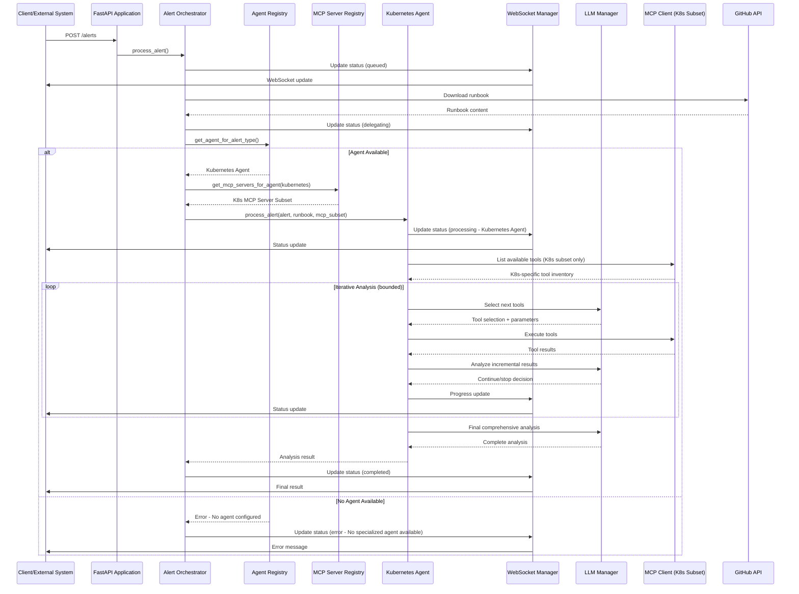

# EP-0002: Multi-Layer Agent Architecture - Design Document

**Status:** Draft  
**Created:** 2024-12-19  
**Updated:** 2024-12-19  
**Phase:** Technical Design
**Requirements Document:** `docs/enhancements/pending/EP-0002-multi-layer-agent-requirements.md`
**Next Phase:** Implementation Plan

---

## Design Overview

The multi-layer agent architecture transforms the current monolithic AlertService into a distributed, extensible system with clear separation of concerns. The design introduces an orchestrator layer that delegates alert processing to specialized agents based on configurable alert type mappings, with each agent having access to its own subset of MCP servers.

### Architecture Summary

The new architecture consists of four main layers:
1. **Orchestrator Layer**: Receives alerts, downloads runbooks, and delegates to appropriate agents
2. **Agent Registry Layer**: Maintains configurable mappings between alert types and specialized agents
3. **Specialized Agent Layer**: Domain-specific agents that handle particular categories of alerts
4. **MCP Server Organization Layer**: Global registry with agent-specific server subsets

### Key Design Principles

- **Separation of Concerns**: Each layer has a single, well-defined responsibility
- **Domain Specialization**: Agents focus on specific infrastructure domains with relevant tools
- **Extensibility**: Easy addition of new agents and alert types through configuration
- **Backward Compatibility**: Existing API contracts remain unchanged
- **Performance**: Minimal overhead with focused tool sets for better LLM decision-making

### Design Goals

- Enable specialized expertise for different alert categories (Kubernetes, ArgoCD, etc.)
- Prevent LLM tool selection confusion by providing focused, domain-specific tool subsets
- Simplify addition of new alert types and MCP servers without modifying core orchestration logic
- Maintain consistent processing patterns across all agents
- Provide clear error handling when no specialized agent is available
- Enable agent-specific MCP server assignments for optimal performance

## System Architecture

### High-Level Architecture

```
┌─────────────────────────────────────────────────────────────┐
│                    SRE AI Agent - Multi-Layer              │
│                                                             │
│  ┌─────────────────────────────────────────────────────┐    │
│  │                 API Layer                           │    │
│  │  ┌─────────────────┐    ┌─────────────────┐          │    │
│  │  │   FastAPI       │    │   WebSocket     │          │    │
│  │  │   Application   │    │   Manager       │          │    │
│  │  └─────────────────┘    └─────────────────┘          │    │
│  └─────────────────────────────────────────────────────┘    │
│                                                             │
│  ┌─────────────────────────────────────────────────────┐    │
│  │              Orchestrator Layer                     │    │
│  │  ┌─────────────────┐    ┌─────────────────┐          │    │
│  │  │   Alert         │    │   Agent         │          │    │
│  │  │   Orchestrator  │    │   Registry      │          │    │
│  │  └─────────────────┘    └─────────────────┘          │    │
│  └─────────────────────────────────────────────────────┘    │
│                                                             │
│  ┌─────────────────────────────────────────────────────┐    │
│  │              Specialized Agent Layer                │    │
│  │  ┌─────────────────┐    ┌─────────────────┐          │    │
│  │  │   Kubernetes    │    │   ArgoCD        │          │    │
│  │  │   Agent         │    │   Agent         │          │    │
│  │  │   (Phase 1)     │    │   (Future)      │          │    │
│  │  └─────────────────┘    └─────────────────┘          │    │
│  └─────────────────────────────────────────────────────┘    │
│                                                             │
│  ┌─────────────────────────────────────────────────────┐    │
│  │           MCP Server Organization Layer             │    │
│  │  ┌─────────────────┐    ┌─────────────────┐          │    │
│  │  │   Global MCP    │    │   Agent-Specific│          │    │
│  │  │   Server        │    │   MCP Server    │          │    │
│  │  │   Registry      │    │   Subsets       │          │    │
│  │  └─────────────────┘    └─────────────────┘          │    │
│  └─────────────────────────────────────────────────────┘    │
│                                                             │
│  ┌─────────────────────────────────────────────────────┐    │
│  │              Integration Layer                      │    │
│  │  ┌─────────────────┐    ┌─────────────────┐          │    │
│  │  │   LLM           │    │   MCP Server    │          │    │
│  │  │   Providers     │    │   Ecosystem     │          │    │
│  │  └─────────────────┘    └─────────────────┘          │    │
│  └─────────────────────────────────────────────────────┘    │
└─────────────────────────────────────────────────────────────┘
```

### Component Architecture

#### New Components

- **AlertOrchestrator**: Main orchestration service that receives alerts, downloads runbooks, and delegates to appropriate agents (REQ-2.1)
- **AgentRegistry**: Registry service that maintains configurable mappings between alert types and specialized agents (REQ-2.2)
- **BaseAgent**: Abstract base class defining the common interface for all specialized agents
- **KubernetesAgent**: Specialized agent for Kubernetes-related alerts (initial implementation) (REQ-2.3)
- **AgentFactory**: Factory pattern implementation for creating agent instances
- **MCPServerRegistry**: Global registry of all available MCP servers that can be easily extended (REQ-2.6)
- **AgentMCPAssignment**: Component managing agent-specific MCP server subsets (REQ-2.7, REQ-2.8)

#### Modified Components

- **AlertService**: Refactored to become the AlertOrchestrator, removing direct LLM analysis logic
- **FastAPI Application**: Updated to use the new AlertOrchestrator instead of AlertService
- **Configuration System**: Extended to support agent registry configuration and agent-specific MCP server assignments (REQ-2.15)
- **ProcessingStatus**: Enhanced to include current processing agent information (REQ-2.9)
- **MCPClient**: Updated to work with agent-specific MCP server subsets instead of global access (REQ-2.13)

#### Component Interactions

The new architecture follows a clear delegation pattern with error handling:
1. API Layer receives alerts and delegates to AlertOrchestrator
2. AlertOrchestrator downloads runbooks and consults AgentRegistry
3. AgentRegistry returns appropriate agent for the alert type or returns error if none available (REQ-2.24)
4. AlertOrchestrator delegates processing to the selected agent with agent-specific MCP server subset
5. Specialized agents perform LLM analysis using only their assigned MCP servers (REQ-2.8, REQ-2.13)
6. Agents report progress through AlertOrchestrator to WebSocket Manager (REQ-2.14)
7. Results flow back through the orchestration chain with agent-specific details (REQ-2.10)

### Data Flow Design

#### Data Flow Diagrams



#### Data Processing Steps

1. **Alert Reception**: API layer receives alert and validates basic structure
2. **Orchestration**: AlertOrchestrator takes control of processing workflow
3. **Runbook Download**: Orchestrator downloads runbook from GitHub
4. **Agent Selection**: AgentRegistry determines appropriate agent for alert type
5. **Agent Delegation**: Orchestrator delegates processing to selected agent
6. **Specialized Processing**: Agent performs domain-specific analysis using LLM and MCP tools
7. **Result Aggregation**: Results flow back through orchestration chain

## Data Design

### Data Models

#### New Data Models

```python
AgentConfig:
  - agent_type: str (e.g., "kubernetes", "argocd")
  - agent_class: str (fully qualified class name)
  - enabled: bool
  - alert_types: List[str] (supported alert types)
  - mcp_servers: List[str] (assigned MCP server subset)
  - configuration: Dict[str, Any] (agent-specific config)

AgentRegistryEntry:
  - alert_type: str
  - agent_type: str
  - priority: int (for handling conflicts)
  - enabled: bool

AgentProcessingContext:
  - alert: Alert
  - runbook_content: str
  - agent_config: AgentConfig
  - assigned_mcp_servers: List[str]
  - progress_callback: Optional[Callable]

MCPServerConfig:
  - server_id: str
  - server_type: str (e.g., "kubernetes", "argocd", "database")
  - enabled: bool
  - connection_params: Dict[str, Any]
  - domains: List[str] (infrastructure domains this server supports)

MCPServerRegistry:
  - servers: Dict[str, MCPServerConfig]
  - agent_assignments: Dict[str, List[str]]
```

#### Modified Data Models

```python
ProcessingStatus:
  - alert_id: str
  - status: str (extended with "delegating" state)
  - progress: int
  - current_step: str
  - current_agent: Optional[str] (NEW - which agent is processing) (REQ-2.9)
  - assigned_mcp_servers: List[str] (NEW - MCP servers assigned to current agent)
  - result: Optional[str]
  - error: Optional[str]
  - timestamp: datetime
```

### Database Design

#### Schema Changes

No database schema changes required in Phase 1. All configuration is maintained in the application configuration file.

#### Migration Strategy

No data migration required as this is a refactoring of existing functionality.

## API Design

### New API Endpoints

No new API endpoints are required for Phase 1. The existing API surface remains unchanged to maintain backward compatibility.

### Modified API Endpoints

#### Endpoint: GET /processing-status/{alert_id}
- **Current Behavior**: Returns basic processing status
- **New Behavior**: Includes current processing agent information
- **Breaking Changes**: None (additive only)
- **Migration Path**: Clients can ignore new fields

### API Integration Points

No changes to external API integration points. The multi-layer architecture is internal to the application.

## User Interface Design

### UI Components

#### Modified UI Components

- **ProcessingStatus Component**: Updated to display current processing agent information
- **ResultDisplay Component**: Enhanced to show agent-specific processing details in iteration history

### User Experience Flow

The user experience remains unchanged:
1. User submits alert via web interface
2. System shows processing progress (now with agent information)
3. User receives comprehensive analysis results
4. Agent-specific details are included in the iteration summary

#### User Interface Mockups

No significant UI changes required. The existing interface will show additional context about which agent is processing the alert.

## Security Design

### Security Architecture

No changes to the security architecture. The multi-layer design maintains the same security boundaries and authentication mechanisms.

### Authentication & Authorization

No changes to authentication or authorization. Agent delegation is an internal architectural decision.

### Data Protection

No changes to data protection mechanisms. The same security controls apply to all agents.

### Security Controls

- Agent registry configuration is protected through the same environment variable mechanism
- Agent-specific configurations follow the same security patterns as existing component configurations
- No additional attack surface introduced by the multi-layer architecture

## Performance Design

### Performance Requirements

The multi-layer architecture should introduce minimal overhead:
- Agent selection should add < 1ms to processing time
- Orchestration delegation should add < 5ms to processing time
- Overall processing time should remain within 5% of current performance

### Performance Architecture

- **Lazy Loading**: Agents are instantiated only when needed
- **Caching**: Agent registry maintains cached mappings for rapid lookup
- **Efficient Delegation**: Minimal data copying between orchestrator and agents

### Scalability Design

The multi-layer architecture improves scalability by:
- Enabling agent-specific optimizations
- Allowing independent scaling of different agent types
- Reducing coupling between alert processing logic

### Performance Optimizations

- Agent registry uses hash-based lookup for O(1) agent selection
- Shared resource pools (LLM clients, MCP connections) across agents
- Efficient context passing to minimize memory overhead

## Error Handling & Resilience

### Error Handling Strategy

The multi-layer architecture enhances error handling by:
- **Isolation**: Failures in one agent don't affect others
- **Fallback**: Orchestrator can attempt alternate agents if configured
- **Clarity**: Error messages clearly indicate which layer failed

### Failure Modes

- **Agent Registry Failure**: 
  - **Impact**: Cannot determine appropriate agent for alert type
  - **Detection**: Registry returns null or throws exception
  - **Recovery**: Return clear error message to user (REQ-2.24)

- **No Agent Available**:
  - **Impact**: No specialized agent configured for alert type
  - **Detection**: Agent registry returns empty result for alert type
  - **Recovery**: Return clear error message indicating no agent is available for the specific alert type (REQ-2.24)

- **Agent Initialization Failure**:
  - **Impact**: Specific agent type unavailable
  - **Detection**: Agent factory throws exception during creation
  - **Recovery**: Log error and return clear error message about agent initialization failure (REQ-2.28)

- **Agent Processing Failure**:
  - **Impact**: Alert processing fails for specific agent
  - **Detection**: Agent throws exception during process_alert()
  - **Recovery**: Log detailed error and return agent-specific error message (REQ-2.28)

- **MCP Server Subset Failure**:
  - **Impact**: Agent cannot access assigned MCP servers
  - **Detection**: MCP connection failures for agent-specific servers
  - **Recovery**: Only affects the specific agent, other agents continue working (REQ-2.25, REQ-2.22)

### Resilience Patterns

- **Circuit Breaker**: Disable failing agents after repeated failures
- **Retry Logic**: Orchestrator retries with different agents if configured
- **Graceful Degradation**: Fall back to basic processing if specialized agents fail

## Configuration & Deployment

### Configuration Changes

#### New Configuration Options

- **agent_registry**: Configuration for alert type to agent mappings (REQ-2.2)
- **agent_configurations**: Agent-specific configuration settings including MCP server assignments (REQ-2.7)
- **mcp_server_registry**: Global registry of all available MCP servers (REQ-2.6)
- **agent_mcp_assignments**: Mapping of agents to their assigned MCP server subsets (REQ-2.8)

#### Modified Configuration Options

- **supported_alerts**: Extended to include agent mappings
- **max_llm_mcp_iterations**: Can be overridden per agent type
- **mcp_servers**: Extended to support global registry with agent-specific assignments (REQ-2.15)

### Deployment Considerations

#### Deployment Strategy

The multi-layer architecture can be deployed as a backward-compatible update:
1. Deploy new code with existing configuration
2. Gradually migrate alert type mappings to new agent registry
3. Enable specialized agents as they become available

#### Rollback Strategy

Rollback is simplified by maintaining API compatibility:
1. Revert to previous AlertService implementation
2. Disable agent registry configuration
3. Existing alert processing continues without interruption

## Testing Strategy

### Unit Testing

#### Test Coverage Areas

- Agent registry lookup logic and edge cases
- Agent factory creation and initialization
- Orchestrator delegation and error handling
- Individual agent processing logic
- Configuration validation and loading
- MCP server registry and agent-specific assignments (REQ-2.6, REQ-2.7, REQ-2.8)
- Error handling when no agent is available (REQ-2.24)
- Agent isolation and failure modes (REQ-2.22, REQ-2.25, REQ-2.28)

### Integration Testing

#### Integration Points to Test

- End-to-end alert processing through new architecture
- Agent delegation with real LLM and MCP interactions
- WebSocket progress updates during agent processing with agent information (REQ-2.9, REQ-2.14)
- Error propagation through orchestration layers
- Agent-specific MCP server subset connectivity (REQ-2.13)
- MCP server failure isolation between agents (REQ-2.25)

### End-to-End Testing

#### Test Scenarios

- Process "Namespace is stuck in Terminating" alert using Kubernetes agent with K8s MCP server subset (REQ-2.3, REQ-2.8)
- Handle unknown alert types with clear error messages (REQ-2.24)
- Verify agent failure handling and error reporting with agent-specific details (REQ-2.28)
- Test configuration changes and agent registry updates
- Test MCP server assignment changes and agent isolation (REQ-2.27)
- Verify concurrent processing with different agents using different MCP server subsets (REQ-2.16)

## Monitoring & Observability

### Monitoring Requirements

Enhanced monitoring for the multi-layer architecture:
- Agent selection and delegation metrics
- Per-agent processing time and success rates
- Agent availability and health status

### Metrics to Track

- **Agent Selection Time**: Time to select appropriate agent (< 1ms target) (REQ-2.17)
- **Agent Processing Success Rate**: Success rate per agent type (> 95% target) (REQ-2.21)
- **Orchestration Overhead**: Additional time introduced by orchestration (< 5ms target) (REQ-2.18)
- **MCP Server Subset Initialization Time**: Time to initialize agent-specific MCP server subsets (REQ-2.17)
- **Agent Isolation Effectiveness**: Percentage of agent failures that don't affect other agents (> 99% target) (REQ-2.22)
- **Error Handling Coverage**: Percentage of errors that return clear, agent-specific messages (> 95% target) (REQ-2.24, REQ-2.28)

### Logging Strategy

Enhanced logging includes:
- Agent selection decisions and rationale
- Agent delegation events and context
- Agent-specific processing steps and results
- MCP server subset assignments and initialization (REQ-2.7, REQ-2.8)
- Clear error messages when no agent is available (REQ-2.24)
- Agent-specific error details and component failures (REQ-2.28)

### Alerting Strategy

New alerting rules for:
- Agent failures exceeding threshold
- Agent registry configuration errors
- Orchestration delegation failures
- MCP server subset connectivity issues
- Agent isolation failures (when one agent failure affects others)

## Migration & Backward Compatibility

### Migration Strategy

The migration follows a phased approach:
1. **Phase 1**: Deploy new architecture with single Kubernetes agent
2. **Phase 2**: Migrate existing functionality to agent-based model
3. **Phase 3**: Add new agents and alert types

### Backward Compatibility

Full backward compatibility maintained:
- All existing API endpoints unchanged
- Existing configuration remains valid
- Same alert processing behavior for existing alert types

### Migration Steps

1. Deploy new multi-layer architecture code
2. Configure global MCP server registry with existing MCP servers (REQ-2.6)
3. Configure agent registry with "Namespace is stuck in Terminating" → Kubernetes Agent (REQ-2.2)
4. Assign Kubernetes MCP server subset to Kubernetes Agent (REQ-2.7, REQ-2.8)
5. Verify processing behavior matches existing system with agent-specific MCP servers
6. Test error handling for unsupported alert types (REQ-2.24)
7. Update configuration to enable additional alert types and MCP server assignments
8. Add new agents with their specific MCP server subsets as needed

## Alternative Designs Considered

### Alternative 1: Plugin-Based Architecture
- **Description**: Use dynamic plugin loading for agents
- **Pros**: Maximum flexibility, runtime agent loading
- **Cons**: Increased complexity, security concerns with dynamic loading
- **Decision**: Rejected in favor of simpler compile-time agent registry

### Alternative 2: Microservices Architecture
- **Description**: Split each agent into separate microservices
- **Pros**: Independent scaling, technology diversity
- **Cons**: Increased operational complexity, network latency
- **Decision**: Rejected for Phase 1, may be considered for future phases

### Alternative 3: Rule-Based Agent Selection
- **Description**: Use complex rule engine for agent selection
- **Pros**: Sophisticated matching logic, flexible conditions
- **Cons**: Configuration complexity, performance overhead
- **Decision**: Rejected in favor of simple mapping for initial implementation

## Implementation Considerations

### Technical Debt

The refactoring addresses existing technical debt:
- Removes monolithic AlertService responsibilities
- Improves testability through separation of concerns
- Enables future optimizations at agent level

### Dependencies

- Python abc module for abstract base classes
- Enhanced configuration validation
- Existing LLM and MCP integrations remain unchanged

### Constraints

- Must maintain backward compatibility
- Cannot introduce breaking changes to existing API
- Must support future extension without architectural changes

## Documentation Requirements

### Code Documentation

- Abstract base agent class with clear interface documentation
- Agent registry configuration format and examples
- Agent implementation patterns and best practices
- MCP server registry configuration and agent assignment patterns (REQ-2.6, REQ-2.7, REQ-2.8)

### API Documentation

- Updated API documentation to reflect new processing status fields including current agent (REQ-2.9)
- Agent-specific error codes and messages (REQ-2.24, REQ-2.28)
- Configuration reference for agent registry and MCP server assignments (REQ-2.15)

### User Documentation

- Migration guide for existing users
- Agent development guide for future extensions
- Troubleshooting guide for agent-specific issues
- MCP server configuration and assignment guide
- Error handling and recovery procedures

### Architecture Documentation

- Updated system architecture diagrams including MCP server organization layer
- Agent interaction patterns and data flow with MCP server subsets
- Performance characteristics and optimization guidelines
- Agent isolation and failure mode documentation

---

## Design Review Checklist

### Architecture Review
- [x] Architecture is sound and scalable
- [x] Components are well-defined and have clear responsibilities
- [x] Data flow is logical and efficient
- [x] Integration points are well-defined
- [x] Security considerations are addressed

### Implementation Review
- [x] Design is implementable with current technology stack
- [x] Performance requirements can be met
- [x] Error handling is comprehensive
- [x] Testing strategy is adequate
- [x] Monitoring and observability are addressed

### Requirements Traceability
- [x] All requirements from requirements doc are addressed
- [x] Design decisions are justified
- [x] Constraints and assumptions are validated
- [x] Success criteria can be met with this design

---

## Next Steps

After design approval:
1. Create Implementation Plan: `docs/enhancements/pending/EP-0002-implementation.md`
2. Reference this design document in the implementation phase
3. Ensure implementation plan addresses all design elements

**AI Prompt for Next Phase:**
```
Create an implementation plan using the template at docs/templates/ep-implementation-template.md for EP-0002 based on the approved design in this document and the requirements in EP-0002-multi-layer-agent-requirements.md.
``` 