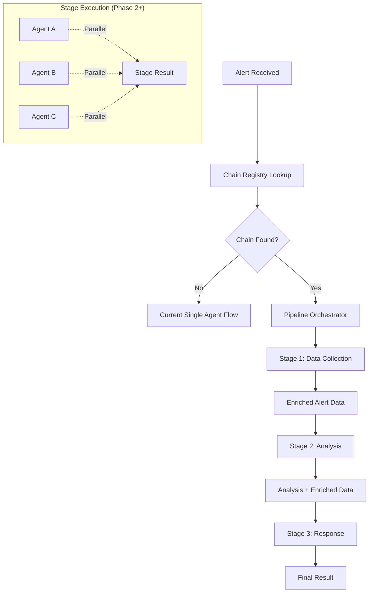

# EP-0008: Agent Chains and Pipeline Architecture - Proposal

**Status:** Proposed  
**Created:** 2025-08-01  
**Type:** Architecture Enhancement

---

## Problem Statement

**Current Limitation:** The current agent system processes alerts using a single specialized agent from start to finish. While this works well for straightforward alerts, there are scenarios where **multiple agents working in sequence** could provide better analysis through:

- **Data Enrichment**: Early agents collect and structure data for later analysis agents
- **Specialized Processing**: Different agents focusing on different aspects (data collection → root cause analysis → response planning)
- **Reusable Components**: Same agents used in different chains for different alert types
- **Performance Optimization**: Potential for parallel processing within workflow stages

**Use Cases:**
- Security incidents requiring data collection → correlation analysis → response planning
- Kubernetes issues needing enrichment → analysis → remediation
- Complex multi-system alerts benefiting from specialized agent expertise at each stage

## Solution Overview

Implement a **three-phase evolutionary approach** to agent chaining, building incrementally on the existing single-agent architecture:

### Phase 1: Sequential Agent Chains
- Simple linear chains: Agent A → Agent B → Agent C
- One agent per stage, executed sequentially
- Data enrichment flows from agent to agent
- Maintains current progress reporting and error handling patterns

### Phase 2: Parallel Pipeline Stages  
- Stages can contain multiple agents running in parallel
- Stage 1: [Agent A + Agent B + Agent C] → Stage 2: [Agent D] → Stage 3: [Agent E + Agent F]
- Performance optimization through parallelization
- Maintains sequential stage dependencies

### Phase 3: Conditional Routing
- Dynamic routing between stages based on agent analysis results
- Agents can make decisions about which stage to execute next
- Support for early termination and branching workflows
- Intelligence-driven processing paths

## Proposed Architecture

### Configuration Structure

**Phase 1: Sequential Chains**
```yaml
# Separate chains from agents for reusability
agent_chains:
  kubernetes-troubleshooting-chain:
    alert_types: ["KubernetesIssue", "PodFailure"]
    stages:
      - name: "data-collection"
        agent: "kubernetes-enrichment-agent"
      - name: "root-cause-analysis"  
        agent: "kubernetes-analysis-agent"
      - name: "response-planning"
        agent: "kubernetes-response-agent"

# Agents remain separate and reusable
agents:
  kubernetes-enrichment-agent:
    mcp_servers: ["kubernetes-server"]
    custom_instructions: "Focus on collecting pod, namespace, and event data. Do not provide final analysis."
    
  kubernetes-analysis-agent:
    mcp_servers: ["kubernetes-server", "monitoring-server"]
    custom_instructions: "Analyze enriched data to determine root cause. Use data from previous agents."
    
  kubernetes-response-agent:
    mcp_servers: ["kubernetes-server", "runbook-server"]
    custom_instructions: "Generate specific remediation steps based on root cause analysis."
```

**Phase 2: Parallel Stages**
```yaml
agent_chains:
  security-incident-chain:
    alert_types: ["SecurityBreach", "UnauthorizedAccess"]
    stages:
      - name: "data-gathering"
        agents: ["log-collector-agent", "threat-intel-agent", "user-behavior-agent"]  # Parallel execution
        execution: "parallel"
        
      - name: "correlation-analysis"
        agents: ["correlation-agent"]  # Sequential, waits for all parallel agents
        execution: "sequential"
        depends_on: ["data-gathering"]
        
      - name: "incident-response"
        agents: ["notification-agent", "containment-agent"]  # Parallel execution
        execution: "parallel"
        depends_on: ["correlation-analysis"]
```

**Phase 3: Conditional Routing**
```yaml
agent_chains:
  adaptive-kubernetes-chain:
    alert_types: ["KubernetesAlert"]
    stages:
      - name: "triage"
        agents: ["kubernetes-triage-agent"]
        routes:
          "critical": "escalation-stage"
          "warning": "self-healing-stage"
          "info": "TERMINATE"
          
      - name: "escalation-stage"
        agents: ["paging-agent", "incident-creator-agent"]
        condition: "severity == critical"
        
      - name: "self-healing-stage"
        agents: ["auto-restart-agent", "scaling-agent"]
        condition: "severity == warning"
```

### Data Flow Architecture



## Implementation Strategy

### Phase 1: Minimal Viable Chain (MVP)
1. **Extend AgentRegistry** to support chain lookups alongside single agent lookups
2. **Create ChainOrchestrator** service for sequential stage execution
3. **Enhance data passing** between agents (enriched alert data)
4. **Maintain compatibility** with existing single-agent processing

### Phase 2: Parallel Processing
1. **Add parallel execution** within stages using `asyncio.gather()`
2. **Implement result merging** strategies for parallel agent outputs
3. **Enhanced progress reporting** for parallel operations

### Phase 3: Conditional Logic
1. **Add routing evaluation** engine for dynamic stage selection
2. **Implement condition parsing** and result-based decision making
3. **Support early termination** and branching workflows

## Requirements

### Functional Requirements
- **REQ-1**: System shall support both single agents and agent chains for alert processing
- **REQ-2**: Agent chains shall be defined in YAML configuration separately from agent definitions
- **REQ-3**: Agents shall be reusable across multiple chains
- **REQ-4**: Data enrichment shall flow from earlier agents to later agents in the chain
- **REQ-5**: Individual agent progress shall be reported throughout chain execution
- **REQ-6**: Chain execution failures shall continue with clear error reporting stored in history
- **REQ-7**: System shall maintain backward compatibility with existing single-agent processing

### Non-Functional Requirements
- **Performance**: Phase 2 shall enable parallel processing to improve overall chain execution time
- **Scalability**: Architecture shall support chains with 2-10 agents without significant performance degradation
- **Maintainability**: Each phase shall be backward compatible with previous phases
- **Observability**: All agent interactions within chains shall be captured in the history service

## Alternative Consideration: LangGraph Framework

### LangGraph Overview
[LangGraph](https://langchain-ai.github.io/langgraph/) is a library for building stateful, multi-agent applications with LLMs. It provides:

- **Graph-based workflow definition** with nodes (agents) and edges (data flow)
- **Built-in state management** for passing data between agents
- **Conditional routing** and dynamic workflow execution
- **Integration with LangChain ecosystem** and various LLM providers
- **Checkpointing and persistence** for long-running workflows
- **Human-in-the-loop** support for interactive workflows

### LangGraph vs Custom Implementation

| Aspect | Custom Pipeline Architecture | LangGraph |
|--------|----------------------------|-----------|
| **Development Time** | **Moderate** - extends existing architecture incrementally | **Very High** - complete rewrite of core components required |
| **Integration Complexity** | **Low** - builds on BaseAgent, MCP Client, History Service | **Very High** - all core components need redesign |
| **Configuration Support** | **Excellent** - extends existing YAML-driven approach | **Poor** - code-driven, would need custom YAML→code layer |
| **Investment Protection** | **Excellent** - preserves existing sophisticated components | **Poor** - requires abandoning mature, tested codebase |
| **MCP Integration** | **Seamless** - uses existing MCP Client with masking/registry | **Complex** - would need complete custom MCP integration |
| **History/Observability** | **Native** - extends existing microsecond-precision tracking | **Major Rework** - LangGraph state model incompatible |
| **Progress Reporting** | **Direct** - extends existing WebSocket/callback system | **Complex** - would need custom progress extraction |
| **Risk Level** | **Low** - incremental changes to proven architecture | **Very High** - massive refactoring with uncertain outcome |
| **Domain Fit** | **Perfect** - designed specifically for alert processing | **Generic** - general workflow framework, not alert-optimized |
| **Maintenance** | **Familiar** - team knows the codebase patterns | **New Dependency** - external framework evolution risk |

### LangGraph Example
```python
from langgraph.graph import StateGraph, END
from typing import TypedDict

class AlertState(TypedDict):
    alert_data: dict
    enriched_data: dict
    analysis: str
    response_plan: str

def data_collection_node(state: AlertState):
    # Kubernetes data collection logic
    return {"enriched_data": collected_data}

def analysis_node(state: AlertState):
    # Root cause analysis using enriched data
    return {"analysis": analysis_result}

def response_node(state: AlertState):
    # Generate response plan
    return {"response_plan": response}

# Build the graph
workflow = StateGraph(AlertState)
workflow.add_node("collect", data_collection_node)
workflow.add_node("analyze", analysis_node)  
workflow.add_node("respond", response_node)

workflow.add_edge("collect", "analyze")
workflow.add_edge("analyze", "respond")
workflow.add_edge("respond", END)

workflow.set_entry_point("collect")
app = workflow.compile()
```

### Analysis: Why LangGraph May Not Be Suitable

**Critical Integration Challenges:**

1. **Deep Refactoring Required**: 
   - BaseAgent class with sophisticated LLM/MCP integration would need complete rewrite
   - History Service with microsecond-precision interaction capture doesn't map to LangGraph's state model
   - MCP Client with data masking and server registry would need redesign
   - Progress callbacks and WebSocket integration would require rework

2. **Configuration-Driven Architecture Mismatch**:
   - Current YAML-based agent configuration (EP-0006) is core to the system design
   - LangGraph is primarily code-driven with Python node functions
   - MCP server assignments, custom instructions, and data masking configs don't map naturally
   - Would require building a custom layer to convert YAML → LangGraph nodes, negating framework benefits

3. **Existing Investment Protection**:
   - Substantial existing codebase specifically designed for alert processing workflows
   - Well-tested BaseAgent hierarchy with domain-specific optimizations
   - Mature history and observability infrastructure
   - Production-ready MCP integration with masking and error handling

### Recommendation: Custom Pipeline Architecture

**Proceed with custom implementation** for the following reasons:
- **Preserves Investment**: Builds incrementally on existing sophisticated components
- **Maintains Design Philosophy**: Keeps configuration-first approach that's central to system design
- **Controlled Evolution**: Allows gradual enhancement without major architectural disruption
- **Domain Optimization**: Custom implementation can optimize specifically for alert processing patterns
- **Reduced Risk**: Avoids large-scale refactoring with uncertain benefits

**LangGraph Consideration for Future**: Re-evaluate LangGraph for new projects or if requirements significantly change, but current system architecture is well-suited for custom pipeline implementation.

## Migration Strategy

### Backward Compatibility
- Existing single-agent configurations continue to work unchanged
- AgentRegistry maintains both single-agent and chain lookups
- API endpoints remain the same (chains are transparent to external users)

### Rollout Plan
1. **Phase 1 MVP** (2-4 weeks): Basic sequential chains with 2-3 simple use cases
2. **Phase 1 Stable** (4-6 weeks): Full sequential chain support with comprehensive testing
3. **LangGraph Evaluation** (Parallel to Phase 1): Proof-of-concept and comparison analysis
4. **Phase 2** (6-8 weeks): Parallel processing within stages (if staying with custom implementation)
5. **Phase 3** (8-12 weeks): Conditional routing and dynamic workflows

## Success Metrics

- **Functionality**: Successfully process alerts using 2-5 agent chains
- **Performance**: Phase 2 parallel processing shows measurable improvement over sequential
- **Adoption**: At least 3 different chain configurations in production use
- **Reliability**: Chain failure rate < 5% with clear error reporting
- **Maintainability**: New chain configurations can be added without code changes

---

**Next Steps:**
1. Review and refine this proposal with team feedback
2. Create detailed technical design for Phase 1 implementation
3. Set up LangGraph evaluation environment for parallel assessment
4. Define specific success criteria and testing approach for MVP