# TARSy System Design - Functional Areas Overview

**Version**: 1.0  
**Last Updated**: 2025-08-19  
**Purpose**: Modular system understanding guide for targeted improvements

---

## Introduction

This document provides a functional area breakdown of the TARSy system, enabling engineers to understand and work on specific parts of the system without needing to comprehend the entire codebase. Each section focuses on a distinct functional area with clear boundaries and responsibilities.

**How to Use This Document:**
- Start with the [High-Level System Overview](#high-level-system-overview) for context
- Jump to specific functional areas based on what you're working on
- Each area includes core concepts, key components, and integration points
- Cross-references help you understand dependencies between areas

---

## High-Level System Overview

TARSy is an AI-powered incident analysis system that processes alerts through sequential chains of specialized agents. The system automatically selects appropriate chains, executes multiple stages where agents build upon each other's work, and provides comprehensive analysis and recommendations.

**Core Flow**: Alert → Chain Selection → Sequential Agent Execution → Analysis & Recommendations → Dashboard Display

---

## Table of Contents

### Foundation Layer
- [1. Alert Processing & Orchestration](#1-alert-processing--orchestration)
  - [Background Processing & Concurrency Management](#background-processing--concurrency-management)
- [2. Configuration Management](#2-configuration-management)

### Core Processing Pipeline  
- [3. Chain Management & Execution](#3-chain-management--execution)
- [4. Agent Architecture & Strategy System](#4-agent-architecture--strategy-system)
- [5. MCP Integration & Tool Management](#5-mcp-integration--tool-management)
- [6. LLM Integration & Multi-Provider Support](#6-llm-integration--multi-provider-support)

### Event Capture & Observability
- [7. Hook System & Event-Driven Architecture](#7-hook-system--event-driven-architecture)
- [8. History & Audit Trail](#8-history--audit-trail)
- [9. Dashboard & Real-time Monitoring](#9-dashboard--real-time-monitoring)
  - [WebSocket & Real-time Communication Architecture](#websocket--real-time-communication-architecture)

### Cross-Cutting Concerns
- [10. Security & Data Protection](#10-security--data-protection)
- [11. Authentication & Access Control](#11-authentication--access-control)

---

## Functional Areas

### 1. Alert Processing & Orchestration
**Purpose**: Core workflow management from alert receipt to completion  
**Key Responsibility**: Coordinating the entire alert processing pipeline

TARSy accepts alerts from any monitoring system through a flexible REST API, validates them, and coordinates the entire processing workflow. The system uses async background processing with sophisticated concurrency control and deduplication.

#### Core Alert Flow

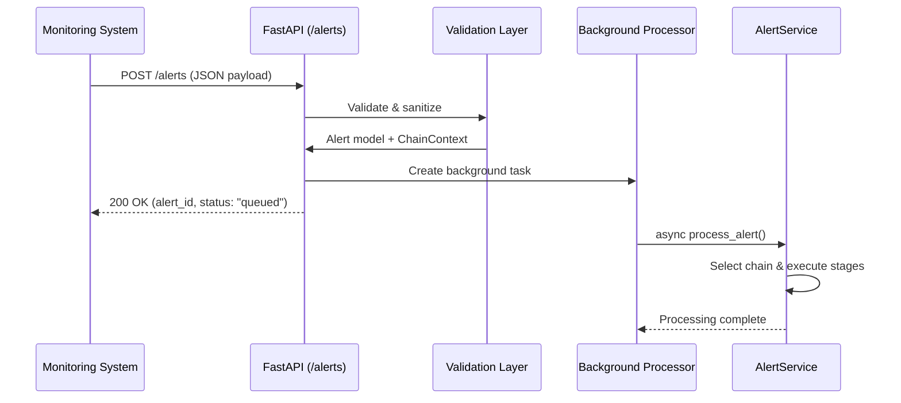

#### Key Components

**📍 Main Entry Point**: `backend/tarsy/main.py`
- **Alert endpoint**: `POST /alerts` with comprehensive validation
- **Alert model**: Simple, flexible structure (see `backend/tarsy/models/alert.py`)
```python
class Alert(BaseModel):
    alert_type: str          # Required - determines chain selection
    runbook: str             # Required - GitHub runbook URL  
    data: Dict[str, Any]     # Flexible JSON payload
    severity: Optional[str]  # Defaults to "warning"
    timestamp: Optional[int] # Defaults to current time
```

**📍 Core Service**: `backend/tarsy/services/alert_service.py`
- Orchestrates all system components (Chain Registry, Agent Factory, MCP Client, LLM Manager)
- Handles chain selection and stage execution
- Manages runbook downloading and distribution

#### Background Processing & Concurrency Management

**Concurrency Control**:
```python
# From main.py startup
alert_processing_semaphore = asyncio.Semaphore(settings.max_concurrent_alerts)

# In background processor
async with alert_processing_semaphore:
    await alert_service.process_alert(alert, alert_id=alert_id)
```

**Alert Deduplication**:
The system prevents duplicate processing using content-based keys:
```python
# AlertKey generates deterministic hash from alert content (excluding timestamp)
alert_key = AlertKey.from_chain_context(alert_context)
# Format: "alert_type_contentHash" (e.g., "kubernetes_a1b2c3d4")
```
**📍 Implementation**: `backend/tarsy/models/alert_processing.py`

**Timeout Management**: 
- **10-minute processing limit** with `asyncio.wait_for()`
- **Graceful error handling** for timeouts, validation errors, connection errors
- **Service lifecycle coordination** during startup/shutdown

**📍 Background Processing**: `process_alert_background()` in `backend/tarsy/main.py`

### 2. Configuration Management
**Purpose**: System configuration and extensibility  
**Key Responsibility**: Flexible system configuration without code changes

TARSy supports both built-in components and YAML-based configuration, enabling system extension without code changes. Configuration defines agents, chains, MCP servers, and their relationships.

#### Configuration Architecture

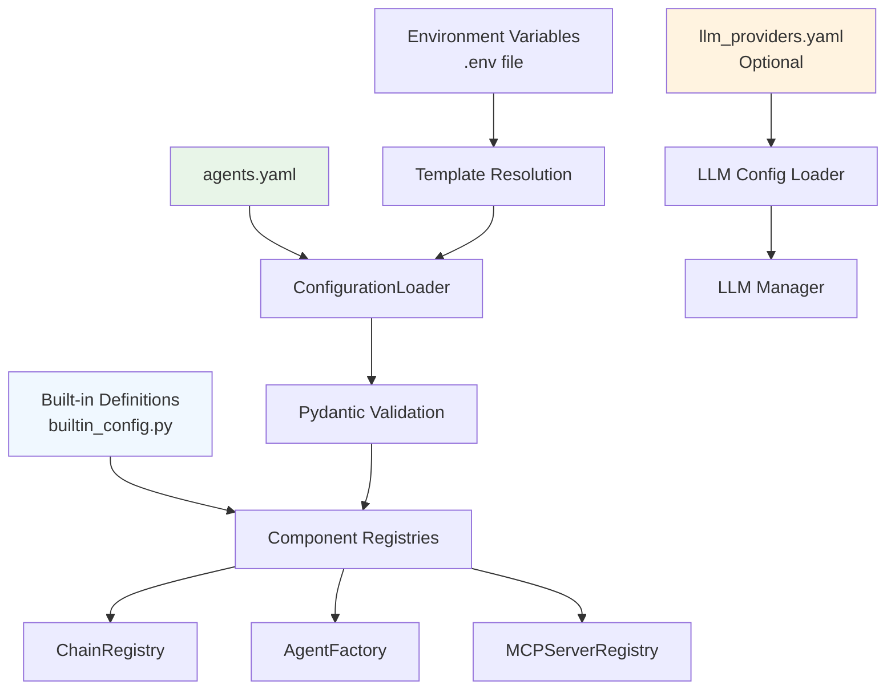

#### Key Configuration Types

**📍 Built-in Configuration**: `backend/tarsy/config/builtin_config.py`
- **Single source of truth** for built-in agents and MCP servers
- **No circular imports** - data structures only
- **Example built-in agent**:
```python
BUILTIN_AGENTS = {
    "KubernetesAgent": {
        "import": "tarsy.agents.kubernetes_agent.KubernetesAgent",
        "iteration_strategy": "react",
        "description": "Kubernetes-specialized agent using ReAct pattern"
    }
}
```

**📍 YAML Configuration**: `config/agents.yaml` (see `config/agents.yaml.example`)
- **Template variables**: `${VARIABLE_NAME}` resolved from environment
- **Agent definitions**: Custom agents with MCP servers and instructions
- **Chain definitions**: Multi-stage workflows with alert type mappings
- **MCP server configurations**: Custom tool servers

**Example YAML Configuration**:
```yaml
mcp_servers:
  security-scanner:
    server_id: "security-scanner"
    command: "npx"
    args: ["@security/scanner-mcp-server@latest"]
    enabled: true
    
agents:
  security-analyst:
    mcp_servers: ["security-scanner", "kubernetes-server"]  # Mix of custom + built-in
    iteration_strategy: "react"
    custom_instructions: "Focus on security implications and threat analysis..."
    
chains:
  security-incident-chain:
    alert_types: ["SecurityBreach", "SuspiciousActivity"]
    stages:
      - name: "evidence-collection"
        agent: "security-analyst"
        iteration_strategy: "react-stage"
      - name: "final-analysis" 
        agent: "security-analyst"
        iteration_strategy: "react-final-analysis"
```

**📍 LLM Provider Configuration**: `config/llm_providers.yaml` (optional, see `config/llm_providers.yaml.example`)
- **Built-in default providers** work out-of-the-box with just API keys
- **Optional YAML overrides** for custom models, proxy configurations, temperature settings
- **Multi-provider support** with OpenAI, Google Gemini, xAI Grok, Anthropic Claude
- **Content truncation controls** with provider-specific `max_tool_result_tokens` limits to prevent context overflow

**Built-in Default Providers**:
```python
# From builtin_config.py - work with just API keys
BUILTIN_LLM_PROVIDERS = {
    "openai-default": {
        "type": "openai", "model": "gpt-5",
        "max_tool_result_tokens": 250000  # Conservative for 272K context
    },
    "google-default": {
        "type": "google", "model": "gemini-2.5-flash",  # DEFAULT
        "max_tool_result_tokens": 950000  # Conservative for 1M context
    },
    "xai-default": {
        "type": "xai", "model": "grok-4-latest",
        "max_tool_result_tokens": 200000  # Conservative for 256K context
    },
    "anthropic-default": {
        "type": "anthropic", "model": "claude-4-sonnet",
        "max_tool_result_tokens": 150000  # Conservative for 200K context
    }
}
```

**Example LLM YAML Configuration**:
```yaml
llm_providers:
  # Override built-in provider model
  openai-default:
    type: openai
    model: gpt-4  # Override default gpt-5
    api_key_env: OPENAI_API_KEY
    max_tool_result_tokens: 200000  # Override default limit
    
  # Custom proxy provider
  openai-proxy:
    type: openai
    model: custom-model
    api_key_env: OPENAI_API_KEY
    base_url: https://my-proxy.domain.com/v1
    temperature: 0.0
    max_tool_result_tokens: 150000  # Custom limit for proxy
```

#### Configuration Loading Process

**📍 Configuration Loader**: `backend/tarsy/config/agent_config.py`
1. **File validation** - YAML syntax and structure validation
2. **Pydantic validation** - Type checking and constraint validation
3. **Conflict detection** - Prevents naming conflicts with built-in components
4. **Reference validation** - Ensures MCP server references exist
5. **Template resolution** - Resolves `${VAR}` from environment variables

**📍 Settings Management**: `backend/tarsy/config/settings.py`
- **Environment-based configuration** using Pydantic BaseSettings
- **LLM provider management** with built-in defaults and YAML merging
- **API keys, timeouts, concurrency limits**
- **Database and service configuration**
- **Template variable defaults**

**📍 LLM Configuration Process**:
1. **Load built-in providers** from `builtin_config.py`
2. **Load YAML overrides** if `config/llm_providers.yaml` exists
3. **Merge configurations** (YAML takes priority over built-ins)
4. **Validate provider types** and required fields
5. **Map API keys** based on provider type (google → GOOGLE_API_KEY, etc.)

### 3. Chain Management & Execution
**Purpose**: Chain definition, selection, and sequential stage execution  
**Key Responsibility**: Managing multi-stage agent workflows

Chains enable multi-stage workflows where specialized agents build upon each other's work. Each chain consists of sequential stages executed by domain-expert agents, with data accumulating as it flows through stages.

#### Chain Architecture

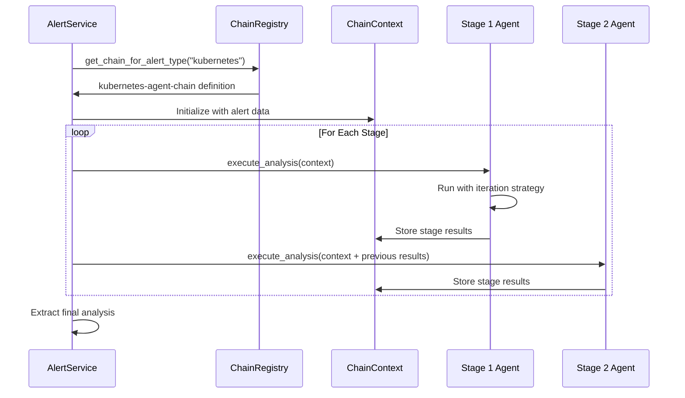

#### Key Components

**📍 Chain Registry**: `backend/tarsy/services/chain_registry.py`
- **O(1) chain lookup** by alert type
- **Conflict detection** - ensures each alert type maps to exactly one chain
- **Built-in + YAML chain merging**

**Current Built-in Chain**:
```python
# From builtin_config.py
"kubernetes-agent-chain": {
    "alert_types": ["kubernetes", "NamespaceTerminating"],
    "stages": [{"name": "analysis", "agent": "KubernetesAgent"}],
    "description": "Single-stage Kubernetes analysis"
}
```

**Multi-stage Chain Example**:
```yaml
# In agents.yaml
chains:
  incident-investigation-chain:
    alert_types: ["CriticalIncident"]
    stages:
      - name: "data-collection"
        agent: "data-collector"
        iteration_strategy: "react-stage"
      - name: "root-cause-analysis" 
        agent: "incident-analyst"
        iteration_strategy: "react-stage"
      - name: "recommendations"
        agent: "incident-analyst"  
        iteration_strategy: "react-final-analysis"
```

#### Chain Context & Data Flow

**📍 Unified Data Model**: `backend/tarsy/models/processing_context.py`
```python
class ChainContext(BaseModel):
    alert_type: str                    # Determines chain selection
    alert_data: Dict[str, Any]         # Original alert payload
    session_id: str                    # Links to history tracking
    stage_outputs: Dict[str, AgentExecutionResult]  # Accumulated stage results
    runbook_content: Optional[str]     # Downloaded once per chain
    chain_id: Optional[str]            # Executing chain identifier
```

**Stage Data Accumulation**: Each stage sees all previous stage outputs, enabling progressive analysis and building upon previous work.

**📍 Chain Execution**: `AlertService._execute_chain_stages()` in `backend/tarsy/services/alert_service.py`

### 4. Agent Architecture & Strategy System
**Purpose**: Agent framework and processing strategies  
**Key Responsibility**: Agent behavior and reasoning patterns

Agents are specialized AI-powered components that analyze alerts using domain expertise and configurable reasoning strategies. The system supports both hardcoded agents (like KubernetesAgent) and YAML-configured agents.

#### Agent Framework Architecture

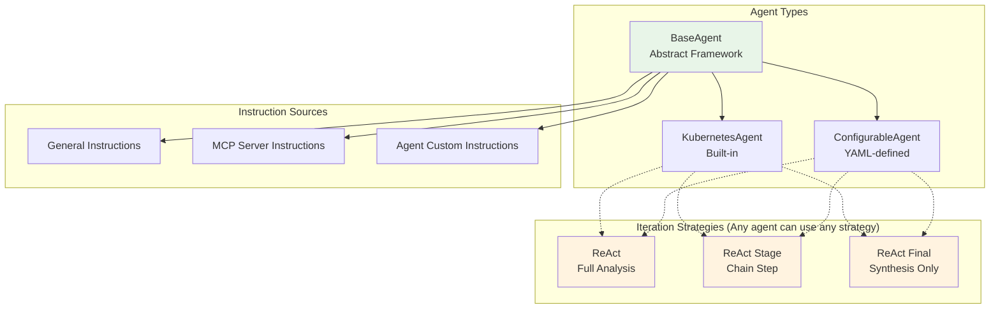

#### BaseAgent Framework

**📍 Abstract Base**: `backend/tarsy/agents/base_agent.py`
All agents inherit from BaseAgent and implement:
```python
class BaseAgent(ABC):
    @abstractmethod
    def mcp_servers(self) -> List[str]:
        """Define which MCP servers this agent uses"""
        
    @abstractmethod  
    def custom_instructions(self) -> str:
        """Agent-specific instructions for the LLM"""
        
    async def execute_analysis(self, context: ChainContext) -> str:
        """Main execution method using configured iteration strategy"""
```

#### Iteration Strategies

**Three distinct processing approaches**:

1. **ReAct (Standard)**: Think→Action→Observation cycles for complete analysis
2. **ReAct Stage**: Stage-specific analysis within multi-stage chains  
3. **ReAct Final Analysis**: Synthesis without tools, uses accumulated data

**📍 Strategy Controllers**: `backend/tarsy/agents/iteration_controllers/`

**ReAct Example Flow**:
```
Question: Analyze this Kubernetes alert
Thought: I need to check the namespace status first
Action: kubernetes_get_namespace
Action Input: {"namespace": "production"}
[Tool Call Executed]
Observation: {
  "apiVersion": "v1",
  "kind": "Namespace", 
  "metadata": {"name": "production"},
  "status": {"phase": "Terminating"}
}
Thought: The namespace is terminating. Now I need to see which pods are affected
Action: kubernetes_list_pods  
Action Input: {"namespace": "production"}
[Tool Call Executed]
Observation: {
  "items": [
    {"metadata": {"name": "app-1"}, "status": {"phase": "Pending"}},
    {"metadata": {"name": "app-2"}, "status": {"phase": "Pending"}},
    {"metadata": {"name": "worker-1"}, "status": {"phase": "Terminating"}}
  ]
}
Final Answer: The namespace 'production' is terminating, causing 2 pods to be stuck in Pending state and 1 pod actively terminating. The namespace termination is preventing new pod scheduling...
```

#### Instruction Composition

**Three-tier instruction system**:
```python
final_instructions = (
    general_instructions +           # Universal SRE guidance
    mcp_server_instructions +        # Tool-specific guidance - Optional
    agent.custom_instructions        # Agent domain expertise - Optional
)
```

**📍 Agent Factory**: `backend/tarsy/services/agent_factory.py`
- **Dependency injection** for LLM client, MCP client, registries
- **Strategy configuration** per stage
- **Both hardcoded and configured agent support**

### 5. MCP Integration & Tool Management
**Purpose**: External tool server integration and tool orchestration  
**Key Responsibility**: Connecting agents to external systems and tools

MCP (Model Context Protocol) servers provide agents with external tools and system access. TARSy integrates with MCP servers using the official SDK, supporting both built-in servers and custom configurations with automatic data masking.

#### MCP Architecture

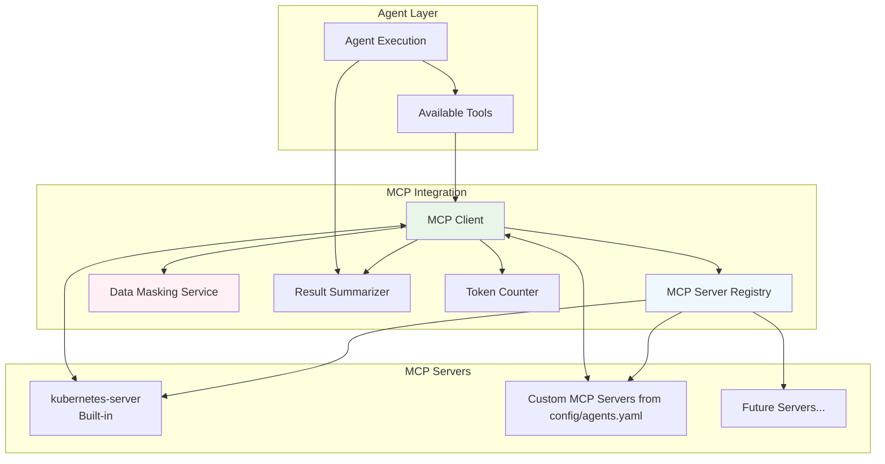

#### Key Components

**📍 MCP Client**: `backend/tarsy/integrations/mcp/client.py`
- **Official MCP SDK integration** using stdio transport
- **Session management** with AsyncExitStack for proper cleanup
- **Tool discovery** and execution coordination
- **Integrated data masking** on all tool responses

```python
# MCP client initialization and tool execution
async with mcp_interaction_context(session_id, server_name, tool_name, parameters) as ctx:
    result = await session.call_tool(tool_name, parameters)
    # Automatic data masking applied before returning
```

**📍 MCP Server Registry**: `backend/tarsy/services/mcp_server_registry.py`
- **Single source of truth** for all MCP server configurations
- **Built-in + YAML server merging** with conflict detection  
- **Template variable resolution** for environment-specific values

**Built-in MCP Server Example**:
```python
# From builtin_config.py
"kubernetes-server": {
    "server_id": "kubernetes-server",
    "enabled": True,
    "connection_params": {
        "command": "npx",
        "args": ["-y", "kubernetes-mcp-server@latest", "--read-only", 
                "--disable-destructive", "--kubeconfig", "${KUBECONFIG}"]
    },
    "instructions": "For Kubernetes operations: Be careful with cluster-scoped...",
    "data_masking": {
        "enabled": True,
        "pattern_groups": ["kubernetes"],
        "patterns": ["certificate", "token"]
    }
}
```

#### Agent-Server Assignment

**Server Assignment Pattern**: Agents declare required servers via `mcp_servers()` method:
```python
class KubernetesAgent(BaseAgent):
    def mcp_servers(self) -> List[str]:
        return ["kubernetes-server"]  # Only has access to k8s tools
```

**Tool Discovery Flow**:
1. **Agent requests tools** → `client.list_tools(session_id, server_name)`
2. **MCP client queries servers** → Discovers available tools per server
3. **Tools formatted** → `AvailableTools` model with server context
4. **Agent executes tools** → `client.call_tool(server, tool, params)`

#### Data Masking Integration

**📍 Automatic Response Filtering**: `backend/tarsy/services/data_masking_service.py`
- **Pattern-based masking** applied to all MCP tool responses
- **Server-specific patterns** (kubernetes secrets, API keys, certificates)
- **Fail-safe approach** - better to over-mask than expose sensitive data

**📍 Configuration**: Built-in servers include masking patterns, custom servers can define their own patterns in YAML configuration.

**📍 Agent Factory Integration**: `backend/tarsy/services/agent_factory.py` ensures agents only access their declared MCP servers.

#### Result Summarization Integration

**📍 Intelligent Size Management**: `backend/tarsy/integrations/mcp/summarizer.py`
- **Context-aware summarization** using agent-provided LLM client and investigation context
- **Token-based thresholds** with tiktoken integration for accurate size detection
- **Security-first design** - summarization occurs after data masking
- **Provider-level token control** using LangChain's native `max_tokens` parameter

**Summarization Flow**:
```python
# Automatic summarization in MCP client
async with mcp_interaction_context(...) as ctx:
    raw_response = await session.call_tool(tool_name, parameters)
    masked_response = self.data_masking_service.mask_response(raw_response, server_name)
    
    # Size check and summarization
    if investigation_conversation and self._should_summarize(server_name, tool_name, masked_response):
        summarized_response = await self.summarizer.summarize_result(
            server_name, tool_name, masked_response, investigation_conversation, 
            session_id, stage_execution_id, max_summary_tokens
        )
        return summarized_response
    
    return masked_response
```

**📍 Server-Specific Configuration**: 
```yaml
# In agents.yaml
mcp_servers:
  kubectl:
    summarization:
      enabled: true                    # Default: true
      size_threshold_tokens: 2000      # Default: 2K tokens
      summary_max_token_limit: 1000    # Default: 1K tokens
```

**📍 Token Counter Utility**: `backend/tarsy/utils/token_counter.py`
- **tiktoken integration** for accurate token estimation
- **Model-aware encoding** with fallbacks for unknown models
- **Observation format simulation** to predict actual context usage

### 6. LLM Integration & Multi-Provider Support
**Purpose**: AI/LLM provider abstraction and management  
**Key Responsibility**: Unified LLM access across multiple providers

TARSy provides comprehensive multi-provider LLM support with built-in defaults for immediate use and optional custom configurations for advanced setups. The system uses LangChain for provider abstraction and includes detailed communication logging.

#### LLM Architecture

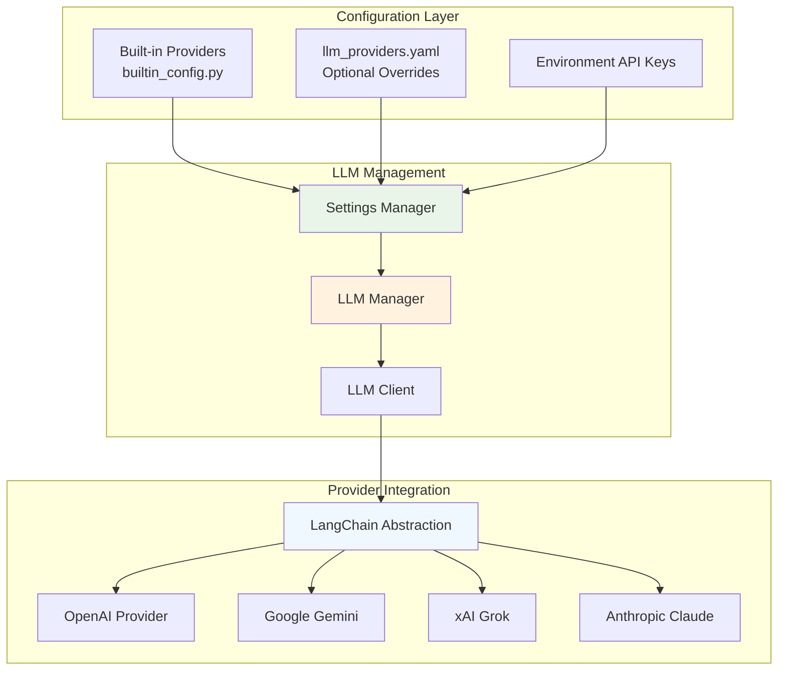

#### Key Components

**📍 Built-in Provider Defaults**: `backend/tarsy/config/builtin_config.py`
- **Out-of-the-box providers**: OpenAI (gpt-5), Google (gemini-2.5-flash), xAI (grok-4-latest), Anthropic (claude-4-sonnet)
- **Default selection**: google-default for immediate use with just GOOGLE_API_KEY
- **Zero configuration required** for basic operation

```python
BUILTIN_LLM_PROVIDERS = {
    "openai-default": {
        "type": "openai", "model": "gpt-5", 
        "api_key_env": "OPENAI_API_KEY"
    },
    "google-default": {  # DEFAULT
        "type": "google", "model": "gemini-2.5-flash",
        "api_key_env": "GOOGLE_API_KEY"  
    },
    # ... xai-default, anthropic-default
}
```

**📍 LLM Manager**: `backend/tarsy/integrations/llm/client.py`
- **Multi-provider initialization** with automatic availability detection
- **Provider selection** via LLM_PROVIDER environment variable
- **Unified client interface** using LangChain abstraction layer
- **Automatic retry logic** with exponential backoff for rate limiting
- **Enhanced token control** with optional `max_tokens` parameter for provider-level enforcement

**Provider Integration Pattern**:
```python
# All providers use unified LangChain integration
LLM_PROVIDERS = {
    "openai": _create_openai_client,     # ChatOpenAI
    "google": _create_google_client,     # ChatGoogleGenerativeAI
    "xai": _create_xai_client,          # ChatXAI
    "anthropic": _create_anthropic_client # ChatAnthropic
}
```

#### Content Truncation Controls

**Provider-Specific Tool Result Limits**: Each LLM provider has different context window limits, and large MCP tool results can cause context overflow. The `max_tool_result_tokens` configuration provides dual-layer protection:

1. **Pre-LLM truncation**: MCPResultSummarizer truncates tool results before sending to LLM
2. **Provider-aware limits**: Conservative defaults based on each provider's context window:
   - **OpenAI GPT-5**: 250K tokens (272K context window)
   - **Google Gemini 2.5**: 950K tokens (1M context window)  
   - **xAI Grok-4**: 200K tokens (256K context window)
   - **Anthropic Claude-4**: 150K tokens (200K context window)

**Benefits**: Prevents LLM API failures, ensures reliable processing regardless of tool result size, maintains performance across all components.

#### Configuration & Customization

**Three-tier configuration system**:

1. **Built-in defaults** (zero config) - Just set GOOGLE_API_KEY
2. **Environment overrides** - Set LLM_PROVIDER to use different built-in provider
3. **YAML customization** - Override models, add proxies, custom base URLs, content truncation limits

**Advanced Configuration Examples**:
```yaml
# config/llm_providers.yaml
llm_providers:
  # Override built-in model
  openai-default:
    type: openai
    model: gpt-4  # Override gpt-5 default
    max_tool_result_tokens: 200000  # Override default limit
    
  # Custom proxy configuration  
  openai-internal-proxy:
    type: openai
    model: gpt-4
    api_key_env: OPENAI_API_KEY
    base_url: https://internal-proxy.company.com/v1
    temperature: 0.1
    max_tool_result_tokens: 150000  # Custom limit for proxy
```

#### Communication & Error Handling

**📍 LLM Communication Logging**: Separate logger (`llm.communications`) captures all LLM interactions
**📍 Hook Integration**: All LLM interactions trigger typed hooks for history and dashboard updates
**📍 Error Handling**: Automatic retry for rate limiting, empty response detection, graceful degradation

#### Advanced LLM Features

**📍 Provider-Level Token Control**: Enhanced `generate_response()` method supports optional `max_tokens` parameter
```python
# Used by summarization system for guaranteed length limits
response_conversation = await self.llm_client.generate_response(
    summarization_conversation, 
    session_id, 
    stage_execution_id, 
    max_tokens=max_summary_tokens  # Provider enforces limit
)
```

**Benefits**:
- **Guaranteed token limits** - provider enforces max_tokens, not just prompt suggestions  
- **Universal support** - works with OpenAI, Anthropic, xAI, Google providers via LangChain
- **Cost control** - prevents excessive token generation and associated costs

#### Provider Support

**All providers use LangChain abstraction** with support for:
- **Custom base URLs** (OpenAI, xAI) for proxy configurations
- **SSL verification control** (OpenAI) 
- **Provider-specific optimizations** (Google Gemini flash models, Anthropic Claude latest models)

#### API Key Management

**Flexible API key configuration**:
- **Environment variable mapping**: provider type determines API key field
- **Built-in security**: API keys never logged or stored in plaintext
- **Validation**: Configuration validates API key presence at startup
- **Zero-configuration defaults**: GOOGLE_API_KEY works out-of-the-box

```python
# Automatic API key mapping by provider type
provider_type_to_key = {
    "google": settings.google_api_key,      # GOOGLE_API_KEY
    "openai": settings.openai_api_key,      # OPENAI_API_KEY  
    "xai": settings.xai_api_key,           # XAI_API_KEY
    "anthropic": settings.anthropic_api_key # ANTHROPIC_API_KEY
}
```

### 7. Hook System & Event-Driven Architecture
**Purpose**: Event-driven component decoupling and real-time system coordination  
**Key Responsibility**: Enabling loose coupling through typed event handling

The hook system enables event-driven architecture where processing components emit events that are consumed by history, dashboard, and monitoring systems without tight coupling. Multiple hook handlers can process the same events concurrently.

#### Hook Architecture

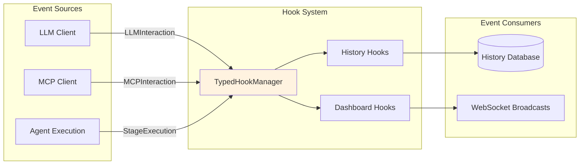

#### Key Components

**📍 Typed Hook Manager**: `backend/tarsy/hooks/typed_context.py`
- **Type-safe event handling** with generic types (`BaseTypedHook[TInteraction]`)
- **Concurrent execution** - multiple hooks process same events
- **Error isolation** - hook failures don't affect processing

**Event Types**:
```python
# Three main interaction types
LLMInteraction    # LLM requests/responses, timing, errors (including summarization LLM calls)
MCPInteraction    # MCP tool calls, results, errors  
StageExecution    # Stage lifecycle, status, metadata
```

**📍 Hook Registration**: `backend/tarsy/hooks/hook_registry.py`
```python
# Example hook registration at startup
typed_hook_registry = get_typed_hook_registry()
typed_hook_registry.register_llm_hook(HistoryLLMHook())
typed_hook_registry.register_llm_hook(DashboardLLMHook())
```

#### Hook Integration Pattern

**Event Emission**: Processing components emit events at key points:
```python
# In LLM client - automatic event emission
interaction = LLMInteraction(session_id=session_id, messages=messages, ...)
await typed_hook_manager.trigger_llm_hooks(interaction)
```

**Event Consumption**: Hook handlers process events independently:
```python
class HistoryLLMHook(BaseTypedHook[LLMInteraction]):
    async def execute(self, interaction: LLMInteraction) -> None:
        # Store interaction in database for audit trail
        
class DashboardLLMHook(BaseTypedHook[LLMInteraction]):  
    async def execute(self, interaction: LLMInteraction) -> None:
        # Format and broadcast to WebSocket subscribers
```

**📍 Hook Implementations**: 
- `backend/tarsy/hooks/typed_history_hooks.py` (history capture)
- `backend/tarsy/hooks/typed_dashboard_hooks.py` (real-time updates)

### 8. History & Audit Trail
**Purpose**: Complete processing history capture and timeline reconstruction  
**Key Responsibility**: Providing comprehensive audit trails and operational visibility

The history system captures the complete lifecycle of alert processing, providing detailed audit trails for debugging, monitoring, and compliance. All interactions, timings, and data flow are preserved with microsecond precision.

#### History Architecture

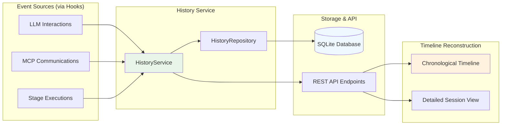

#### Key Components

**📍 History Service**: `backend/tarsy/services/history_service.py`
- **Complete session lifecycle management** from creation to completion
- **Graceful degradation** when database unavailable (history capture disabled)
- **Retry mechanisms** with exponential backoff for database operations

**Session Lifecycle**:
```python
# Session creation (linked to chain execution)
session = AlertSession(
    session_id=chain_context.session_id,
    alert_id=alert_id,
    alert_data=chain_context.alert_data,
    agent_type=f"chain:{chain_definition.chain_id}",
    chain_definition=chain_definition.model_dump()
)
```

**📍 Database Models**: `backend/tarsy/models/unified_interactions.py`
- **LLMInteraction**: Complete LLM request/response tracking with timing
- **MCPInteraction**: MCP tool calls with parameters, results, and errors
- **StageExecution**: Chain stage tracking with status and metadata

**Timeline Data Structure**:
```python
class DetailedSession(BaseModel):
    # Core session info
    session_id: str
    alert_data: dict
    chain_definition: dict
    
    # Chronological timeline
    stages: List[DetailedStage]  # Each stage contains interactions
    
    @computed_field
    def chronological_interactions(self) -> List[Interaction]:
        # All LLM + MCP interactions sorted by timestamp_us
```

#### History API Endpoints

**📍 REST API**: `backend/tarsy/controllers/history_controller.py`

**Core Endpoints**:
- **`GET /api/v1/history/sessions`** - Paginated session list with filtering
- **`GET /api/v1/history/sessions/{id}`** - Detailed session with complete timeline  
- **`GET /api/v1/history/active-sessions`** - Currently processing sessions
- **`GET /api/v1/history/health`** - History service health check

**Advanced Filtering Support**:
```http
# Multiple filter examples
GET /api/v1/history/sessions?status=completed&alert_type=kubernetes
GET /api/v1/history/sessions?search=namespace+terminating&page=2
GET /api/v1/history/sessions?start_date_us=1734476400000000&end_date_us=1734562799999999
```

#### Timeline Reconstruction

**Microsecond Precision**: All timestamps use Unix microseconds for accurate sequencing

**Chronological Assembly**: 
1. **Stage executions** provide structure 
2. **LLM interactions** show reasoning process
3. **MCP communications** show tool usage  
4. **Combined timeline** enables complete workflow reconstruction

**📍 Hook Integration**: History hooks automatically capture events from processing components, ensuring no data loss and consistent timing information.

**📍 Dashboard Integration**: History API powers both the SRE dashboard timeline view and provides data for real-time progress updates.

### 9. Dashboard & Real-time Monitoring
**Purpose**: User interface and live system monitoring  
**Key Responsibility**: Providing real-time visibility and historical analysis

TARSy provides a comprehensive SRE dashboard for operational monitoring with optinal integrated manual alert submission capability. Real-time updates flow through a sophisticated WebSocket system integrated with the hook architecture.

#### UI Architecture

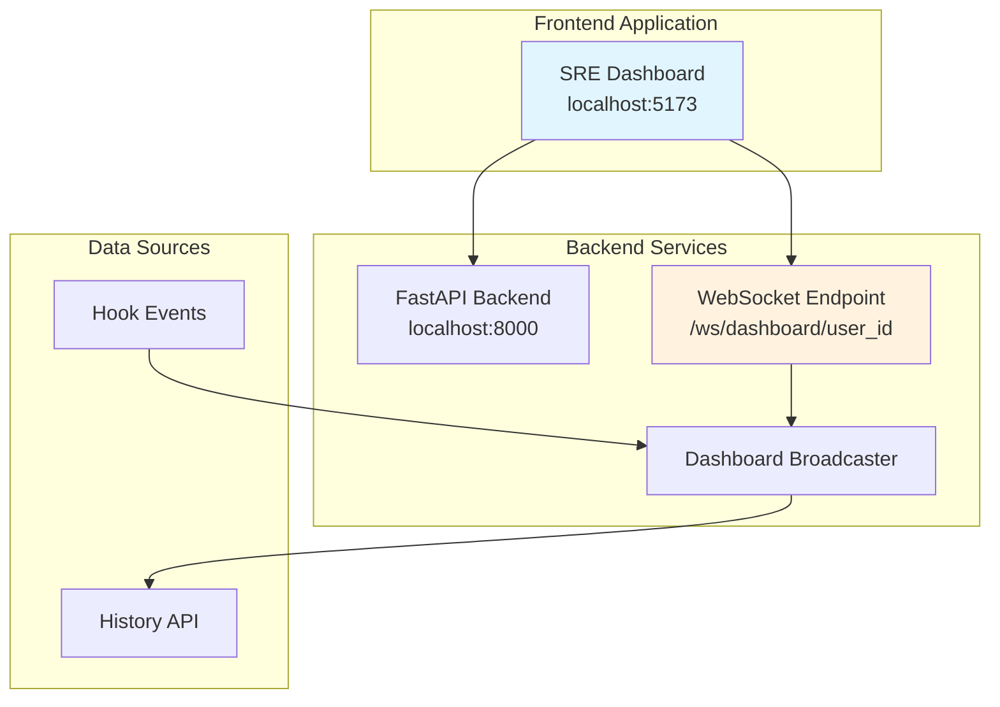

**📍 SRE Dashboard**: `dashboard/src/` (React TypeScript)
- **Session list view** with filtering and real-time updates
- **Timeline visualization** for processing stages
- **Active session monitoring** with live progress

**📍 Manual Alert Submission**: Integrated into dashboard at `/submit-alert` (React TypeScript)  
- **Alert submission interface** for manual alert testing
- **Payload validation and preview** with flexible key-value pairs
- **Processing status monitoring** with real-time WebSocket updates
- **Unified user experience** within main dashboard application

#### WebSocket & Real-time Communication Architecture

**Multiplexed WebSocket System**:
```python
# Single WebSocket connection supports multiple channels
@app.websocket("/ws/dashboard/{user_id}")
async def dashboard_websocket_endpoint(websocket: WebSocket, user_id: str):
    # Connection management with subscription routing
```

**📍 Connection Management**: `backend/tarsy/services/dashboard_connection_manager.py`

**Subscription Channels**:
- **`dashboard_updates`**: Real-time session list changes
- **`session_{id}`**: Individual session timeline updates
- **`system_health`**: Service status notifications

**📍 Dashboard Broadcasting**: `backend/tarsy/services/dashboard_broadcaster.py`
- **Intelligent batching** - groups related updates
- **Session tracking** - maintains active session state
- **Message routing** - targets specific user subscriptions

**Event Integration Flow**:
```
Hook Event → Dashboard Hook → Broadcaster → WebSocket → UI Update
```

**📍 Frontend WebSocket**: `dashboard/src/services/websocket.ts`
- **Automatic reconnection** with exponential backoff
- **Subscription management** for multiple channels  
- **Message routing** to appropriate UI components

### 10. Security & Data Protection
**Purpose**: Sensitive data protection and secure operations  
**Key Responsibility**: Preventing sensitive data exposure

TARSy implements comprehensive data masking to prevent sensitive information (API keys, passwords, certificates, Kubernetes secrets) from reaching LLM providers, logs, or persistent storage. The system follows a fail-safe approach: better to over-mask than expose sensitive data.

#### Security Architecture

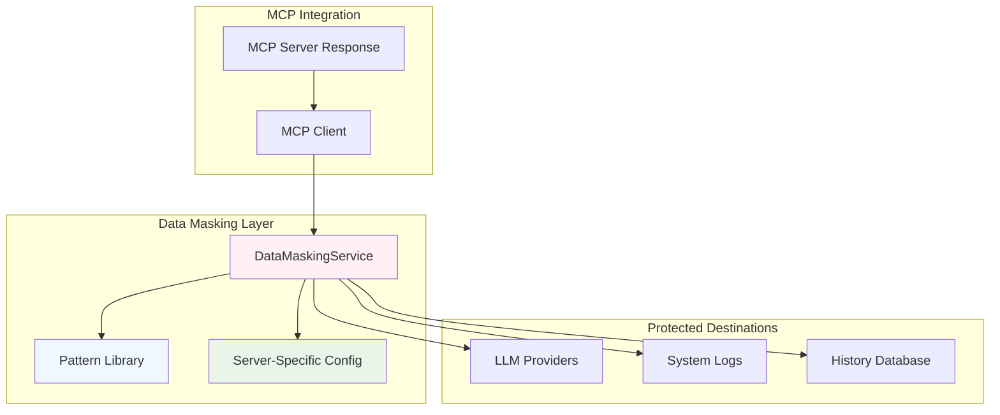

#### Data Masking Service

**📍 Core Service**: `backend/tarsy/services/data_masking_service.py`
- **Automatic integration** with MCP client - all tool responses are masked
- **Pattern-based detection** using configurable regex patterns
- **Server-specific configuration** allowing granular control per MCP server
- **Fail-safe operation** - continues processing even if masking fails

**Masking Workflow**:
```python
# Automatic masking in MCP client
async with mcp_interaction_context(...) as ctx:
    raw_response = await session.call_tool(tool_name, parameters)
    masked_response = self.data_masking_service.mask_response(raw_response, server_name)
    return masked_response  # Only masked data reaches LLM/logs/storage
```

#### Built-in Masking Patterns

**📍 Pattern Library**: `backend/tarsy/config/builtin_config.py`

**Pattern Categories**:
```python
BUILTIN_PATTERN_GROUPS = {
    "basic": ["api_key", "password"],
    "secrets": ["api_key", "password", "token"], 
    "security": ["api_key", "password", "token", "certificate"],
    "kubernetes": ["kubernetes_data_section", "kubernetes_stringdata_json", 
                  "api_key", "password"],
    "all": ["base64_secret", "base64_short", "api_key", "password", 
           "certificate", "token"]
}
```

**Example Patterns**:
- **Kubernetes Secrets**: Masks entire `data:` sections in YAML
- **API Keys**: `api_key: sk-abc123...` → `api_key: "***MASKED_API_KEY***"`
- **Certificates**: `-----BEGIN CERTIFICATE-----...` → `***MASKED_CERTIFICATE***`
- **Base64 Values**: Long base64 strings → `***MASKED_BASE64_VALUE***`

#### Server-Specific Configuration

**Built-in Server Example**:
```python
# kubernetes-server with built-in masking
"data_masking": {
    "enabled": True,
    "pattern_groups": ["kubernetes"],  # Expands to multiple patterns
    "patterns": ["certificate", "token"]  # Additional individual patterns
}
```

**YAML Configuration Example**:
```yaml
mcp_servers:
  security-scanner:
    server_id: "security-scanner"
    # ... connection config ...
    data_masking:
      enabled: true
      pattern_groups: ["security"]
      custom_patterns:
        - name: "custom_token"
          pattern: "CUSTOM-[A-Z0-9]{16}"
          replacement: "***MASKED_CUSTOM_TOKEN***"
```

#### Security Integration Points

**📍 MCP Response Filtering**: All MCP tool responses automatically masked before reaching any destination

**📍 History Database Protection**: All stored interactions contain only masked data

**📍 LLM Communication Security**: Sensitive data never sent to external LLM providers

**📍 Logging Security**: System logs contain masked versions of sensitive data

**Configuration Validation**: 
- **Pattern testing** during startup to catch invalid regex patterns
- **Server reference validation** ensures masking configs reference valid servers
- **Graceful degradation** if masking service unavailable

---

### 11. Authentication & Access Control
**Purpose**: Optional OAuth2-based authentication for enhanced security  
**Key Responsibility**: Protecting dashboard and API access in development and production environments

TARSy supports flexible authentication through [OAuth2-Proxy](https://github.com/oauth2-proxy/oauth2-proxy) integration, enabling organization-level access control while maintaining simple local development workflows.

#### Authentication Architecture

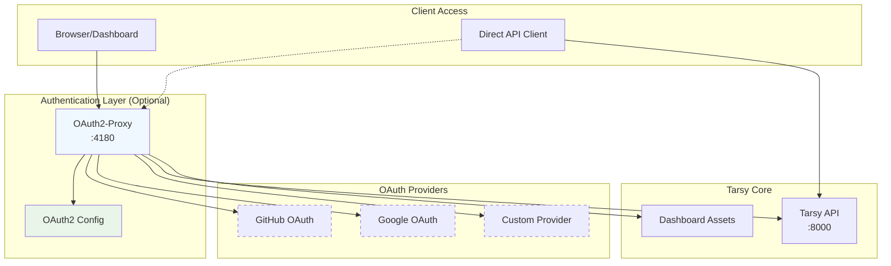

#### OAuth2-Proxy Integration

**📍 Configuration**: `config/oauth2-proxy.cfg`
- **Upstream Configuration**: Proxies requests to Tarsy API (`:8000`)
- **Provider Integration**: GitHub, Google, and others
- **Session Management**: Cookie-based authentication with configurable expiration
- **Access Control**: Organization, team, or domain-based restrictions

**Protected Endpoints**:
- **Dashboard Access**: All dashboard routes require authentication
- **API Endpoints**: All `/api/` routes protected by default
- **WebSocket Connections**: Real-time updates require authenticated session
- **Health Endpoints**: Unprotected for monitoring purposes

#### Authentication Flow

**Browser-Based Authentication**:
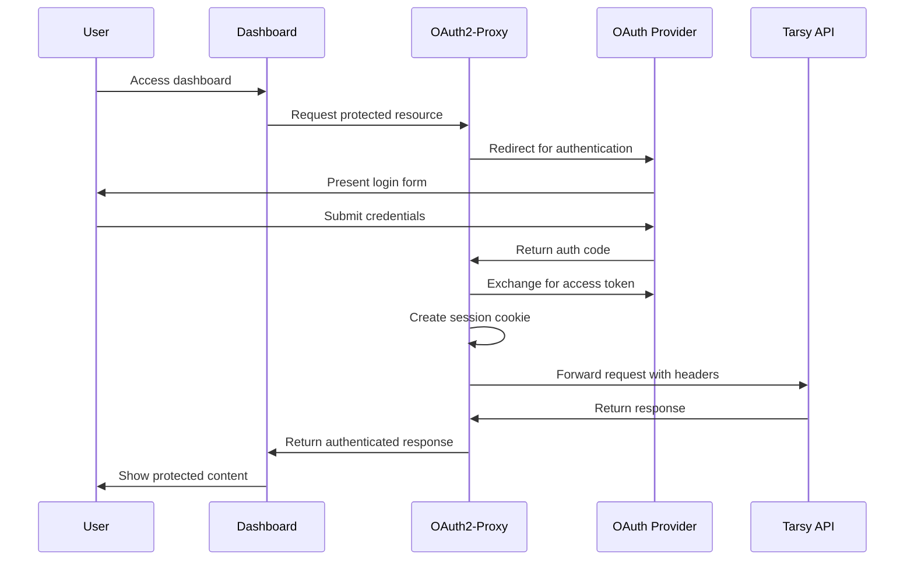

**API Authentication Headers**:
```http
X-Auth-Request-User: username@organization.com
X-Auth-Request-Email: username@organization.com
X-Forwarded-For: original.client.ip
Authorization: Bearer <token>
```

**📖 For oauth2-proxy setup instructions**: See [OAuth2-Proxy Setup Guide](oauth2-proxy-setup.md)

---